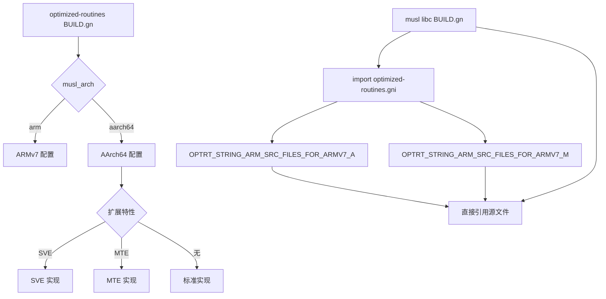

# 03 - OH 构建适配详解

本文档详细说明 optimized-routines 在 OpenHarmony 中的构建配置和编译选项。

---

## BUILD.gn 结构

### 导出的静态库目标

BUILD.gn 定义了两个静态库目标：

| 目标名 | 输出文件名 | 内容 | 架构支持 |
|--------|------------|------|---------|
| `optimized_static` | liboptimize.a | 字符串函数 + 数学函数 | ARMv7-A, AArch64 |
| `optimize_math` | liboptimize_math.a | 数学函数优化 | AArch64 仅 |

### 构建条件

```gn
if (!(is_lite_system && current_os == "ohos")) {
  # 仅在非轻量系统或非 ohos 系统时构建
  ohos_static_library("optimized_static") { ... }
  ohos_static_library("optimize_math") { ... }
}
```

---

## 配置结构

### 公共配置

#### optimized_routines_config

```gn
config("optimized_routines_config") {
  include_dirs = [
    "//third_party/optimized-routines/math",
    "//third_party/optimized-routines/math/include",
  ]
}
```

**作用**: 定义公共头文件路径，供依赖者使用。

#### optimized_routines_stack_config

```gn
config("optimized_routines_stack_config") {
  cflags = []
  cflags_c = []

  if (musl_arch == "aarch64") {
    cflags += [ "-mbranch-protection=pac-ret+b-key" ]
    cflags_c += [ "-fno-stack-protector" ]
  }
}
```

**说明**:
- AArch64: 启用 PAC-RET+B-KEY 分支保护
- AArch64 汇编文件: 禁用栈保护器（-fno-stack-protector）

---

## ARMv7 配置

### 源文件列表

```gn
if (musl_arch == "arm") {
  if (is_llvm_build) {
    defines += [ "__IS_LLVM_BUILD" ]
  }

  sources += [
    # 数学函数（C 实现）
    "math/cosf.c",
    "math/exp2.c",
    "math/exp2f.c",
    "math/exp_data.c",
    "math/expf.c",
    "math/log.c",
    "math/log2.c",
    "math/log2_data.c",
    "math/log2f.c",
    "math/log_data.c",
    "math/logf.c",
    "math/math_err.c",
    "math/math_errf.c",
    "math/pow.c",
    "math/powf.c",
    "math/sincosf.c",
    "math/sinf.c",

    # 字符串函数（ARMv7-A 汇编实现）
    "string/arm/memchr.S",
    "string/arm/memcpy.S",
    "string/arm/memset.S",
    "string/arm/strcmp.S",
    "string/arm/strlen-armv6t2.S",
  ]
}
```

### 汇编标志

```gn
asmflags = [
  "-D__memcpy_arm = memcpy",
  "-D__memchr_arm = memchr",
  "-D__memset_arm = memset",
  "-D__strcmp_arm = strcmp",
  "-D__strlen_armv6t2 = strlen",
]

include_dirs += [ "//third_party/optimized-routines/string/arm" ]
```

**说明**: 定义符号别名，与 musl libc 符号兼容。

---

## AArch64 配置

### 标准实现

```gn
else if (musl_arch == "aarch64") {
  include_dirs += [ "//third_party/optimized-routines/string/aarch64" ]

  sources += [
    # 数学函数（C 实现）
    "math/cosf.c",
    "math/math_errf.c",
    "math/sincosf.c",
    "math/sincosf_data.c",
    "math/sinf.c",

    # 字符串函数（标准汇编实现）
    "string/aarch64/memchr.S",
    "string/aarch64/memcmp.S",
    "string/aarch64/memcpy.S",
    "string/aarch64/memset.S",
    "string/aarch64/stpcpy.S",
    "string/aarch64/strchr.S",
    "string/aarch64/strchrnul.S",
    "string/aarch64/strcmp.S",
    "string/aarch64/strcpy.S",
    "string/aarch64/strlen.S",
    "string/aarch64/strncmp.S",
    "string/aarch64/strnlen.S",
    "string/aarch64/strrchr.S",
  ]

  asmflags = [
    "-D__memmove_aarch64 = memmove",
    "-D__memcpy_aarch64 = memcpy",
    "-D__memchr_aarch64 = memchr",
    "-D__memset_aarch64 = memset",
    "-D__memcmp_aarch64 = memcmp",
    "-D__strcmp_aarch64 = strcmp",
    "-D__strlen_aarch64 = strlen",
    "-D__strcpy_aarch64 = strcpy",
    "-D__stpcpy_aarch64 = stpcpy",
    "-D__strchr_aarch64 = strchr",
    "-D__strrchr_aarch64 = strrchr",
    "-D__strchrnul_aarch64 = strchrnul",
    "-D__strnlen_aarch64 = strnlen",
    "-D__strncmp_aarch64 = strncmp",
  ]
}
```

### SVE 实现

```gn
if (defined(ARM_FEATURE_SVE)) {
  sources += [
    # SVE 字符串函数（实验性）
    "string/aarch64/memchr-sve.S",
    "string/aarch64/memcmp-sve.S",
    "string/aarch64/memcpy.S",  # 复用标准 memcpy
    "string/aarch64/memset.S",  # 复用标准 memset
    "string/aarch64/stpcpy-sve.S",
    "string/aarch64/strchr-sve.S",
    "string/aarch64/strchrnul-sve.S",
    "string/aarch64/strcmp-sve.S",
    "string/aarch64/strcpy-sve.S",
    "string/aarch64/strlen-sve.S",
    "string/aarch64/strncmp-sve.S",
    "string/aarch64/strnlen-sve.S",
    "string/aarch64/strrchr-sve.S",
  ]

  asmflags = [
    "-D__memcpy_aarch64 = memcpy",
    "-D__memset_aarch64 = memset",
    "-D__memcmp_aarch64_sve = memcmp",
    "-D__memchr_aarch64_sve = memchr",
    "-D__strcmp_aarch64_sve = strcmp",
    "-D__strlen_aarch64_sve = strlen",
    "-D__strcpy_aarch64_sve = strcpy",
    "-D__stpcpy_aarch64_sve = stpcpy",
    "-D__strchr_aarch64_sve = strchr",
    "-D__strrchr_aarch64_sve = strrchr",
    "-D__strchrnul_aarch64_sve = strchrnul",
    "-D__strnlen_aarch64_sve = strnlen",
    "-D__strncmp_aarch64_sve = strncmp",
  ]
}
```

### MTE 实现

```gn
else if (defined(ARM_FEATURE_MTE)) {
  sources += [
    # MTE 字符串函数
    "string/aarch64/memchr-mte.S",
    "string/aarch64/memcmp.S",  # 标准实现
    "string/aarch64/memcpy.S",  # 标准实现
    "string/aarch64/memset.S",  # 标准实现
    "string/aarch64/stpcpy-mte.S",
    "string/aarch64/strchr-mte.S",
    "string/aarch64/strchrnul-mte.S",
    "string/aarch64/strcmp-mte.S",
    "string/aarch64/strcpy-mte.S",
    "string/aarch64/strlen-mte.S",
    "string/aarch64/strncmp-mte.S",
    "string/aarch64/strnlen.S",  # 标准实现
    "string/aarch64/strrchr-mte.S",
  ]

  asmflags = [
    "-D__memcpy_aarch64 = memcpy",
    "-D__memset_aarch64 = memset",
    "-D__memcmp_aarch64 = memcmp",
    "-D__memchr_aarch64_mte = memchr",
    "-D__strcmp_aarch64_mte = strcmp",
    "-D__strlen_aarch64_mte = strlen",
    "-D__strcpy_aarch64_mte = strcpy",
    "-D__stpcpy_aarch64_mte = stpcpy",
    "-D__strchr_aarch64_mte = strchr",
    "-D__strrchr_aarch64_mte = strrchr",
    "-D__strchrnul_aarch64_mte = strchrnul",
    "-D__strnlen_aarch64 = strnlen",
    "-D__strncmp_aarch64_mte = strncmp",
  ]
}
```

---

## optimize_math 静态库（AArch64 专用）

```gn
ohos_static_library("optimize_math") {
  output_name = "liboptimize_math"
  output_extension = "a"

  sources = []

  if (musl_arch == "aarch64") {
    sources += [
      "math/cosf.c",
      "math/math_errf.c",
      "math/sincosf.c",
      "math/sincosf_data.c",
      "math/sinf.c",
    ]
  }

  cflags = [
    "-mllvm",
    "-instcombine-max-iterations=0",  # 禁用某些 LLVM 优化
    "-ffp-contract=fast",             # 快速浮点乘加融合
    "-O3",
    "-fPIC",
    "-fstack-protector-strong",
  ]
}
```

**特殊优化**:
- `-instcombine-max-iterations=0` - 禁用 LLVM 指令组合优化
- `-ffp-contract=fast` - 启用快速浮点乘加融合（FMA）

---

## 编译选项详解

### 基础选项

```gn
cflags = [
  "-O3",                        # 最高优化级别
  "-fPIC",                      # 生成位置无关代码
  "-fstack-protector-strong",    # 栈保护器（强）
]

cflags_c = [
  "-fno-lto",                   # 禁用链接时优化（C 文件）
]
```

### 架构特定选项

| 架构 | 选项 | 作用 |
|------|------|------|
| AArch64 | `-mbranch-protection=pac-ret+b-key` | PAC-RET+B-KEY 分支保护 |
| AArch64 汇编 | `-fno-stack-protector` | 禁用栈保护器（汇编） |

### 优化选项

| 选项 | 值 | 作用 | 适用 |
|------|-----|------|------|
| `-O3` | - | 最高优化级别 | 所有架构 |
| `-ffp-contract=fast` | - | 快速浮点乘加融合 | optimize_math |
| `-instcombine-max-iterations` | 0 | 禁用 LLVM 指令组合 | optimize_math |

---

## 安全特性配置

### PAC-RET (Pointer Authentication)

```gn
if (musl_arch == "aarch64") {
  cflags += [ "-mbranch-protection=pac-ret+b-key" ]
}
```

**作用**: 返回地址验证，防止 ROP 攻击。

### 栈保护器

```gn
cflags = [ "-fstack-protector-strong" ]

if (musl_arch == "aarch64") {
  cflags_c += [ "-fno-stack-protector" ]  # 汇编文件禁用
}
```

**作用**:
- 强级别栈保护，检测栈溢出
- 汇编文件禁用（避免性能损失）

### HWASAN (Hardware Address Sanitizer)

```gn
if (use_hwasan) {
  defines += [ "HWASAN_REMOVE_CLEANUP" ]
  configs += [ "//build/config/sanitizers:default_sanitizer_flags" ]
  cflags += [
    "-mllvm",
    "-hwasan-instrument-check-enabled=true",
  ]
}
```

**作用**: 硬件辅助的内存错误检测（仅调试阶段）。

---

## 配置文件关系



---

## 配置继承

### optimized_inherited_configs

`optimized-routines.gni` 中定义的继承配置：

```gni
optimized_inherited_configs = [
  "//build/config/compiler:no_exceptions",
  "//build/config/compiler:export_dynamic",
  "//build/config/compiler:runtime_library",
  "//build/config/compiler:no_rtti",
  "//build/config/sanitizers:default_sanitizer_flags",
  "//build/config/compiler:default_symbols",
  "//build/config/compiler:default_stack_frames",
  "//build/config/compiler:default_optimization",
  "//build/config/compiler:default_include_dirs",
  "//build/config/compiler:chromium_code",
  "//build/config/compiler:compiler_arm_thumb",
  "//build/config/compiler:compiler_arm_fpu",
  "//build/config/compiler:compiler",
  "//build/config/compiler:afdo_optimize_size",
  "//build/config/compiler:afdo",
]
```

**说明**: 这些是 OH 构建系统的默认配置，optimized-routines 使用 `remove_configs = optimized_inherited_configs` 移除后，再添加需要的配置。

---

## 配置示例

### ARMv7-A 配置

```gni
# 设备配置文件示例
musl_arch = "arm"
is_llvm_build = true
ARM_FEATURE_SVE = false  # ARMv7 不支持 SVE
```

### AArch64 标准配置

```gni
# 设备配置文件示例
musl_arch = "aarch64"
```

### AArch64 + SVE 配置

```gni
# 设备配置文件示例
musl_arch = "aarch64"
ARM_FEATURE_SVE = true
```

### AArch64 + MTE 配置

```gni
# 设备配置文件示例
musl_arch = "aarch64"
ARM_FEATURE_MTE = true
```

---

## 常见问题

### Q: 为什么 optimize_math 仅支持 AArch64？

A: optimize_math 针对数学函数（cosf/sinf/sincosf）进行了特定优化，使用了 AArch64 特有的指令和编译选项。ARMv7 的数学函数直接使用 optimized_static 中的 C 实现。

### Q: SVE 和 MTE 能否同时启用？

A: 不能。BUILD.gn 中使用 `if-else if` 链式判断，SVE 和 MTE 互斥。

### Q: `-fno-lto` 的作用是什么？

A: 禁用链接时优化。optimized-routines 通过源码级集成到 musl，编译器可以跨模块优化，不需要 LTO。

### Q: 为什么汇编文件禁用栈保护器？

A: 汇编代码手工编写，通常不会产生栈溢出漏洞。启用栈保护器会增加不必要的开销。

---

## 相关文档

- **[02_Adaptations.md](02_Adaptations.md)** - OH 适配说明
- **[04_Usage_in_OH.md](04_Usage_in_OH.md)** - 使用情况和依赖
- **[06_Security.md](06_Security.md)** - 安全特性详解

---

**文档版本**: 1.0
**最后更新**: 2026-02-07
