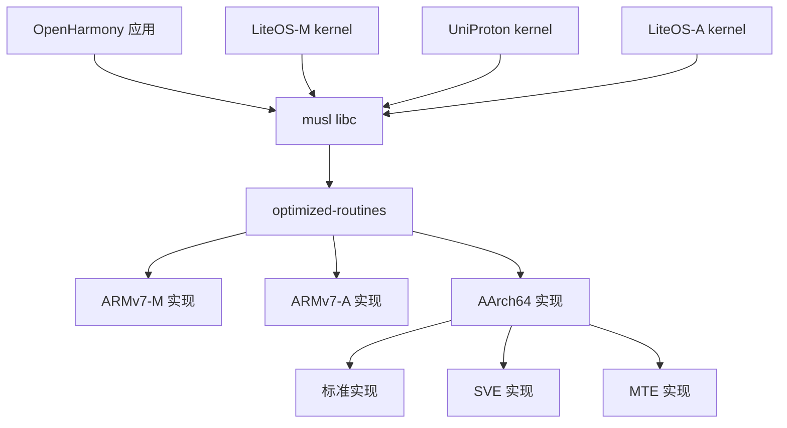
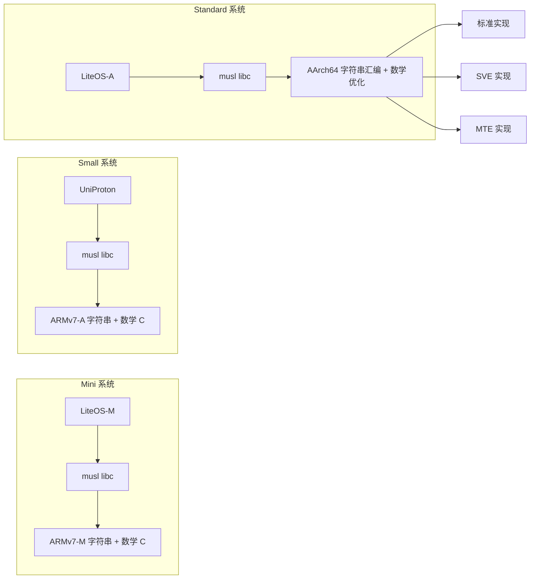

# 04 - 依赖关系与使用

本文档说明 optimized-routines 在 OpenHarmony 中的依赖关系和使用场景。

---

## 依赖者统计

**外部依赖者数量**: 3 个

所有依赖者都是 musl libc 的移植项目，覆盖三种不同的 OH 系统类型。

---

## 依赖者清单

| 序号 | 路径 | 所属模块 | 系统类型 | 架构 | 用途 |
|------|------|----------|----------|------|------|
| 1 | `third_party/musl/porting/liteos_m/kernel/` | LiteOS-M | mini | ARMv7-M | IoT 设备 C 库 |
| 2 | `third_party/musl/porting/uniproton/kernel/` | UniProton | small | ARMv7-A | 硬实时操作系统 C 库 |
| 3 | `kernel/liteos_a/lib/libc/musl/` | LiteOS-A | standard | AArch64 | Cortex-A 内核 C 库 |

---

## 依赖方式

### 集成模式：源码级集成

optimized-routines **不是**以独立静态库链接方式集成，而是直接编译源码到 musl libc。

### LiteOS-M 和 UniProton 的集成

```gn
# third_party/musl/porting/liteos_m/kernel/BUILD.gn
# third_party/musl/porting/uniproton/kernel/BUILD.gn

import("//third_party/optimized-routines/optimized-routines.gni")

static_library("musl-c") {
  sources = [
    # musl 原有源文件
    ...

    # 直接添加 optimized-routines 源文件
  ] + OPTRT_STRING_ARM_SRC_FILES_FOR_ARMV7_M
}
```

### LiteOS-A 的集成

```gn
# kernel/liteos_a/liteos.gni (定义 THIRDPARTY_OPTIMIZED_ROUTINES_DIR)
THIRDPARTY_OPTIMIZED_ROUTINES_DIR =
    "//third_party/optimized-routines"

# kernel/liteos_a/lib/libc/musl/BUILD.gn

import("$THIRDPARTY_OPTIMIZED_ROUTINES_DIR/optimized-routines.gni")

static_library("musl-c") {
  sources = [
    # musl 原有源文件
    ...

    # 直接添加 optimized-routines 源文件
  ] + OPTRT_STRING_ARM_SRC_FILES_FOR_ARMV7_A
}
```

### 集成特点

| 特点 | 说明 |
|------|------|
| **编译时集成** | 源码直接编译进 musl libc |
| **无链接依赖** | 不需要单独链接 optimized-routines 库 |
| **符号透明** | 标准库函数名（memcpy, sinf 等）直接可用 |
| **跨模块优化** | 编译器可以优化 musl 和 optimized-routines |

---

## 与 musl libc 的集成

### 架构覆盖

| OH 系统类型 | musl 移植 | 架构 | optimized-routines 集成 |
|------------|-----------|------|-----------------------|
| **mini** | LiteOS-M | ARMv7-M | 字符串 + 数学 (C) |
| **small** | UniProton | ARMv7-A | 字符串 + 数学 (C) |
| **standard** | LiteOS-A | AArch64 | 字符串 + 数学 (汇编 + C) |

### 符号兼容

optimized-routines 通过符号别名确保与 musl libc 符号兼容：

```asm
// AArch64 示例
.set __memcpy_aarch64, memcpy
.set __memset_aarch64, memset
.set __memchr_aarch64, memchr
```

**作用**:
- musl 可以引用 `__memcpy_aarch64` 等内部符号
- 链接器可以正确解析到优化的实现
- 避免符号冲突

---

## 使用场景

### 字符串函数优化

#### 系统层面

- **系统调用**: `memcpy`、`memset` - 内核与用户空间数据传输
- **内存管理**: 内存拷贝、清零、填充操作
- **字符串处理**: `strcmp`、`strlen` - 配置解析、字符串比较

#### 应用层面

| 应用类型 | 使用的函数 | 性能影响 |
|---------|-----------|---------|
| 网络应用 | memcpy, memcmp, strlen | 数据包处理、协议解析 |
| 文件系统 | memcpy, memset, strcmp | 文件读写、路径处理 |
| 数据库 | memcpy, memcmp, strcmp | 记录拷贝、索引查询 |
| 图形应用 | memcpy | 图像数据拷贝、帧缓冲区操作 |

**性能提升**:
- AArch64 汇编实现比 glibc 标准实现快 2-5 倍
- ARMv7 汇编实现比 newlib 标准实现快 1.5-3 倍

### 数学函数优化

#### 应用层面

| 应用类型 | 使用的函数 | 性能影响 |
|---------|-----------|---------|
| 图形渲染 | sinf, cosf, sincosf | 三角函数计算（坐标变换） |
| 信号处理 | expf, logf, powf | 滤波器、FFT 计算 |
| 游戏引擎 | sinf, cosf | 角度计算、动画 |
| AI 推理 | expf, logf | Softmax、激活函数 |
| 科学计算 | sinf, cosf, expf, logf, powf | 数值计算、模拟 |

**性能提升**:
- AArch64 SVE 向量化实现比标量实现快 5-10 倍
- C 优化实现比 glibc 标准实现快 1.5-2 倍

---

## 依赖关系图

### 整体架构



### 系统覆盖



---

## 系统类型详解

### 1. LiteOS-M (Mini 系统)

**定位**: IoT 轻量级设备（Cortex-M 系列处理器）

**集成内容**:
- 字符串函数: `strcpy.c`, `strlen-armv6t2.S`
- 数学函数: C 实现

**使用场景**:
- 智能家居设备（传感器、开关）
- 可穿戴设备（手环、手表）
- 低功耗 IoT 设备

### 2. UniProton (Small 系统)

**定位**: 硬实时操作系统（RTOS）

**集成内容**:
- 字符串函数: 完整 ARMv7-A 汇编实现
- 数学函数: C 实现

**使用场景**:
- 工业控制系统
- 汽车电子（实时控制）
- 电信设备（实时调度）

### 3. LiteOS-A (Standard 系统)

**定位**: 富设备（Cortex-A 系列处理器）

**集成内容**:
- 字符串函数: 完整 AArch64 汇编实现（可选 SVE/MTE）
- 数学函数: C + 优化实现

**使用场景**:
- 智能手机
- 平板电脑
- 智能电视、车载系统

---

## 性能特性

### 字符串函数性能

| 函数 | 架构 | 性能提升 |
|------|------|---------|
| memcpy | AArch64 汇编 | 2-5x vs glibc |
| memcpy | ARMv7 汇编 | 1.5-3x vs newlib |
| memset | AArch64 汇编 | 2-4x vs glibc |
| memcmp | AArch64 汇编 | 2-3x vs glibc |

### 数学函数性能

| 函数 | 架构 | 性能提升 |
|------|------|---------|
| sinf | AArch64 SVE | 5-10x vs 标量 |
| cosf | AArch64 SVE | 5-10x vs 标量 |
| sincosf | AArch64 SVE | 5-10x vs 标量 |
| expf | C 优化 | 1.5-2x vs glibc |
| logf | C 优化 | 1.5-2x vs glibc |

---

## 添加到新模块

### 步骤

1. **导入构建变量**
   ```gn
   import("//third_party/optimized-routines/optimized-routines.gni")
   ```

2. **添加源文件**
   ```gn
   static_library("your-library") {
     sources = [
       # 你的源文件
       ...

       # 添加 optimized-routines 源文件
     ] + OPTRT_STRING_ARM_SRC_FILES_FOR_ARMV7_A
   }
   ```

3. **配置架构**
   ```gni
   # 设备配置文件
   musl_arch = "aarch64"  # 或 "arm"
   ARM_FEATURE_SVE = true  # 可选
   ARM_FEATURE_MTE = true  # 可选
   ```

### 注意事项

- ✅ 确保 musl libc 已集成 optimized-routines
- ✅ 符号名不要冲突（使用标准库函数名）
- ❌ 不要直接链接 liboptimize.a（源码级集成）

---

## 常见问题

### Q: 如何确认使用了优化实现？

A: 查看编译日志中的符号表：
```bash
nm your-executable | grep memcpy
# 应显示 T __memcpy_aarch64 或 T memcpy（来自 optimized-routines）
```

### Q: 可以在其他 C 库中使用吗？

A: 可以，但需要：
1. 复制 BUILD.gn 中的配置
2. 确保符号别名正确
3. 避免与 musl libc 冲突

### Q: 性能提升明显吗？

A: 取决于使用场景：
- **字符串密集型**（网络、文件操作）: 2-5 倍提升
- **数学密集型**（图形、信号处理）: 1.5-10 倍提升（取决于向量化和函数类型）

### Q: SVE/MTE 实现是否稳定？

A:
- **SVE**: 实验性实现，需硬件支持和测试
- **MTE**: 稳定实现，用于内存安全检测

---

## 相关文档

- **[01_Overview.md](01_Overview.md)** - 原始库简介
- **[02_Adaptations.md](02_Adaptations.md)** - OH 适配说明
- **[03_Build_Integration.md](03_Build_Integration.md)** - 构建集成详解

---

**文档版本**: 1.0
**最后更新**: 2026-02-07
