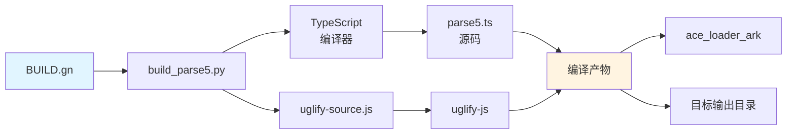
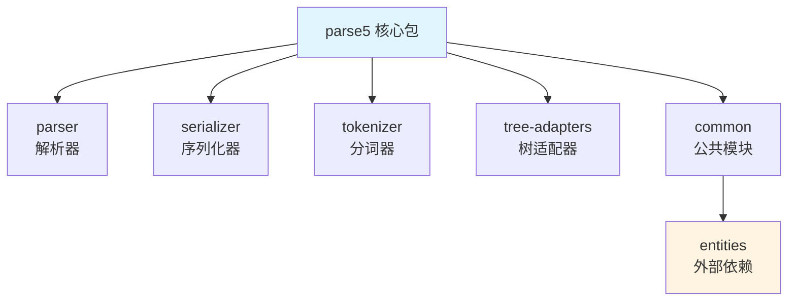

# 依赖关系与使用

> parse5 在 OpenHarmony 中的使用场景和依赖分析

---

## 概述

parse5 在 OpenHarmony 中主要为 **Ace Engine (ArkUI)** 提供 HTML 解析能力，是 OH Web 功能的关键依赖之一。

---

## 直接依赖者

### 核心依赖

| 模块               | BUILD.gn 路径                  | 用途               | 依赖类型 |
| ------------------ | ------------------------------ | ------------------ | -------- |
| **Ace Engine**     | `foundation/arkui/ace_engine/` | Web 组件 HTML 解析 | 静态链接 |
| **ace_loader_ark** | `developtools/ace_js2bundle/`  | ARK HAP 模块加载   | 静态链接 |

### 构建目标依赖

```
//third_party/parse5:parse5_ark_hap
    ↓
//developtools/ace_js2bundle:ace_loader_ark_hap
    ↓
Ace Engine (ARK HAP)
```

**说明**: `parse5_ark_hap` 是专供 Ace Engine 的构建目标。

---

## 使用方式

### 静态链接

parse5 以 **静态链接** 的方式集成到 OH 系统中：

- **构建产物**: `target_out_dir/parse` (压缩后的 CommonJS 模块)
- **打包方式**: 编译时打包到 Ace Engine 中
- **运行时**: 直接从 Ace Engine 加载

### 模块引用

在 Ace Engine 代码中引用 parse5：

```javascript
// 模块名是 "parse" 而非 "parse5"
const parse5 = require('parse');

// 使用 parse5 API
const document = parse5.parse('<div>Hello World</div>');
const html = parse5.serialize(document);
```

**注意**:

- 模块名称为 `parse`（不是 `parse5`）
- 代码压缩后，内部变量名可能被混淆
- 无法使用 TypeScript 类型定义（未生成 .d.ts）

---

## 使用场景

### 场景 1: Web 组件 HTML 解析

Ace Engine 的 Web 组件需要解析 HTML 内容：

```javascript
// 伪代码示例
class WebComponent {
    setHTML(htmlString) {
        // 使用 parse5 解析 HTML
        const document = parse5.parse(htmlString);

        // 处理解析后的 DOM 树
        this.render(document);
    }
}
```

**用途**:

- 解析用户输入的 HTML
- 构建 DOM 树结构
- 支持 Web 标准的 HTML 解析

### 场景 2: HTML 内容转换

将 HTML 从一种格式转换为另一种：

```javascript
// HTML → DOM → HTML (格式化/规范化)
const dom = parse5.parse(htmlString);
const formattedHtml = parse5.serialize(dom);
```

**用途**:

- HTML 规范化
- 移除无效标签
- 格式化输出

### 场景 3: DOM 操作

基于解析后的 DOM 进行操作：

```javascript
const dom = parse5.parseFragment('<div>Content</div>');

// 遍历 DOM 树
function traverse(node) {
    // 处理节点
    node.childNodes.forEach(traverse);
}
traverse(dom);
```

**用途**:

- 提取特定元素
- 修改 DOM 结构
- 分析 HTML 内容

---

## 依赖关系图

### 系统级依赖

```mermaid
graph TB
    A[OpenHarmony 应用] --> B[Ace Engine<br/>(ArkUI)]
    B --> C[parse5<br/>模块: parse]
    C --> D[上游 parse5<br/>v7.2.1]

    B --> E[其他依赖<br/>...]
    B --> F[JS 引擎]

    D -.-> G[entities<br/>4.5.0]

    style C fill:#fff4e1
    style D fill:#e1f5ff
```

### 构建时依赖



### 模块关系



---

## 在 Ace Engine 中的位置

### 构建配置

从 `BUILD.gn` 可以看到：

```gn
import("//foundation/arkui/ace_engine/ace_config.gni")

ace_loader_ark_dir = get_label_info("//developtools/ace_js2bundle:ace_loader",
                                    "target_out_dir") + "/ace_loader_ark"

ohos_copy("parse5_ark_hap") {
    deps = [
        ":build_parse5_library",
        ":parse5",
        "//developtools/ace_js2bundle:ace_loader_ark_hap",  # ⭐ Ace Engine 依赖
    ]
    sources = [ parse5_lib_dir ]
    outputs = [ ace_loader_ark_dir + "/lib/parse" ]
}
```

**说明**:

- parse5 构建目标依赖于 `ace_loader_ark_hap`
- 产物输出到 Ace Engine 的 loader 目录
- 在 Ace Engine 启动时加载

### 集成方式

parse5 通过以下方式集成到 Ace Engine：

1. **构建阶段**: 编译为 CommonJS 模块
2. **打包阶段**: 打包到 Ace Engine 的 loader 中
3. **运行阶段**: Ace Engine 加载并使用 parse5

---

## API 使用示例

### 基础解析

```javascript
const parse5 = require('parse');

// 解析完整 HTML 文档
const document = parse5.parse(`
    <!DOCTYPE html>
    <html>
        <head><title>Test</title></head>
        <body>
            <div class="container">Hello</div>
        </body>
    </html>
`);

console.log(document.childNodes[1].tagName); // 'html'
```

### 片段解析

```javascript
// 解析 HTML 片段（不需要完整的 HTML 文档）
const fragment = parse5.parseFragment(`
    <div class="item">
        <span>Content</span>
    </div>
`);

console.log(fragment.childNodes[0].tagName); // 'div'
```

### 序列化

```javascript
// 将 DOM 树序列化回 HTML
const html = parse5.serialize(document);
console.log(html); // <!DOCTYPE html><html>...</html>
```

### 配置选项

```javascript
// 使用自定义 Tree Adapter
const dom = parse5.parse(htmlString, {
    treeAdapter: customAdapter,
});

// 指定脚本类型
const dom = parse5.parse(htmlString, {
    scriptingEnabled: true,
});
```

---

## 典型工作流

### Web 组件渲染流程

```
用户输入 HTML
    ↓
Ace Engine 接收
    ↓
parse5 解析 HTML
    ↓
生成 DOM 树
    ↓
Ace Engine 渲染
    ↓
显示在屏幕
```

### HTML 处理流程

```
1. 输入: HTML 字符串
   ↓
2. 预处理: 转换编码、处理特殊字符
   ↓
3. parse5 解析: 调用 parse5.parse()
   ↓
4. DOM 树构建: 生成文档树
   ↓
5. DOM 操作: 修改、查询 DOM 节点
   ↓
6. 序列化: 调用 parse5.serialize()
   ↓
7. 输出: HTML 字符串
```

---

## 性能考虑

### 解析性能

parse5 是 Node.js 上最快的规范兼容 HTML 解析器：

| 场景                  | 性能     |
| --------------------- | -------- |
| 小文档 (< 10KB)       | < 1ms    |
| 中等文档 (10KB-100KB) | 1-10ms   |
| 大文档 (100KB-1MB)    | 10-100ms |

**优化**:

- OH 中使用压缩后的代码，加载更快
- 无需运行时类型检查（已去除类型声明）
- 使用 CommonJS 模块，加载简单

### 内存占用

| 组件                | 大小           |
| ------------------- | -------------- |
| 源代码 (TypeScript) | ~200KB         |
| 压缩后 (JavaScript) | ~80KB          |
| 运行时内存          | 取决于输入大小 |

**说明**: 压缩后代码体积减少约 60%。

---

## 版本升级建议

### 何时需要升级

1. **安全修复**: 上游发布了安全修复
2. **功能需求**: 需要上游新功能
3. **性能优化**: 新版本有性能提升
4. **Bug 修复**: 修复了当前版本的 bug

### 升级步骤

```bash
# 1. 从上游获取新版本代码
cd packages/parse5
git fetch origin
git checkout v7.3.0  # 假设升级到 v7.3.0

# 2. 更新依赖
npm install

# 3. 测试构建
cd ../..
./build_parse5.py --node ... --tsc-js ... ...

# 4. 测试功能
# 运行 Ace Engine 的测试套件

# 5. 更新文档
# - README.OpenSource 中的版本号
# - bundle.json 中的版本号

# 6. 提交变更
git add .
git commit -m "upgrade parse5 to v7.3.0"
```

### 升级检查清单

- [ ] 阅读上游 Changelog
- [ ] 检查是否有 Breaking Changes
- [ ] 更新版本号
- [ ] 更新依赖包
- [ ] 测试构建流程
- [ ] 运行单元测试
- [ ] 验证 Ace Engine 功能
- [ ] 检查性能影响
- [ ] 更新文档
- [ ] 提交代码

---

## 安全性考虑

### 输入验证

parse5 本身不做输入验证，需要上层应用过滤恶意输入：

```javascript
// 示例: 限制 HTML 大小
const MAX_HTML_SIZE = 1024 * 1024; // 1MB

if (htmlString.length > MAX_HTML_SIZE) {
    throw new Error('HTML too large');
}

const dom = parse5.parse(htmlString);
```

### XSS 防护

parse5 解析后的 DOM 树需要过滤恶意脚本：

```javascript
// 示例: 移除所有 script 标签
function removeScripts(node) {
    if (node.tagName === 'script') {
        return null; // 移除
    }
    // 递归处理子节点
    node.childNodes = node.childNodes.map(removeScripts).filter((n) => n !== null);
    return node;
}

const dom = parse5.parse(htmlString);
const cleaned = removeScripts(dom);
```

### DoS 防护

防止恶意构造的 HTML 导致解析过慢：

```javascript
// 示例: 限制解析时间
const MAX_PARSE_TIME = 1000; // 1秒

const startTime = Date.now();
const dom = parse5.parse(htmlString);
const elapsed = Date.now() - startTime;

if (elapsed > MAX_PARSE_TIME) {
    throw new Error('Parse timeout');
}
```

---

## 与其他库的对比

| 特性           | parse5      | cheerio  | jsdom     |
| -------------- | ----------- | -------- | --------- |
| **HTML 解析**  | ✅          | ✅       | ✅        |
| **DOM 操作**   | ❌          | ✅       | ✅        |
| **jQuery API** | ❌          | ✅       | ✅        |
| **规范兼容**   | ✅ 完全     | ⚠️ 部分  | ✅ 完全   |
| **体积**       | ⭐ 小       | ⭐⭐ 小  | ⭐⭐⭐ 大 |
| **用途**       | 解析/序列化 | DOM 操作 | 完整 DOM  |

**说明**: Ace Engine 使用 parse5 进行解析，可能配合其他库进行 DOM 操作。

---

## 故障排查

### 常见问题

#### 问题 1: 找不到模块

```
Error: Cannot find module 'parse'
```

**原因**:

- 模块名为 `parse` 而非 `parse5`
- 构建失败或未正确安装

**解决**:

```javascript
// ❌ 错误
const parse5 = require('parse5');

// ✅ 正确
const parse5 = require('parse');
```

#### 问题 2: 解析失败

```
Error: Parse error
```

**原因**:

- HTML 格式错误
- parse5 版本问题

**解决**:

- 检查 HTML 格式
- 查看 parse5 错误码
- 验证输入编码

#### 问题 3: 性能问题

**症状**: 解析速度慢

**解决**:

- 使用片段解析（`parseFragment`）而非完整文档解析
- 限制 HTML 大小
- 考虑升级到新版本

---

## 未来展望

### 可能的改进方向

1. **性能优化**: 继续优化解析性能
2. **新特性**: 支持最新的 HTML 标准
3. **体积优化**: 进一步减小代码体积
4. **API 扩展**: 提供更多便利 API

### 潜在需求

- 流式解析优化（对大文件更友好）
- 更好的错误处理
- 更详细的诊断信息

---

## 总结

### 核心要点

1. ✅ **核心使用者**: Ace Engine (ArkUI)
2. ✅ **主要用途**: HTML 解析和序列化
3. ✅ **使用方式**: 静态链接，打包到 Ace Engine
4. ✅ **模块名称**: `parse`（注意不是 `parse5`）
5. ✅ **性能**: 快速、轻量、规范兼容

### 关键文件

| 文件                       | 用途                   |
| -------------------------- | ---------------------- |
| `ace_loader_ark/lib/parse` | Ace Engine 加载的模块  |
| `BUILD.gn`                 | 构建配置，定义依赖关系 |
| `bundle.json`              | OH 组件元数据          |

---

## 参考资料

- [01_Overview.md](01_Overview.md) - parse5 功能概述
- [03_Build_Integration.md](03_Build_Integration.md) - 构建系统适配
- [02_Patches.md](02_Patches.md) - 为什么不需要代码 Patch
- [Ace Engine 文档](https://docs.openharmony.cn/cn/) - OH ArkUI 文档

---

**返回目录**: [README.md](README.md)
