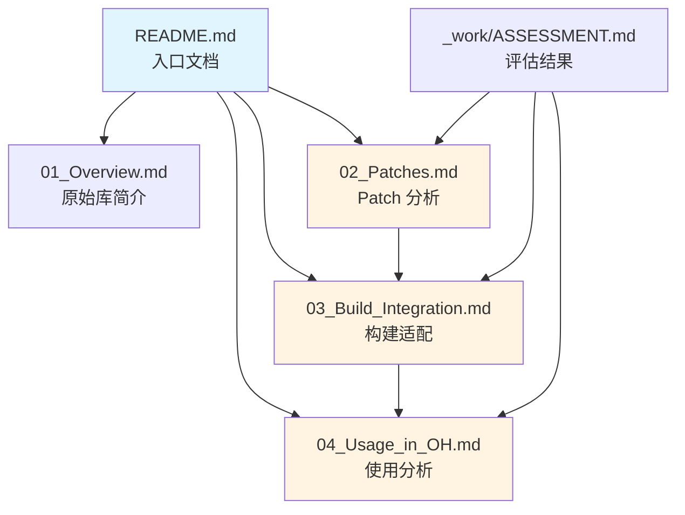

# 阅读路线建议

根据你的角色和需求，选择合适的阅读路径：

---

## 🎯 按角色阅读

### 开发者 - 使用 parse5

**目标**: 了解如何在 OH 项目中使用 parse5

**推荐路线**:

```
1. README.md (了解概览)
   ↓
2. 01_Overview.md (了解原始库功能)
   ↓
3. 04_Usage_in_OH.md (了解 OH 中的使用方式)
```

**时间**: 15-20 分钟

---

### 构建工程师 - 维护构建系统

**目标**: 了解 parse5 的构建流程和适配方式

**推荐路线**:

```
1. README.md (了解概览)
   ↓
2. 03_Build_Integration.md (深入了解构建适配)
   ↓
3. 02_Patches.md (了解为什么不需要代码 Patch)
   ↓
4. _work/ASSESSMENT.md (查看详细评估)
```

**时间**: 30-40 分钟

---

### 架构师 - 评估技术选型

**目标**: 评估 parse5 是否适合项目需求

**推荐路线**:

```
1. README.md (了解概览)
   ↓
2. 01_Overview.md (了解原始库功能和限制)
   ↓
3. 04_Usage_in_OH.md (了解 OH 中的使用场景)
   ↓
4. 03_Build_Integration.md (了解构建开销)
```

**时间**: 25-35 分钟

---

### 安全审计 - 评估安全风险

**目标**: 评估 parse5 的安全性和潜在风险

**推荐路线**:

```
1. README.md (了解概览)
   ↓
2. 01_Overview.md (了解库的用途和范围)
   ↓
3. _work/ASSESSMENT.md (查看依赖和版本)
   ↓
4. 检查 upstream CVE 报告 (外部)
```

**时间**: 20-30 分钟

---

### 维护者 - 升级 parse5 版本

**目标**: 升级到上游新版本

**推荐路线**:

```
1. _work/ASSESSMENT.md (查看当前状态和注意事项)
   ↓
2. 02_Patches.md (确认无代码 Patch)
   ↓
3. 03_Build_Integration.md (了解构建流程)
   ↓
4. 执行升级:
   - 更新 packages/parse5/ 源代码
   - 更新 README.OpenSource 版本号
   - 更新 bundle.json 版本号
   - 测试构建
```

**时间**: 1-2 小时（含测试）

---

## 📚 按主题阅读

### 想了解 "为什么不需要 Patch？"

1. **快速了解**: 02_Patches.md 的"核心结论"章节
2. **深入了解**: 02_Patches.md 的"详细分析"章节
3. **构建流程**: 03_Build_Integration.md

### 想了解 "构建流程细节"

1. **总体流程**: 03_Build_Integration.md 的"构建流程图"
2. **构建脚本**: 03_Build_Integration.md 的"build_parse5.py 详解"
3. **压缩脚本**: 03_Build_Integration.md 的"uglify-source.js 详解"

### 想了解 "在 OH 中如何被使用"

1. **依赖关系**: 04_Usage_in_OH.md 的"直接依赖者"
2. **使用方式**: 04_Usage_in_OH.md 的"使用方式"
3. **典型场景**: 04_Usage_in_OH.md 的"使用场景"

---

## ⏱️ 时间预估

| 阅读目标     | 推荐文档                                | 预计时间   |
| ------------ | --------------------------------------- | ---------- |
| 快速了解概览 | README.md + 01_Overview.md              | 10 分钟    |
| 理解适配方案 | 02_Patches.md + 03_Build_Integration.md | 25 分钟    |
| 了解使用方式 | 04_Usage_in_OH.md                       | 15 分钟    |
| 完整深入理解 | 所有核心文档                            | 60-90 分钟 |

---

## 🔍 文档关系图



---

## 💡 阅读提示

### 核心概念

- **纯 upstream**: 完全使用上游代码，无任何修改
- **构建适配**: 仅通过构建脚本和配置进行适配
- **模块重命名**: parse5 在 OH 中输出为 `parse`

### 常见问题

**Q: 为什么 parse5 不需要代码 Patch？**
A: 因为 parse5 是纯 JavaScript/TypeScript 库，不涉及平台相关代码，可以直接在 OH 环境中运行。详见 02_Patches.md。

**Q: 如何升级 parse5 版本？**
A: 由于无代码 Patch，只需替换上游源代码，然后调整构建配置。详见 04_Usage_in_OH.md 的"版本升级建议"。

**Q: 构建产物为什么叫 `parse` 而不是 `parse5`？**
A: 为了简化命名和统一 OH 模块命名规范。详见 03_Build_Integration.md 的"输出配置"章节。

---

## 📞 获取帮助

如果文档中没有找到答案：

1. 查看上游官方文档: https://parse5.js.org/
2. 查看 OpenHarmony 构建系统文档
3. 在 OpenHarmony 社区提问
4. 查看 \_work/NOTES.md 了解更多技术细节

---

**开始阅读**: [返回 README.md](README.md)
