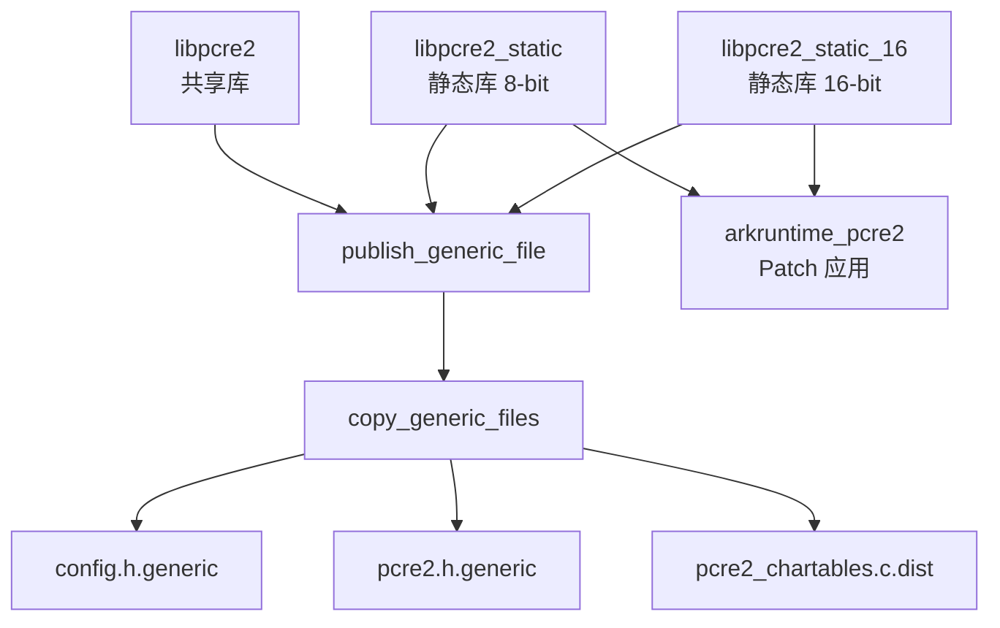

# 03 - OH 构建系统适配

## 概述

OpenHarmony 使用 **GN (Generate Ninja)** 作为构建系统，与 PCRE2 原生的 CMake/Autotools 构建系统不同。本文档详细说明 OH 如何适配 PCRE2 的构建。

## 文件结构

```
third_party/pcre2/
├── BUILD.gn              # GN 构建配置（OH 新增）
├── bundle.json           # OH 组件配置
├── README.OpenSource     # 开源信息
├── copy_generic_files.sh # 配置文件复制脚本（OH 新增）
├── check_md5.sh          # MD5 校验脚本
└── pcre2/                # 上游源码
    ├── CMakeLists.txt    # 上游 CMake 配置（未使用）
    ├── configure         # 上游 Autotools 配置（未使用）
    └── src/              # 源码目录
        ├── config.h.generic      # 预生成配置文件
        ├── pcre2.h.generic       # 预生成头文件
        └── pcre2_chartables.c.dist # 预生成字符表
```

## BUILD.gn 结构

### 整体结构

```gn
import("//build/config/components/ets_frontend/ets_frontend_config.gni")
if (ark_standalone_build) {
  import("$build_root/ark.gni")
} else {
  import("//build/ohos.gni")
}

PCRE2_LIB_DIR = "//third_party/pcre2/pcre2"

# 1. 配置文件复制 Action
action("copy_generic_files") { ... }

# 2. 生成的头文件
ohos_shared_headers("pcre2_generated_headers") { ... }

# 3. 字符表文件发布
ohos_prebuilt_etc("publish_generic_file") { ... }

# 4. 编译配置
config("third_party_pcre2_config") { ... }

# 5. 源码列表
pcre2_sources = [ ... ]

# 6. 构建目标
ohos_shared_library("libpcre2") { ... }
ohos_static_library("libpcre2_static") { ... }
ohos_static_library("libpcre2_static_16") { ... }
```

### 详细配置

#### 1. 配置文件复制 Action

```gn
action("copy_generic_files") {
  script = rebase_path("//third_party/pcre2/copy_generic_files.sh")
  
  inputs = [
    "$PCRE2_LIB_DIR/src/config.h.generic",
    "$PCRE2_LIB_DIR/src/pcre2.h.generic",
    "$PCRE2_LIB_DIR/src/pcre2_chartables.c.dist",
  ]
  
  outputs = [
    "${target_gen_dir}/src/pcre2_chartables.c",
  ]
  
  args = [
    rebase_path("$PCRE2_LIB_DIR"),
    rebase_path("${target_gen_dir}"),
  ]
}
```

**目的**: 将上游提供的 `.generic` 配置文件复制到构建目录，供编译使用。

**脚本逻辑** (`copy_generic_files.sh`):
```bash
#!/bin/bash
pcre2_lib_dir=$1
pcre2_gen_dir=$2

mkdir -P $pcre2_gen_dir/src

# 使用 MD5 校验避免重复复制
check_md5_and_copy $pcre2_lib_dir/src/config.h.generic $pcre2_gen_dir/src/config.h
check_md5_and_copy $pcre2_lib_dir/src/pcre2.h.generic $pcre2_gen_dir/src/pcre2.h
check_md5_and_copy $pcre2_lib_dir/src/pcre2_chartables.c.dist $pcre2_gen_dir/src/pcre2_chartables.c
```

#### 2. 头文件配置

```gn
config("third_party_pcre2_config") {
  include_dirs = [
    "$PCRE2_LIB_DIR/src",           # 源码头文件
    "${target_gen_dir}/src",        # 生成的头文件
  ]
}
```

#### 3. 源码列表

```gn
pcre2_sources = [
  "$PCRE2_LIB_DIR/src/pcre2_auto_possess.c",
  "$PCRE2_LIB_DIR/src/pcre2_chkdint.c",
  "$PCRE2_LIB_DIR/src/pcre2_compile.c",
  "$PCRE2_LIB_DIR/src/pcre2_compile_class.c",
  "$PCRE2_LIB_DIR/src/pcre2_config.c",
  "$PCRE2_LIB_DIR/src/pcre2_context.c",
  "$PCRE2_LIB_DIR/src/pcre2_convert.c",
  "$PCRE2_LIB_DIR/src/pcre2_dfa_match.c",
  "$PCRE2_LIB_DIR/src/pcre2_error.c",
  "$PCRE2_LIB_DIR/src/pcre2_extuni.c",
  "$PCRE2_LIB_DIR/src/pcre2_find_bracket.c",
  "$PCRE2_LIB_DIR/src/pcre2_jit_compile.c",
  "$PCRE2_LIB_DIR/src/pcre2_maketables.c",
  "$PCRE2_LIB_DIR/src/pcre2_match.c",
  "$PCRE2_LIB_DIR/src/pcre2_match_data.c",
  "$PCRE2_LIB_DIR/src/pcre2_newline.c",
  "$PCRE2_LIB_DIR/src/pcre2_ord2utf.c",
  "$PCRE2_LIB_DIR/src/pcre2_pattern_info.c",
  "$PCRE2_LIB_DIR/src/pcre2_script_run.c",
  "$PCRE2_LIB_DIR/src/pcre2_serialize.c",
  "$PCRE2_LIB_DIR/src/pcre2_string_utils.c",
  "$PCRE2_LIB_DIR/src/pcre2_study.c",
  "$PCRE2_LIB_DIR/src/pcre2_substitute.c",
  "$PCRE2_LIB_DIR/src/pcre2_substring.c",
  "$PCRE2_LIB_DIR/src/pcre2_tables.c",
  "$PCRE2_LIB_DIR/src/pcre2_ucd.c",
  "$PCRE2_LIB_DIR/src/pcre2_valid_utf.c",
  "$PCRE2_LIB_DIR/src/pcre2_xclass.c",
]
```

**注意**: 未包含的源文件：
- `pcre2_jit_match.c` - JIT 匹配入口（通过 `pcre2_jit_compile.c` 包含）
- `pcre2_jit_misc.c` - JIT 辅助函数（通过 `pcre2_jit_compile.c` 包含）
- `pcre2_printint.c` - 调试打印函数（仅在测试中使用）
- `pcre2_fuzzsupport.c` - Fuzzing 支持（仅在测试中使）
- `pcre2_dftables.c` - 字符表生成（预生成）

#### 4. 共享库目标

```gn
ohos_shared_library("libpcre2") {
  deps = [ ":publish_generic_file" ]
  branch_protector_ret = "pac_ret"  # 启用 PAC-RET 保护
  output_name = "libpcre2"
  
  sources = pcre2_sources
  sources += get_target_outputs(":publish_generic_file")
  
  public_configs = [ ":third_party_pcre2_config" ]
  
  cflags = [
    "-D_GNU_SOURCE",
    "-DHAVE_CONFIG_H",
    "-DSUPPORT_PCRE2_8=1",
    "-DPCRE2_CODE_UNIT_WIDTH=8",
    "-w",  # 禁用所有警告
  ]
  
  install_enable = true
  install_images = [
    "system",
    "ramdisk",
    "updater",
  ]
  
  license_file = "$PCRE2_LIB_DIR/LICENCE.md"
  innerapi_tags = [
    "platformsdk_indirect",
    "chipsetsdk_sp_indirect",
  ]
  
  part_name = "pcre2"
  subsystem_name = "thirdparty"
}
```

**关键配置**:
- **PAC-RET**: 启用指针认证返回地址保护（ARM64 安全特性）
- **安装镜像**: 安装到 system、ramdisk、updater 三个镜像
- **API 级别**: `platformsdk_indirect`、`chipsetsdk_sp_indirect`

#### 5. 静态库目标 (8-bit)

```gn
ohos_static_library("libpcre2_static") {
  defines = [ "ARK_PCRE2_NEWLINE_PATCH" ]  # 启用 OH Patch
  
  deps = [ ":publish_generic_file" ]
  
  if(path_exists("//arkcompiler/runtime_core")) {
    external_deps = [ "runtime_core:arkruntime_pcre2" ]  # Patch 依赖
  }
  
  output_name = "libpcre2_static"
  sources = pcre2_sources
  sources += get_target_outputs(":publish_generic_file")
  
  public_configs = [ ":third_party_pcre2_config" ]
  
  cflags = [
    "-D_GNU_SOURCE",
    "-DHAVE_CONFIG_H",
    "-DSUPPORT_PCRE2_8=1",
    "-DSUPPORT_UNICODE=1",    # 启用 Unicode 支持
    "-DPCRE2_CODE_UNIT_WIDTH=8",
    "-w",
  ]
  
  license_file = "$PCRE2_LIB_DIR/LICENCE.md"
  part_name = "pcre2"
  subsystem_name = "thirdparty"
}
```

**与共享库的区别**:
- 定义了 `ARK_PCRE2_NEWLINE_PATCH` - 启用换行符 Patch
- 依赖 `arkruntime_pcre2` - 确保 Patch 已应用
- 启用了 `SUPPORT_UNICODE=1` - Unicode 支持
- 不安装到系统镜像（静态库）

#### 6. 静态库目标 (16-bit)

```gn
ohos_static_library("libpcre2_static_16") {
  defines = [ "ARK_PCRE2_NEWLINE_PATCH" ]
  
  deps = [ ":publish_generic_file" ]
  
  if(path_exists("//arkcompiler/runtime_core")) {
    external_deps = [ "runtime_core:arkruntime_pcre2" ]
  }
  
  output_name = "libpcre2_static_16"
  sources = pcre2_sources
  sources -= [ "$PCRE2_LIB_DIR/src/pcre2_chkdint.c" ]  # 16-bit 不需要
  sources += get_target_outputs(":publish_generic_file")
  
  public_configs = [ ":third_party_pcre2_config" ]
  
  cflags = [
    "-D_GNU_SOURCE",
    "-DHAVE_CONFIG_H",
    "-DSUPPORT_PCRE2_16=1",    # 16-bit 模式
    "-DSUPPORT_UNICODE=1",
    "-DPCRE2_CODE_UNIT_WIDTH=16",
    "-w",
  ]
  
  license_file = "$PCRE2_LIB_DIR/LICENCE.md"
  part_name = "pcre2"
  subsystem_name = "thirdparty"
}
```

**16-bit 版本用途**: 用于处理 UTF-16 编码的字符串（如 Windows 平台、某些 ArkTS 场景）。

## 与上游构建系统对比

| 方面 | 上游 CMake/Autotools | OH GN |
|-----|---------------------|-------|
| **配置生成** | configure/CMake 动态生成 | 使用预生成的 `.generic` 文件 |
| **字符表** | 编译时运行 `dftables` 生成 | 使用预生成的 `pcre2_chartables.c` |
| **JIT 检测** | 运行时检测编译器支持 | 始终启用（假设支持）|
| **Unicode** | 可配置 | 始终启用 |
| **安装** | make install | GN install_images |
| **测试** | make check | 集成到 OH 测试框架 |

## 关键编译选项

### 宏定义

| 宏 | 值 | 说明 |
|---|-----|-----|
| `HAVE_CONFIG_H` | 1 | 使用 config.h |
| `SUPPORT_PCRE2_8` | 1 | 启用 8-bit 支持 |
| `SUPPORT_PCRE2_16` | 1 | 启用 16-bit 支持（仅 libpcre2_static_16）|
| `SUPPORT_UNICODE` | 1 | 启用 Unicode 支持（仅静态库）|
| `PCRE2_CODE_UNIT_WIDTH` | 8/16 | 字符单元宽度 |
| `ARK_PCRE2_NEWLINE_PATCH` | - | 启用换行符 Patch（仅静态库）|
| `_GNU_SOURCE` | - | 启用 GNU 扩展 |

### 编译标志

| 标志 | 说明 |
|-----|-----|
| `-w` | 禁用所有警告（上游代码警告较多）|
| `-fPIC` | 位置无关代码（由 GN 自动添加）|

## Inner Kits

`bundle.json` 中定义的 inner kits：

```json
{
  "inner_kits": [
    {
      "name": "//third_party/pcre2:libpcre2",
      "header": {
        "header_files": [],
        "header_base": "//third_party/pcre2/pcre2/src"
      }
    },
    {
      "name": "//third_party/pcre2:libpcre2_static",
      "header": {
        "header_files": [],
        "header_base": "//third_party/pcre2/pcre2/src"
      }
    },
    {
      "name": "//third_party/pcre2:libpcre2_static_16",
      "header": {
        "header_files": [],
        "header_base": "//third_party/pcre2/pcre2/src"
      }
    },
    {
      "name": "//third_party/pcre2:publish_generic_file"
    },
    {
      "name": "//third_party/pcre2:pcre2_generated_headers"
    }
  ]
}
```

## 依赖关系



## 常见问题

### Q1: 为什么需要静态库和共享库两种版本？

**A**: 
- **共享库** (`libpcre2`): 供 SELinux、仓颉等独立组件使用
- **静态库** (`libpcre2_static`): 供 ArkCompiler 链接到运行时中，需要 Patch
- **静态库 16-bit** (`libpcre2_static_16`): 供 ArkCompiler 处理 UTF-16 字符串

### Q2: 为什么 Patch 只应用于静态库？

**A**: Patch 是为了满足 ArkTS/ETS 语言规范的要求，仅 ArkCompiler 需要。其他组件（如 SELinux）使用原生 PCRE2 行为即可。

### Q3: 如何升级 PCRE2 版本？

**A**:
1. 替换 `pcre2/` 目录下的上游源码
2. 检查 `.generic` 文件是否更新
3. 测试 Patch 是否能正确应用
4. 运行全量测试

### Q4: 如何添加新的编译选项？

**A**: 在 BUILD.gn 的 `cflags` 或 `defines` 中添加，注意：
- 共享库和静态库的选项可能不同
- 确保与上游 `config.h.generic` 中的默认值一致

---

> **下一步**: 了解 PCRE2 在 OH 中的依赖关系和使用场景，请参阅 [04_Usage_in_OH.md](./04_Usage_in_OH.md)。
