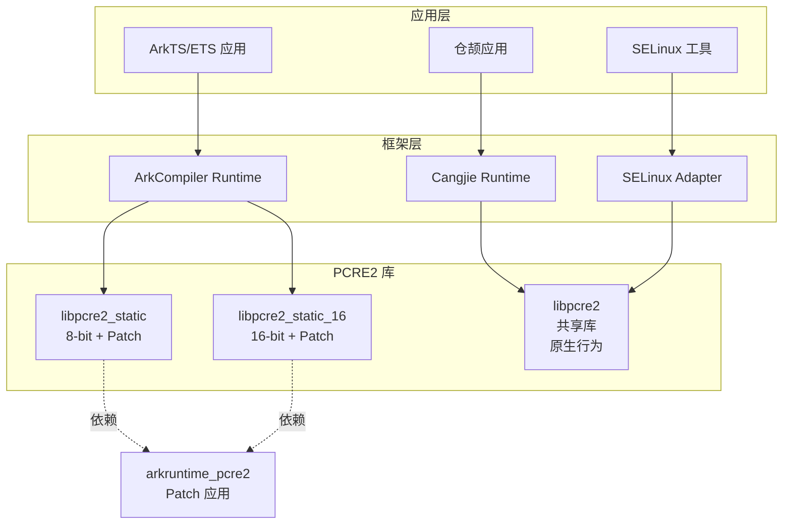

# 04 - 依赖关系与使用场景

## 直接依赖者

| 模块 | BUILD.gn 路径 | 使用的目标 | 用途描述 |
|-----|--------------|-----------|---------|
| **ArkCompiler Runtime Core** | `arkcompiler/runtime_core/static_core/runtime/BUILD.gn` | `libpcre2_static`, `libpcre2_static_16` | ArkTS/ETS 运行时正则表达式 |
| **SELinux Adapter** | `base/security/selinux_adapter/BUILD.gn` | `libpcre2` | SELinux 策略解析 |
| **Cangjie Runtime** | `third_party/cangjie_runtime/stdlib/libs/std/regex/BUILD.gn` | `libpcre2` | 仓颉语言正则表达式 |
| **SELinux (第三方)** | `third_party/selinux/BUILD.gn` | `libpcre2`, `libpcre2_static` | SELinux 策略编译 |

## 详细依赖分析

### 1. ArkCompiler Runtime Core

**路径**: `arkcompiler/runtime_core/static_core/runtime/BUILD.gn`

**依赖方式**:
```gn
# 外部依赖（通过 bundle.json）
_libarkruntime_calculated_external_deps += [ "pcre2:libpcre2_static" ]
_libarkruntime_calculated_external_deps += [ "pcre2:libpcre2_static_16" ]

# 或者独立构建时的直接依赖
deps += [
  "//third_party/pcre2:libpcre2_static",
  "//third_party/pcre2:libpcre2_static_16",
]
```

**使用场景**:
- **ArkTS/ETS RegExp**: 实现 JavaScript 风格的正则表达式对象
- **字符串处理**: `String.prototype.match()`, `String.prototype.replace()` 等
- **正则字面量**: `/pattern/flags` 语法的编译和匹配

**关键代码示例**:
```cpp
// 伪代码：ArkCompiler 使用 PCRE2
#include "pcre2.h"

// 编译正则表达式
pcre2_code* regex = pcre2_compile(
    pattern,           // 正则模式
    PCRE2_ZERO_TERMINATED,
    options,           // 编译选项（如 PCRE2_MULTILINE）
    &errorcode,        // 错误码
    &erroroffset,      // 错误位置
    NULL               // 编译上下文
);

// 执行匹配
int rc = pcre2_match(
    regex,             // 编译后的正则
    subject,           // 待匹配字符串
    subject_length,
    start_offset,
    match_options,
    match_data,        // 匹配结果
    NULL               // 匹配上下文
);
```

**特殊之处**: ArkCompiler 使用静态库，并且依赖 Patch 修改后的版本（`ARK_PCRE2_NEWLINE_PATCH`）。

### 2. SELinux Adapter

**路径**: `base/security/selinux_adapter/BUILD.gn`

**依赖方式**:
```gn
external_deps = [
  "pcre2:libpcre2",
]

# 工具链复制
ohos_copy("libpcre2_toolchain") {
  external_deps = [ "pcre2:libpcre2($host_toolchain)" ]
  # ...
}
```

**使用场景**:
- **策略文件解析**: 解析 SELinux 策略规则中的正则表达式
- **类型标记**: 处理安全上下文的模式匹配
- **策略编译**: 将策略源文件编译为二进制格式

**关键文件**:
- `libsepol` (SELinux Policy): 使用 PCRE2 解析策略规则

### 3. Cangjie Runtime (仓颉语言运行时)

**路径**: `third_party/cangjie_runtime/stdlib/libs/std/regex/BUILD.gn`

**依赖方式**:
```gn
external_deps = [ "pcre2:libpcre2" ]
```

**使用场景**:
- 仓颉语言标准库的 `regex` 模块
- 提供与 PCRE2 语法兼容的正则表达式功能

### 4. SELinux (第三方库)

**路径**: `third_party/selinux/BUILD.gn`

**依赖方式**:
```gn
external_deps = [
  "pcre2:libpcre2",
  "pcre2:libpcre2_static",
]
```

**使用场景**:
- `libsepol`: 策略编译库
- `libselinux`: SELinux 用户空间库
- `checkpolicy`: 策略编译器

## 依赖关系图



## 使用场景详解

### 场景 1: ArkTS/ETS 正则表达式

**典型用法**:
```typescript
// ArkTS 代码
let regex = /hello\s+(\w+)/i;
let match = "Hello World".match(regex);

// 使用 RegExp 对象
let regex2 = new RegExp("\\d+", "g");
let numbers = "abc123def456".match(regex2);
```

**底层调用链**:
```
ArkTS RegExp 对象
    ↓
ArkCompiler 运行时 (C++)
    ↓
libpcre2_static (Patch 版本)
    ↓
pcre2_compile() / pcre2_match()
```

**关键特性**:
- 使用 8-bit 版本处理 UTF-8 字符串
- 使用 16-bit 版本处理 UTF-16 字符串
- 启用 `ARK_PCRE2_NEWLINE_PATCH` 保证换行符行为

### 场景 2: SELinux 策略解析

**典型用法**:
```bash
# 编译 SELinux 策略
checkpolicy -c -o policy.bin policy.conf

# 加载策略
load_policy policy.bin
```

**底层调用链**:
```
policy.conf 文件
    ↓
checkpolicy / libsepol
    ↓
libpcre2 (共享库)
    ↓
策略规则匹配和验证
```

**关键特性**:
- 使用原生 PCRE2 行为（无需 Patch）
- 共享库形式，被多个 SELinux 工具使用

### 场景 3: 仓颉语言正则表达式

**典型用法** (伪代码):
```cangjie
import std.regex

func main(): Int64 {
    let pattern = Regex("\\d+")
    let result = pattern.match("abc123def")
    return 0
}
```

**底层调用链**:
```
仓颉源代码
    ↓
仓颉编译器
    ↓
Cangjie Runtime
    ↓
libpcre2 (共享库)
```

## 链接方式

### 静态链接

| 目标 | 使用者 | 说明 |
|-----|-------|-----|
| `libpcre2_static.a` | ArkCompiler | 8-bit，启用 Patch |
| `libpcre2_static_16.a` | ArkCompiler | 16-bit，启用 Patch |

**优点**:
- 无运行时依赖
- 可以定制编译选项（如 Patch）
- 性能略好（无 PLT 跳转）

**缺点**:
- 增加二进制体积
- 更新需要重新链接

### 动态链接

| 目标 | 使用者 | 说明 |
|-----|-------|-----|
| `libpcre2.so` | SELinux, 仓颉 | 原生行为 |

**优点**:
- 共享代码，减少内存占用
- 更新只需替换 so 文件
- 符合 Linux 标准实践

**缺点**:
- 运行时依赖
- 版本兼容性风险

## 头文件引用

依赖者通过以下方式引用 PCRE2 头文件：

```cpp
// 通过 inner_kits 配置的头文件路径
#include "pcre2.h"

// 内部使用
#include "pcre2_internal.h"
```

**头文件路径**（通过 GN config）:
```
//third_party/pcre2/pcre2/src          # 源码头文件
//third_party/pcre2/${target_gen_dir}/src  # 生成的头文件
```

## 版本兼容性

### 库版本

| 组件 | 当前版本 | 兼容性 |
|-----|---------|-------|
| PCRE2 | 10.46 | 向前兼容（旧应用可用新版库）|
| ABI | 0.14.0 | libpcre2.so.0.14.0 |

### 升级影响

**共享库升级**:
- 应用无需重新编译（ABI 兼容）
- 新功能可用（需重新编译以使用新 API）

**静态库升级**:
- 依赖者需要重新链接
- Patch 需要重新验证

## 性能考量

### JIT 编译

PCRE2 支持 JIT（Just-In-Time）编译，可以显著提升匹配性能：

| 模式 | 性能 | 使用场景 |
|-----|------|---------|
| 解释器 | 基准 | 简单模式、短字符串 |
| JIT | 5-20x 提升 | 复杂模式、长字符串、频繁匹配 |

**OH 配置**: JIT 始终启用（通过 `pcre2_jit_compile.c`）

### 使用建议

1. **ArkTS/ETS**: 频繁使用的正则表达式应缓存编译结果
2. **SELinux**: 策略编译一次性操作，JIT 收益不大
3. **仓颉**: 标准库应提供正则缓存机制

## 故障排查

### 常见问题

#### Q1: ArkTS 正则表达式行为与浏览器不一致？

**检查**:
```bash
# 确认使用了 Patch 版本
readelf -s libarkruntime.so | grep pcre2
# 应看到 ARK_PCRE2_NEWLINE_PATCH 相关符号
```

#### Q2: SELinux 策略编译失败？

**检查**:
```bash
# 确认 libpcre2.so 存在
ls -la /system/lib/libpcre2.so

# 检查符号表
nm -D /system/lib/libpcre2.so | grep pcre2_compile
```

#### Q3: 仓颉正则表达式崩溃？

**检查**:
- 确认 PCRE2 版本兼容性
- 检查是否有栈溢出（复杂正则可能导致）

---

> **下一步**: 了解 API 差异，请参阅 [05_API_Differences.md](./05_API_Differences.md)。
