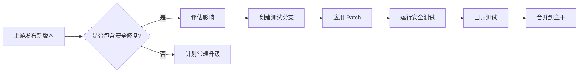

# 06 - 安全风险分析

## 已知 CVE 清单

### CVE-2025-58050

| 属性 | 值 |
|-----|-----|
| **CVE ID** | CVE-2025-58050 |
| **影响版本** | PCRE2 10.45 only |
| **修复版本** | PCRE2 10.46 |
| **OH 状态** | ✅ **已修复**（当前版本 10.46）|
| **严重程度** | 中等 |

#### 漏洞详情

**类型**: 越界读取 (Out-of-bounds Read)

**描述**: 
- 在使用 `(*ACCEPT)` 和 `(*scs:)` 模式特性时，可能发生任意长度的越界读取
- 需要攻击者控制的正则表达式模式才能触发
- 不能通过提供特殊的被匹配文本触发

**影响**:
- 拒绝服务 (DoS)
- 信息泄露
- 可能用于提升其他漏洞的严重性

**触发条件**:
```
1. 使用 PCRE2 10.45
2. 正则表达式包含 (*ACCEPT) 动词
3. 正则表达式包含 (*scs:) 特性
4. 攻击者能控制正则表达式模式
```

**修复**:
- 在 10.46 版本中修复了边界检查
- OH 当前版本 10.46 已包含此修复

### 历史 CVE

根据 PCRE2 官方文档，10.46 版本之前未发现其他已公开 CVE。但历史上 PCRE/PCRE2 曾出现过以下类型漏洞：

| CVE 类型 | 示例 | 防范措施 |
|---------|------|---------|
| 堆栈溢出 | 复杂正则导致的递归溢出 | 设置 `match_limit` 和 `depth_limit` |
| 越界读取 | CVE-2025-58050 | 及时升级版本 |
| 整数溢出 | 量词溢出 | 上游已修复 |
| 拒绝服务 | 灾难性回溯 | JIT 编译缓解 |

## 当前版本安全状态

### 版本信息

| 项目 | 值 |
|-----|-----|
| **当前版本** | 10.46 |
| **发布日期** | 2025-08-27 |
| **已知 CVE** | 0（已修复 CVE-2025-58050）|

### 安全特性

OH 中的 PCRE2 启用了以下安全特性：

#### 1. PAC-RET 保护

```gn
ohos_shared_library("libpcre2") {
  branch_protector_ret = "pac_ret"  # 启用指针认证
}
```

**作用**: 防止返回地址被篡改（ROP 攻击）

**平台**: ARM64（PAC 指令）

#### 2. 匹配限制

PCRE2 原生支持限制以防止 ReDoS（正则拒绝服务）：

```c
// 设置匹配限制
uint32_t match_limit = 1000000;
pcre2_set_match_limit(compile_context, match_limit);

// 设置深度限制
uint32_t depth_limit = 10000;
pcre2_set_depth_limit(compile_context, depth_limit);
```

**建议**: ArkCompiler 应在编译上下文设置合理的默认值。

#### 3. 堆栈保护

编译时启用：
```gn
cflags = [
  "-fstack-protector-strong",  # 堆栈保护
]
```

## Patch 引入的安全考量

### ARK_PCRE2_NEWLINE_PATCH 安全分析

#### 攻击面分析

**Patch 修改内容**: 减少换行符识别范围

**安全影响**: 
- ✅ **降低攻击面**: 减少了换行符处理代码路径
- ✅ **行为可预测**: 与 ECMAScript 一致，开发者预期明确
- ⚠️ **潜在差异**: 与原生 PCRE2 文档描述的行为不同

#### 风险评估

| 风险项 | 等级 | 说明 |
|-------|-----|-----|
| **引入新漏洞** | 低 | Patch 逻辑简单，仅移除代码分支 |
| **与上游差异** | 中 | 开发者参考 PCRE2 文档时可能困惑 |
| **升级兼容性** | 中 | 需确保 Patch 正确应用 |

## 安全使用建议

### 对于系统开发者

#### 1. 正则表达式输入验证

```c
// 示例：限制正则模式长度
#define MAX_PATTERN_LENGTH 10000

pcre2_code* safe_compile(const char* pattern) {
    if (strlen(pattern) > MAX_PATTERN_LENGTH) {
        return NULL;  // 拒绝过长的模式
    }
    
    // 检查危险模式
    if (strstr(pattern, "(*ACCEPT)") || strstr(pattern, "(*scs:")) {
        // 额外审查或限制
    }
    
    return pcre2_compile((PCRE2_SPTR)pattern, ...);
}
```

#### 2. 资源限制

```c
// 创建带限制的编译上下文
pcre2_compile_context* ctx = pcre2_compile_context_create(NULL);

// 设置匹配限制（防止灾难性回溯）
pcre2_set_match_limit(ctx, 1000000);

// 设置堆栈深度限制
pcre2_set_depth_limit(ctx, 10000);

// 编译
pcre2_code* re = pcre2_compile(pattern, length, options, 
                               &errorcode, &erroroffset, ctx);
```

#### 3. JIT 安全

```c
// JIT 编译后，内存页标记为可执行
// 确保内存分配安全
pcre2_jit_compile(re, PCRE2_JIT_COMPLETE);

// 使用 JIT 快速路径匹配
pcre2_jit_match(re, subject, length, startoffset, options, 
                match_data, match_context);
```

### 对于应用开发者

#### ArkTS/ETS 应用

```typescript
// 避免使用用户输入直接构造正则表达式
// ❌ 危险
function search(text: string, userPattern: string): boolean {
    return new RegExp(userPattern).test(text);
}

// ✅ 安全：白名单验证
function safeSearch(text: string, userPattern: string): boolean {
    // 验证模式只包含安全字符
    if (!/^[a-zA-Z0-9\s\-_.*?+\[\]()|^$]+$/.test(userPattern)) {
        return false;
    }
    return new RegExp(userPattern).test(text);
}
```

#### 通用原则

1. **永远不要信任用户输入的正则表达式**
   - 即使 PCRE2 安全，复杂正则仍可能导致 DoS
   - 使用超时机制

2. **限制模式复杂度**
   - 避免嵌套量词 `(a+)+`
   - 避免过多分支 `(a|b|c|...){100}`

3. **使用匹配限制**
   - 设置合理的 `match_limit`
   - 设置合理的 `depth_limit`

## 升级策略

### 安全升级流程



### 监控机制

1. **上游监控**
   - 订阅 PCRE2 邮件列表：pcre2-dev@googlegroups.com
   - 关注 GitHub Releases：https://github.com/PCRE2Project/pcre2/releases

2. **安全公告**
   - OpenHarmony 安全公告页面
   - CVE 数据库监控

3. **自动化扫描**
   - 定期扫描依赖版本
   - 自动告警已知 CVE

## 应急响应

### 发现漏洞时的处理流程

1. **评估影响**
   ```bash
   # 检查当前版本
   grep "Version Number" third_party/pcre2/README.OpenSource
   ```

2. **临时缓解**
   - 如果漏洞可被利用，考虑临时禁用相关功能
   - 对于 ArkCompiler，可回退到解释器模式（禁用 JIT）

3. **紧急修复**
   - 升级到新版本
   - 或应用上游安全补丁

4. **验证修复**
   - 运行全量测试
   - 特别关注正则表达式相关功能

5. **发布更新**
   - 更新安全公告
   - 通知下游组件

## 安全测试建议

### 建议的测试用例

1. **ReDoS 测试**
   ```javascript
   // 测试灾难性回溯保护
   const evilPattern = /(a+)+$/;
   const longString = "a".repeat(100) + "b";
   // 应在合理时间内返回 false
   ```

2. **边界测试**
   ```javascript
   // 测试 CVE-2025-58050 修复
   const pattern = "(*ACCEPT)(*scs:1)";
   // 不应崩溃或越界读取
   ```

3. **换行符测试**
   ```javascript
   // 验证 Patch 行为
   /.$/m.test("a\x0B");  // VT 字符
   // ArkCompiler: true
   // 原生 PCRE2: false
   ```

---

## 参考资源

- [PCRE2 Security Policy](https://github.com/PCRE2Project/pcre2/blob/master/SECURITY.md)
- [OpenHarmony Security](https://gitee.com/openharmony/security)
- [CVE 数据库](https://cve.mitre.org/)

---

> **文档导航完成！** 返回 [README.md](./README.md) 查看概览，或查看 [SUMMARY.md](./SUMMARY.md) 获取阅读路线建议。
