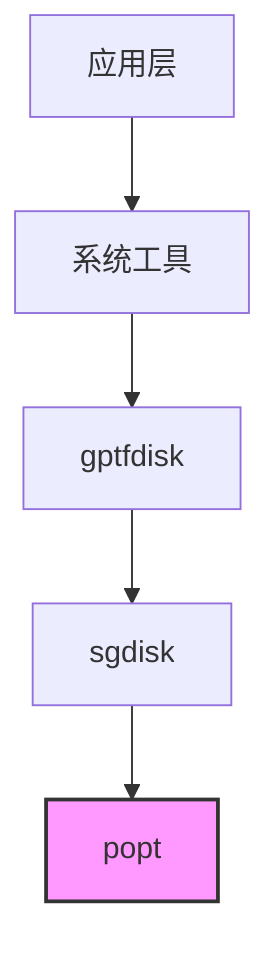

# 01 - 原始库简介与 OpenHarmony 定位

## 1.1 原始库信息

### 基本信息
| 属性 | 值 |
|------|-----|
| 名称 | popt (Parse Options) |
| 版本 | 1.19 |
| 许可证 | MIT License |
| 上游仓库 | https://github.com/rpm-software-management/popt |
| 维护组织 | RPM 软件包管理器项目 |

### 功能概述
popt 是一个用于解析命令行参数的 C 语言库，设计目标是为应用程序提供比标准 `getopt(3)` 更强大、更灵活的参数解析能力。

#### 主要特性
1. **完全可重入** - 线程安全，可同时处理多个参数集
2. **灵活解析** - 可解析任意 `argv[]` 风格数组，不限于 `main()` 的参数
3. **参数别名** - 支持用户自定义参数别名和缩写
4. **自动帮助生成** - 根据选项表自动生成 `--help` 和 `--usage` 信息
5. **参数类型丰富** - 支持字符串、整数、长整数、浮点数、位集合等多种类型
6. **国际化支持** - 内置 i18n 支持，帮助信息可翻译

### 核心 API 概览

```c
// 基本使用流程
#include <popt.h>

// 1. 定义选项表
struct poptOption options[] = {
    { "verbose", 'v', POPT_ARG_NONE, &verbose, 0, "Enable verbose output", NULL },
    { "output", 'o', POPT_ARG_STRING, &output_file, 0, "Output file", "FILE" },
    POPT_AUTOHELP
    POPT_TABLEEND
};

// 2. 创建上下文
poptContext optCon = poptGetContext(NULL, argc, argv, options, 0);

// 3. 循环处理选项
while ((c = poptGetNextOpt(optCon)) >= 0) {
    // 处理选项逻辑
}

// 4. 清理
poptFreeContext(optCon);
```

### 版本历史
| 版本 | 主要变更 |
|------|---------|
| 1.19 | 当前上游版本，包含 bug 修复 |
| 1.18 | 新增 POPT_ARG_BITSET 位集合参数 |
| 1.16 | 新增 POPT_ARG_LONGLONG 和 POPT_ARG_ARGV |
| 1.14 | 移除 mmap 依赖，提高可移植性 |
| 1.0 | 初始版本 |

## 1.2 OpenHarmony 中的定位

### 组件归属
- **子系统**: thirdparty (第三方库)
- **组件名**: popt
- **目标路径**: `third_party/popt`
- **发布方式**: code-segment (代码片段)

### 在 OH 架构中的位置



### 在 OH 中的作用

popt 在 OpenHarmony 中扮演**命令行工具基础设施**的角色：

1. **参数解析标准化** - 为命令行工具提供统一的参数解析能力
2. **开发效率提升** - 避免每个工具重复实现参数解析逻辑
3. **用户体验一致** - 确保所有使用 popt 的工具有相似的帮助格式和错误提示

### 使用场景

| 场景 | 说明 |
|------|------|
| **GPT 分区管理** | gptfdisk 的 sgdisk 使用 popt 解析分区操作命令 |
| **未来扩展** | 其他命令行工具可复用此库 |

### 适配特点

#### 为什么选择 popt？
1. **成熟稳定** - 自 1998 年起随 RPM 项目发展，历经多年考验
2. **无依赖** - 除标准库外无其他依赖，易于移植
3. **功能完整** - 满足复杂命令行工具的需求
4. **许可友好** - MIT 许可证与 OH 兼容

#### OH 特定的适配
- **静态链接** - 以静态库形式提供，避免动态链接复杂性
- **功能裁剪** - 未启用配置文件功能 (poptconfig.c)，减少攻击面
- **编译优化** - 使用 `-Os` 优化代码大小，适合嵌入式场景

## 1.3 许可证说明

### 许可证信息
- **上游许可证**: MIT License
- **OH 声明**: X Consortium (bundle.json) / MIT (README.OpenSource)

### 许可证兼容性
MIT 许可证是宽松的开源许可证，允许：
- ✅ 商业使用
- ✅ 修改
- ✅ 分发
- ✅ 私有使用
- ✅ 再许可

唯一要求：保留版权声明和许可文本。

### TODO(需确认)
README.OpenSource 声明 MIT，但 bundle.json 声明 X Consortium。两者实质相似，但建议统一声明以避免混淆。

## 1.4 与上游的差异

### 版本一致性
| 来源 | 版本 | 说明 |
|------|------|------|
| README.OpenSource | 1.19 | 实际源码版本 |
| config.h | 1.16 | 配置文件中定义，建议更新 |
| bundle.json | 3.1 | OH 组件版本号 |

### 代码差异
**无代码级差异** - OH 使用的 popt 代码与上游 1.19 完全一致，未进行任何修改。

这体现了 popt 库的**高度可移植性**：
- 无需平台特定适配
- 功能完全满足需求
- 维护成本极低

### 构建差异
| 方面 | 上游 | OH |
|------|------|-----|
| 构建系统 | Autotools | GN (BUILD.gn) |
| 库类型 | 动态/静态 | 仅静态 |
| 安装方式 | system-wide | 组件化 |
| 配置文件支持 | 完整 | 禁用 |
