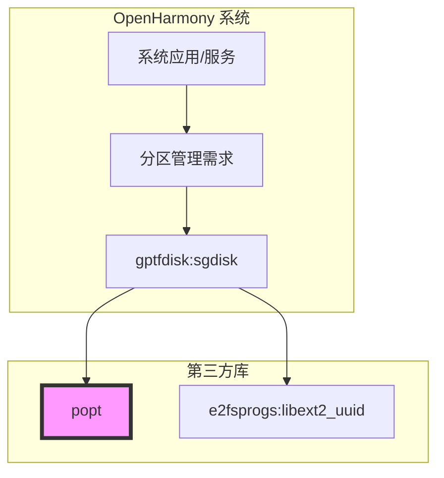

# 04 - OpenHarmony 中的使用与依赖关系

## 4.1 直接依赖者列表

### 依赖统计
| 统计项 | 数值 |
|--------|------|
| 直接依赖者数量 | 1 |
| 间接依赖者数量 | 0 |
| 总依赖者数量 | 1 |

### 依赖者详情

#### gptfdisk
| 属性 | 值 |
|------|-----|
| 模块名 | gptfdisk |
| BUILD.gn | `third_party/gptfdisk/BUILD.gn` |
| 使用目标 | sgdisk (可执行文件) |
| 依赖方式 | 静态链接 |
| 用途 | 命令行参数解析 |

**BUILD.gn 引用**:
```gn
ohos_executable("sgdisk") {
  external_deps = [
    "e2fsprogs:libext2_uuid",
    "popt:popt_static",
  ]
  ...
}
```

---

## 4.2 gptfdisk 详细分析

### 4.2.1 模块简介
gptfdisk 是一组用于操作 GPT (GUID Partition Table) 分区表的工具，包括：
- **gdisk** - 交互式文本模式分区工具
- **cgdisk** - curses 界面分区工具
- **sgdisk** - 命令行驱动分区工具
- **fixparts** - MBR 分区表修复工具

### 4.2.2 popt 在 gptfdisk 中的作用

**sgdisk** 是唯一使用 popt 的组件：
- gdisk 和 cgdisk 使用交互式界面，不需要命令行解析库
- fixparts 使用自定义解析逻辑
- **sgdisk** 需要处理复杂的命令行参数，因此使用 popt

### 4.2.3 使用场景

sgdisk 使用 popt 解析以下类型的参数：

| 参数类型 | 示例 | 说明 |
|----------|------|------|
| 操作选项 | `-d`, `--delete` | 删除分区 |
| 信息查询 | `-p`, `--print` | 打印分区表 |
| 备份操作 | `-b`, `--backup` | 备份分区表 |
| 恢复操作 | `-l`, `--load-backup` | 从备份恢复 |
| 属性设置 | `-t`, `--typecode` | 设置分区类型 |
| 帮助选项 | `-h`, `--help` | 显示帮助 |

### 4.2.4 典型调用示例

```bash
# 打印分区表
sgdisk -p /dev/sda

# 删除第 5 个分区
sgdisk -d 5 /dev/sda

# 备份分区表到文件
sgdisk -b backup.bin /dev/sda

# 显示帮助
sgdisk --help
```

---

## 4.3 依赖关系图

### 4.3.1 整体依赖视图



### 4.3.2 popt 在依赖链中的位置

```
应用/脚本
    └── sgdisk (gptfdisk)
            ├── popt (命令行解析) ⭐
            └── libext2_uuid (UUID 生成)
```

### 4.3.3 反向依赖 (哪些模块可能被 popt 影响)

由于 popt 仅被 gptfdisk 使用，影响范围有限：
- 分区管理相关功能
- 命令行工具的行为

---

## 4.4 链接方式分析

### 4.4.1 静态链接

popt 以**静态库**形式提供给 gptfdisk：

```gn
# gptfdisk/BUILD.gn
external_deps = [
    "popt:popt_static",  # 静态链接
]
```

**优点**:
- ✅ 无运行时依赖
- ✅ 单文件可执行
- ✅ 部署简单

**缺点**:
- ❌ 可执行文件稍大
- ❌ 多工具不能共享代码 (但只有一个工具使用)

### 4.4.2 头文件引用

```cpp
// gptfdisk 源码中的引用方式
#include "sgdisk.h"
// sgdisk.h 中可能包含:
#include <popt.h>
```

通过 BUILD.gn 的 `public_configs` 自动获取头文件路径：
```gn
config("popt_config") {
  include_dirs = [ "//third_party/popt/src" ]
}
```

---

## 4.5 使用方式总结

### 4.5.1 API 使用模式

gptfdisk 中典型的 popt 使用模式：

```cpp
// 1. 定义选项表
struct poptOption options[] = {
    {"print", 'p', POPT_ARG_NONE, &print_table, 0, 
     "Print the partition table", NULL},
    {"backup", 'b', POPT_ARG_STRING, &backup_file, 0,
     "Backup partition table to file", "FILE"},
    {"delete", 'd', POPT_ARG_INT, &delete_part, 0,
     "Delete a partition", "PARTNUM"},
    POPT_AUTOHELP
    POPT_TABLEEND
};

// 2. 创建解析上下文
poptContext optCon = poptGetContext(NULL, argc, argv, options, 0);

// 3. 解析循环
int c;
while ((c = poptGetNextOpt(optCon)) >= 0) {
    // 选项值自动填充到对应的变量
}

// 4. 错误处理
if (c < -1) {
    fprintf(stderr, "Error: %s\n", poptBadOption(optCon, POPT_BADOPTION_NOALIAS));
    return 1;
}

// 5. 获取剩余参数 (如设备路径)
const char *device = poptGetArg(optCon);

// 6. 清理
poptFreeContext(optCon);
```

### 4.5.2 关键 API 说明

| API 函数 | 用途 |
|----------|------|
| `poptGetContext()` | 创建解析上下文 |
| `poptGetNextOpt()` | 获取下一个选项 |
| `poptGetArg()` | 获取非选项参数 |
| `poptBadOption()` | 获取出错的选项 |
| `poptFreeContext()` | 释放资源 |
| `POPT_AUTOHELP` | 自动生成 `--help` |

---

## 4.6 影响范围评估

### 4.6.1 功能影响

popt 影响的功能：
- ✅ GPT 分区表管理 (通过 sgdisk)
- ✅ 分区备份/恢复
- ✅ 分区属性修改

popt 不影响的功能：
- ❌ 文件系统操作 (由其他工具处理)
- ❌ 磁盘 I/O 底层操作 (由 gptfdisk 自己处理)
- ❌ 交互式分区工具 (gdisk, cgdisk 不使用 popt)

### 4.6.2 安全风险面

由于使用范围有限，攻击面较小：
- 输入来源: 命令行参数 (受控环境)
- 使用场景: 系统管理员工具
- 权限要求: 通常需要 root 权限

---

## 4.7 扩展使用建议

### 4.7.1 适合使用 popt 的场景

如果你的 OH 命令行工具需要以下功能，建议使用 popt：

| 场景 | 说明 |
|------|------|
| 复杂参数解析 | 长选项、短选项、带参数选项 |
| 自动帮助生成 | 不想手动维护 `--help` 输出 |
| 参数验证 | 类型检查、范围检查 |
| 参数别名 | 用户可配置参数简写 |

### 4.7.2 集成步骤

```gn
# 1. 在 BUILD.gn 中添加依赖
ohos_executable("my_tool") {
  external_deps = [
    "popt:popt_static",
  ]
}
```

```c
// 2. 在源码中包含头文件
#include <popt.h>

// 3. 使用 popt API 解析参数
// (参考第 4.5.1 节的示例)
```

---

## 4.8 总结

| 方面 | 说明 |
|------|------|
| 依赖者数量 | 1 (gptfdisk:sgdisk) |
| 使用范围 | 命令行参数解析 |
| 链接方式 | 静态链接 |
| 功能影响 | 分区管理工具 |
| 安全级别 | 低 (受控环境使用) |
| 扩展性 | 好 (可为其他工具提供支持) |

**关键结论**: popt 在 OH 中目前仅用于 gptfdisk 的 sgdisk 工具，是典型的**单一用途、低影响**第三方库。其功能稳定，无需修改，适合作为命令行工具的基础组件。
