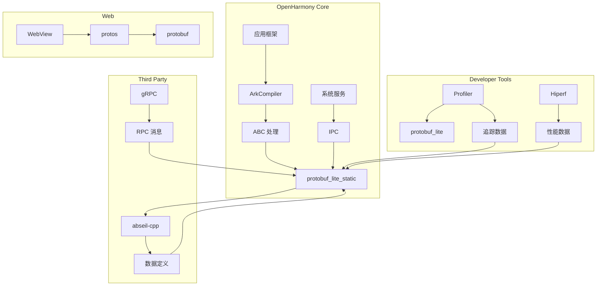

# 依赖关系与使用

## 4.1 直接依赖者概览

在 OpenHarmony 代码库中，共有 **188 个 BUILD.gn 文件** 包含对 protobuf 的依赖。

### 4.1.1 主要依赖模块

| 模块名称 | BUILD.gn 路径 | 依赖类型 | 使用场景 |
|----------|---------------|----------|----------|
| **ArkCompiler** | `arkcompiler/ets_frontend/merge_abc/` | protobuf_lite_static | ABC 文件处理与合并 |
| **WebView** | `base/web/webview/interfaces/kits/napi/protos/` | protobuf | WebView 原生接口定义 |
| **Profiler** | `developtools/profiler/device/services/*/` | protobuf_lite | 性能分析数据序列化 |
| **Hiperf** | `developtools/hiperf/` | protobuf_lite | 性能剖析工具 |
| **gRPC** | `third_party/grpc/` | protobuf | RPC 通信框架 |
| **libphonenumber** | `third_party/libphonenumber/cpp/` | protobuf | 电话号码库 |

### 4.1.2 按子系统分类

| 子系统 | 依赖模块数 | 主要用途 |
|--------|------------|----------|
| **arkcompiler** | 5+ | 方言转换、ABC 处理 |
| **developtools** | 30+ | 性能分析、追踪 |
| **base/web** | 10+ | WebView 通信 |
| **third_party** | 20+ | 第三方库依赖 |
| **其他** | 100+ | 零散使用 |

## 4.2 使用方式详解

### 4.2.1 静态链接

**适用场景**：系统核心模块、需要减少运行时依赖

```gn
# 静态链接 protobuf_lite
external_deps = [ "protobuf:protobuf_lite_static" ]

# 静态链接完整版
external_deps = [ "protobuf:protobuf_static" ]
```

**示例 - ArkCompiler ABC 处理**：

```gn
ohos_static_library("merge_abc") {
  sources = [ "xxx.cc" ]
  external_deps = [ "protobuf:protobuf_lite_static" ]
  # 编译器静态链接 protobuf，用于 ABC 文件处理
}
```

### 4.2.2 动态链接

**适用场景**：可加载模块、插件系统、节省 ROM 空间

```gn
# 动态链接 protobuf_lite
external_deps = [ "protobuf:protobuf_lite" ]
```

**示例 - Profiler 插件**：

```gn
ohos_shared_library("profiler_plugin") {
  sources = [ "plugin.cc" ]
  external_deps = [ "protobuf:protobuf_lite" ]
  # 插件动态链接，运行时加载 protobuf
}
```

### 4.2.3 头文件引用

```cpp
// 标准 protobuf 引用方式
#include <google/protobuf/message.h>
#include <google/protobuf/descriptor.h>
#include <google/protobuf/arena.h>

// 使用 lite 版本
#include <google/protobuf/message_lite.h>
```

### 4.2.4 Protoc 使用

```gn
# 使用预编译的 protoc
protoc = rebase_path("//binarys/third_party/protobuf/innerapis/protoc/clang_x64/libs/protoc")

# 构建时编译 .proto 文件
action("generate_my_proto") {
  protoc = "//third_party/protobuf:protoc"
  sources = [ "my_data.proto" ]
  outputs = [ "$generated_dir/my_data.pb.cc" ]
  deps = [ ":protoc" ]
}
```

## 4.3 典型使用场景

### 4.3.1 场景 1：IPC 消息定义

```protobuf
// data.proto
message IPCMessage {
  string sender = 1;
  bytes payload = 2;
  int64 timestamp = 3;
}
```

```cpp
// 使用示例
IPCMessage msg;
msg.set_sender("system_service");
msg.set_payload(data.data(), data.size());
msg.set_timestamp(current_time());
std::string serialized = msg.SerializeAsString();
```

### 4.3.2 场景 2：配置序列化

```protobuf
message AppConfig {
  string app_name = 1;
  repeated string permissions = 2;
  map<string, string> settings = 3;
}
```

### 4.3.3 场景 3：性能追踪数据

```protobuf
message TraceEvent {
  enum Phase {
    BEGIN = 0;
    END = 1;
    INSTANT = 2;
  }
  string name = 1;
  Phase phase = 2;
  int64 timestamp = 3;
  map<string, string> args = 4;
}
```

## 4.4 依赖关系图

### 4.4.1 全局依赖图



### 4.4.2 模块级依赖

```
┌──────────────────────────────────────────────────────────────────┐
│                        依赖层级                                   │
├──────────────────────────────────────────────────────────────────┤
│  Level 0: abseil-cpp (底层依赖)                                   │
│     ▲                                                              │
│  Level 1: protobuf_lite/protobuf (核心库)                         │
│     ▲                                                              │
│  Level 2: arkcompiler, profiler, hiperf (直接依赖者)               │
│     ▲                                                              │
│  Level 3: 应用层模块 (间接使用者)                                   │
└──────────────────────────────────────────────────────────────────┘
```

### 4.4.3 依赖链示例

```
ABC 文件处理链：
  merge_abc ──static──▶ protobuf_lite_static ──static──▶ abseil-cpp

Profiler 插件链：
  profiler_plugin ──shared──▶ protobuf_lite ──static──▶ abseil-cpp

WebView 接口链：
  webview_kits ──static──▶ protobuf ──static──▶ abseil-cpp
```

## 4.5 使用最佳实践

### 4.5.1 版本选择指南

| 场景 | 推荐版本 | 理由 |
|------|----------|------|
| **设备端应用** | protobuf_lite | ROM/RAM 占用小 |
| **系统服务** | protobuf_lite | 启动快、稳定 |
| **构建工具** | protobuf_full | 需要反射功能 |
| **开发调试** | protobuf_full | 功能完整 |

### 4.5.2 链接方式选择

| 考量因素 | 静态链接 | 动态链接 |
|----------|----------|----------|
| **二进制大小** | 较大 | 较小（共享） |
| **启动速度** | 较快 | 较慢（加载） |
| **更新便利** | 困难 | 容易 |
| **兼容性** | 稳定 | 需版本匹配 |
| **适用场景** | 核心模块 | 插件系统 |

### 4.5.3 常见问题

**Q1: 静态链接 vs 动态链接如何选择？**

A: 系统核心模块建议静态链接，避免运行时依赖冲突；插件和工具可使用动态链接。

**Q2: protobuf 版本不匹配会怎样？**

A: 可能导致序列化/反序列化兼容性问题，建议统一 OH 版本的 protobuf 版本。

**Q3: 如何在模块中使用 protoc？**

A: 通过 `//third_party/protobuf:protoc` 目标引用预编译的 protoc 工具。

## 4.6 依赖验证

### 检查模块依赖

```bash
# 查看哪些模块依赖 protobuf
grep -r "protobuf:" --include="BUILD.gn" /path/to/module/ | head -20

# 检查静态/动态链接
grep -r "protobuf_lite_static\|protobuf_lite" --include="BUILD.gn" /path/to/module/
```
