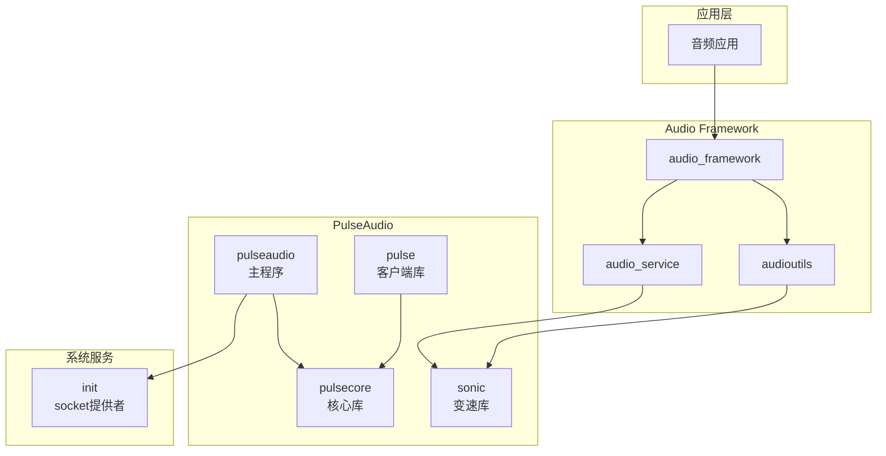

# 04 - PulseAudio 在 OpenHarmony 中的使用

## 4.1 依赖关系总览

### 依赖图



---

## 4.2 直接依赖者列表

### 生产代码依赖

| 模块 | 路径 | 依赖组件 | 用途 |
|-----|------|---------|------|
| audioutils | `frameworks/native/audioutils/BUILD.gn` | `pulseaudio:sonic` | 音频变速处理 |
| audio_service | `services/audio_service/BUILD.gn` | `pulseaudio:sonic` | 音频服务中的变速功能 |

### 测试代码依赖

| 模块类型 | 数量 | 说明 |
|---------|------|------|
| ACTS 测试 | 1 | audio_cpp_standard |
| Fuzz 测试 | 20+ | 多个 fuzzer 依赖 sonic/pulse |

### 详细依赖分析

#### audio_service (音频服务)

```python
# services/audio_service/BUILD.gn
external_deps += [ "pulseaudio:sonic" ]
```

**使用场景**：
- 音频播放速度调整
- 音频流时间拉伸
- 音频处理管道中的变速节点

#### audioutils (音频工具)

```python
# frameworks/native/audioutils/BUILD.gn
external_deps += [ "pulseaudio:sonic" ]
```

**使用场景**：
- 通用音频变速算法封装
- 音频处理工具函数
- 媒体播放器的变速支持

---

## 4.3 使用方式详解

### 4.3.1 Sonic 库使用

#### 链接方式
- **静态链接**：否 (shared_library)
- **动态链接**：是
- **头文件引用**：`#include "sonic.h"`

#### API 调用示例

```c
#include "sonic.h"

// 创建 Sonic 流
sonicStream stream = sonicCreateStream(sampleRate, channels);

// 设置速度
sonicSetSpeed(stream, 1.5f);  // 1.5倍速
sonicSetPitch(stream, 1.0f);  // 保持音调

// 处理音频数据
sonicWriteShortToStream(stream, samples, numSamples);
int samplesAvailable = sonicSamplesAvailable(stream);
sonicReadShortFromStream(stream, outSamples, samplesAvailable);

// 销毁
sonicDestroyStream(stream);
```

### 4.3.2 PulseAudio 客户端库使用

#### 链接方式
- **库名**：`pulse`, `pulse-simple`
- **头文件路径**：`third_party/pulseaudio/src/pulse/`

#### 使用场景

目前 OHOS 中主要使用 **sonic** 组件，**pulse** 客户端库主要在 fuzzer 测试中使用。

生产代码中的典型使用模式：

```c
// 简单音频播放 (pulse-simple)
#include <pulse/simple.h>

pa_simple *s = NULL;
int error;

pa_sample_spec ss = {
    .format = PA_SAMPLE_S16LE,
    .rate = 44100,
    .channels = 2
};

s = pa_simple_new(NULL, "app_name", PA_STREAM_PLAYBACK, 
                  NULL, "stream_name", &ss, NULL, NULL, &error);

// 写入音频数据
pa_simple_write(s, buffer, sizeof(buffer), &error);

// 清理
pa_simple_free(s);
```

---

## 4.4 PulseAudio 守护进程启动

### 启动流程

```
init 进程
    │
    ├── 创建 socket (/dev/unix/socket/native)
    │
    └── 启动 pulseaudio 服务
            │
            ├── 调用 ohos_pa_main()
            │
            ├── 获取预创建 socket (GetControlSocket)
            │
            ├── 初始化 PulseAudio 核心
            │
            └── 开始监听客户端连接
```

### Init 配置 (cfg 文件)

```cfg
# system.cfg 或 subsystem_cfg 中的配置示例
service pulseaudio /system/bin/pulseaudio
    socket native stream 0666 root root
    # ...
```

### Socket 权限

| 路径 | 权限 | 说明 |
|-----|------|------|
| `/dev/unix/socket/native` | 0666 | PulseAudio 主 socket |
| `/data/data/.pulse_dir/` | 0755 | 运行时目录 |
| `/data/data/.pulse_dir/runtime/native` | 0666 | 运行时 socket |
| `/data/data/.pulse_dir/state/cookie` | 0664 | 认证 cookie |

---

## 4.5 典型使用场景

### 场景 1：媒体播放器变速播放

```
媒体播放器
    │
    ├── 用户设置播放速度 1.5x
    │
    ├── Audio Framework 路由决策
    │
    ├── audio_service 处理
    │       └── 调用 sonic 变速算法
    │
    └── 输出到音频 HAL
```

### 场景 2：系统音效播放

```
系统事件
    │
    ├── 通知 Audio Framework
    │
    ├── 音频流路由
    │
    ├── 通过 PulseAudio 协议发送到守护进程
    │
    └── 混音后输出
```

### 场景 3：录音处理

```
录音应用
    │
    ├── 请求录音
    │
    ├── Audio Framework 权限检查
    │
    ├── PulseAudio 创建录音流
    │
    └── 音频数据回调
```

---

## 4.6 依赖关系变化趋势

### 当前状态 (截至分析时)
- **生产依赖**：audio_service, audioutils → sonic
- **测试依赖**：大量使用 sonic/pulse
- **守护进程**：独立运行，无直接模块依赖

### 可能的变化
1. **音频框架演进**：可能逐步替代 PulseAudio 的部分功能
2. **Sonic 独立**：可能将 sonic 独立为单独的 third_party 库
3. **协议变更**：PA_COMMAND_UNDERFLOW_OHOS 可能扩展更多 OHOS 专用命令

---

## 4.7 集成注意事项

### 对于 Audio Framework 开发者

1. **Sonic 使用**
   - 确认变速需求是否需要 sonic
   - 注意采样率和通道数配置
   - 处理变速后的缓冲区大小变化

2. **PulseAudio 协议**
   - 了解 `PA_COMMAND_UNDERFLOW_OHOS` 命令
   - 处理音频下溢事件
   - 正确设置流属性

### 对于系统开发者

1. **Init 集成**
   - 确保 init 配置正确创建 socket
   - 检查 socket 权限设置
   - 处理服务重启场景

2. **权限配置**
   - 确认 `/data/data/.pulse_dir` 权限
   - 检查 SELinux/沙箱策略
   - 验证客户端访问权限

---

## 4.8 故障排查

### 常见问题

| 问题 | 可能原因 | 排查方法 |
|-----|---------|---------|
| 无法连接 PulseAudio | init socket 未创建 | 检查 `/dev/unix/socket/native` |
| 权限拒绝 | 目录权限不正确 | 检查 `.pulse_dir` 权限 |
| Sonic 变速无效 | 参数设置错误 | 检查 sonic API 调用 |
| 音频下溢 | 缓冲区不足 | 监控 `PA_COMMAND_UNDERFLOW_OHOS` |

### 日志查看

```bash
# 查看 PulseAudio 日志
hilog | grep PulseAudio

# 查看详细日志
hilog -T PulseAudio
```
