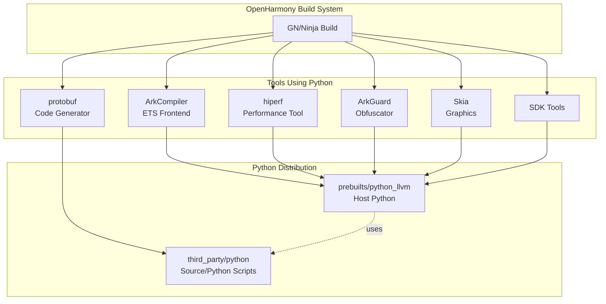

# Python 在 OpenHarmony 中的使用

## 依赖关系概述

Python 在 OpenHarmony 中作为**构建时依赖**使用，而非运行时组件。它被多个开发工具和编译器组件所依赖。

### 依赖关系图



## 直接依赖者清单

### 1. ArkCompiler (方舟编译器)

**路径**: `arkcompiler/ets_frontend/`

**使用方式**:
- **ArkGuard**: ArkTS 代码混淆工具
  ```gn
  # arkguard/BUILD.gn
  #!/usr/bin/env python
  ```

- **ETS Frontend**: TypeScript/ETS 语法处理
  - 使用 Python 脚本进行语法分析和 AST 转换
  - 路径: `arkcompiler/ets_frontend/legacy_bin/api8/`

**依赖类型**: 构建时脚本执行

### 2. hiperf (性能分析工具)

**路径**: `developtools/hiperf/`

**使用方式**:
```gn
# BUILD.gn
ohos_copy("hiperf_host_python") {
    # 复制 Python 运行时到主机工具目录
}

deps += [ ":hiperf_host_python" ]  # 主机端构建依赖
```

**依赖类型**: 主机端工具运行时

### 3. Protobuf 代码生成

**路径**: `developtools/smartperf_host/trace_streamer/src/protos/`

**使用方式**:
```gn
# BUILD.gn
sources = [
    "$protobuf_dir/compiler/python/python_generator.cc",
    ...
]
```

**依赖类型**: 编译时代码生成

### 4. ArkDefectScan (Ark 缺陷扫描)

**路径**: `arkcompiler/runtime_core/libark_defect_scan_aux/tests/unittest/`

**使用方式**:
```gn
# BUILD.gn
group("run_python_script_first") {
    # 使用 Python 脚本准备测试环境
}

deps = [ ":run_python_script_first" ]
```

**依赖类型**: 测试时脚本执行

### 5. Skia 图形库

**路径**: `third_party/skia/m133/gn/toolchain/`

**使用方式**:
```gn
# BUILD.gn
command = "$shell python3 \"$cp_py\" {{source}} {{output}}"

# 或
command = "python3 \"$rm_py\" \"{{output}}\" && $ar rcs {{output}} @$rspfile"
```

**依赖类型**: 构建时工具脚本

### 6. Musl NDK 脚本

**路径**: `interface/sdk_c/third_party/musl/ndk_script/`

**使用方式**:
```gn
# BUILD.gn
prebuilts_python = "//prebuilts/python_llvm"

# Darwin ARM64
args += [ "-p" ] + [ rebase_path("${prebuilts_python}/darwin-arm64") ]

# Darwin x86
args += [ "-p" ] + [ rebase_path("${prebuilts_python}/darwin-x86") ]

# Linux x86
args += [ "-p" ] + [ rebase_path("${prebuilts_python}/linux-x86") ]

# Windows x86
args += [ "-p" ] + [ rebase_path("${prebuilts_python}/windows-x86") ]

# OHOS ARM64
args += [ "-p" ] + [ rebase_path("${ohos_arm64_toolchain_dir}/llvm/python3") ]
```

**依赖类型**: SDK 构建工具链

## 依赖关系详表

| 模块 | BUILD.gn 路径 | 使用方式 | Python 来源 |
|-----|--------------|---------|------------|
| ArkGuard | arkcompiler/ets_frontend/arkguard/BUILD.gn | 脚本执行 | prebuilts |
| hiperf | developtools/hiperf/BUILD.gn | 运行时复制 | prebuilts |
| protobuf | developtools/smartperf_host/.../protos/BUILD.gn | 代码生成器 | third_party |
| ArkDefectScan | arkcompiler/.../unittest/BUILD.gn | 测试脚本 | prebuilts |
| Skia | third_party/skia/m133/gn/toolchain/BUILD.gn | 构建工具 | prebuilts |
| Musl NDK | interface/sdk_c/.../ndk_script/BUILD.gn | SDK 构建 | prebuilts |

## 预构建 Python 分布

### 目录结构

```
prebuilts/python_llvm/
├── darwin-arm64/          # macOS ARM64 (Apple Silicon)
├── darwin-x86/            # macOS x86_64
├── linux-x86/             # Linux x86_64
└── windows-x86/           # Windows x86_64
```

### 版本说明

预构建的 Python 通常与 `third_party/python` 版本一致，但可能包含:
- 额外的构建时补丁
- 针对特定平台的优化
- 工具链集成配置

## 典型使用场景

### 场景 1: ArkCompiler ETS 前端处理

```
开发者编写 .ets 文件
        ↓
ArkCompiler Frontend (C++)
        ↓
Python 脚本 (语法转换) ←── third_party/python 中的脚本
        ↓
方舟字节码 (abc)
        ↓
设备运行
```

### 场景 2: 性能分析工具

```
设备运行应用
        ↓
hiperf 采集性能数据
        ↓
主机端 Python 脚本分析 ←── prebuilts/python 运行时
        ↓
生成性能报告
```

### 场景 3: Protobuf 代码生成

```
.proto 定义文件
        ↓
protoc 编译器
        ↓
Python 生成器 (third_party/python 集成)
        ↓
生成 C++/Java/JS 代码
        ↓
应用编译
```

## 依赖管理注意事项

### 1. 版本一致性

确保 `prebuilts/python_llvm` 与 `third_party/python` 版本兼容:
- 主版本号应一致 (如都是 3.11.x)
- API 行为应一致

### 2. 构建顺序

```
1. 准备 prebuilts/python_llvm
   ↓
2. 编译依赖 Python 的工具 (hiperf, ArkCompiler)
   ↓
3. 运行使用 Python 的构建脚本
   ↓
4. 生成最终系统镜像
```

### 3. 交叉编译考虑

- `third_party/python` 代码可以在主机上运行 (用于构建)
- OHOS 设备上不部署 Python 运行时
- 设备端应用不使用 Python 解释器

## 升级影响分析

升级 `third_party/python` 时需检查:

### 直接影响
- [ ] 预构建 Python 是否需要同步更新
- [ ] 各工具的 Python 脚本是否兼容新版本

### 间接影响
- [ ] ArkCompiler 构建流程
- [ ] SDK 生成流程
- [ ] CI/CD 构建环境

### 验证清单
- [ ] 全量构建通过
- [ ] ArkCompiler ETS 编译正常
- [ ] hiperf 功能正常
- [ ] SDK 生成正常

## 相关文档

- [ArkCompiler 文档](https://gitee.com/openharmony/arkcompiler_ets_runtime)
- [hiperf 文档](https://gitee.com/openharmony/developtools_hiperf)
- [OHOS 构建系统](https://gitee.com/openharmony/build)
