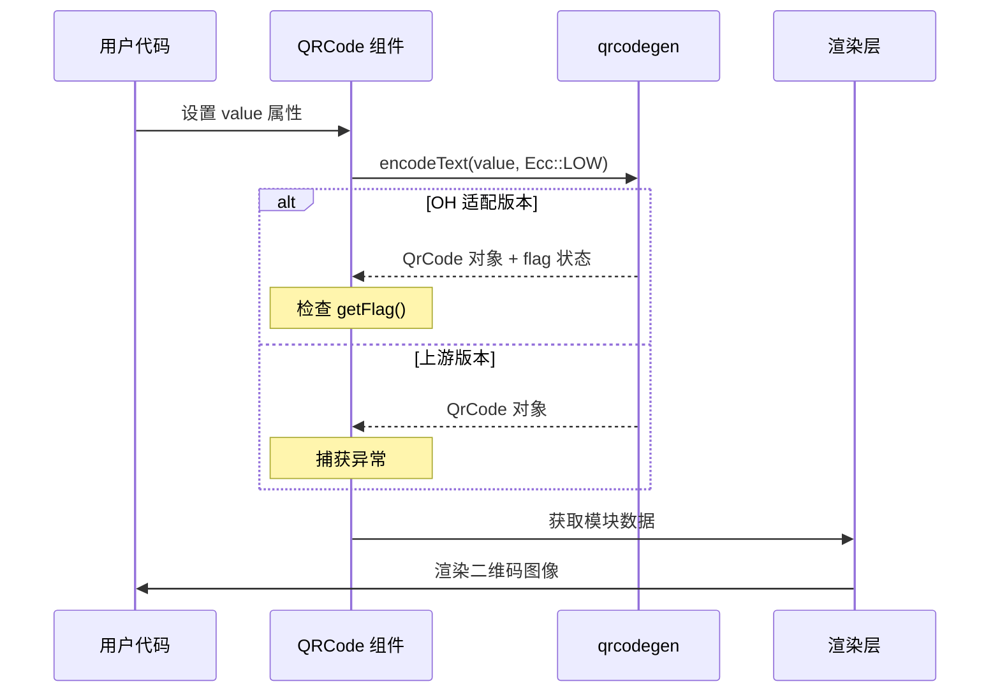

# 04_在 OH 中的使用

## 4.1 依赖关系概览

### 直接依赖者

| 模块 | BUILD.gn 路径 | 使用方式 | 依赖目标 |
|------|---------------|----------|----------|
| **ace_engine (NG)** | `foundation/arkui/ace_engine/frameworks/core/components_ng/pattern/qrcode/BUILD.gn` | QRCode 组件实现 | `ace_engine_qrcode` |
| **ace_engine (Compatible)** | `foundation/arkui/ace_engine/frameworks/compatible/BUILD.gn` | 兼容层 QRCode | `ace_engine_qrcode` |
| **ui_lite** | `foundation/arkui/ui_lite/BUILD.gn` | 轻量级 QRCode | `qrcodegen` |
| **单元测试** | `foundation/arkui/ace_engine/test/unittest/core/pattern/qrcode/BUILD.gn` | 测试 | `ace_engine_qrcode` |

### 依赖关系图

```mermaid
graph TD
    A[应用/组件] --> B[QRCode 组件]
    B --> C[ace_engine]
    C --> D[ace_engine_qrcode]
    E[轻量级应用] --> F[ui_lite]
    F --> G[qrcodegen_static]
    
    style D:#4CAF50,stroke:#333,stroke-width:2px
    style G:#2196F3,stroke:#333,stroke-width:2px
```

## 4.2 AceEngine QRCode 组件

### 组件位置

```
foundation/arkui/ace_engine/
├── frameworks/
│   ├── core/
│   │   └── components_ng/
│   │       └── pattern/
│   │           └── qrcode/           # NG 模式 QRCode
│   └── compatible/
│       └── components/
│           └── qrcode/               # 兼容层 QRCode
└── docs/pattern/qrcode/              # QRCode 知识库
```

### NG 模式构建配置

**文件**：`foundation/arkui/ace_engine/frameworks/core/components_ng/pattern/qrcode/BUILD.gn`

```gn
# 部分依赖声明
static_library("ace_qrcode") {
  sources = [
    "qrcode_theme.h",
    # ... 其他源文件
  ]
  deps = [ "//third_party/qrcodegen:ace_engine_qrcode" ]
}

static_library("ace_qrcode_ng") {
  sources = [
    "qrcode_component.h",
    # ... 其他源文件
  ]
  deps = [ "//third_party/qrcodegen:ace_engine_qrcode" ]
}
```

### 典型使用代码

#### 1. 生成二维码

```cpp
#include "qrcodegen.hpp"

// 使用 QrCode::encodeText 生成二维码
auto qrCode = qrcodegen::QrCode::encodeText(
    value.c_str(),  // 要编码的文本
    qrcodgen::QrCode::Ecc::LOW  // 错误纠正级别
);

// 检查生成状态（OH 适配特有）
if (!qrCode.getFlag()) {
    // 生成失败处理
    return;
}
```

#### 2. 获取模块数据

```cpp
// 获取二维码尺寸
int size = qrCode.getSize();

// 获取指定位置的模块颜色
for (int y = 0; y < size; y++) {
    for (int x = 0; x < size; x++) {
        bool dark = qrCode.getModule(x, y);
        // dark == true 表示黑色模块
        // dark == false 表示白色模块
    }
}
```

#### 3. 转换为位图用于渲染

```cpp
// 参考：foundation/arkui/ace_engine/frameworks/compatible/components/qrcode/rosen_render_qrcode.cpp

SkBitmap RosenRenderQrcode::ProcessQrcodeData(int32_t width, const qrcodegen::QrCode& qrCode) {
    SkBitmap bitmap;
    bitmap.allocN32Pixels(width, width);
    
    int32_t moduleSize = width / qrCode.getSize();
    for (int32_t y = 0; y < qrCode.getSize(); y++) {
        for (int32_t x = 0; x < qrCode.getSize(); x++) {
            bool dark = qrCode.getModule(x, y);
            SkColor color = dark ? foregroundColor_ : backgroundColor_;
            bitmap.eraseRect(moduleSize * x, moduleSize * y, 
                           moduleSize, moduleSize);
        }
    }
    return bitmap;
}
```

## 4.3 ui_lite 使用

### 轻量级构建配置

**文件**：`foundation/arkui/ui_lite/BUILD.gn`

```gn
# ui_lite 中使用 qrcodegen_static
static_library("libui") {
  sources = [
    "frameworks/components/ui_qrcode.cpp",
    # ...
  ]
  deps = [
    "//third_party/qrcodegen:qrcodegen",
    # ...
  ]
}
```

### ui_lite QRCode 组件

**头文件**：`foundation/arkui/ui_lite/interfaces/kits/components/ui_qrcode.h`

```cpp
class UIQrcode : public Component {
public:
    void SetImageInfo(qrcodegen::QrCode& qrcode);
    void GenerateQrCode(qrcodegen::QrCode& qrcode);
    void FillQrCodeColor(qrcodegen::QrCode& qrcode);
};
```

## 4.4 UI 框架集成

### ArkUI NG 模式集成

**文件**：`foundation/arkui/ace_engine/frameworks/core/components_ng/pattern/qrcode/`

| 文件 | 功能 |
|------|------|
| `qrcode_component.h/cpp` | QRCode 组件定义 |
| `qrcode_modifier.h/cpp` | QRCode 修饰器 |
| `qrcode_paint_method.h/cpp` | 绘制方法 |
| `qrcode_theme.h` | QRCode 主题 |

### 错误处理流程



## 4.5 链接方式

### 静态链接

本库仅提供**静态库**链接方式，不支持动态链接。

**链接方式**：所有依赖模块通过 GN 的 `deps` 声明静态依赖。

```gn
# BUILD.gn 中的依赖声明
ohos_static_library("my_component") {
  deps = [
    "//third_party/qrcodegen:ace_engine_qrcode",  # 或 qrcodegen_static
  ]
}
```

## 4.6 头文件引用

### 引用路径

```cpp
#include "qrcodegen.hpp"
```

### 头文件搜索路径

| 构建目标 | 头文件路径 |
|----------|------------|
| `ace_engine_qrcode` | `//third_party/qrcodegen/cpp` |
| `qrcodegen_static` | `//third_party/qrcodegen/cpp` |

### 命名空间

所有符号位于 `qrcodegen` 命名空间：

```cpp
using qrcodegen::QrCode;
using qrcodegen::QrSegment;
using qrcodegen::BitBuffer;
```

## 4.7 常见使用场景

### 场景一：显示简单的 URL 二维码

```cpp
#include "qrcodegen.hpp"

// 生成 URL 二维码
void GenerateUrlQrcode(const std::string& url) {
    auto qrCode = qrcodegen::QrCode::encodeText(
        url.c_str(),
        qrcodegen::QrCode::Ecc::MEDIUM
    );
    
    if (!qrCode.getFlag()) {
        LOGE("QR code generation failed");
        return;
    }
    
    // 获取尺寸和模块数据用于渲染
    int size = qrCode.getSize();
    // ... 渲染逻辑
}
```

### 场景二：显示联系人信息（vCard）

```cpp
void GenerateVCardQrcode(const std::string& name, const std::string& phone) {
    std::string vcard = "BEGIN:VCARD\n"
                       "FN:" + name + "\n"
                       "TEL:" + phone + "\n"
                       "END:VCARD";
    
    auto qrCode = qrcodegen::QrCode::encodeText(
        vcard.c_str(),
        qrcodegen::QrCode::Ecc::QUARTILE  // 更高的错误纠正级别
    );
    
    if (!qrCode.getFlag()) {
        LOGE("QR code generation failed");
        return;
    }
    
    // ... 渲染逻辑
}
```

### 场景三：批量生成二维码

```cpp
void GenerateBatchQrcodes(const std::vector<std::string>& values) {
    std::vector<qrcodegen::QrCode> qrcodes;
    qrcodes.reserve(values.size());
    
    for (const auto& value : values) {
        auto qrCode = qrcodegen::QrCode::encodeText(
            value.c_str(),
            qrcodegen::QrCode::Ecc::LOW
        );
        
        if (qrCode.getFlag()) {
            qrcodes.push_back(qrCode);
        }
    }
    
    // 处理生成的二维码
}
```

## 4.8 性能考虑

### 生成性能

| 因素 | 影响 |
|------|------|
| 数据长度 | 数据越长，生成时间越长（版本号增加） |
| 错误纠正级别 | 更高的 ECL 级别会增加计算量 |
| 掩码选择 | OH 固定使用掩码 5，减少计算 |

### 内存使用

- **QrCode 对象**：约 `version * 4 + 17` 的平方的布尔值
- **最大版本 40**：177×177 = 31,329 个布尔值（约 31KB）
- **建议**：避免在频繁创建/销毁的场景中使用大版本 QRCode

### 优化建议

1. **缓存生成的 QRCode**：如果数据不变，避免重复生成
2. **选择合适的 ECL**：LOW 足够扫描即可
3. **控制数据长度**：避免使用过长的输入数据
4. **考虑异步生成**：对于大批量生成，使用后台线程
