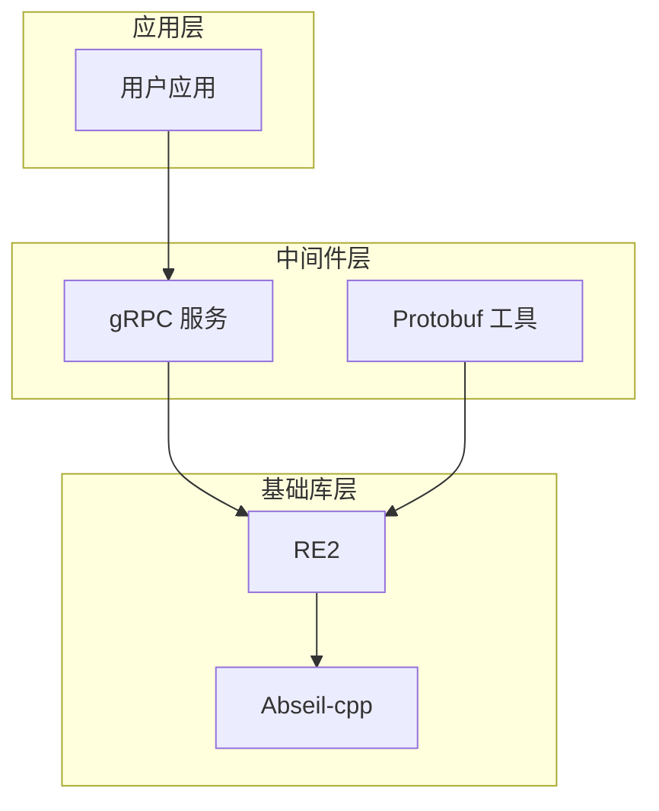
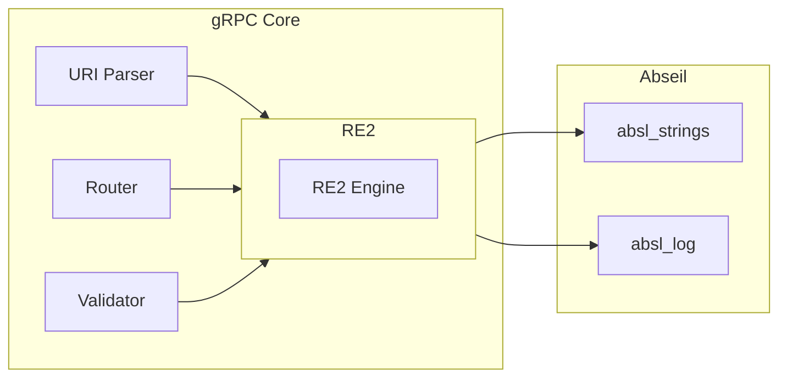

# 依赖关系与使用

## 4.1 直接依赖者

### 4.1.1 依赖模块列表

| 模块 | 引用位置 | 用途 | 重要性 |
|------|----------|------|--------|
| **gRPC** | `third_party/grpc/...` | URI 路由匹配、模板解析 | 核心依赖 |
| **Protobuf** | `third_party/protobuf/...` | Profile 分析工具 | 工具支持 |
| **Abseil-cpp** | 统计依赖 | 组件依赖分析 | 间接相关 |

### 4.1.2 gRPC 中的使用

**引用统计** (gRPC 核心模块):
- 超过 20 个文件引用 RE2 头文件
- 构建系统 (`Makefile`, `setup.py`) 显式包含 RE2 源文件

**主要用途**:

1. **URI 模板匹配**
   ```cpp
   // 使用 RE2 解析和匹配 URI 模板
   RE2::FullMatch(uri, pattern)
   ```

2. **路由解析**
   ```cpp
   // gRPC 服务端路由匹配
   RE2 用于高效匹配请求路径到处理函数
   ```

3. **验证和规范化**
   ```cpp
   // 使用正则进行输入验证
   RE2::PartialMatch(input, validation_pattern)
   ```

**文件示例**:
- `src/python/grpcio/grpc_core_dependencies.py`: 列出所有 RE2 源文件
- `third_party/grpc/Makefile`: 包含 RE2 编译

### 4.1.3 Protobuf 中的使用

**使用场景**: Profile 分析工具

**引用文件**:
```cpp
// third_party/protobuf/src/google/protobuf/compiler/cpp/tools/analyze_profile_proto.cc
#include "third_party/re2/re2.h"
```

**用途**: 分析 protobuf profile 数据时使用正则表达式进行匹配和提取

## 4.2 依赖关系图

### 4.2.1 层级依赖图



### 4.2.2 gRPC 内部依赖



## 4.3 使用方式

### 4.3.1 链接方式

**类型**: 动态链接（共享库）

```gn
# 依赖模块的 BUILD.gn 中声明
external_deps = [ "re2" ]
```

**运行时**:
```
/system/lib/libre2.so  (或类似路径)
```

### 4.3.2 头文件引用

```cpp
// 标准引用方式
#include "re2/re2.h"

// 可选工具类
#include "util/strutil.h"
```

### 4.3.3 典型使用场景

#### 场景一：URI 路由匹配 (gRPC)

```cpp
#include "re2/re2.h"

// 定义路由模式
const RE2 route_pattern("/service/method/(\\w+)");

// 匹配请求路径
std::string resource_id;
if (RE2::PartialMatch(request_path, route_pattern, &resource_id)) {
    // 处理匹配结果
    ProcessResource(resource_id);
}
```

#### 场景二：输入验证

```cpp
#include "re2/re2.h"

// 定义验证模式（线性时间保证，安全）
const RE2 valid_id_pattern("^[a-zA-Z][a-zA-Z0-9_]{0,63}$");

bool ValidateId(const std::string& id) {
    return RE2::FullMatch(id, valid_id_pattern);
}
```

#### 场景三：字符串提取

```cpp
#include "re2/re2.h"

// 提取多个捕获组
std::string key, value;
RE2::Extract(input, "(\\w+)=(\\w+)", "\\1: \\2", &result);
```

## 4.4 影响评估

### 4.4.1 变更影响范围

| 变更类型 | 影响模块 | 影响程度 |
|----------|----------|----------|
| RE2 API 变更 | gRPC | 高 |
| RE2 ABI 变更 | 所有依赖模块 | 高 |
| RE2 Bug 修复 | gRPC | 中 |
| RE2 性能改进 | gRPC | 中-低 |

### 4.4.2 升级风险

**高风险变更**:
1. **ABI 不兼容**: 需要重新编译所有依赖模块
2. **API 废弃**: gRPC 中使用的 API 被移除

**中风险变更**:
1. **行为变更**: 正则匹配行为细微变化
2. **默认选项变更**: 编译或运行默认行为改变

**低风险变更**:
1. **Bug 修复**: 修复已知问题
2. **性能优化**: 内部实现优化

### 4.4.3 测试建议

升级 RE2 后需测试的功能：

- [ ] gRPC 服务启动和停止
- [ ] gRPC URI 路由匹配
- [ ] gRPC 客户端连接
- [ ] Protobuf profile 分析工具
- [ ] 自定义使用 RE2 的应用

## 4.5 替代方案分析

### 4.5.1 为什么不使用 PCRE

| 对比项 | RE2 | PCRE |
|--------|-----|------|
| **安全性** | O(n) 保证，防 ReDoS | 可能灾难性回溯 |
| **性能** | 大多数场景优秀 | 简单模式更快 |
| **功能** | 标准正则 | 功能更丰富 |
| **线程安全** | 原生支持 | 需配置 |

**OH 选择 RE2 的原因**:
1. **安全性优先**: 防止恶意正则攻击
2. **gRPC 兼容**: gRPC 本身依赖 RE2
3. **维护简单**: 零 Patch 策略

### 4.5.2 为什么不使用 std::regex

| 对比项 | RE2 | std::regex |
|--------|-----|------------|
| **性能** | 优秀 | 通常较慢 |
| **一致性** | 跨平台一致 | 不同实现差异大 |
| **标准性** | 非标准但广泛使用 | C++11 标准 |
| **功能** | 专注高效匹配 | 功能较全但慢 |

## 4.6 使用统计

### 4.6.1 代码引用统计

根据 `grep` 搜索结果：
- **gRPC**: ~394 处引用
- **Protobuf**: 1 处直接引用
- **Abseil**: 文档引用

### 4.6.2 构建系统引用

| 构建文件 | 引用内容 |
|----------|----------|
| `grpc/Makefile` | 编译标志和源文件 |
| `grpc/setup.py` | Python 扩展依赖 |
| `grpc/CMakeLists.txt` | CMake 配置 |

## 4.7 依赖管理建议

### 4.7.1 版本协调

RE2 与 Abseil-cpp 版本需要协调：

```
升级流程:
1. 检查 RE2 新版本要求的 Abseil 版本
2. 先升级 Abseil 到兼容版本
3. 再升级 RE2
4. 测试 gRPC 功能
```

### 4.7.2 长期维护策略

1. **跟随上游**: 定期升级到最新稳定版
2. **ABI 监控**: 关注符号版本变更
3. **依赖测试**: 升级后全面测试 gRPC
4. **文档同步**: 更新版本号和使用说明

---

**上一篇**: [03_Build_Integration.md](./03_Build_Integration.md) | **返回**: [README.md](./README.md)
