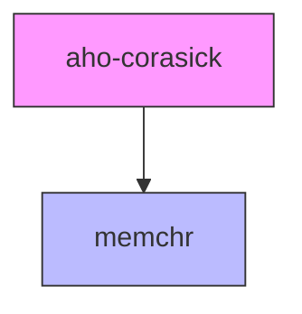
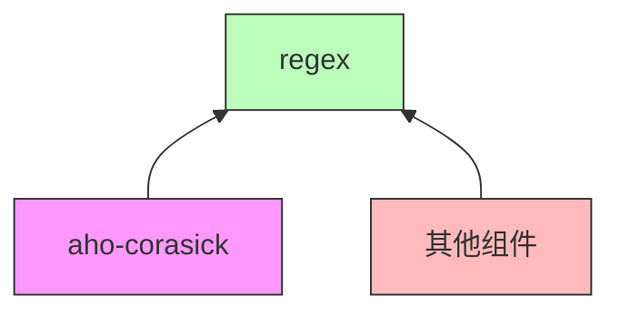

# 03 - OpenHarmony 构建集成

本文档详细说明 aho-corasick 库在 OpenHarmony 中的构建配置和集成方式。

---

## 1. 构建系统概述

### 1.1 OpenHarmony 构建系统

OpenHarmony 使用 **GN (Generate Ninja)** 作为构建系统：
- **GN**: 元构建系统，定义构建目标和依赖关系
- **Ninja**: 实际执行构建，快速增量编译
- **工具链**: 支持多种语言，包括 Rust

### 1.2 Rust 在 OH 中的构建

Rust crate 在 OH 中的构建方式：
1. **Cargo 配置** (Cargo.toml): 定义 Rust 包元数据和依赖
2. **GN 配置** (BUILD.gn): 定义 OH 构建目标
3. **转换**: GN 配置通常对应 Cargo 配置，但不完全相同

### 1.3 文件位置

```
third_party/rust/crates/aho-corasick/
├── BUILD.gn          # GN 构建配置（本文档重点）
├── Cargo.toml        # Rust Cargo 配置
├── bundle.json       # OH 组件配置
└── OAT.xml           # 开源合规配置
```

---

## 2. BUILD.gn 详细分析

### 2.1 完整配置

```gn
# Copyright (c) 2023 Huawei Device Co., Ltd.
# Licensed under the Apache License, Version 2.0 (the "License");
# you may not use this file except in compliance with the License.
# You may obtain a copy of the License at
#
#     http://www.apache.org/licenses/LICENSE-2.0
#
# Unless required by applicable law or in writing, software
# distributed under the License is distributed on an "AS IS" BASIS,
# WITHOUT WARRANTIES OR CONDITIONS OF ANY KIND, either express or implied.
# See the License for the specific language governing permissions and
# limitations under the License.

import("//build/ohos.gni")

ohos_cargo_crate("lib") {
    crate_name = "aho_corasick"
    crate_type = "rlib"
    crate_root = "src/lib.rs"

    sources = ["src/lib.rs"]
    edition = "2018"
    cargo_pkg_version = "0.7.20"
    cargo_pkg_authors = "Andrew Gallant <jamslam@gmail.com>"
    cargo_pkg_name = "aho-corasick"
    cargo_pkg_description = "Fast multiple substring searching."
    deps = ["//third_party/rust/crates/memchr:lib"]
    features = ["std"]
    module_output_extension = ".rlib"
    part_name = "rust_aho_corasick"
    subsystem_name = "thirdparty"
}
```

### 2.2 配置项详解

#### 头部声明

| 行 | 内容 | 说明 |
|---|------|------|
| 1-13 | 版权声明 | Apache 2.0 许可证，标准的 OH 版权声明 |
| 15 | `import("//build/ohos.gni")` | 导入 OH 构建系统的 GN 模板 |

#### 构建目标定义

| 配置项 | 值 | 说明 |
|-------|---|------|
| `ohos_cargo_crate("lib")` | - | 使用 OH 提供的 Rust crate 模板，目标名为 "lib" |

#### Crate 元数据

| 配置项 | 值 | 对应 Cargo.toml | 说明 |
|-------|---|----------------|------|
| `crate_name` | "aho_corasick" | `name = "aho_corasick"` | crate 的标识名（下划线） |
| `crate_root` | "src/lib.rs" | `lib.name` | crate 根文件 |
| `edition` | "2018" | `edition = "2018"` | Rust 版本 |
| `cargo_pkg_version` | "0.7.20" | `version = "0.7.20"` | 包版本 |
| `cargo_pkg_authors` | "Andrew..." | `authors` | 作者信息 |
| `cargo_pkg_name` | "aho-corasick" | `name = "aho-corasick"` | 包名（连字符） |
| `cargo_pkg_description` | "Fast..." | `description` | 包描述 |

#### 构建配置

| 配置项 | 值 | 说明 |
|-------|---|------|
| `crate_type` | "rlib" | 生成 Rust 静态库（.rlib） |
| `sources` | ["src/lib.rs"] | 源文件列表（lib.rs 会包含其他模块） |
| `features` | ["std"] | 启用的 Cargo features |
| `module_output_extension` | ".rlib" | 输出文件扩展名 |

#### 依赖配置

| 配置项 | 值 | 说明 |
|-------|---|------|
| `deps` | ["//third_party/rust/crates/memchr:lib"] | 依赖 memchr crate |

#### OH 组件标识

| 配置项 | 值 | 说明 |
|-------|---|------|
| `part_name` | "rust_aho_corasick" | OH 组件名，与 bundle.json 一致 |
| `subsystem_name` | "thirdparty" | 所属子系统 |

---

## 3. 与 Cargo.toml 的对比

### 3.1 Cargo.toml 原始配置

```toml
[package]
name = "aho-corasick"
version = "0.7.20"
authors = ["Andrew Gallant <jamslam@gmail.com>"]
description = "Fast multiple substring searching."
edition = "2018"
license = "Unlicense OR MIT"

[features]
default = ["std"]
std = ["memchr/std"]

[dependencies]
memchr = { version = "2.4.0", default-features = false }
```

### 3.2 配置映射表

| 配置 | Cargo.toml | BUILD.gn | 差异 |
|-----|------------|----------|------|
| 名称 | `aho-corasick` | `crate_name = "aho_corasick"` | GN 使用下划线命名 |
| 版本 | `0.7.20` | `cargo_pkg_version = "0.7.20"` | 一致 |
| Edition | `2018` | `edition = "2018"` | 一致 |
| 依赖 | `memchr = "2.4.0"` | `deps = ["//third_party/rust/crates/memchr:lib"]` | GN 使用路径引用 |
| Features | `std = ["memchr/std"]` | `features = ["std"]` | GN 简化表示 |

### 3.3 重要差异说明

#### Feature 传递

- **Cargo**: `std = ["memchr/std"]` 表示启用 std 时同时启用 memchr 的 std
- **GN**: `features = ["std"]` + 依赖路径隐式处理传递

#### 版本管理

- **Cargo**: 使用语义版本控制，支持版本范围
- **GN**: 使用固定版本，版本在 `cargo_pkg_version` 中明确指定

---

## 4. 依赖分析

### 4.1 直接依赖



**memchr crate**:
- **路径**: `//third_party/rust/crates/memchr`
- **用途**: 提供快速字符查找（如 `memchr` 函数）
- **关系**: aho-corasick 使用 memchr 进行底层字节搜索优化

### 4.2 反向依赖



**主要依赖者**:
1. **regex crate**: 主要使用者，用于正则表达式字面量优化
2. **clippy_dev**: Rust 工具链开发工具

### 4.3 依赖层级

```
应用/组件
    │
    ├─► regex crate ───────────┐
    │       │                  │
    │       ├─► aho-corasick ◄─┤
    │       │       │          │
    │       │       └─► memchr │
    │       │                  │
    │       └─► 其他依赖        │
    │                          │
    └─► 其他组件 ──────────────┘
```

---

## 5. 在其他组件中使用

### 5.1 添加依赖的方法

在其他 BUILD.gn 中添加对 aho-corasick 的依赖：

```gn
ohos_rust_executable("my_component") {
    # ... 其他配置 ...
    
    deps = [
        # 添加 aho-corasick 依赖
        "//third_party/rust/crates/aho-corasick:lib",
        
        # 其他依赖...
    ]
}
```

### 5.2 在 Rust 代码中使用

```rust
// 在代码中引入 aho_corasick
use aho_corasick::AhoCorasick;

fn main() {
    let patterns = &["foo", "bar", "baz"];
    let haystack = "The quick brown foo jumps over the lazy bar";
    
    let ac = AhoCorasick::new(patterns);
    for mat in ac.find_iter(haystack) {
        println!("Found {:?} at position {}", 
                 patterns[mat.pattern()], 
                 mat.start());
    }
}
```

### 5.3 Cargo.toml 配置（如适用）

如果使用 Cargo 构建（非 GN）：

```toml
[dependencies]
aho-corasick = "0.7"
```

**注意**: 在 OH 环境中，建议使用 GN 构建以确保与系统其他组件兼容。

---

## 6. 构建输出

### 6.1 输出文件

构建完成后生成：

```
out/<target>/third_party/rust/crates/aho-corasick/
└── libaho_corasick.rlib    # Rust 静态库
```

### 6.2 库类型说明

- **.rlib**: Rust 静态库格式
  - 包含编译后的 Rust 代码
  - 包含元数据（用于类型检查）
  - 仅能被 Rust 代码链接使用

### 6.3 链接方式

- **静态链接**: aho-corasick 以静态库形式链接到最终二进制文件
- **跨 crate 内联**: Rust 支持跨 crate 的函数内联优化

---

## 7. 构建配置详解

### 7.1 Features 配置

当前启用的 features：

| Feature | 状态 | 说明 |
|---------|------|------|
| `std` | ✅ 启用 | 标准库支持，提供 `std::io` 等功能 |
| `default` | ✅ 启用 | 默认包含 std |

### 7.2 未启用的 Features

上游 crate 支持但 OH 未启用的 features：

| Feature | 说明 | OH 未启用原因 |
|---------|------|--------------|
| （无其他 features） | - | - |

**注意**: 0.7.x 版本的 aho-corasick 功能相对简单，features 较少。1.x 版本可能有更多可配置选项。

### 7.3 编译选项

BUILD.gn 未显式配置的编译选项（使用默认值）：

- **优化级别**: 由 OH 全局配置决定
- **调试信息**: Release 模式包含调试信息（见 Cargo.toml `[profile.release]`）
- **LTO**: 使用 OH 全局 LTO 配置

---

## 8. 升级指南

### 8.1 升级步骤

#### 小版本升级 (0.7.20 → 0.7.x)

1. **修改 BUILD.gn**:
   ```gn
   cargo_pkg_version = "0.7.21"  # 新版本号
   ```

2. **验证依赖兼容性**:
   - 检查 regex crate 是否支持新版本
   - 检查 memchr 版本要求是否变化

3. **构建测试**:
   ```bash
   gn gen out
   ninja -C out third_party/rust/crates/aho-corasick:lib
   ```

4. **运行测试**:
   ```bash
   # 运行 crate 自身测试
   cargo test --manifest-path third_party/rust/crates/aho-corasick/Cargo.toml
   ```

#### 大版本升级 (0.7.x → 1.x)

**⚠️ 注意**: 1.x 版本有重大 API 变更，升级需谨慎。

1. **评估必要性**: 检查 1.x 版本的新功能是否必需
2. **检查依赖**: 确认 regex crate 等依赖已支持 1.x
3. **API 迁移**: 根据上游迁移指南修改调用代码
4. **全面测试**: 运行所有依赖组件的测试

### 8.2 兼容性检查清单

- [ ] 版本号更新正确
- [ ] 依赖版本要求满足
- [ ] 构建无错误
- [ ] 单元测试通过
- [ ] 依赖组件构建正常
- [ ] 集成测试通过

---

## 9. 常见问题

### Q1: 为什么 BUILD.gn 中 sources 只有 lib.rs？

**A**: `src/lib.rs` 是 crate 根文件，它会通过 `mod` 声明包含其他模块文件。GN 只需要知道入口文件，Rust 编译器会自动处理模块依赖。

### Q2: 如何启用额外的 features？

**A**: 在 BUILD.gn 的 `features` 列表中添加：
```gn
features = ["std", "new_feature"]
```

### Q3: 可以同时使用多个版本的 aho-corasick 吗？

**A**: Rust 支持依赖不同版本的同一个 crate，但 OH 构建系统可能有限制。建议保持版本一致以避免冲突。

### Q4: 构建失败如何排查？

**A**: 
1. 检查 memchr 是否已构建
2. 检查 Rust 工具链版本
3. 查看详细的构建日志：`ninja -C out -v ...`

---

## 10. 总结

aho-corasick 的构建配置特点：

1. **标准配置**: BUILD.gn 是 Cargo.toml 的标准映射
2. **无特殊处理**: 无 OH 特定的编译选项或配置
3. **简单依赖**: 仅依赖 memchr crate
4. **静态链接**: 输出 .rlib 静态库

### 关键文件

| 文件 | 用途 |
|------|------|
| `BUILD.gn` | GN 构建配置（本文档主题） |
| `Cargo.toml` | Rust 包配置 |
| `bundle.json` | OH 组件元数据 |

### 维护要点

- 升级时同步更新 `cargo_pkg_version`
- 关注上游 features 变化
- 保持与 regex crate 的版本兼容
