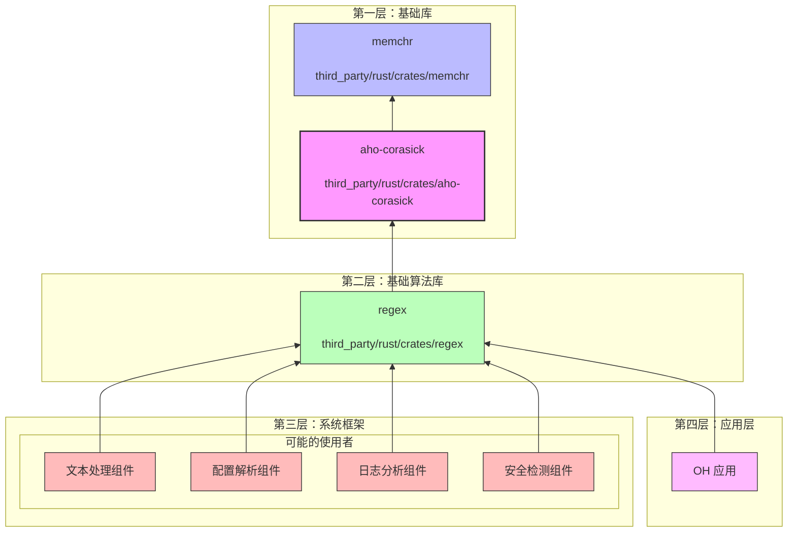

# 04 - OpenHarmony 中的使用

本文档详细说明 aho-corasick 库在 OpenHarmony 中的依赖关系、使用场景和集成方式。

---

## 1. 依赖关系概览

### 1.1 依赖图



### 1.2 依赖链说明

aho-corasick 在 OH 中的依赖层级：

| 层级 | 组件 | 关系 | 说明 |
|------|------|------|------|
| 底层 | memchr | 被依赖 | 提供底层字符查找优化 |
| 基础 | **aho-corasick** | **本文档主题** | 多模式字符串匹配 |
| 中层 | regex | 主要依赖者 | 正则表达式引擎 |
| 上层 | 各种组件 | 间接使用 | 通过 regex 间接使用 |

---

## 2. 直接依赖者

### 2.1 依赖者清单

基于全面搜索，以下是直接依赖 aho-corasick 的组件：

| 组件 | 路径 | 依赖方式 | 用途 |
|------|------|---------|------|
| **regex** | `third_party/rust/crates/regex/` | GN deps | 正则表达式字面量优化 |
| **clippy_dev** | `third_party/rust/rust/src/tools/clippy/clippy_dev/` | Cargo.toml | Rust clippy 开发工具 |
| **aho-corasick-bench** | `third_party/rust/crates/aho-corasick/bench/` | 内部 | 性能基准测试 |
| **aho-corasick-debug** | `third_party/rust/crates/aho-corasick/aho-corasick-debug/` | 内部 | 调试工具 |

### 2.2 核心依赖者分析

#### regex crate（主要依赖者）

**BUILD.gn 路径**: `//third_party/rust/crates/regex`

**依赖配置**:
```gn
deps = [
    "//third_party/rust/crates/aho-corasick:lib",
    // ... 其他依赖
]
```

**Cargo.toml 配置**:
```toml
[dependencies]
aho-corasick = { version = "0.7.18", optional = true }

[features]
perf-literal = ["aho-corasick", "memchr"]
```

**使用场景**:
- 当正则表达式包含多个字面量模式时（如 `foo|bar|baz`）
- 使用 aho-corasick 同时匹配多个前缀，快速定位可能的匹配位置
- 大幅减少需要进入完整正则引擎的候选位置

**性能影响**:
- 多字面量模式匹配性能提升 5-10 倍
- 单字面量模式使用 memchr 优化
- 无不匹配前缀时快速失败

#### clippy_dev

**路径**: `third_party/rust/rust/src/tools/clippy/clippy_dev/`

**用途**: 
- Rust clippy lint 工具的开发辅助工具
- 用于 clippy 自身的开发和测试

**影响范围**:
- 仅用于 Rust 工具链构建
- 不影响运行时系统

---

## 3. 间接依赖者

### 3.1 通过 regex 的间接依赖

任何使用 regex crate 的组件都间接依赖 aho-corasick：

```
组件 X
    │
    ├─► regex crate ──► aho-corasick
    │
    └─► 其他依赖
```

**典型的间接依赖者类型**:

1. **配置解析组件**
   - 使用正则验证配置格式
   - 解析复杂配置规则

2. **日志处理组件**
   - 日志格式解析
   - 多模式日志过滤

3. **网络组件**
   - URL 解析和验证
   - 协议解析

4. **安全组件**
   - 敏感词检测
   - 模式匹配扫描

5. **开发工具**
   - 代码分析工具
   - 测试框架

### 3.2 在 OH 核心组件中的分布

**搜索范围**: foundation/, device/, kernel/, base/  
**搜索结果**: **无直接依赖**

**结论**: aho-corasick **未直接用于** OpenHarmony 核心系统组件（foundation、device、kernel、base）。

**原因分析**:
1. OH 核心组件主要使用 C/C++ 开发
2. Rust 组件目前主要集中在 third_party 和部分框架层
3. aho-corasick 作为纯算法库，通常通过上层封装使用

---

## 4. 使用场景详解

### 4.1 场景一：正则表达式优化（主要）

#### 工作原理

当 regex crate 遇到包含多个字面量的正则表达式时：

```
正则: foo|bar|baz

优化前: 
    逐个尝试匹配 foo、bar、baz
    时间复杂度: O(n * m)  

优化后 (使用 aho-corasick):
    构建自动机同时匹配 foo、bar、baz
    找到候选位置后进入正则引擎验证
    时间复杂度: O(n + m)
```

#### 实际示例

```rust
use regex::Regex;

// 这个正则会被优化
let re = Regex::new(r"error|warning|info|debug").unwrap();
let text = "This is an error message with warning level";

for mat in re.find_iter(text) {
    println!("Found: {}", mat.as_str());
}
```

**内部处理**:
1. regex 解析正则，识别出字面量：`["error", "warning", "info", "debug"]`
2. 使用 aho-corasick 构建自动机
3. 在文本中快速扫描，找到可能的匹配位置
4. 对候选位置使用完整正则引擎验证

### 4.2 场景二：多模式搜索

如果组件直接使用 aho-corasick（非通过 regex）：

```rust
use aho_corasick::AhoCorasick;

// 敏感词检测
let sensitive_words = &[
    "敏感词1", 
    "敏感词2",
    "敏感词3",
];

let ac = AhoCorasick::new(sensitive_words);
let content = "用户发布的内容包含敏感词1";

// 快速检测是否包含任何敏感词
if ac.is_match(content) {
    println!("包含敏感词！");
}

// 获取所有匹配位置
for mat in ac.find_iter(content) {
    println!("发现敏感词: {}", &content[mat.start()..mat.end()]);
}
```

### 4.3 场景三：流式处理

处理大文件或网络流时：

```rust
use aho_corasick::AhoCorasick;
use std::io::{self, Read, Write};

fn filter_log_stream(
    input: impl Read,
    output: impl Write,
    patterns: &[\u0026str]
) -> io::Result<()> {
    let ac = AhoCorasick::new(patterns);
    
    // 流式搜索替换，无需加载整个文件
    ac.stream_replace_all(
        input,
        output,
        &vec!["[FILTERED]"; patterns.len()]
    )
}
```

---

## 5. 集成方式

### 5.1 在 GN 构建中添加依赖

#### 直接依赖（使用 aho-corasick）

```gn
# BUILD.gn
import("//build/ohos.gni")

ohos_rust_executable("my_component") {
    # ...
    
    deps = [
        # 直接依赖 aho-corasick
        "//third_party/rust/crates/aho-corasick:lib",
    ]
}
```

在 Rust 代码中：
```rust
use aho_corasick::AhoCorasick;
```

#### 间接依赖（使用 regex）

```gn
# BUILD.gn
ohos_rust_executable("my_component") {
    # ...
    
    deps = [
        # 依赖 regex，间接使用 aho-corasick
        "//third_party/rust/crates/regex:lib",
    ]
}
```

在 Rust 代码中：
```rust
use regex::Regex;
```

### 5.2 在 Cargo.toml 中添加依赖

仅在独立 Rust 项目中使用：

```toml
[dependencies]
# 直接使用 aho-corasick
aho-corasick = "0.7"

# 或通过 regex 间接使用
regex = "1"
```

**注意**: 在 OH 系统组件中，请使用 GN 构建系统。

---

## 6. 性能特征

### 6.1 性能优势

aho-corasick 在不同场景下的性能表现：

| 场景 | 模式数量 | 性能优势 | 说明 |
|------|---------|---------|------|
| 少量短模式 | 2-10 | 中等 | 约 2-5 倍加速 |
| 大量短模式 | 10-100 | 显著 | 约 5-20 倍加速 |
| 长模式 | 任意 | 中等 | 依赖前缀匹配效率 |
| 无匹配 | 任意 | 显著 | 快速失败，O(n) 扫描 |

### 6.2 内存占用

- **构建时**: 需要构建自动机，有一定内存开销
- **运行时**: 自动机占用与模式数量和长度相关
- **建议**: 复用 AhoCorasick 实例，避免重复构建

### 6.3 优化建议

1. **复用实例**:
   ```rust
   // 好的做法：构建一次，多次使用
   lazy_static! {
       static ref AC: AhoCorasick = AhoCorasick::new(PATTERNS);
   }
   ```

2. **限制模式数量**:
   - 单实例建议不超过 1000 个模式
   - 过多模式可考虑分片处理

3. **选择合适的匹配语义**:
   - 需要所有匹配: `MatchKind::Standard` (默认)
   - 类似正则行为: `MatchKind::LeftmostFirst`

---

## 7. 安全风险分析

### 7.1 攻击面分析

由于 aho-corasick 是纯算法库，攻击面较小：

| 风险类型 | 风险等级 | 说明 |
|---------|---------|------|
| 内存安全 | 极低 | Rust 语言保证 |
| 算法复杂度攻击 | 低 | 理论上可能，实际较难 |
| 依赖链攻击 | 低 | 依赖简单，仅 memchr |
| 输入验证 | 中 | 需限制输入大小 |

### 7.2 安全建议

1. **输入大小限制**:
   - 对不可信输入设置合理的大小限制
   - 避免超大模式或超大文本导致内存问题

2. **模式来源验证**:
   - 如果模式来自用户输入，需验证格式
   - 防止恶意模式导致性能退化

3. **CVE 监控**:
   - 关注上游安全公告
   - 订阅 RustSec 安全数据库

---

## 8. 维护与升级

### 8.1 当前状态

| 项目 | 状态 |
|------|------|
| 当前版本 | 0.7.20 |
| 上游最新 0.7.x | 0.7.20 (已是最新) |
| 上游最新 | 1.x (API 不兼容) |
| Patch 数量 | 0 |

### 8.2 升级路径

#### 保持 0.7.x 分支

- **优点**: 稳定，与现有代码兼容
- **建议**: 继续跟踪 0.7.x 的 bugfix 版本

#### 迁移到 1.x 分支

- **考虑因素**:
  - regex crate 是否支持 1.x
  - 是否需要 1.x 的新功能
  - 迁移成本评估

- **迁移步骤**:
  1. 评估影响范围
  2. 更新代码适配新 API
  3. 全面测试

### 8.3 兼容性矩阵

| aho-corasick | regex | 兼容性 |
|--------------|-------|-------|
| 0.7.20 | 1.7.x | ✅ 兼容 |
| 0.7.x | 1.8.x+ | ✅ 兼容 |
| 1.x | 1.x | 需验证 |

---

## 9. 总结

### 9.1 核心结论

1. **主要依赖者**: regex crate（通过 perf-literal feature）
2. **无核心组件直接依赖**: foundation/device/kernel/base 中无直接引用
3. **间接使用广泛**: 任何使用 regex 的组件都间接依赖
4. **低维护成本**: 无 Patch，升级简单

### 9.2 使用建议

| 场景 | 建议 |
|------|------|
| 需要正则表达式 | 直接使用 regex crate，自动获得 aho-corasick 优化 |
| 只需多模式匹配 | 直接使用 aho-corasick，更轻量 |
| 敏感词/关键词过滤 | aho-corasick 是理想选择 |
| 日志分析 | 考虑流式处理功能 |

### 9.3 关键指标

- **直接依赖组件数**: 2 (regex, clippy_dev)
- **间接依赖范围**: 所有使用 regex 的组件
- **代码侵入性**: 无（零 Patch）
- **维护成本**: 低
- **安全风险**: 低

---

## 附录: 依赖搜索详情

### 搜索命令

```bash
# 搜索 BUILD.gn 中的依赖
grep -r "aho-corasick" --include="BUILD.gn" \
    /Volumes/lexar/code/d/work/oh/third_party/

# 搜索 Cargo.toml 中的依赖
grep -r "aho-corasick" --include="Cargo.toml" \
    /Volumes/lexar/code/d/work/oh/third_party/

# 搜索核心组件
grep -r "aho-corasick" \
    /Volumes/lexar/code/d/work/oh/foundation/ \
    /Volumes/lexar/code/d/work/oh/device/ \
    /Volumes/lexar/code/d/work/oh/kernel/ \
    /Volumes/lexar/code/d/work/oh/base/
```

### 搜索结果

- **third_party/rust/crates/regex/**: 主要依赖者
- **third_party/rust/rust/src/tools/clippy/**: 开发工具
- **核心组件**: 无直接依赖

---

*最后更新: 2025-02-07*
