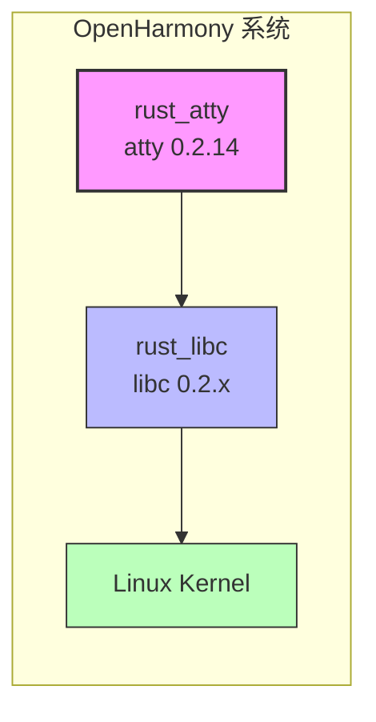
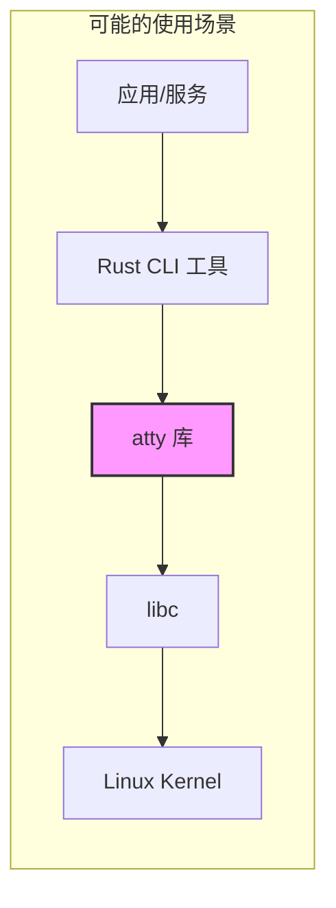

# 04 - 依赖关系与使用

## 直接依赖者

### 搜索结果

在 OpenHarmony 代码库中搜索 `third_party/rust/crates/atty` 或 `rust_atty` 的引用：

**发现的引用**:

| 文件 | 引用内容 | 说明 |
|------|----------|------|
| `third_party/rust/crates/atty/bundle.json` | 自身组件定义 | - |
| `third_party/rust/crates/atty/BUILD.gn` | 自身构建配置 | - |
| `test/xts/tools/config/precise_compilation.json` | `"name": "third_party_rust_atty"` | 测试编译配置 |

### 结论

**未发现其他 OH 模块直接依赖 atty 库**。

### 可能的使用场景分析

虽然未发现直接依赖者，atty 库在 OH 中可能有以下使用方式：

#### 1. 间接依赖（Transitive Dependency）

Rust 的依赖关系是通过 Cargo 管理的。atty 可能是某个 Rust crate 的依赖，而该 crate 被 OH 模块使用。

**示例场景**:
```
OH 应用/服务
    │
    └── 依赖 Rust crate X
            │
            └── 依赖 atty (TTY 检测用于 CLI 输出)
```

#### 2. 命令行工具开发

atty 主要用途是 CLI 工具开发。在 OH 中可能用于：

| 使用场景 | 说明 | 示例 |
|----------|------|------|
| 开发者工具 | OH SDK 中的 Rust 工具 | 测试框架、诊断工具 |
| 系统服务 | 带 CLI 的系统组件 | 日志工具、配置工具 |
| 测试框架 | 测试输出格式化 | 测试运行器 |

#### 3. 预置依赖

该库可能是为未来功能预置的，目前尚未被使用。

## 依赖关系图

### 当前依赖关系（简化）



### 理论上的使用场景



## 依赖链分析

### 上游依赖

| 依赖 | 版本 | 用途 | OH 对应 |
|------|------|------|---------|
| libc | 0.2 | Unix TTY 检测 | rust_libc |

**依赖代码**:
```rust
#[cfg(all(unix, not(target_arch = "wasm32")))]
pub fn is(stream: Stream) -> bool {
    extern crate libc;
    let fd = match stream {
        Stream::Stdout => libc::STDOUT_FILENO,  // 来自 libc
        Stream::Stderr => libc::STDERR_FILENO,  // 来自 libc
        Stream::Stdin  => libc::STDIN_FILENO,   // 来自 libc
    };
    unsafe { libc::isatty(fd) != 0 }  // 调用 libc::isatty()
}
```

### 与其他 Rust crates 的关系

atty 是 Rust CLI 生态系统的常见依赖。与以下 crate 常配合使用：

| Crate | 与 atty 的关系 | 用途 |
|-------|----------------|------|
| clap | 常一起使用 | 命令行参数解析 + TTY 检测 |
| env_logger | 可能依赖 | 日志输出格式化 |
| termcolor | 常一起使用 | 终端颜色控制 |
| ansi_term | 可能一起使用 | ANSI 颜色代码 |

**典型组合**:
```rust
// CLI 工具典型用法
use atty::Stream;
use termcolor::{Color, ColorChoice, ColorSpec, StandardStream, WriteColor};

fn main() {
    // 检测是否为终端，决定颜色输出
    let color_choice = if atty::is(Stream::Stdout) {
        ColorChoice::Auto
    } else {
        ColorChoice::Never
    };
    
    let mut stdout = StandardStream::stdout(color_choice);
    stdout.set_color(ColorSpec::new().set_fg(Some(Color::Green)))?;
    writeln!(&mut stdout, "Hello World!")?;
}
```

## 使用方式详解

### 在 Rust 代码中使用

**Cargo.toml**:
```toml
[dependencies]
atty = "0.2"
```

**代码示例**:
```rust
use atty::Stream;

fn main() {
    // 检测 stdout 是否为终端
    if atty::is(Stream::Stdout) {
        println!("\x1B[32m彩色输出\x1B[0m");  // 绿色文字
    } else {
        println!("纯文本输出");  // 无颜色代码
    }
    
    // 检测 stdin 是否被重定向
    if atty::isnt(Stream::Stdin) {
        println!("从管道或文件读取输入...");
        // 批量处理模式
    } else {
        println!("交互式模式");
        // 交互式提示
    }
}
```

### 在 OH 中使用 atty

由于 atty 已作为 OH 组件提供，其他 Rust 组件可以通过以下方式引用：

**BUILD.gn**:
```gn
ohos_cargo_crate("my_cli_tool") {
    crate_name = "my_cli_tool"
    crate_type = "bin"
    # ...
    external_deps = [
        "rust_atty:lib",  # 引用 atty
        # ...
    ]
}
```

**Cargo.toml** (如果使用 Cargo 构建):
```toml
[target.'cfg(target_os = "linux")'.dependencies]
# 在 OH 中使用系统提供的 atty
atty = { path = "../../../../third_party/rust/crates/atty" }
```

## 查找依赖者的建议方法

如果需要查找哪些组件依赖 atty，可以尝试以下方法：

### 方法 1: 搜索 Cargo.toml

```bash
# 在 OH 源码中搜索 Cargo.toml 中的 atty 依赖
find /path/to/ohos -name "Cargo.toml" -exec grep -l "atty" {} \;
```

### 方法 2: 检查 Cargo.lock

```bash
# 查看 rust 项目的 Cargo.lock
find /path/to/ohos -name "Cargo.lock" -exec grep -A 5 "name = \"atty\"" {} \;
```

### 方法 3: 运行时分析

```bash
# 检查编译后的二进制文件是否链接了 atty
strings out/.../some_binary | grep atty
```

## 总结

### 当前状态

| 指标 | 状态 |
|------|------|
| 直接依赖者 | 未发现 |
| 间接依赖 | 可能存在（作为 transitive dependency）|
| 使用场景 | CLI 工具开发 |

### 维护建议

1. **监控使用**: 随着 OH Rust 生态发展，可能会有更多 CLI 工具使用该库
2. **版本同步**: 保持与上游同步，确保兼容性
3. **文档更新**: 当发现新的使用场景时，更新本文档

### 关键结论

atty 作为基础工具库，其使用通常是隐式的（通过其他 crate 间接使用）。即使没有发现直接依赖者，它在 Rust CLI 生态系统中仍扮演重要角色。
