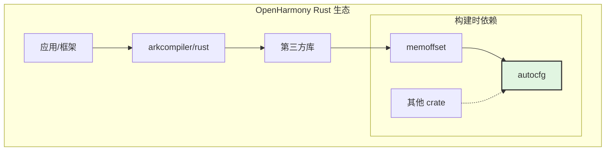

# 01 - 原始库简介与 OH 定位

## 原始库信息

### 基本介绍

**autocfg** 是 Rust 生态系统中广泛使用的基础工具库，主要功能是**在编译时自动探测 Rust 编译器支持的特性**。

```rust
// 典型使用场景：在 build.rs 中探测 i128 类型支持
extern crate autocfg;

fn main() {
    let ac = autocfg::new();
    ac.emit_has_type("i128");  // 如果支持，输出 cargo:rustc-cfg=has_i128
}
```

### 上游信息

| 属性 | 内容 |
|-----|------|
| **名称** | autocfg |
| **版本** | 1.4.0 (2024-09-26) |
| **作者** | Josh Stone <cuviper@gmail.com> |
| **仓库** | https://github.com/cuviper/autocfg |
| **许可证** | Apache-2.0 OR MIT (双许可) |
| **最小 Rust 版本** | 1.0.0 (极保守的兼容性策略) |

### 原始功能

autocfg 提供以下核心能力：

| 功能 | 说明 | API |
|-----|------|-----|
| **版本探测** | 检查 rustc 版本是否满足要求 | `probe_rustc_version(major, minor)` |
| **类型探测** | 检查特定类型是否可用 | `probe_type(name)`, `emit_has_type(name)` |
| **特性探测** | 检查特定 trait 是否可用 | `probe_trait(name)`, `emit_has_trait(name)` |
| **路径探测** | 检查特定模块路径是否可用 | `probe_path(path)`, `emit_has_path(path)` |
| **表达式探测** | 检查任意表达式是否可编译 | `probe_expression(expr)` |
| **常量探测** | 检查常量表达式是否支持 | `probe_constant(expr)` |
| **原始探测** | 直接测试任意代码片段 | `probe_raw(code)` |

### 工作原理

```
┌─────────────┐     ┌──────────────┐     ┌─────────────┐
│  build.rs   │────▶│   autocfg    │────▶│   rustc     │
│  (调用方)    │     │ (探测工具)    │     │ (测试编译)   │
└─────────────┘     └──────────────┘     └─────────────┘
                           │
                           ▼
                    ┌──────────────┐
                    │ 生成 cfg 标志 │──▶ cargo:rustc-cfg=XXX
                    └──────────────┘
```

1. **探测阶段**：autocfg 创建临时代码片段，调用 rustc 进行测试编译
2. **判断阶段**：根据编译成功与否，判断特性是否支持
3. **输出阶段**：输出 `cargo:rustc-cfg` 指令，供 Cargo 传递给 rustc

---

## 在 OpenHarmony 中的定位

### 引入原因

OpenHarmony 引入 autocfg 是为了支持**条件编译**需求。由于 OH 需要支持多种 Rust 版本和平台，需要一种机制来：

1. **版本适配**：在不同 Rust 版本上使用不同实现
2. **特性检测**：探测编译器是否支持特定语言特性
3. **平台适配**：处理不同目标平台的差异

### 使用场景

在 OpenHarmony 中，autocfg 主要用于：

#### 场景 1：memoffset 库

```rust
// memoffset 的 build.rs
extern crate autocfg;

fn main() {
    let ac = autocfg::new();
    // 探测 offset_of! 宏（Rust 1.51 之前需要）
    ac.emit_has_path("core::mem::offset_of");
}
```

memoffset 使用 autocfg 探测 `offset_of!` 宏的支持情况，该宏用于获取结构体字段的偏移量。

#### 场景 2：其他第三方库

其他依赖 autocfg 的 crate 在编译时自动适配 OH 的 Rust 工具链版本。

### 技术定位



**定位说明**：
- **层级**：基础工具层（与 rustc 交互）
- **作用域**：构建时（compile-time）
- **影响范围**：所有使用它的 crate 的 build.rs
- **运行时影响**：**零** - 不进入最终二进制

### 与其他组件的关系

| 组件 | 关系 | 说明 |
|------|------|------|
| memoffset | **下游依赖** | 使用 autocfg 探测 offset_of 支持 |
| rustc | **交互对象** | 调用 rustc 进行测试编译 |
| cargo | **输出目标** | 生成 cargo:rustc-cfg 指令 |
| ohos_cargo_crate | **构建模板** | OH 使用此模板构建 autocfg |

---

## 源代码结构

```
src/
├── lib.rs      # 主库代码 (591 行) - AutoCfg 结构体和主要 API
├── rustc.rs    # Rustc 封装 (90 行) - rustc 调用和版本获取
├── version.rs  # 版本解析 (66 行) - 语义版本比较
├── error.rs    # 错误处理 (82 行) - Error 类型定义
└── tests.rs    # 单元测试 (139 行)
```

### 关键代码分析

#### AutoCfg 结构体 (src/lib.rs)

```rust
#[derive(Clone, Debug)]
pub struct AutoCfg {
    out_dir: PathBuf,          // 输出目录（用于临时文件）
    rustc: Rustc,              // rustc 封装
    rustc_version: Version,    // 检测到的 rustc 版本
    target: Option<OsString>,  // 目标平台
    no_std: bool,              // 是否使用 #![no_std]
    rustflags: Vec<String>,    // RUSTFLAGS 传递的选项
    uuid: u64,                 // 唯一标识（用于临时 crate 名）
}
```

#### 探测方法示例

```rust
// 探测类型是否存在
pub fn probe_type(&self, name: &str) -> bool {
    self.probe(format_args!("pub type Probe = {};", name))
}

// 探测特性是否实现
pub fn probe_trait(&self, name: &str) -> bool {
    self.probe(format_args!("pub trait Probe: {} + Sized {{}}", name))
}
```

---

## 版本历史（重点更新）

| 版本 | 日期 | 重要变更 |
|------|------|---------|
| 1.4.0 | 2024-09 | 添加 `emit_possibility`，支持 Rust 1.80 的 checked cfgs |
| 1.3.0 | 2024-05 | 添加 `probe_raw`，支持直接控制测试代码 |
| 1.2.0 | 2024-03 | 支持 `no_std`，支持 RUSTC_WRAPPER |
| 1.1.0 | 2022-02 | 支持 CARGO_ENCODED_RUSTFLAGS |
| 1.0.0 | 2020-01 | 🎉 1.0 正式发布，API 稳定 |

**OH 当前版本**: 1.4.0（最新稳定版）

---

## 总结

autocfg 是 Rust 生态的**基础设施级**库，在 OpenHarmony 中扮演**构建时探测工具**的角色。它：

- ✅ **功能单一明确**：仅探测编译器特性
- ✅ **平台无关**：基于标准 Rust 接口
- ✅ **零运行时影响**：纯构建时工具
- ✅ **成熟稳定**：1.0+ 版本，API 稳定

由于其特性，autocfg 在 OH 中**无需任何修改**即可工作，是典型的**零 Patch 第三方库**。

---

*文档生成时间: 2025-02-08*
