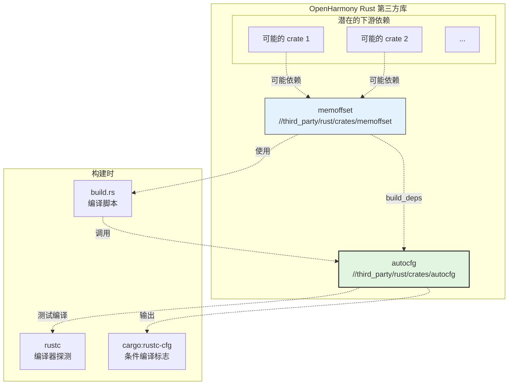
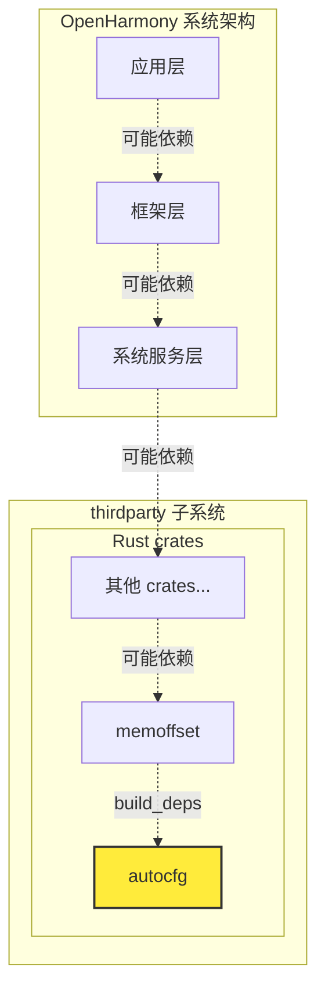

# 04 - 依赖关系与使用场景

## 概述

autocfg 在 OpenHarmony 中是**构建时工具**，被其他 Rust crate 在 `build.rs` 构建脚本中使用。本章详细分析依赖关系、使用场景，并提供依赖关系图。

---

## 依赖者分析

### 直接依赖者

在 OpenHarmony 的 `third_party/rust/crates/` 中，**直接依赖** autocfg 的 crate：

| 依赖者 | BUILD.gn 路径 | 依赖类型 | 用途 |
|--------|--------------|---------|------|
| **memoffset** | `//third_party/rust/crates/memoffset` | `build_deps` | 探测 `offset_of!` 宏支持 |

### 搜索验证

使用以下命令验证依赖关系：

```bash
cd /Volumes/lexar/code/d/work/oh

# 搜索 BUILD.gn 中的依赖声明
grep -r "//third_party/rust/crates/autocfg" --include="BUILD.gn"
# 结果: ./third_party/rust/crates/memoffset/BUILD.gn
#       build_deps = ["//third_party/rust/crates/autocfg:lib"]

# 搜索 Cargo.toml 中的依赖
grep -r "autocfg" --include="Cargo.toml" third_party/rust/crates/
# 结果: memoffset/Cargo.toml:autocfg = "1"
```

### memoffset 详情

memoffset 是 autocfg 的主要（也是唯一）依赖者。

#### memoffset 的 Cargo.toml

```toml
[package]
name = "memoffset"
version = "0.6.5"
edition = "2018"

[build-dependencies]
autocfg = "1"
```

#### memoffset 的 build.rs

```rust
extern crate autocfg;

fn main() {
    let ac = autocfg::new();
    
    // 探测是否支持 offset_of! 宏（Rust 1.51+）
    ac.emit_has_path("core::mem::offset_of");
    
    // 探测是否支持 MaybeUninit（Rust 1.36+）
    ac.emit_has_type("core::mem::MaybeUninit");
}
```

#### memoffset 的 BUILD.gn

```gn
ohos_cargo_crate("lib") {
  crate_name = "memoffset"
  crate_type = "rlib"
  
  # 声明对 autocfg 的构建依赖
  build_deps = ["//third_party/rust/crates/autocfg:lib"]
  
  sources = [
    "src/lib.rs",
    "src/raw_field.rs",
    # ... 其他源文件
  ]
  
  edition = "2018"
  part_name = "rust_memoffset"
  subsystem_name = "thirdparty"
}
```

### 间接依赖分析

虽然 autocfg 本身只有 memoffset 一个直接依赖者，但 memoffset 可能被更多 crate 使用：

```
autocfg → memoffset → [其他依赖 memoffset 的 crate]
```

这些间接依赖者可能包括：
- 使用 `offset_of!` 宏进行内存布局操作的 crate
- 处理 FFI 绑定、unsafe 代码的 crate

**注意**：由于时间限制，本次分析未完整追踪 memoffset 的下游依赖链。

---

## 使用场景详解

### 场景 1: 探测 offset_of! 宏

#### 背景

`offset_of!` 宏用于获取结构体字段的偏移量。该宏在 Rust 1.51 中稳定化，在此之前需要使用 crate 实现。

#### memoffset 中的使用

```rust
// memoffset 的 src/lib.rs

// 根据探测结果条件编译
#![cfg_attr(has_core_mem_offset_of, feature(offset_of))]

#[cfg(has_core_mem_offset_of)]
pub use core::mem::offset_of;

#[cfg(not(has_core_mem_offset_of))]
pub use crate::raw_field::offset_of;
```

#### autocfg 的作用

```rust
// memoffset 的 build.rs
fn main() {
    let ac = autocfg::new();
    // 如果支持 offset_of!，设置 cfg(has_core_mem_offset_of)
    ac.emit_has_path("core::mem::offset_of");
}
```

**效果**：
- 如果 Rust 版本 ≥ 1.51，使用标准库的 `offset_of!`
- 如果 Rust 版本 < 1.51，使用 memoffset 自己的实现

### 场景 2: 探测 MaybeUninit

#### 背景

`MaybeUninit<T>` 是 Rust 1.36 引入的类型，用于处理未初始化内存。在此之前使用 `mem::uninitialized()`，但该函数已被废弃。

#### 使用方式

```rust
// build.rs
fn main() {
    let ac = autocfg::new();
    ac.emit_has_type("core::mem::MaybeUninit");
}
```

### 场景 3: 其他潜在的探测场景

虽然当前只有 memoffset 使用 autocfg，但 autocfg 的设计支持多种探测：

| 探测类型 | 示例 | 典型用途 |
|---------|------|---------|
| 版本探测 | `probe_rustc_version(1, 50)` | 检查编译器版本是否满足 |
| 类型探测 | `emit_has_type("i128")` | 检查 128 位整数支持 |
| 特性探测 | `emit_has_trait("Send")` | 检查 auto trait 可用性 |
| 路径探测 | `emit_has_path("std::sync::Mutex")` | 检查模块路径存在 |
| 表达式探测 | `probe_expression("1+1")` | 检查语法特性 |

---

## 依赖关系图

### 完整依赖图



### 简化依赖图


### OH 子系统视图



---

## 使用方式详解

### 链接方式

| 属性 | 说明 |
|------|------|
| **链接类型** | 静态链接（rlib） |
| **链接时机** | 构建时（compile-time） |
| **运行时存在** | **否** - autocfg 不进入运行时二进制 |
| **输出格式** | `.rlib` Rust 静态库 |

### 引用方式

#### 在 build.rs 中引用

```rust
// 下游 crate 的 build.rs
extern crate autocfg;

fn main() {
    let ac = autocfg::new();
    // ... 探测代码
}
```

#### 在 BUILD.gn 中声明

```gn
# 下游 crate 的 BUILD.gn
rust_crate("xxx") {
  # 普通依赖（运行时）
  deps = ["//other/crate:lib"]
  
  # 构建依赖（build.rs 使用）
  build_deps = ["//third_party/rust/crates/autocfg:lib"]
}
```

**重要区别**：
- `deps`: 运行时依赖，链接到最终二进制
- `build_deps`: 构建时依赖，只在编译 build.rs 时使用

### 头文件/接口

autocfg 作为 Rust crate，没有 C 头文件。其公共接口是 Rust 的 `pub` 项：

```rust
// autocfg 的主要公共 API

pub struct AutoCfg { ... }

impl AutoCfg {
    pub fn new() -> Result<Self, Error>;
    pub fn probe_rustc_version(&self, major: usize, minor: usize) -> bool;
    pub fn emit_has_type(&self, name: &str);
    pub fn emit_has_trait(&self, name: &str);
    pub fn emit_has_path(&self, path: &str);
    pub fn probe_expression(&self, expr: &str) -> bool;
    // ... 其他方法
}

pub fn emit(cfg: &str);
pub fn rerun_path(path: &str);
pub fn emit_possibility(cfg: &str);
```

---

## 使用统计

### 在 OH 代码库中的使用范围

基于搜索结果：

| 范围 | 使用数量 | 说明 |
|------|---------|------|
| `third_party/rust/crates/` | 1 | memoffset |
| `third_party/rust/rust/` | 3 | rustc_codegen_cranelift 补丁文件（版本锁定） |
| `foundation/` | 0 | 未找到 |
| `ark/` | 0 | 未找到 |
| `base/` | 0 | 未找到 |

### 与其他库的对比

| 库 | OH 中使用位置数 | 类型 |
|---|----------------|------|
| **autocfg** | **~4** | 构建时工具 |
| libc | 50+ | 运行时基础库 |
| log | 30+ | 运行时日志 |
| serde | 20+ | 序列化 |

**说明**：autocfg 使用位置少是正常情况，因为它是**构建时工具**，不是运行时库。

---

## 维护和影响分析

### 变更影响范围

如果对 autocfg 进行修改，影响范围：

```
autocfg 变更
    ↓
memoffset 构建（影响）
    ↓
memoffset 的下游 crate（潜在影响）
```

### 风险评估

| 风险项 | 等级 | 说明 |
|-------|------|------|
| 编译失败影响 | **中** | 影响 memoffset 及下游所有 crate |
| 运行时影响 | **无** | autocfg 不进入运行时 |
| API 变更影响 | **低** | 上游 API 稳定（1.0+），向后兼容 |

### 维护建议

1. **升级前测试**：升级 autocfg 前，确保 memoffset 能正常编译
2. **版本锁定**：OH 使用 Git 子模块锁定版本，避免意外升级
3. **监控上游**：关注上游安全公告（虽然 autocfg 安全风险极低）

---

## 总结

autocfg 在 OpenHarmony 中的使用情况：

| 指标 | 数值/状态 |
|------|----------|
| 直接依赖者数量 | **1** (memoffset) |
| 间接影响范围 | 有限（memoffset 的下游） |
| 使用场景 | 探测 `offset_of!` 和 `MaybeUninit` |
| 链接方式 | 构建时静态链接 |
| 运行时存在 | **否** |
| 维护优先级 | **低**（无运行时影响，API 稳定） |

**核心结论**：autocfg 是 OpenHarmony Rust 生态的**基础构建工具**，虽然使用位置不多，但为关键 crate（如 memoffset）提供了编译器特性探测能力。由于其构建时特性，对运行时系统**零影响**。

---

*文档生成时间: 2025-02-08*
