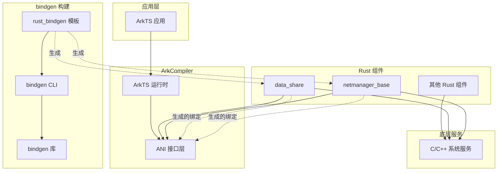

# 04 - 依赖关系与使用

## 直接依赖者

### 生产环境使用者

| 模块 | BUILD.gn 路径 | 用途 |
|-----|--------------|-----|
| **data_share** | `foundation/distributeddatamgr/data_share/common/ani_sys/BUILD.gn` | ANI 绑定生成，支持数据共享服务的 ArkTS 接口 |
| **netmanager_base** | `foundation/communication/netmanager_base/common/ani_sys/BUILD.gn` | ANI 绑定生成，支持网络管理的 ArkTS 接口 |

### 构建系统使用者

| 模块 | BUILD.gn 路径 | 用途 |
|-----|--------------|-----|
| **rust_bindgen 模板** | `build/templates/rust/rust_bindgen.gni` | 提供声明式绑定生成能力 |
| **bindgen 测试** | `build/rust/tests/test_bindgen_test/` | 验证 bindgen 功能 |

### 测试用例

| 测试 | 路径 | 说明 |
|-----|------|-----|
| test_for_extern_c | `build/rust/tests/test_bindgen_test/test_for_extern_c` | 测试 extern "C" 函数绑定 |
| test_for_h | `build/rust/tests/test_bindgen_test/test_for_h` | 测试 C 头文件绑定 |
| test_for_hpp | `build/rust/tests/test_bindgen_test/test_for_hpp` | 测试 C++ 头文件绑定 |
| test_for_hello_world | `build/rust/tests/test_bindgen_test/test_for_hello_world` | 基础功能测试 |

## 使用方式详解

### data_share 使用示例

**BUILD.gn**:
```gn
rust_bindgen("ani_bindgen_h") {
  header = "//arkcompiler/runtime_core/static_core/plugins/ets/runtime/ani/ani.h"
}

ohos_rust_static_library("ani_sys") {
  sanitize = {
    cfi = true
    cfi_cross_dso = true
    boundary_sanitize = true
    all_ubsan = true
    debug = false
  }
  deps = [ ":ani_bindgen_h" ]
  sources = [ "src/lib.rs" ]
  external_deps = [ "runtime_core:ani" ]

  bindgen_output = get_target_outputs(":ani_bindgen_h")
  inputs = bindgen_output
  rustenv = [ "ANI_BINDGEN_RS_FILE=" + rebase_path(bindgen_output[0]) ]

  clippy_lints = "none"
  part_name = "data_share"
  subsystem_name = "distributeddatamgr"
}
```

**src/lib.rs**:
```rust
// 包含生成的绑定
include!(env!("ANI_BINDGEN_RS_FILE"));

// 使用生成的类型和函数
pub use self::bindings::*;

// 包装函数，提供安全的 Rust API
pub fn call_ani_function(...) -> Result<(), AniError> {
    unsafe {
        // 使用生成的 FFI 函数
        let result = ani::some_ani_function(...);
        // ...
    }
}
```

### netmanager_base 使用示例

与 data_share 结构相同，同样为 ANI 绑定生成：

```gn
rust_bindgen("ani_bindgen_h") {
  header = "//arkcompiler/runtime_core/static_core/plugins/ets/runtime/ani/ani.h"
}
```

## 依赖图

### 完整依赖关系



### 构建时依赖

```mermaid
graph LR
    A[组件 BUILD.gn] -->|调用| B[ruby_bindgen 模板]
    B -->|依赖| C[@ohos/rust_bindgen:bindgen]
    C -->|包含| D[bindgen-cli:bin]
    D -->|依赖| E[bindgen:lib]
    E -->|依赖| F[clang-sys:lib]
    F -->|调用| G[libclang.so]
```

## 使用场景分析

### 场景 1: ANI (Ark Native Interface) 绑定

**背景**: OH 需要让 Rust 组件能够调用 ArkTS 运行时提供的接口。

**bindgen 作用**: 为 `ani.h` 头文件生成 Rust FFI 绑定。

**优势**:
- 自动生成，避免手写 FFI 的错误
- ANI 头文件更新时自动同步
- 类型安全，编译期检查

### 场景 2: Rust/C++ 组件互操作

**背景**: OH 中既有 C++ 系统服务，也有 Rust 实现的组件。

**bindgen 作用**: 为 C++ 头文件生成 Rust 绑定，使 Rust 可以调用 C++ 接口。

**示例**:
```rust
// 调用 C++ 系统服务的 Rust 代码
use generated_bindings::system_service;

pub fn init_system() {
    unsafe {
        system_service::initialize();
    }
}
```

## 静态链接 vs 动态链接

bindgen 本身是**构建时工具**，不涉及运行时链接问题。但生成的绑定代码在使用时有以下特点：

| 特性 | 说明 |
|-----|-----|
| **绑定方式** | 生成的 Rust 代码使用 `extern "C"` 声明 |
| **链接时机** | 与 Rust 组件一起链接 |
| **依赖库** | 运行时依赖生成的绑定所引用的 C/C++ 库 |

## 头文件引用方式

### 绝对路径

```gn
rust_bindgen("bindings") {
  header = "//foundation/xxx/yyy/interface.h"
}
```

### 相对路径

```gn
rust_bindgen("bindings") {
  header = "include/my_header.h"
}
```

### 系统头文件

```gn
rust_bindgen("system_bindings") {
  header = "/usr/include/some_header.h"
  # 不推荐，会降低可移植性
}
```

## 关键使用统计

```bash
# 统计使用 rust_bindgen 的模块
$ grep -r "rust_bindgen(" /Volumes/lexar/code/d/work/oh --include="*.gn" | wc -l
# 结果: 约 5+ 个使用点

# 统计生成的绑定引用
$ grep -r "BINDGEN_RS_FILE\|ANI_BINDGEN_RS_FILE" /Volumes/lexar/code/d/work/oh --include="*.gn" | wc -l
# 结果: 约 5+ 个引用
```

## 注意事项

1. **头文件路径**: 使用 `//` 开头的绝对路径，避免相对路径带来的维护问题
2. **环境变量**: 生成的绑定路径通过 `rustenv` 传递给 rustc
3. **增量构建**: bindgen 会生成 depfile，支持增量构建
4. **错误处理**: 绑定生成失败会阻止依赖目标编译，需确保头文件可访问
