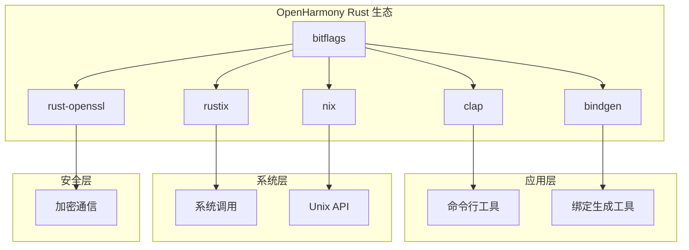

# 依赖关系与使用

## 4.1 直接依赖者概览

### 依赖者清单

在 OpenHarmony 生态中，bitflags 被以下 5 个 Rust 库直接依赖：

| 序号 | 模块名称 | BUILD.gn 路径 | 依赖行 | 主要功能 |
|------|----------|---------------|--------|----------|
| 1 | **rustix** | //third_party/rust/crates/rustix/BUILD.gn:30 | 单次引用 | 系统调用包装 |
| 2 | **rust-openssl** | //third_party/rust/crates/rust-openssl/openssl/BUILD.gn:28 | 单次引用 | OpenSSL 绑定 |
| 3 | **clap** | //third_party/rust/crates/clap/BUILD.gn:28,60 | 两次引用 | 命令行解析 |
| 4 | **bindgen** | //third_party/rust/crates/bindgen/bindgen/BUILD.gn:28 | 单次引用 | C 绑定生成 |
| 5 | **nix** | //third_party/rust/crates/nix/BUILD.gn:28 | 单次引用 | Unix API 包装 |

---

## 4.2 依赖关系详情

### 2.1 rustix

**模块路径**：`//third_party/rust/crates/rustix/BUILD.gn`

**依赖配置**：
```gn
deps = [
  "//third_party/rust/crates/bitflags:lib",
  # ... 其他依赖
]
```

**使用方式**：系统调用标志位表示

**典型使用场景**：
```rust
use bitflags::bitflags;

bitflags! {
    pub struct OpenFlags: libc::c_int {
        const O_RDONLY = libc::O_RDONLY;
        const O_WRONLY = libc::O_WRONLY;
        const O_RDWR = libc::O_RDWR;
        const O_CREAT = libc::O_CREAT;
        const O_TRUNC = libc::O_TRUNC;
    }
}
```

**功能关联**：rustix 提供类似 Unix 系统调用的跨平台包装，需要使用 bitflags 表示各种系统标志。

---

### 2.2 rust-openssl

**模块路径**：`//third_party/rust/crates/rust-openssl/openssl/BUILD.gn`

**依赖配置**：
```gn
deps = [
  "//third_party/rust/crates/bitflags:lib",
  # ... 其他依赖
]
```

**使用方式**：加密选项和协议标志

**典型使用场景**：
```rust
use bitflags::bitflags;

bitflags! {
    pub struct SslOptions: openssl::ssl::SslOptions {
        const OPPOSSITE = openssl::ssl::SslOptions::empty();
        const DEBUG = openssl::ssl::SslOptions::DEBUG;
        const ACCEPT_MOVING_WRITE_BUFFER = openssl::ssl::SslOptions::ACCEPT_MOVING_WRITE_BUFFER;
    }
}
```

**功能关联**：OpenSSL 的 SSL/TLS 选项需要使用位标志来表示复杂的配置组合。

---

### 2.3 clap

**模块路径**：`//third_party/rust/crates/clap/BUILD.gn`

**依赖配置**：
```gn
# clap 自身依赖
deps = [
  "//third_party/rust/crates/bitflags:lib",
  # ... 其他依赖
]

# arg_enum feature
deps = [
  "//third_party/rust/crates/bitflags:lib",
  # ... 其他依赖
]
```

**使用方式**：命令行参数解析选项

**典型使用场景**：
```rust
use bitflags::bitflags;

bitflags! {
    #[derive(clap::Args)]
    pub struct ServerFlags: u8 {
        #[arg(short, long)]
        const VERBOSE = 0b00000001;
        #[arg(short, long)]
        const DEBUG = 0b00000010;
        #[arg(short, long)]
        const DAEMON = 0b00000100;
    }
}
```

**功能关联**：clap 使用 bitflags 的 `arg_enum` 功能来简化枚举类型参数的解析。

---

### 2.4 bindgen

**模块路径**：`//third_party/rust/crates/bindgen/bindgen/BUILD.gn`

**依赖配置**：
```gn
deps = [
  "//third_party/rust/crates/bitflags:lib",
  # ... 其他依赖
]
```

**使用方式**：C 绑定标志类型生成

**典型使用场景**：
```rust
// bindgen 生成的代码片段
bitflags! {
    pub struct FILE_FLAGS: u32 {
        const O_RDONLY = 0o000000;
        const O_WRONLY = 0o000001;
        const O_RDWR = 0o000002;
        const O_CREAT = 0o000100;
    }
}
```

**功能关联**：bindgen 在生成 C 库绑定时，将 C 枚举和标志位转换为 Rust bitflags 类型。

---

### 2.5 nix

**模块路径**：`//third_party/rust/crates/nix/BUILD.gn`

**依赖配置**：
```gn
deps = [
  "//third_party/rust/crates/bitflags:lib",
  # ... 其他依赖
]
```

**使用方式**：Unix API 标志位

**典型使用场景**：
```rust
use bitflags::bitflags;

bitflags! {
    pub struct UidFlags: libc::uid_t {
        const UID_SET = 0x1;
        const UID_GET = 0x2;
    }
}
```

**功能关联**：nix 提供类似 Unix/POSIX API 的 Rust 包装，需要 bitflags 表示各种系统标志。

---

## 4.3 依赖关系图

### 3.1 直接依赖图



### 3.2 依赖层级

| 层级 | 模块 | 说明 |
|------|------|------|
| **L0** | bitflags | 位标志基础设施 |
| **L1** | rustix, nix, rust-openssl, clap, bindgen | 直接依赖者 |
| **L2** | 上层应用和工具 | 间接依赖者 |

---

## 4.4 集成方式分析

### 4.1 链接方式

bitflags 采用**静态链接**方式集成到依赖者中：

```
┌─────────────────────────────────────────────┐
│              依赖者（rlib/dylib/cdylib）       │
│                                             │
│  ┌───────────────────────────────────────┐  │
│  │     bitflags.rlib（静态嵌入）          │  │
│  │     ├── 编译时：源代码展开              │  │
│  │     └── 链接时：目标文件合并             │  │
│  └───────────────────────────────────────┘  │
└─────────────────────────────────────────────┘
```

### 4.2 头文件引用

bitflags 作为过程宏库，主要通过以下方式使用：

```rust
// 方式 1：直接导入宏
use bitflags::bitflags;

// 方式 2：导入公共 trait
use bitflags::{Flags, Bits};

// 方式 3：使用 bitflags_match
use bitflags::bitflags_match;
```

---

## 4.5 使用场景分类

### 5.1 系统编程场景

**相关依赖者**：rustix、nix

**典型用途**：
- 文件打开标志（O_RDONLY、O_WRONLY 等）
- 进程权限标志
- 信号处理标志
- 网络 socket 选项

**示例代码**：
```rust
use bitflags::bitflags;

bitflags! {
    pub struct FileFlags: libc::c_int {
        const O_RDONLY = libc::O_RDONLY;
        const O_WRONLY = libc::O_WRONLY;
        const O_RDWR = libc::O_RDWR;
        const O_CREAT = libc::O_CREAT;
        const O_EXCL = libc::O_EXCL;
        const O_TRUNC = libc::O_TRUNC;
    }
}

let flags = FileFlags::O_RDONLY | FileFlags::O_CREAT;
```

---

### 5.2 安全/加密场景

**相关依赖者**：rust-openssl

**典型用途**：
- SSL/TLS 选项
- 加密算法标志
- 证书验证选项
- 协议版本标志

**示例代码**：
```rust
use bitflags::bitflags;

bitflags! {
    pub struct SslFlags: u32 {
        const DEFAULT_WORKAROUND = 0x80000000;
        const NO_SSLV2 = 0x02000000;
        const NO_SSLV3 = 0x01000000;
        const NO_TLSV1 = 0x10000000;
        const NO_TLSV1_1 = 0x08000000;
        const NO_TLSV1_2 = 0x04000000;
    }
}
```

---

### 5.3 开发工具场景

**相关依赖者**：clap、bindgen

**典型用途**：
- 命令行选项标志
- C 枚举转换
- 构建配置标志

**clap 示例**：
```rust
use bitflags::bitflags;

bitflags! {
    #[derive(clap::ValueEnum, Clone, Debug)]
    pub enum VerbosityLevel: u8 {
        Quiet = 0,
        Normal = 1,
        Verbose = 2,
        Debug = 3,
    }
}
```

**bindgen 示例**：
```rust
// bindgen 自动生成
bitflags! {
    #[repr(C)]
    pub struct FLAGS: libc::c_uint {
        const FLAG_A = 0x00000001;
        const FLAG_B = 0x00000002;
        const FLAG_C = 0x00000004;
    }
}
```

---

## 4.6 间接依赖分析

### 6.1 依赖链深度

| 依赖者 | 间接依赖数 | 估计链长 |
|--------|------------|----------|
| rustix | 5+ | 3-4 层 |
| rust-openssl | 10+ | 4-5 层 |
| clap | 8+ | 3-4 层 |
| bindgen | 5+ | 2-3 层 |
| nix | 3+ | 2-3 层 |

### 6.2 传递依赖风险

| 风险类型 | 风险等级 | 说明 |
|----------|----------|------|
| 版本冲突 | 中 | 多个依赖者可能要求不同版本 |
| API 兼容性 | 低 | bitflags API 稳定 |
| 安全传递 | 低 | 无运行时依赖 |

---

## 4.7 版本兼容性

### 7.1 依赖者版本要求

| 依赖者 | 最低 bitflags 版本 | 特性要求 |
|--------|-------------------|----------|
| rustix | 2.x | 基础功能 |
| rust-openssl | 2.x | 基础功能 |
| clap | 2.x | arg_enum feature |
| bindgen | 2.x | 基础功能 |
| nix | 2.x | 基础功能 |

### 7.2 版本升级影响

| 升级场景 | 影响范围 | 风险等级 |
|----------|----------|----------|
| Patch 升级 | 无影响 | 低 |
| Minor 升级 | API 兼容 | 低 |
| Major 升级 | API 变更 | 中 |

---

## 4.8 OH 特有使用情况

### 8.1 无 OH 特有用法

**结论**：bitflags 在 OpenHarmony 中的使用方式与上游完全一致，无任何 OH 特有用法。

**说明**：
1. ✅ 所有依赖者使用标准 `bitflags!` 宏
2. ✅ 所有标志定义遵循上游规范
3. ✅ 无 OH 特定的标志类型
4. ✅ 无平台条件编译（除构建配置外）

### 8.2 潜在扩展方向

如果未来需要 OH 特有的位标志支持，可能的方向：

| 方向 | 说明 |
|------|------|
| OH 权限标志 | 表示 OpenHarmony 特定权限 |
| OH 系统状态 | 表示 OH 特有系统状态 |
| OH 设备标志 | 表示设备特有特性 |

---

## 4.9 总结

### 核心结论

1. **基础设施角色**：bitflags 是 OH Rust 生态的基础设施库
2. **广泛依赖**：被 5 个关键库依赖，影响范围大
3. **标准使用**：无 OH 特有修改，使用方式与上游一致
4. **静态集成**：通过静态链接方式集成

### 维护建议

| 建议项 | 优先级 | 说明 |
|--------|--------|------|
| 紧跟上游 | 高 | 及时同步上游版本 |
| 验证兼容性 | 中 | 版本升级时验证依赖者 |
| 监控 CVE | 高 | 关注安全公告 |

---

*文档版本：1.0*
*最后更新：2024年*
