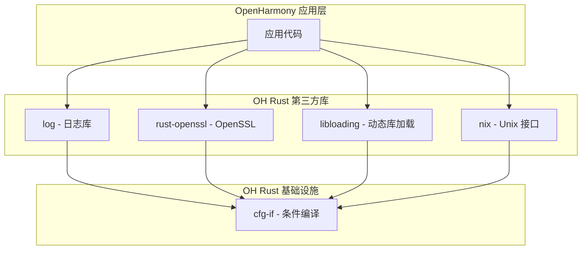

# 在 OpenHarmony 中的使用

## 直接依赖者

### 依赖者列表

| 模块 | BUILD.gn 路径 | 用途 | 依赖方式 |
|------|--------------|------|----------|
| **log** | //third_party/rust/crates/log:BUILD.gn | 日志库的条件编译 | 直接依赖 |
| **rust-openssl** | //third_party/rust/crates/rust-openssl/openssl:BUILD.gn | OpenSSL 的平台条件编译 | 直接依赖 |
| **libloading** | //third_party/rust/crates/libloading:BUILD.gn | 动态库加载的条件编译 | 直接依赖 |
| **nix** | //third_party/rust/crates/nix:BUILD.gn | Unix 系统接口的条件编译 | 直接依赖 |

### 依赖者 BUILD.gn 示例

#### log 库的依赖

```gn
# //third_party/rust/crates/log:BUILD.gn
ohos_cargo_crate("lib") {
    crate_name = "log"
    crate_type = "rlib"
    crate_root = "src/lib.rs"

    sources = ["src/lib.rs"]
    edition = "2018"

    deps = [ "//third_party/rust/crates/cfg-if:lib" ]  # cfg-if 依赖
}
```

#### nix 库的依赖

```gn
# //third_party/rust/crates/nix:BUILD.gn
ohos_cargo_crate("lib") {
    crate_name = "nix"
    crate_type = "rlib"
    crate_root = "src/lib.rs"

    sources = [
        "src/lib.rs",
        # ... 其他源文件
    ]
    edition = "2018"

    deps = [
        "//third_party/rust/crates/cfg-if:lib",  # cfg-if 依赖
        # ... 其他依赖
    ]
}
```

## 依赖关系图



## 使用场景分析

### 场景一：log 库的条件编译

`log` 库使用 `cfg-if` 来处理不同平台和特性下的日志实现：

```rust
// log 库中的使用示例
use cfg_if::cfg_if;

cfg_if! {
    if #[cfg(feature = "std")] {
        // 标准库实现
        use std::sync::Mutex;
    } else if #[cfg(feature = "atomics")] {
        // 原子特性实现
        use core::sync::atomic::AtomicUsize;
    } else {
        // 最小实现
        use bare_naked_impl;
    }
}
```

### 场景二：nix 库的平台抽象

`nix` 库使用 `cfg-if` 来抽象 Unix 系统接口：

```rust
// nix 库中的使用示例
use cfg_if::cfg_if;

cfg_if! {
    if #[cfg(target_os = "linux")] {
        mod linux;
        pub use linux::*;
    } else if #[cfg(target_os = "android")] {
        mod android;
        pub use android::*;
    } else if #[cfg(target_os = "ohos")] {
        mod ohos;
        pub use ohos::*;
    } else if #[cfg(target_os = "freebsd")] {
        mod freebsd;
        pub use freebsd::*;
    }
}
```

### 场景三：libloading 的平台支持

`libloading` 库使用 `cfg-if` 来处理动态库加载的平台差异：

```rust
// libloading 库中的使用示例
use cfg_if::cfg_if;

cfg_if! {
    if #[cfg(unix)] {
        mod unix;
        use self::unix::Library;
    } else if #[cfg(windows)] {
        mod windows;
        use self::windows::Library;
    }
}
```

## 在 OH 应用中的使用

### 1. 添加依赖

在应用的 BUILD.gn 中添加依赖：

```gn
rust_ffi("my_component") {
    # ... 其他配置
    deps = [
        "//third_party/rust/crates/cfg-if:lib",
        # ... 其他依赖
    ]
}
```

### 2. Rust 代码中使用

```rust
use cfg_if::cfg_if;

cfg_if! {
    if #[cfg(target_os = "ohos")] {
        fn get_system_info() -> &'static str {
            "OpenHarmony"
        }
    } else if #[cfg(target_os = "linux")] {
        fn get_system_info() -> &'static str {
            "Linux"
        }
    } else if #[cfg(target_os = "windows")] {
        fn get_system_info() -> &'static str {
            "Windows"
        }
    }
}

fn main() {
    println!("System: {}", get_system_info());
}
```

## 最佳实践

### 1. 条件编译的组织

```rust
// ✅ 推荐：使用 cfg_if! 组织复杂条件
use cfg_if::cfg_if;

cfg_if! {
    if #[cfg(all(unix, feature = "advanced"))] {
        fn advanced_unix_feature() { /* ... */ }
    } else if #[cfg(all(windows, feature = "advanced"))] {
        fn advanced_windows_feature() { /* ... */ }
    } else if #[cfg(any(unix, windows))] {
        fn basic_feature() { /* ... */ }
    } else {
        fn fallback_feature() { /* ... */ }
    }
}

// ❌ 不推荐：大量嵌套的 #[cfg]
#[cfg(unix)]
mod platform_a {
    #[cfg(feature = "advanced")]
    mod advanced { /* ... */ }
}
```

### 2. 平台检测宏

```rust
// 推荐：定义清晰的平台检测宏
use cfg_if::cfg_if;

cfg_if! {
    if #[cfg(target_os = "ohos")] {
        pub const IS_OHOS: bool = true;
    } else {
        pub const IS_OHOS: bool = false;
    }
}

cfg_if! {
    if #[cfg(target_family = "unix")] {
        pub const IS_UNIX: bool = true;
    } else {
        pub const IS_UNIX: bool = false;
    }
}
```

### 3. 特性条件

```rust
// 推荐：特性条件使用 cfg_if! 便于维护
use cfg_if::cfg_if;

cfg_if! {
    if #[cfg(feature = "serde")] {
        use serde::{Serialize, Deserialize};
        #[derive(Serialize, Deserialize)]
        struct Data { /* ... */ }
    } else {
        struct Data { /* ... */ }
    }
}
```

## 依赖管理注意事项

### 版本兼容性

| 依赖者 | 最低 cfg-if 版本要求 | 说明 |
|--------|---------------------|------|
| log | 0.1 或更高 | 常规条件编译 |
| nix | 0.1 或更高 | 平台抽象 |
| rust-openssl | 0.1 或更高 | 平台检测 |
| libloading | 0.1 或更高 | 动态库加载 |

### 升级影响

由于 `cfg-if` 库的 API 极其稳定（自 1.0.0 版本以来几乎没有变更），升级该库：

- ✅ 对依赖者代码**无影响**
- ✅ 宏展开行为完全一致
- ✅ 可能的变更仅在文档和内部实现细节

## 常见问题

### Q1: 为什么需要 cfg-if 而不是直接使用 #[cfg]？

虽然可以直接使用 `#[cfg]` 属性，但当存在多个相互排斥的条件分支时，`cfg_if!` 宏可以：

1. **减少重复**：避免每个分支都写完整的 `#[cfg]` 属性
2. **提高可读性**：将条件编译逻辑集中在一处
3. **便于维护**：修改条件时只需改一处

### Q2: cfg-if 与 #[cfg] 的性能差异？

**无性能差异**。`cfg_if!` 宏完全在编译期展开，生成的代码与直接使用 `#[cfg]` 属性完全相同。

### Q3: 如何在 OH 中调试条件编译问题？

```rust
// 使用静态断言验证条件配置
use cfg_if::cfg_if;

cfg_if! {
    if #[cfg(target_os = "ohos")] {
        compile_error!("Confirmed: Building for OpenHarmony");
    } else {
        compile_error!("Not building for OpenHarmony");
    }
}
```
