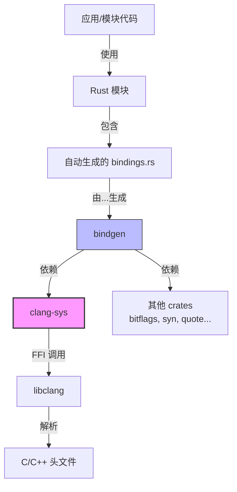
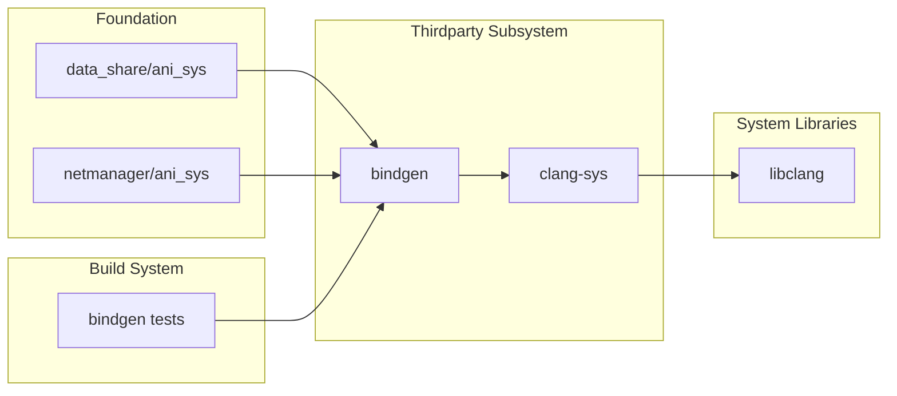

# 依赖关系与使用

## 直接依赖者

### 依赖清单

通过搜索 `third_party/rust/crates/clang-sys`，找到以下直接依赖：

| 模块 | BUILD.gn 路径 | 用途 |
|-----|--------------|-----|
| **bindgen** | `//third_party/rust/crates/bindgen/bindgen/BUILD.gn` | 自动生成 Rust FFI 绑定 |

### bindgen 依赖详情

#### BUILD.gn 依赖声明

```gn
# third_party/rust/crates/bindgen/bindgen/BUILD.gn
deps = [
    "//third_party/rust/crates/bitflags:lib",
    "//third_party/rust/crates/rust-cexpr:lib",
    "//third_party/rust/crates/clang-sys:lib",  # <-- 依赖 clang-sys
    "//third_party/rust/crates/lazy-static.rs:lib",
    "//third_party/rust/crates/lazycell:lib",
    "//third_party/rust/crates/log:lib",
    "//third_party/rust/crates/peeking_take_while:lib",
    "//third_party/rust/crates/proc-macro2:lib",
    "//third_party/rust/crates/quote:lib",
    "//third_party/rust/crates/regex:lib",
    "//third_party/rust/crates/rustc-hash:lib",
    "//third_party/rust/crates/shlex:lib",
    "//third_party/rust/crates/syn:lib",
    "//third_party/rust/crates/which-rs:lib",
]
```

#### bindgen 使用 clang-sys 的方式

bindgen 通过 clang-sys 实现以下功能：

1. **C/C++ 代码解析**
   - 调用 libclang 解析头文件
   - 获取 AST（抽象语法树）
   - 提取类型、函数、常量定义

2. **Clang 版本检测**
   - 检测系统 libclang 版本
   - 根据版本选择支持的特性

3. **跨平台支持**
   - 在不同平台查找 libclang
   - 处理平台差异

### bindgen-cli 工具

bindgen 还提供了 CLI 工具：

```gn
# third_party/rust/crates/bindgen/bindgen-cli/BUILD.gn
ohos_cargo_crate("bindgen") {
    deps = [
        "//third_party/rust/crates/bindgen/bindgen:lib",  # 依赖 bindgen 库
        # ...
    ]
    part_name = "rust_bindgen"
}
```

## 间接使用场景

### 使用 rust_bindgen 的模块

通过搜索 `rust_bindgen` 使用：

| 模块路径 | BUILD.gn 路径 | 用途 |
|---------|--------------|-----|
| 构建系统测试 | `//build/rust/tests/test_bindgen_test/*` | bindgen 功能测试 |
| 数据管理 ANI | `//foundation/distributeddatamgr/data_share/common/ani_sys/BUILD.gn` | ANI 接口绑定生成 |
| 网络管理 ANI | `//foundation/communication/netmanager_base/common/ani_sys/BUILD.gn` | ANI 接口绑定生成 |

### 典型使用示例

#### 示例 1：基础 bindgen 使用

```gn
# BUILD.gn
rust_bindgen("c_lib_bindgen") {
    header = "//path/to/header.h"
    output = "bindings.rs"
}

ohos_rust_executable("my_app") {
    deps = [ ":c_lib_bindgen" ]
}
```

#### 示例 2：OH 中的实际配置

```gn
# foundation/.../ani_sys/BUILD.gn
rust_bindgen("ani_bindgen_h") {
    header = "ani_sys.h"
    output = "ani_sys.rs"
    include_dirs = [
        "//foundation/arkui/ani_engine/runtime/main/ani.h",
        "//foundation/arkui/ani_engine/runtime/main/ani_deco.h",
    ]
}

ohos_rust_shared_library("ani_sys") {
    deps = [ ":ani_bindgen_h" ]
    # ...
}
```

## 依赖关系图

### 完整依赖链



### OH 子系统视角



## 使用方式详解

### 1. 静态链接 vs 动态链接

#### OH 配置：静态链接优先

```gn
# clang-sys BUILD.gn
features = [
    # ...
    "static",      # 启用静态链接
]
```

**优点**:
- 运行时无需依赖系统 libclang
- 部署简单，无动态库版本冲突

**缺点**:
- 二进制体积增大
- 需要静态链接 LLVM/Clang 库

### 2. 版本支持策略

#### OH 启用的 Clang 版本

```gn
features = [
    "clang_3_5",   # 基础版本
    "clang_3_6",
    "clang_3_7",
    "clang_3_8",
    "clang_3_9",
    "clang_4_0",
    "clang_5_0",
    "clang_6_0",   # OH 支持的最高版本
]
```

**说明**: OH 当前限制支持到 Clang 6.0，平衡了功能需求和构建稳定性。

### 3. 头文件搜索路径

bindgen 使用 clang-sys 时，头文件搜索路径来源：

1. **系统默认路径**: `/usr/include`, `/usr/local/include`
2. **llvm-config 输出**: `llvm-config --includedir`
3. **BUILD.gn 指定**: `include_dirs` 参数
4. **环境变量**: `CPATH`, `C_INCLUDE_PATH`

## 使用场景详细说明

### 场景 1：ANI (Ark Native Interface) 绑定生成

#### 背景
ANI 是 OH 的 ArkTS 与 Native 代码交互接口。Rust 代码需要调用 ANI C API。

#### 使用流程

```
ani.h (C 头文件)
    ↓
rust_bindgen (GN 模板)
    ↓
ani_sys.rs (生成的 Rust 绑定)
    ↓
Rust 模块使用
```

#### 实际代码示例

```rust
// 自动生成的 ani_sys.rs (片段)
#[repr(C)]
pub struct ani_env {
    _unused: [u8; 0],
}

extern "C" {
    pub fn ani_create_env(vm: *mut ani_vm, env: *mut *mut ani_env) -> ani_status;
    // ... 更多函数
}
```

```rust
// Rust 模块中使用
use ani_sys::*;

fn init_ani_env() {
    let mut env: *mut ani_env = ptr::null_mut();
    let status = unsafe { ani_create_env(vm, &mut env) };
    // ...
}
```

### 场景 2：C 库 Rust 封装

#### 背景
为现有的 C 库创建 Rust 友好封装。

#### 典型项目结构

```
my_c_library/
├── include/
│   └── mylib.h          # C 头文件
├── src/
│   └── lib.c            # C 实现
└── rust_wrapper/
    ├── Cargo.toml
    ├── build.rs
    └── src/
        ├── lib.rs       # Rust 封装
        └── bindings.rs  # bindgen 生成
```

#### build.rs 示例

```rust
use std::env;
use std::path::PathBuf;

fn main() {
    let bindings = bindgen::Builder::default()
        .header("../include/mylib.h")
        .parse_callbacks(Box::new(bindgen::CargoCallbacks))
        .generate()
        .expect("Unable to generate bindings");
    
    let out_path = PathBuf::from(env::var("OUT_DIR").unwrap());
    bindings
        .write_to_file(out_path.join("bindings.rs"))
        .expect("Couldn't write bindings");
}
```

## 依赖统计

### 模块级别统计

| 层级 | 模块数 | 说明 |
|-----|-------|-----|
| 直接依赖 | 1 | bindgen |
| 间接使用（bindgen 测试） | 4 | test_bindgen_test/* |
| 间接使用（ANI 系统） | 2 | data_share, netmanager |
| **总计** | **7** | |

### 子系统分布

```
thirdparty/         100% (直接归属)
    └── bindgen ──> 第三方库子系统

foundation/
    ├── distributeddatamgr/  ~29% (data_share/ani_sys)
    └── communication/       ~29% (netmanager_base/ani_sys)

build/
    └── rust/tests/          ~57% (测试)
```

## 影响范围评估

### 高风险变更影响

如果对 clang-sys 进行以下变更，将影响：

| 变更类型 | 影响范围 | 风险等级 |
|---------|---------|---------|
| 升级主版本 | bindgen + ANI 系统 | 中 |
| 修改 features | 所有依赖者 | 中 |
| 移除 static | 部署失败 | 高 |
| 添加 breaking API | bindgen 编译失败 | 高 |

### 升级策略建议

1. **小版本升级**（1.4.0 -> 1.4.x）:
   - 风险：低
   - 测试：构建 bindgen 即可

2. **大版本升级**（1.4.0 -> 1.5.0）:
   - 风险：中
   - 测试：全面测试 bindgen 和 ANI 系统

3. **破坏性变更**:
   - 风险：高
   - 措施：需同步升级 bindgen
