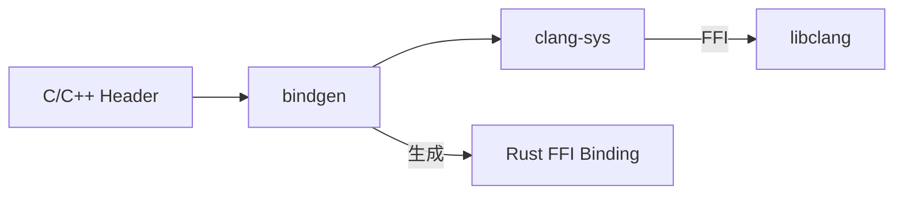

# clang-sys OpenHarmony Wiki

## 简介

本文档详细记录了 `clang-sys` 库在 OpenHarmony 中的集成与适配情况。

**关键信息速览**:
- **库类型**: Rust FFI 绑定库（libclang 的 Rust 绑定）
- **上游版本**: v1.4.0
- **OH 组件版本**: 6.1
- **Patch 数量**: 0（零 Patch，原生集成）
- **主要用途**: 为 bindgen 提供 libclang 访问能力
- **许可证**: Apache License 2.0

## 文档导航

### 核心文档

1. **[原始库简介](01_Overview.md)**
   - clang-sys 功能概述
   - 在 OH 中的定位和作用

2. **[Patch 详细分析](02_Patches.md)**
   - Patch 清单（本库无 Patch）
   - 无 Patch 原因分析

3. **[OH 构建适配](03_Build_Integration.md)**
   - BUILD.gn 配置详解
   - 与上游构建系统的差异
   - 特性启用策略

4. **[依赖关系与使用](04_Usage_in_OH.md)**
   - 依赖者分析（bindgen）
   - 典型使用场景
   - 依赖关系图

5. **[API/接口差异](05_API_Differences.md)**
   - 无 OH 特有 API 变更

6. **[安全风险分析](06_Security.md)**
   - FFI 安全风险
   - 依赖链安全
   - 版本建议

### 辅助文档

- **[ASSESSMENT.md](_work/ASSESSMENT.md)** - 项目评估报告（Phase 0 产出）
- **[NOTES.md](_work/NOTES.md)** - 分析过程记录
- **[PLAN.md](_work/PLAN.md)** - 任务进度跟踪

## 快速理解 clang-sys 在 OH 中的角色

**一句话总结**: clang-sys 是 OpenHarmony Rust 生态与 Clang 编译器之间的桥梁，使 bindgen 能够解析 C/C++ 头文件并自动生成 Rust 绑定代码。

## 维护要点

1. **无 Patch 维护负担**: 升级时可直接替换上游新版本
2. **关注依赖链**: 主要关注 libloading 和 libc 的安全更新
3. **版本扩展**: 如需支持更新 Clang 版本，扩展 BUILD.gn features 即可
