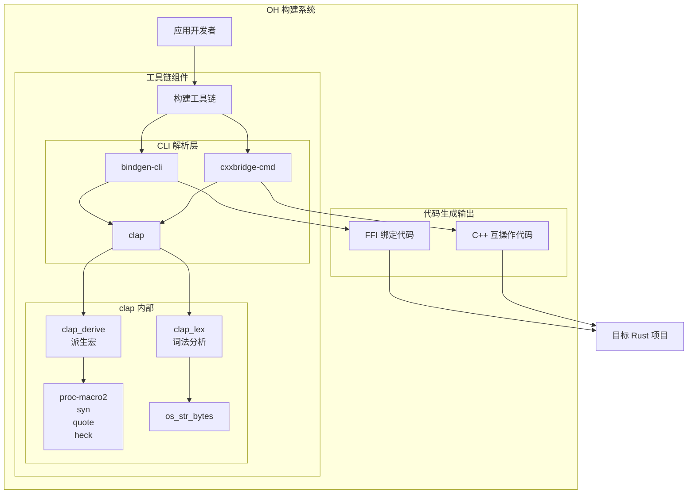
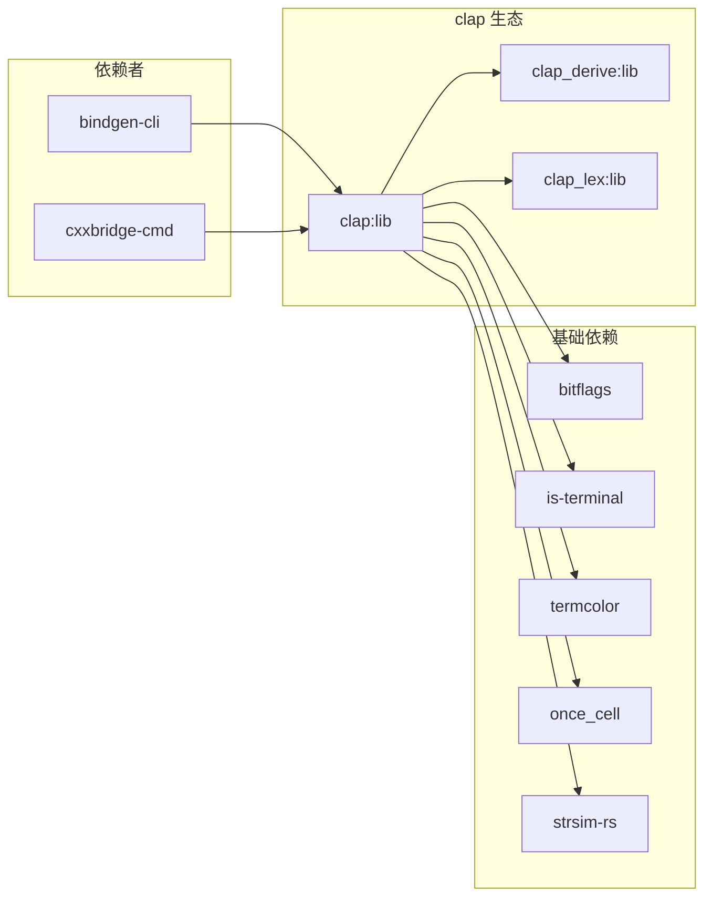

# 04 - OH 中的依赖关系与使用

## 概述

clap 在 OpenHarmony 中是**构建时工具链**的组成部分，不直接参与运行时系统功能。本章详细说明哪些模块依赖 clap，以及它们如何使用。

## 直接依赖者清单

### 当前依赖者

| 模块 | BUILD.gn 路径 | 用途 | 链接方式 |
|------|--------------|------|----------|
| bindgen-cli | `third_party/rust/crates/bindgen/bindgen-cli/BUILD.gn` | FFI 绑定生成器 CLI | 静态链接 |
| cxxbridge-cmd | `third_party/rust/crates/cxx/gen/cmd/BUILD.gn` | C++ 互操作代码生成 | 静态链接 |

### 依赖统计

- **直接依赖者数量**: 2
- **间接依赖者**: 通过 bindgen/cxx 间接使用的项目
- **运行时依赖**: 0 (clap 仅用于构建时工具)

## bindgen-cli 使用详情

### 模块信息

| 属性 | 值 |
|------|-----|
| **名称** | bindgen-cli |
| **版本** | 0.64.0 |
| **功能** | 自动生成 Rust FFI 绑定到 C/C++ 库 |
| **上游** | https://github.com/rust-lang/rust-bindgen |

### BUILD.gn 配置

```gn
ohos_cargo_crate("bindgen") {
  crate_type = "bin"
  crate_root = "main.rs"
  
  deps = [
    "//third_party/rust/crates/bindgen/bindgen:lib",
    "//third_party/rust/crates/clap:lib",    # clap 依赖
    "//third_party/rust/crates/env_logger:lib",
    "//third_party/rust/crates/log:lib",
    "//third_party/rust/crates/shlex:lib",
  ]
  
  features = [
    "env_logger",
    "log",
    "logging",
    "static",
    "which-rustfmt",
  ]
  
  part_name = "rust_bindgen"
  subsystem_name = "thirdparty"
}
```

### 使用 clap 的方式

bindgen-cli 使用 clap 的 **derive API** 定义命令行接口：

```rust
// 简化示例
#[derive(Parser, Debug)]
#[command(name = "bindgen")]
#[command(about = "Automatically generates Rust FFI bindings to C and C++ libraries.")]
struct Options {
    /// The header file to generate bindings for
    #[arg(value_name = "HEADER")]
    input_header: PathBuf,
    
    /// Disable linking to libclang
    #[arg(long)]
    disable_libclang: bool,
    
    /// Generate inline functions
    #[arg(long)]
    generate_inline_functions: bool,
    
    // ... 更多选项
}
```

### 典型使用场景

1. **C/C++ 库绑定生成**
   ```bash
   bindgen input.h -o bindings.rs --enable-cxx-namespaces
   ```

2. **在 GN 构建中调用**
   ```gn
   action("generate_bindings") {
     script = "//build/tools/bindgen.py"
     args = [
       "--header", rebase_path("//third_party/some_lib/include/lib.h"),
       "--output", rebase_path("$target_gen_dir/bindings.rs"),
     ]
   }
   ```

## cxxbridge-cmd 使用详情

### 模块信息

| 属性 | 值 |
|------|-----|
| **名称** | cxxbridge-cmd |
| **版本** | 1.0.130 |
| **功能** | 为 `cxx` crate 生成 C++ 代码 |
| **上游** | https://github.com/dtolnay/cxx |

### BUILD.gn 配置

```gn
if (host_os != "linux" || host_cpu != "arm64") {
  ohos_cargo_crate("cxxbridge") {
    crate_type = "bin"
    crate_root = "src/main.rs"
    
    deps = [
      "//third_party/rust/crates/clap:lib",        # clap 依赖
      "//third_party/rust/crates/codespan/codespan-reporting:lib",
      "//third_party/rust/crates/proc-macro2:lib",
      "//third_party/rust/crates/quote:lib",
      "//third_party/rust/crates/syn:lib",
    ]
    
    part_name = "rust_cxx"
    subsystem_name = "thirdparty"
  }
}
```

### 使用 clap 的方式

cxxbridge-cmd 同样使用 clap 的 derive API：

```rust
#[derive(Parser)]
#[command(name = "cxxbridge")]
#[command(about = "C++ code generator for cxx crate")]
struct Opt {
    /// Input Rust source file
    input: Option<PathBuf>,
    
    /// Output file
    #[arg(short, long)]
    output: Option<PathBuf>,
    
    /// Include directory
    #[arg(short = 'I', value_name = "DIR")]
    include: Vec<PathBuf>,
    
    // ... 更多选项
}
```

### 典型使用场景

1. **生成 C++ 头文件**
   ```bash
   cxxbridge src/lib.rs --header --output include/mylib.h
   ```

2. **生成 C++ 源文件**
   ```bash
   cxxbridge src/lib.rs --output src/mylib.cpp
   ```

## 依赖关系图

### 完整依赖链



### 简化依赖图



## 使用模式分析

### 模式 1: 声明式 CLI (Derive API)

两个依赖者都使用 clap 的 derive API：

```rust
#[derive(Parser)]
struct Cli {
    #[arg(short, long)]
    verbose: bool,
}
```

**优点**:
- 代码简洁，易于维护
- 类型安全，编译时检查
- 自动生成帮助文档

### 模式 2: 构建时工具

clap 仅用于构建阶段，不参与设备运行：

```
构建时 (Host)
    bindgen-cli --> 生成 bindings.rs
    cxxbridge-cmd --> 生成 C++ 代码

运行时 (Target)
    生成的代码运行
    clap 不参与
```

**意义**:
- 不影响运行时包大小
- 不影响运行时性能
- 降低安全风险面

## 潜在扩展使用场景

### 当前未使用但可能受益的场景

| 场景 | 说明 | 可行性 |
|------|------|--------|
| OHPM CLI | 包管理器命令行工具 | 高 |
| DevEco 工具链 | IDE 配套 CLI 工具 | 高 |
| 测试框架 | 测试运行器 CLI | 中 |
| 诊断工具 | 系统诊断命令行工具 | 中 |

### 使用建议

对于需要 CLI 的 Rust 工具，推荐采用 clap：

1. **新工具开发**: 直接使用 clap derive API
2. **现有工具**: 如使用 `structopt` 可迁移至 clap 4.x
3. **脚本替代**: 复杂脚本可改写为 Rust + clap CLI

## 依赖变更影响分析

### 如果 clap 升级...

**影响范围**:
- bindgen-cli: 需验证 CLI 接口兼容性
- cxxbridge-cmd: 需验证 CLI 接口兼容性

**检查清单**:
- [ ] derive API 是否有破坏性变更
- [ ] 特性标志是否更名
- [ ] 依赖的 crate 版本是否兼容

### 如果移除 clap...

**影响**:
- bindgen-cli 和 cxxbridge-cmd 将无法构建
- OH 的 Rust FFI 工作流中断

**结论**: clap 是 Rust 工具链的关键依赖

---

*文档版本: v1.0*
