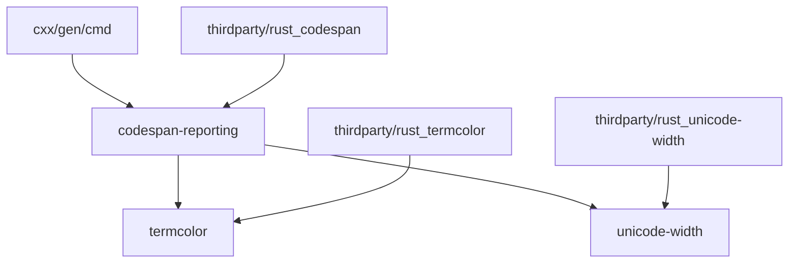

# 依赖关系与使用

## 4.1 直接依赖者

### 4.1.1 依赖者清单

在 OpenHarmony 代码库中，直接依赖 codespan-reporting 的模块如下：

| 模块名称 | BUILD.gn 路径 | 依赖方式 | 主要用途 |
|----------|--------------|----------|----------|
| cxx/gen/cmd | //third_party/rust/crates/cxx/gen/cmd/BUILD.gn | 静态链接 | Rust FFI 代码生成的诊断输出 |

### 4.1.2 依赖详情：cxx/gen/cmd

**cxx** 是一个用于在 Rust 和 C++ 之间建立安全互操作的库。其代码生成工具（gen/cmd）需要输出清晰的编译错误和诊断信息，因此选择使用 codespan-reporting。

**BUILD.gn 中的依赖声明**：

```gn
rustdeps = [
    "//third_party/rust/crates/codespan/codespan-reporting:lib",
    "//third_party/rust/crates/quote:lib",
    "//third_party/rust/crates/proc-macro2:lib",
]
```

**使用方式**：

cxx/gen/cmd 使用 codespan-reporting 的方式包括：

1. **诊断定义**：创建包含错误消息、代码位置和说明的 Diagnostic 对象
2. **文件管理**：通过 SimpleFiles 或自定义 Files 实现管理源文件
3. **终端输出**：使用 termcolor 支持的 StandardStream 输出彩色诊断信息
4. **位置标签**：使用 Label 类型高亮显示错误相关的源代码位置

## 4.2 依赖关系图

### 4.2.1 模块依赖图



### 4.2.2 依赖层次说明

| 层次 | 组件 | 说明 |
|------|------|------|
| 第一层 | cxx/gen/cmd | 直接使用者 |
| 第二层 | codespan-reporting | 诊断报告库 |
| 第三层 | termcolor, unicode-width | 底层支撑库 |

## 4.3 使用场景详解

### 4.3.1 场景描述

codespan-reporting 在 OpenHarmony 中的主要使用场景是 **Rust FFI 代码生成的错误报告**。

当 cxx 的代码生成工具处理 Rust 和 C++ 接口定义时，可能会遇到各种错误情况，例如：

- 接口定义语法错误
- 类型不兼容
- 缺少必要的类型定义
- 宏展开失败

在这些情况下，工具需要向用户输出清晰的错误信息，帮助开发者定位和修复问题。

### 4.3.2 典型使用模式

**创建诊断信息**：

```rust
use codespan_reporting::diagnostic::{Diagnostic, Label};
use codespan_reporting::files::SimpleFiles;
use codespan_reporting::term::termcolor::{ColorChoice, StandardStream};

// 创建文件管理
let mut files = SimpleFiles::new();
let file_id = files.add("interface.rs", source_code);

// 创建诊断
let diagnostic = Diagnostic::error()
    .with_message("type mismatch in interface definition")
    .with_code("E001")
    .with_labels(vec![
        Label::primary(file_id, error_span).with_message("expected `i32`, found `String`"),
    ])
    .with_notes(vec!["consider converting the type appropriately"]);

// 输出诊断
let writer = StandardStream::stderr(ColorChoice::Always);
codespan_reporting::term::emit(&writer.lock(), &config, &files, &diagnostic)?;
```

### 4.3.3 使用优势

在 OpenHarmony 中使用 codespan-reporting 的优势包括：

1. **错误信息质量高**：彩色输出和源码位置高亮显著提升可读性
2. **错误定位精确**：通过 Span 和 Label 机制精确定位错误位置
3. **输出格式规范**：统一的诊断格式便于解析和处理
4. **用户体验一致**：与 Rust 编译器的错误风格一致，降低学习成本

## 4.4 链接方式

### 4.4.1 链接类型

codespan-reporting 在 OpenHarmony 中采用 **静态链接** 方式集成：

| 属性 | 值 |
|------|-----|
| 链接方式 | 静态链接（static） |
| 库类型 | rlib（Rust 静态库） |
| 链接时机 | 编译时链接 |

### 4.4.2 链接说明

静态链接方式意味着：

1. **代码合并**：codespan-reporting 的代码会被链接到最终的可执行文件中
2. **无运行时依赖**：最终产物不依赖单独的 codespan 动态库
3. **体积影响**：可执行文件体积会包含 codespan-reporting 的代码

## 4.5 API 使用参考

### 4.5.1 核心类型

| 类型 | 用途 |
|------|------|
| Diagnostic | 表示一个诊断（错误、警告等） |
| Label | 标记源码中的特定位置 |
| Files trait | 文件系统的抽象接口 |
| SimpleFiles | Files trait 的简单实现 |
| Severity | 诊断严重程度（error、warning、note、help） |

### 4.5.2 关键函数

| 函数 | 用途 |
|------|------|
| Diagnostic::error() | 创建一个错误级别的诊断 |
| Diagnostic::warning() | 创建一个警告级别的诊断 |
| Label::primary() | 创建一个主要标签（错误位置） |
| Label::secondary() | 创建一个次要标签（相关位置） |
| term::emit() | 将诊断输出到终端 |

### 4.5.3 配置选项

| 配置项 | 用途 |
|--------|------|
| Config::tab_width | 制表符宽度 |
| Config::line_endings | 行尾字符设置 |
| Config::styles | 诊断样式配置 |

## 4.6 最佳实践

### 4.6.1 推荐的用法

1. **使用语义化的错误代码**：为不同类型的错误分配唯一的错误代码
2. **提供清晰的错误消息**：消息应该直接说明问题所在
3. **包含修复建议**：通过 notes 提供可能的解决方案
4. **关联相关位置**：使用 secondary labels 显示错误相关的上下文

### 4.6.2 应避免的用法

1. **避免过于笼统的消息**：如「出错了」这样的消息没有帮助
2. **避免过多的标签**：过多的标签会分散注意力
3. **避免歧义的描述**：确保描述只有一种理解方式

## 4.7 未来扩展可能性

### 4.7.1 潜在的新使用者

codespan-reporting 未来可能被以下模块使用：

| 模块 | 可能性 | 用途 |
|------|--------|------|
| Rust 编译器前端 | 中 | Rust 代码的诊断输出 |
| 其他语言工具链 | 中 | 对应语言的错误报告 |
| 静态分析工具 | 低 | 分析结果的展示 |

### 4.7.2 可能的扩展方向

1. **更多输出格式**：支持 JSON、HTML 等输出格式
2. **交互式输出**：支持点击跳转到错误位置
3. **国际化支持**：支持多语言的错误消息

## 4.8 相关文档

- **上游文档**：[codespan-reporting docs.rs](https://docs.rs/codespan-reporting)
- **示例代码**：[上游 examples 目录](https://github.com/brendanzab/codespan/tree/master/codespan-reporting/examples)
- **相关库**：[termcolor](https://crates.io/crates/termcolor)、[unicode-width](https://crates.io/crates/unicode-width)
