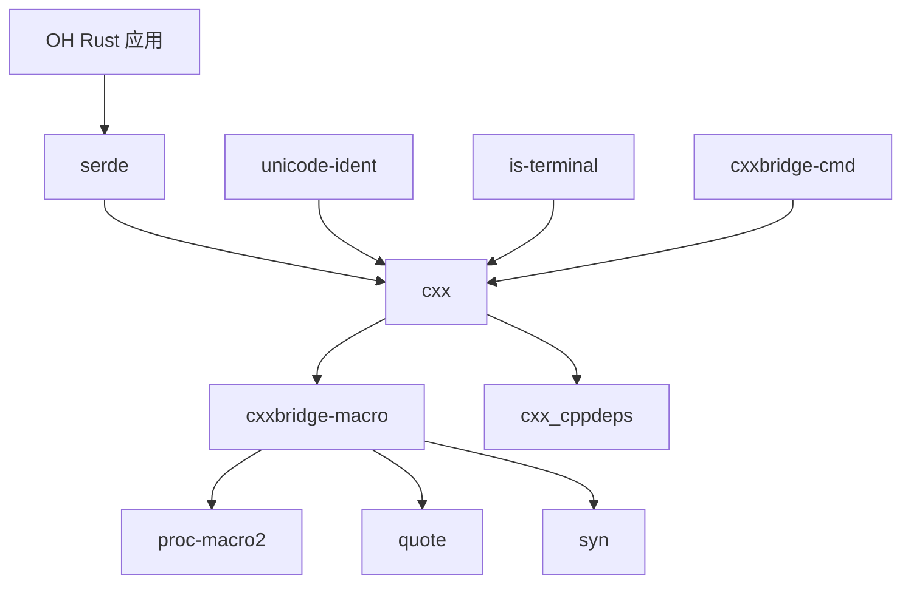
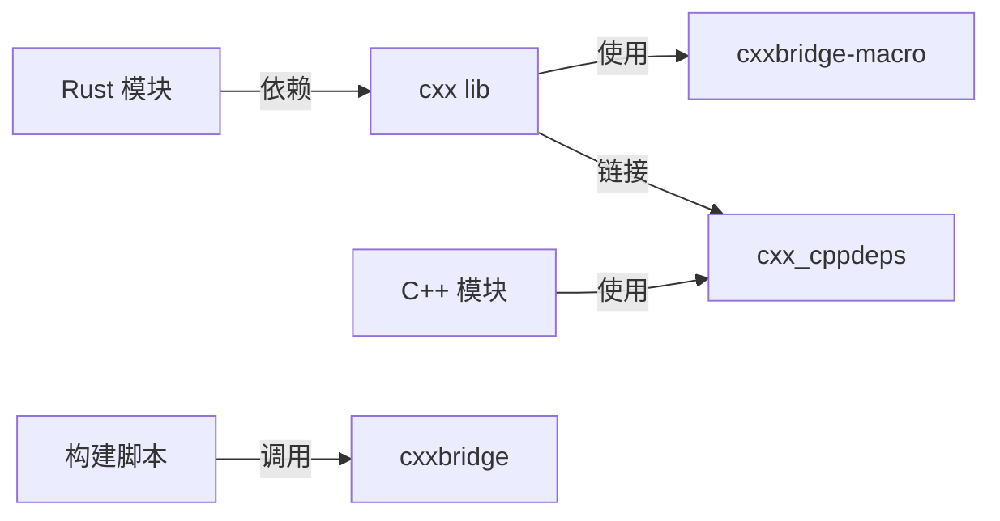

# 依赖关系与使用

## 直接依赖者

### 依赖关系概览

cxx 库作为 OpenHarmony Rust 生态的基础设施，被多个其他 Rust crates 间接依赖。以下是已知的依赖关系：

| OH 模块 | 引用路径 | 用途说明 |
|--------|---------|---------|
| **serde** | third_party/rust/crates/serde | Rust 序列化库的 C++ 互操作支持 |
| **unicode-ident** | third_party/rust/crates/unicode-ident | Unicode 标识符处理 |
| **is-terminal** | third_party/rust/crates/is-terminal | 终端检测功能 |

### 依赖链分析

```
cxx (基础 FFI 库)
├── serde (C++ 互操作层)
│   └── [上层应用]
├── unicode-ident (构建依赖)
│   └── Rust 工具链
└── is-terminal (工具链依赖)
    └── cxxbridge 工具
```

## 使用场景

### 场景 1：Rust crates 的 C++ 集成

**典型模式**：OH 中的 Rust 模块需要调用系统级 C++ 组件

```rust
// OH Rust 模块示例
#[cxx::bridge]
mod sys_bridge {
    unsafe extern "C++" {
        include!("ohos/system_interface.h");
        fn get_system_property(name: &str) -> Result<String, SystemError>;
        fn set_system_property(name: &str, value: &str) -> Result<(), SystemError>;
    }
}
```

### 场景 2：混合语言构建工具

**典型模式**：使用 cxxbridge 命令行工具进行代码生成

```bash
# 非 Cargo 构建系统集成
cxxbridge src/ffi.rs --header > include/ffi.h
cxxbridge src/ffi.rs > src/ffi.cc
```

### 场景 3：Rust 过程宏依赖

**典型模式**：其他 proc-macro crate 依赖 cxxbridge-macro

```toml
# Cargo.toml 示例
[dependencies]
cxx = "1.0.130"  # 通过 cxxbridge-macro 提供宏支持
```

## 对外提供的 Inner Kits

### 组件清单

根据 `bundle.json` 定义，cxx 向 OH 系统提供以下 Inner Kits：

| 组件路径 | 类型 | 说明 |
|---------|------|-----|
| `//third_party/rust/crates/cxx:cxx_cppdeps` | 静态库 | C++ 运行时类型转换支持 |
| `//third_party/rust/crates/cxx:lib` | rlib | Rust 核心 FFI 库 |
| `//third_party/rust/crates/cxx/macro:macro_lib` | 过程宏 | Rust 代码生成宏 |
| `//third_party/rust/crates/cxx/gen/cmd:cxxbridge` | 二进制 | C++ 代码生成工具 |

### 组件使用方式

#### 1. C++ 依赖声明

```gn
# BUILD.gn 示例
ohos_shared_library("my_module") {
  deps += [
    "//third_party/rust/crates/cxx:cxx_cppdeps",  # C++ 运行时
  ]
  public_configs += [
    "//third_party/rust/crates/cxx:cxx_cppdeps_header_config",
  ]
}
```

#### 2. Rust 依赖声明

```toml
# Cargo.toml 示例
[dependencies]
cxx = { path = "//third_party/rust/crates/cxx" }
```

#### 3. 过程宏使用

```rust
// Rust 模块中使用
#[cxx::bridge]
mod ffi {
    // FFI 定义
}
```

#### 4. 命令行工具调用

```gn
# 使用 cxxbridge 进行代码生成
ohos_source_set("generated_ffi") {
  sources = [
    "$target_gen_dir/ffi.cc",
  ]
  deps += [
    "//third_party/rust/crates/cxx/gen/cmd:cxxbridge",
  ]
}
```

## 依赖图

### Rust crates 依赖关系



### OH 模块调用关系



## 编译时依赖

### Rust 依赖树

```
cxx v1.0.130
├── cxxbridge-macro v1.0.130 (proc-macro)
│   ├── proc-macro2 v1.0
│   ├── quote v1.0
│   └── syn v2.0
├── link-cplusplus v1.0.9
└── [build]
    ├── cc v1.0.83
    └── cxxbridge-flags v1.0.130
```

### OH 适配依赖

| OH 组件 | 上游对应 | 用途 |
|--------|---------|------|
| proc-macro2 | proc-macro2 | Rust 词法分析 |
| quote | quote | Rust 代码生成 |
| syn | syn | Rust 代码解析 |
| clap | clap | 命令行参数解析 |
| codespan-reporting | codespan-reporting | 诊断输出 |

## 版本兼容性

### 版本矩阵

| cxx 版本 | Rust 版本要求 | C++ 标准要求 |
|---------|--------------|-------------|
| 1.0.130 | 1.70+ | C++11+ |

### OH 兼容性

| OH 版本 | cxx 版本 | 状态 |
|--------|---------|------|
| 标准系统 | 1.0.130 | ✓ 兼容 |
| 轻量系统 | 1.0.130 | ⚠ 可能需要额外配置 |

## 最佳实践

### 1. 依赖声明

```toml
# 推荐：使用精确版本
[dependencies]
cxx = "=1.0.130"

# 或使用 path 引用
[dependencies]
cxx = { path = "//third_party/rust/crates/cxx" }
```

### 2. C++ 异常处理

```rust
// 如果不需要 C++ 异常传播，使用 Result
#[cxx::bridge]
mod safe_ffi {
    extern "Rust" {
        fn safe_operation() -> Result<Output, Error>;
    }
}
```

### 3. 类型选择

```rust
// 推荐：使用智能指针跨语言传递
#[cxx::bridge]
mod smart_pointer_example {
    unsafe extern "C++" {
        type ManagedHandle;
        fn get_handle() -> UniquePtr<ManagedHandle>;
        fn process(handle: &ManagedHandle);
    }
}
```

## 相关文档

- [01_Overview.md](./01_Overview.md) - 原始库介绍
- [02_Patches.md](./02_Patches.md) - Patch 分析
- [03_Build_Integration.md](./03_Build_Integration.md) - 构建适配详解
