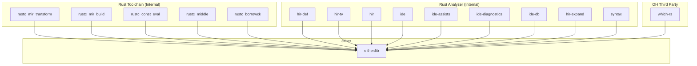

# either - 在 OpenHarmony 中的使用

## 1. 依赖关系概览

### 1.1 依赖图



### 1.2 依赖统计

| 类别 | 数量 | 说明 |
|------|------|------|
| **GN 构建的依赖者** | 1 | which-rs (通过 BUILD.gn deps) |
| **Cargo 构建的依赖者** | 14+ | Rust 工具链组件 (通过 Cargo.toml) |

---

## 2. 直接依赖者详情

### 2.1 which-rs

| 属性 | 值 |
|------|-----|
| **名称** | which-rs |
| **路径** | `third_party/rust/crates/which-rs` |
| **版本** | 4.4.0 |
| **功能** | Unix `which` 命令的 Rust 实现 |
| **依赖方式** | GN 构建，通过 `deps` 声明 |

#### BUILD.gn 依赖声明

```gn
ohos_cargo_crate("lib") {
    crate_name = "which"
    # ...
    deps = [
        "//third_party/rust/crates/either:lib",
        "//third_party/rust/crates/libc:lib",
    ]
}
```

#### Cargo.toml 依赖声明

```toml
[dependencies]
either = "1.6.1"
```

#### 使用场景

`which-rs` 使用 `either` 来处理两种可能的查找结果：

```rust
// 伪代码示例：表示查找成功/失败的不同类型
pub fn which<T: AsRef<OsStr>>(binary_name: T) -> Either<PathBuf, Error> {
    // 查找可执行文件
    // 返回 Left(PathBuf) 或 Right(Error)
}
```

实际用途：
- **OH Previewer**: IDE 工具预览器中查找可执行文件
- **CLI 工具**: 命令行工具中定位程序路径

---

## 3. 间接依赖者 (Rust 工具链)

### 3.1 为什么 Rust 工具链使用 either

Rust 编译器和工具链内部大量使用 `either` 来处理：

1. **MIR 转换**: 不同的转换策略
2. **类型检查**: 类型推导的多种可能
3. **借用检查**: 不同的借用路径
4. **IDE 支持**: 代码分析的多种结果

### 3.2 组件列表

#### Rust 编译器组件

| 组件 | 路径 | 用途 |
|------|------|------|
| rustc_mir_transform | `compiler/rustc_mir_transform` | MIR 优化转换 |
| rustc_mir_build | `compiler/rustc_mir_build` | MIR 构建 |
| rustc_const_eval | `compiler/rustc_const_eval` | 常量求值 |
| rustc_middle | `compiler/rustc_middle` | 中间表示 |
| rustc_borrowck | `compiler/rustc_borrowck` | 借用检查 |

#### Rust Analyzer 组件

| 组件 | 路径 | 用途 |
|------|------|------|
| hir-def | `src/tools/rust-analyzer/crates/hir-def` | HIR 定义 |
| hir-ty | `src/tools/rust-analyzer/crates/hir-ty` | HIR 类型 |
| hir | `src/tools/rust-analyzer/crates/hir` | HIR 核心 |
| hir-expand | `src/tools/rust-analyzer/crates/hir-expand` | 宏展开 |
| ide | `src/tools/rust-analyzer/crates/ide` | IDE 功能 |
| ide-assists | `src/tools/rust-analyzer/crates/ide-assists` | 代码辅助 |
| ide-diagnostics | `src/tools/rust-analyzer/crates/ide-diagnostics` | 诊断 |
| ide-db | `src/tools/rust-analyzer/crates/ide-db` | IDE 数据库 |
| syntax | `src/tools/rust-analyzer/crates/syntax` | 语法分析 |

### 3.3 Cargo.toml 示例

```toml
# rustc_middle/Cargo.toml
[dependencies]
either = "1.5.0"

# hir-def/Cargo.toml
[dependencies]
either = "1.7.0"
```

### 3.4 与 GN 构建的关系

| 方面 | 说明 |
|------|------|
| 构建方式 | Rust 工具链使用 Cargo 构建，不经过 GN |
| 源码共享 | 可能与 OH 的 either 使用相同源码 |
| 版本管理 | 各自管理，可能版本不同 |

---

## 4. 在 OH Previewer 中的使用

### 4.1 Previewer 架构

```
ide/tools/previewer/
├── automock/           # 自动化 Mock
├── jsapp/             # JS 应用支持
├── cli/               # 命令行接口
├── util/              # 工具函数
└── mock/              # Mock 数据
```

### 4.2 which-rs 在 Previewer 中的作用

```rust
// 在 Previewer 中查找模拟器/工具路径
use which::which;

pub fn find_simulator() -> Result<PathBuf, Error> {
    which("simulator").map_err(|e| Error::NotFound(e))
}
```

### 4.3 依赖关系

```
previewer
  ├── which-rs
  │     └── either (用于结果处理)
  ├── libc
  └── ...
```

---

## 5. 使用场景总结

### 5.1 典型使用模式

#### 模式 1：统一迭代器类型

```rust
use either::Either;

// 根据条件返回不同类型的迭代器
fn get_lines(source: Source) -> Either<FileLines, VecLines> {
    match source {
        Source::File(path) => Either::Left(FileLines::new(path)),
        Source::Memory(lines) => Either::Right(lines.into_iter()),
    }
}

// 统一处理
for line in get_lines(source) {
    process(line);
}
```

#### 模式 2：统一错误类型

```rust
use either::Either;

// 两种可能的错误类型
type AppError = Either<IoError, ParseError>;

fn do_something() -> Result<(), AppError> {
    let data = read_file().map_err(Either::Left)?;
    let parsed = parse(data).map_err(Either::Right)?;
    Ok(parsed)
}
```

#### 模式 3：配置选项

```rust
use either::Either;

// 两种可能的配置
type Config = Either<DebugConfig, ReleaseConfig>;

fn apply_config(config: Config) {
    either::for_both!(config, c => {
        c.apply();
    });
}
```

### 5.2 在 OH 中的具体用途

| 用途 | 组件 | 说明 |
|------|------|------|
| 路径查找 | which-rs | 查找可执行文件 |
| 编译器内部 | rustc_* | MIR/类型处理 |
| IDE 支持 | rust-analyzer | 代码分析 |

---

## 6. 依赖管理建议

### 6.1 版本一致性

建议保持 OH 集成的 either 版本与 Rust 工具链使用的版本兼容：

| 位置 | 当前版本 | 建议 |
|------|---------|------|
| OH BUILD.gn | 1.8.1 | 保持 |
| Rust 编译器 | 1.x | 可兼容 |
| rust-analyzer | 1.7.0 | 可兼容 |

### 6.2 升级策略

1. **检查工具链版本**: 查看 Rust 工具链使用的 either 版本
2. **API 兼容性**: 确认 1.x 版本的 API 兼容性
3. **同步升级**: 考虑与工具链一起升级

### 6.3 依赖检查清单

```bash
# 检查哪些组件依赖 either
grep -r "either" third_party/rust --include="Cargo.toml" | grep -v "either express"

# 检查 GN 依赖
grep -r "either:lib" third_party/rust --include="BUILD.gn"
```

---

## 7. 移除影响评估

### 7.1 如果移除 either 库

| 影响 | 程度 | 说明 |
|------|------|------|
| which-rs | **高** | 需要重写，移除 either 依赖 |
| Rust 工具链 | **极高** | 无法构建，编译器依赖 |
| OH 系统 | **中** | Previewer 功能受影响 |

### 7.2 替换方案

理论上可以用以下方式替换 either：

1. **自定义枚举**: 为每个使用场景定义专用枚举
2. **Result 类型**: 使用 `Result<L, R>` (语义不同)
3. **Box<dyn Trait>**: 使用 trait object (有运行时开销)

**不建议替换**: either 提供了零开销的抽象，且已被广泛依赖。

---

## 8. 总结

| 指标 | 数值/状态 |
|------|----------|
| **GN 直接依赖者** | 1 (which-rs) |
| **Cargo 依赖者** | 14+ (Rust 工具链) |
| **主要使用场景** | 路径查找、编译器内部 |
| **系统重要性** | 高 (工具链依赖) |
| **维护复杂度** | 低 |

**结论**: either 在 OpenHarmony 中主要作为**基础设施库**使用，被 which-rs 直接依赖，同时是 Rust 工具链的必要组件。虽然 GN 构建的直接依赖者较少，但其作为工具链依赖的重要性不可忽视。
