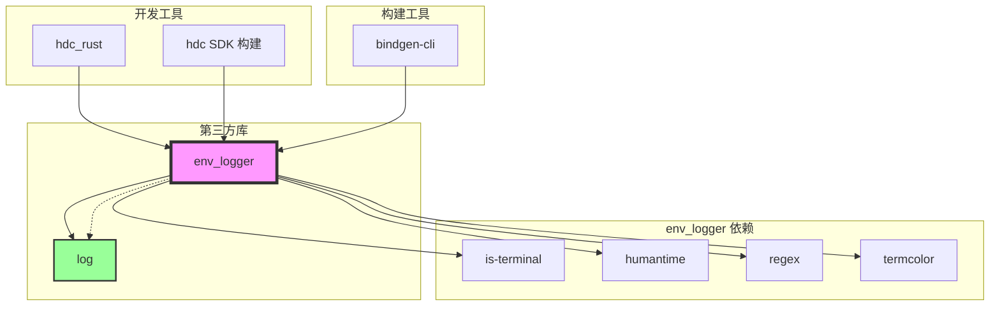
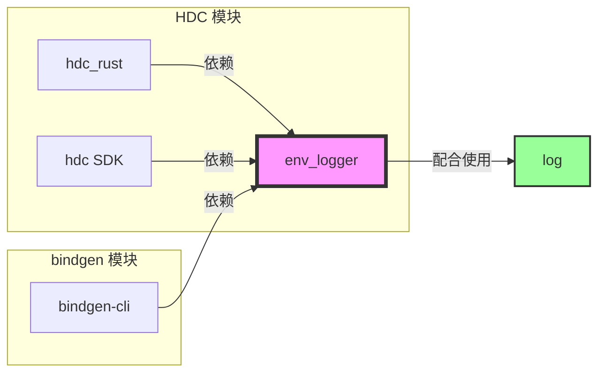

# 依赖关系与使用

> env_logger 在 OpenHarmony 中的使用场景和依赖关系

---

## 概述

env_logger 在 OpenHarmony 中主要用于 **开发和构建工具** 的日志输出。它是一个纯 Rust 实现的日志库，与 `log` crate 配合使用，提供灵活的环境变量配置能力。

**使用特点**：
- ✅ 轻量级，无复杂依赖
- ✅ 环境变量配置，易于使用
- ✅ 适合 CLI 工具和开发工具
- ❌ 不适合应用生产环境日志

---

## 直接依赖者

### 依赖者清单

在 OpenHarmony 代码库中，共有 **3 个模块**依赖 env_logger：

| 模块 | BUILD.gn 路径 | 引用行 | 类型 | 用途 |
|------|--------------|--------|------|------|
| hdc_rust | developtools/hdc/hdc_rust/BUILD.gn | 62 | Rust 可执行文件 | HDC 设备端守护进程（hdcd） |
| hdc | developtools/hdc/BUILD.gn | 305 | SDK 构建目标 | SDK 构建时的 hdcd |
| bindgen-cli | third_party/rust/crates/bindgen/bindgen-cli/BUILD.gn | 30 | Rust 可执行文件 | Rust FFI 绑定生成工具 |

### 依赖者详细分析

#### 1. hdc_rust（HDC 设备端守护进程）

**路径**：`developtools/hdc/hdc_rust/`

**BUILD.gn 配置**：
```gn
ohos_rust_executable("hdcd") {
    sources = ["src/daemon/main.rs"]
    edition = "2021"

    deps = [
        "//third_party/rust/crates/env_logger:lib",
        "//third_party/rust/crates/humantime:lib",
        "//third_party/rust/crates/log:lib",
        # ... 其他依赖
    ]
}
```

**用途**：
- HDC（OpenHarmony Device Connector）是 OpenHarmony 的设备连接与调试工具
- hdc_rust 实现了纯 Rust 版本的设备端守护进程（hdcd）
- 用于设备与开发机的通信和调试

**日志使用场景**：

```rust
use log::{info, debug, error};

fn main() {
    env_logger::init();

    info!("HDC 守护进程启动");
    debug!("监听端口: {}", PORT);

    match connect_device() {
        Ok(_) => info!("设备连接成功"),
        Err(e) => error!("设备连接失败: {}", e),
    }
}
```

**日志级别建议**：

| 级别 | 用途 | 示例 |
|------|------|------|
| `error` | 连接失败、致命错误 | `error!("无法连接设备: {}", e)` |
| `warn` | 非致命问题、重试 | `warn!("连接超时，正在重试...")` |
| `info` | 关键操作状态 | `info!("设备已连接: {}", device_id)` |
| `debug` | 详细调试信息 | `debug!("收到数据包: {:?}", packet)` |

#### 2. hdc（HDC 主模块）

**路径**：`developtools/hdc/`

**BUILD.gn 配置**：
```gn
# 在构建 ohos-sdk 时使用
ohos_rust_executable("hdcd_${image_name}_exe") {
    edition = "2021"
    sources = ["../hdc_rust/src/daemon/main.rs"]

    deps = [
        "//third_party/rust/crates/env_logger:lib",
        "//third_party/rust/crates/humantime:lib",
        "//third_party/rust/crates/log:lib",
        # ... 其他依赖
    ]
}
```

**用途**：
- 在构建 ohos-sdk 产品时，使用 Rust 版本的 hdcd
- 用于开发和测试环境

**日志使用场景**：
与 hdc_rust 相同，但主要用于 SDK 构建和测试

#### 3. bindgen-cli（Rust FFI 绑定生成工具）

**路径**：`third_party/rust/crates/bindgen/bindgen-cli/`

**BUILD.gn 配置**：
```gn
ohos_rust_executable("bindgen") {
    edition = "2021"
    sources = ["src/main.rs"]

    deps = [
        "//third_party/rust/crates/bindgen/bindgen:lib",
        "//third_party/rust/crates/clap:lib",
        "//third_party/rust/crates/env_logger:lib",
        "//third_party/rust/crates/log:lib",
        # ... 其他依赖
    ]

    features = [
        "env_logger",  # 启用 env_logger 集成
        "log",
        "logging",
    ]
}
```

**用途**：
- bindgen 是一个自动将 C/C++ 头文件转换为 Rust FFI 绑定的工具
- env_logger 用于输出绑定生成过程中的日志

**日志使用场景**：

```rust
use log::{info, debug, warn};

fn main() {
    env_logger::init();

    info!("开始生成 Rust 绑定");
    debug!("解析头文件: {}", header_path);

    match generate_bindings() {
        Ok(bindings) => {
            info!("绑定生成成功");
            debug!("生成 {} 个绑定", bindings.len());
        }
        Err(e) => {
            warn!("绑定生成失败: {}", e);
        }
    }
}
```

**日志级别建议**：

| 级别 | 用途 | 示例 |
|------|------|------|
| `error` | 绑定生成失败 | `error!("无法解析头文件: {}", path)` |
| `warn` | 警告信息 | `warn!("忽略无法解析的类型: {:?}", ty)` |
| `info` | 进度信息 | `info!("已处理 {}/{} 个定义", current, total)` |
| `debug` | 详细解析信息 | `debug!("解析类型: {:?}", type_info)` |

---

## 依赖关系图

### 整体依赖图



### 模块间依赖



---

## 使用方式

### 1. 在 BUILD.gn 中添加依赖

#### 基础配置

```gn
ohos_rust_executable("my_app") {
    sources = ["src/main.rs"]
    edition = "2021"

    deps = [
        "//third_party/rust/crates/env_logger:lib",
        "//third_party/rust/crates/log:lib",  # 必须同时依赖 log
    ]

    features = []
}
```

#### Rust 库配置

```gn
ohos_rust_crate("my_lib") {
    crate_name = "my_lib"
    crate_type = "rlib"
    crate_root = "src/lib.rs"
    edition = "2021"

    deps = [
        "//third_party/rust/crates/env_logger:lib",
        "//third_party/rust/crates/log:lib",
    ]

    features = []
}
```

### 2. 代码中使用

#### 基础用法

```rust
use log::{info, debug, warn, error};

fn main() {
    // 初始化 logger（必须在 main 函数开始时调用）
    env_logger::init();

    info!("应用程序启动");

    // 在任何地方使用日志宏
    debug!("调试信息: {}", x);
    warn!("警告信息");
    error!("错误信息");
}
```

#### 自定义配置

```rust
use env_logger::{Builder, Env};
use log::info;

fn main() {
    // 使用 Builder 自定义配置
    env_logger::Builder::from_env(Env::default().default_filter_or("info"))
        .init();

    info!("使用默认 info 级别");
}
```

#### 自定义格式

```rust
use env_logger::{Builder, WriteStyle};
use log::info;

fn main() {
    env_logger::Builder::new()
        .format(|buf, record| {
            writeln!(
                buf,
                "[{} {}] {}",
                record.level(),
                record.target(),
                record.args()
            )
        })
        .write_style(WriteStyle::Always)
        .init();

    info!("自定义格式日志");
}
```

### 3. 环境变量配置

#### RUST_LOG 语法

```bash
# 基础语法
RUST_LOG=[target][=][level][,...]
```

#### 常用配置

```bash
# 启用所有 info 级别日志
RUST_LOG=info

# 启用特定模块的 debug 日志
RUST_LOG=my_crate=debug

# 全局 error + 特定模块 debug
RUST_LOG=error,my_crate=debug

# 启用所有日志（包括 trace）
RUST_LOG=trace

# 关闭所有日志
RUST_LOG=off

# 关闭特定模块日志
RUST_LOG=off,other_module=info
```

#### 高级用法

```bash
# 使用正则表达式过滤
RUST_LOG=my_crate/.*error.*/info

# 多模块组合
RUST_LOG=module1=debug,module2=info,module3=error

# 使用通配符
RUST_LOG=hdc*=info
```

### 4. 在测试中使用

```rust
#[cfg(test)]
mod tests {
    use log::info;
    use env_logger::builder;

    fn init_logger() {
        let _ = builder().is_test(true).try_init();
    }

    #[test]
    fn test_something() {
        init_logger();
        info!("测试日志");
        assert!(true);
    }
}
```

---

## 使用场景分析

### 场景 1：HDC 设备调试

**需求**：调试设备连接问题

**配置**：
```bash
# 启用 debug 级别日志
RUST_LOG=hdc_rust=debug
```

**日志输出**：
```
[2024-01-18T10:30:00Z DEBUG hdc_rust] 尝试连接设备: 192.168.1.100:8710
[2024-01-18T10:30:01Z INFO hdc_rust] 设备连接成功: device_123
[2024-01-18T10:30:02Z DEBUG hdc_rust] 收到数据包: Packet { cmd: Connect, ... }
```

### 场景 2：bindgen 绑定生成

**需求**：查看绑定生成过程

**配置**：
```bash
# 启用 info 级别日志
RUST_LOG=bindgen=info
```

**日志输出**：
```
[2024-01-18T10:30:00Z INFO bindgen] 开始解析头文件: /path/to/header.h
[2024-01-18T10:30:01Z INFO bindgen] 已解析 100 个类型定义
[2024-01-18T10:30:02Z INFO bindgen] 生成 Rust 绑定完成
```

### 场景 3：生产环境调试

**需求**：最小化日志输出

**配置**：
```bash
# 仅输出 error 级别日志
RUST_LOG=error
```

**日志输出**：
```
[2024-01-18T10:30:00Z ERROR my_app] 连接失败: Connection timed out
```

---

## 最佳实践

### 1. 日志级别选择

| 场景 | 推荐级别 | 说明 |
|------|----------|------|
| 开发调试 | `debug` 或 `trace` | 详细日志用于问题诊断 |
| 正常使用 | `info` | 适度信息，不影响性能 |
| 生产环境 | `warn` 或 `error` | 仅输出重要信息 |

### 2. 模块化日志

```rust
use log::{info, debug};

// 为不同模块使用不同的日志目标
mod network {
    pub fn connect() {
        info!("network::connect: 连接到服务器");
    }
}

mod storage {
    pub fn save() {
        info!("storage::save: 保存数据");
    }
}
```

**配置**：
```bash
# 仅启用 network 模块的 debug 日志
RUST_LOG=network=debug
```

### 3. 性能考虑

```rust
use log::debug;

// 使用 log_enabled! 宏避免不必要的字符串格式化
if log_enabled!(log::Level::Debug) {
    let expensive = expensive_calculation();
    debug!("结果: {}", expensive);
}
```

### 4. 错误处理

```rust
use log::error;

fn do_something() -> Result<(), MyError> {
    match perform_operation() {
        Ok(result) => Ok(result),
        Err(e) => {
            error!("操作失败: {}", e);
            Err(e)
        }
    }
}
```

---

## 典型使用模式

### 模式 1：初始化即运行

```rust
use log::info;

fn main() {
    // 在 main 函数开始时初始化
    env_logger::init();

    info!("应用程序启动");
    // ... 应用程序逻辑
}
```

### 模式 2：可配置初始化

```rust
use env_logger::{Builder, Env};
use log::info;

fn main() {
    // 从环境变量读取，提供默认值
    env_logger::Builder::from_env(Env::default().default_filter_or("info"))
        .init();

    info!("应用程序启动");
}
```

### 模式 3：Builder 配置

```rust
use env_logger::Builder;
use log::info;

fn main() {
    Builder::new()
        .filter_level(log::LevelFilter::Info)
        .format(|buf, record| {
            writeln!(buf, "[{}] {}", record.level(), record.args())
        })
        .init();

    info!("应用程序启动");
}
```

---

## 与 OH HiLog 的对比

| 维度 | env_logger | OH HiLog |
|------|------------|----------|
| 适用场景 | CLI 工具、开发工具 | 应用程序、系统服务 |
| 日志存储 | 输出到 stdout/stderr | 持久化到文件系统 |
| 日志查询 | grep 文件 | `hilog` 工具查询 |
| 配置方式 | 环境变量 | HiLog API |
| 系统集成 | 无 | 深度集成 OH 日志系统 |
| 跨进程 | 不支持 | 支持 |
| 日志级别 | 5 级（error, warn, info, debug, trace） | 4 级（FATAL, ERROR, WARN, INFO, DEBUG） |

**建议**：
- **开发工具、CLI 工具**：使用 env_logger
- **应用程序、系统服务**：使用 OH HiLog

---

## 故障排查

### 问题 1：日志不输出

**原因**：
- 环境变量 `RUST_LOG` 未设置
- 日志级别设置过高

**解决**：
```bash
# 检查环境变量
echo $RUST_LOG

# 设置环境变量
export RUST_LOG=info
```

### 问题 2：日志输出没有颜色

**原因**：
- `auto-color` feature 未启用
- 输出到文件或管道

**解决**：
```gn
# 在 BUILD.gn 中启用
features = [
    "auto-color",
]
```

### 问题 3：性能问题

**现象**：大量日志导致性能下降

**原因**：日志级别过低，输出过多

**解决**：
```bash
# 提高日志级别
export RUST_LOG=info  # 而不是 debug 或 trace
```

---

## 总结

### 关键点

1. **3 个依赖模块**：hdc_rust、hdc、bindgen-cli
2. **主要用途**：开发和构建工具的日志输出
3. **配置方式**：通过 `RUST_LOG` 环境变量
4. **依赖关系**：必须同时依赖 `env_logger` 和 `log`

### 使用建议

- ✅ 适合：CLI 工具、开发工具、调试程序
- ❌ 不适合：生产环境应用、需要持久化日志的场景
- ⚠️ 注意：env_logger 不支持 OH HiLog 的特性

### 维护要点

| 任务 | 说明 |
|------|------|
| 监控依赖 | 关注依赖 env_logger 的模块 |
| 测试验证 | 升级后测试所有依赖模块的日志功能 |
| 文档更新 | 更新使用文档和最佳实践 |

---

**文档版本**：1.0
**更新时间**：2026-02-08
**评估版本**：env_logger v0.10.2
