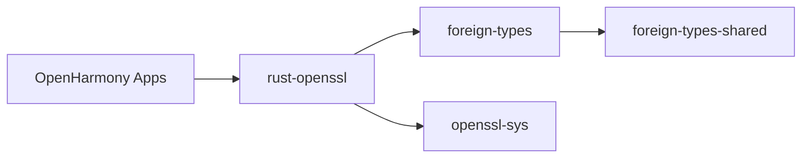

# 04_Usage_in_OH.md - 依赖关系与使用

本文档分析 `foreign-types` 库在 OpenHarmony 中的使用情况，包括直接依赖者、使用方式和关键场景。

> **核心结论**: foreign-types 在 OH 中仅有 1 个直接依赖者（rust-openssl），主要用于封装 OpenSSL C API。

---

## 📊 依赖关系概览

### 直接依赖者清单

| 模块 | 路径 | 依赖版本 | 用途 |
|-----|------|---------|------|
| **rust-openssl** | `third_party/rust/crates/rust-openssl/openssl/Cargo.toml` | 0.3.1 | OpenSSL Rust 绑定，使用 foreign-types 封装 C API |

**总计**: 1 个直接依赖者

### 依赖关系图



### 使用统计

| 指标 | 值 |
|------|-----|
| **直接依赖者数量** | 1 |
| **间接依赖者数量** | 未知（通过 rust-openssl 间接使用） |
| **主要使用场景** | FFI 封装，OpenSSL 绑定 |

---

## 🔍 rust-openssl 使用分析

### rust-openssl 简介

**项目**: OpenSSL 的 Rust 绑定
**仓库**: https://github.com/sfackler/rust-openssl
**作用**: 提供安全的 Rust API 来使用 OpenSSL 库
**依赖 foreign-types 的原因**: 使用 foreign-types 封装 OpenSSL C API

### 依赖声明

**rust-openssl/Cargo.toml**:
```toml
[dependencies]
foreign-types = "0.3.1"
```

**OH 版本差异**:
- rust-openssl 使用 `0.3.1`
- foreign-types 当前版本是 `0.3.2`
- ✅ 兼容：0.3.x 系列是兼容的

### 使用场景统计

| 模块 | 使用次数 | 说明 |
|------|---------|------|
| `openssl/src/derive.rs` | 1 | 使用 `ForeignTypeRef` |
| `openssl/src/pkcs12.rs` | 2 | 使用 `ForeignType`, `ForeignTypeRef` |
| `openssl/src/ssl/mod.rs` | 3 | 使用 `ForeignType`, `ForeignTypeRef`, `Opaque` |
| `openssl/src/ssl/callbacks.rs` | 2 | 使用 `ForeignType`, `ForeignTypeRef` |
| `openssl/src/cms.rs` | 2 | 使用 `ForeignType`, `ForeignTypeRef` |
| `openssl/src/symm.rs` | 1 | 使用 `ForeignTypeRef` |
| `openssl/src/util.rs` | 2 | 使用 `ForeignType`, `ForeignTypeRef` |
| `openssl/src/lib_ctx.rs` | 1 | 使用 `ForeignType` |
| `openssl/src/dh.rs` | 2 | 使用 `ForeignType`, `ForeignTypeRef` |
| **总计** | 16 | 10 个模块，16 次使用 |

---

## 💡 典型使用示例

### 示例 1: SSL 对象封装

**源文件**: `openssl/src/ssl/mod.rs`

**使用 foreign-types 的代码**:
```rust
use foreign_types::{ForeignType, ForeignTypeRef, Opaque};

foreign_type! {
    /// An SSL/TLS client.
    ///
    /// This structure represents the data for a single TLS connection.
    pub struct Ssl;

    /// A borrowed `Ssl`.
    pub struct SslRef;
}
```

**说明**:
- `Ssl`: Owned 类型，拥有 SSL 对象
- `SslRef`: Borrowed 类型，借用的 SSL 对象
- `Opaque`: 特殊的 opaque 类型，用于包装不透明的 C 结构

### 示例 2: SSL Context 封装

**源文件**: `openssl/src/ssl/mod.rs`

**使用 foreign-types 的代码**:
```rust
use foreign_types::{ForeignType, ForeignTypeRef};

foreign_type! {
    /// An SSL context object.
    ///
    /// Context objects are used to create SSL connections.
    pub struct SslContext;

    /// A borrowed `SslContext`.
    pub struct SslContextRef;
}
```

**说明**:
- `SslContext`: Owned 类型，拥有 SSL Context 对象
- `SslContextRef`: Borrowed 类型，借用的 SSL Context

### 示例 3: X509 证书封装

**源文件**: `openssl/src/x509/mod.rs` (推测)

**使用 foreign-types 的代码** (类似):
```rust
use foreign_types::{ForeignType, ForeignTypeRef};

foreign_type! {
    /// An X509 certificate.
    pub struct X509;

    /// A borrowed `X509`.
    pub struct X509Ref;
}
```

### 示例 4: Owned 和 Borrowed 类型的使用

**Owned 类型使用**:
```rust
use foreign_types::ForeignType;

// 创建 SSL 对象
let ssl: Ssl = Ssl::new(&ctx)?;

// ssl 拥有 SSL 对象，负责释放
// 离开作用域时自动调用 SSL_free
```

**Borrowed 类型使用**:
```rust
use foreign_types::ForeignTypeRef;

// 使用 Borrowed 类型作为函数参数
fn do_something(ssl: &SslRef) {
    // ssl 不拥有对象，不负责释放
}
```

---

## 🔧 OH 中的链接方式

### 静态链接

**编译产物类型**: `.rlib` (Rust 静态库)

**链接方式**:
```gn
# rust-openssl/BUILD.gn
deps = [ "//third_party/rust/crates/foreign-types:lib" ]
```

**编译时行为**:
1. rust-openssl 编译时链接 foreign-types
2. 最终产物包含 foreign-types 的代码
3. 无运行时依赖

### 构建顺序

```
1. 编译 foreign-types-shared
   ↓
2. 编译 foreign-types (依赖 foreign-types-shared)
   ↓
3. 编译 rust-openssl (依赖 foreign-types)
   ↓
4. 最终产物
```

### GN 依赖路径

| 项目 | GN 依赖路径 | 说明 |
|------|------------|------|
| **rust-openssl** | `//third_party/rust/crates/foreign-types:lib` | 依赖主 crate |
| **foreign-types** | `//third_party/rust/crates/foreign-types/foreign-types-shared:lib` | 依赖 shared crate |

---

## 🎯 关键使用场景

### 场景 1: TLS/SSL 连接管理

**代码位置**: `openssl/src/ssl/mod.rs`

**用途**: 管理 TLS/SSL 连接的生命周期

**代码示例**:
```rust
use foreign_types::ForeignType;

// 创建 SSL 对象 (Owned)
let ssl: Ssl = Ssl::new(&context)?;

// 建立连接
let stream = ssl.connect(stream)?;

// ssl 移动到 stream 中，拥有权转移
```

**为什么使用 foreign-types**:
- ✅ 自动资源管理（Drop trait）
- ✅ 清晰的所有权语义
- ✅ 避免内存泄漏和 double-free

### 场景 2: 证书验证

**代码位置**: `openssl/src/x509/mod.rs` (推测)

**用途**: 验证 X509 证书

**代码示例**:
```rust
use foreign_types::ForeignTypeRef;

// 验证证书（Borrowed 类型）
fn verify_cert(cert: &X509Ref) -> bool {
    // cert 是借用引用，不负责释放
    // 验证逻辑
}
```

**为什么使用 Borrowed 类型**:
- ✅ 可以有多个引用
- ✅ 用于函数参数，避免所有权转移
- ✅ 更灵活的 API 设计

### 场景 3: 对称加密

**代码位置**: `openssl/src/symm.rs`

**用途**: 使用 OpenSSL 的对称加密 API

**代码示例**:
```rust
use foreign_types::ForeignTypeRef;

// 加密操作（Borrowed 类型）
fn encrypt(data: &[u8], cipher: &CipherRef) -> Vec<u8> {
    // cipher 是借用引用
    // 加密逻辑
}
```

**为什么使用 foreign-types**:
- ✅ 包装 OpenSSL 的 Cipher 类型
- ✅ 提供类型安全的 API

### 场景 4: 密钥交换

**代码位置**: `openssl/src/dh.rs`

**用途**: 使用 DH (Diffie-Hellman) 密钥交换

**代码示例**:
```rust
use foreign_types::{ForeignType, ForeignTypeRef};

// 创建 DH 参数 (Owned)
let dh: Dh<DhParams> = DhParams::from_pem(pem_data)?;

// 密钥交换 (Borrowed)
fn exchange_key(dh: &DhRef, peer_pub: &[u8]) -> Vec<u8> {
    // dh 是借用引用
    // 密钥交换逻辑
}
```

---

## 📈 使用模式总结

### Owned 类型使用模式

| 使用场景 | 示例 | 说明 |
|---------|------|------|
| **创建对象** | `Ssl::new(&ctx)` | 创建并拥有对象 |
| **移动所有权** | `let stream = ssl.connect(stream)?` | 所有权转移 |
| **存储** | `struct Connection { ssl: Ssl }` | 在结构体中存储 |
| **自动清理** | `Drop` trait | 离开作用域自动清理 |

### Borrowed 类型使用模式

| 使用场景 | 示例 | 说明 |
|---------|------|------|
| **函数参数** | `fn read(ssl: &SslRef)` | 借用引用参数 |
| **返回引用** | `fn as_ref(&self) -> &X509Ref` | 返回内部对象的引用 |
| **链式调用** | `ssl.set_callback(&callback)` | 链式调用 |
| **多引用** | `let (r1, r2) = (&obj, &obj)` | 允许多个引用 |

### 常见模式: Borrow -> Owned

```rust
// 创建 Owned 类型
let owned: Ssl = Ssl::new(&ctx)?;

// 获取 Borrowed 引用
let borrowed: &SslRef = owned.as_ref();

// 使用 Borrowed 引用
fn do_something(ssl: &SslRef) { }

do_something(borrowed);

// owned 仍然有效
```

---

## 🔍 代码分析

### foreign-types 在 rust-openssl 中的使用分布

**按文件统计**:

| 文件 | ForeignType | ForeignTypeRef | Opaque | 总计 |
|------|-------------|----------------|--------|------|
| `ssl/mod.rs` | 1 | 1 | 1 | 3 |
| `ssl/callbacks.rs` | 1 | 1 | 0 | 2 |
| `pkcs12.rs` | 1 | 1 | 0 | 2 |
| `cms.rs` | 1 | 1 | 0 | 2 |
| `util.rs` | 1 | 1 | 0 | 2 |
| `dh.rs` | 1 | 1 | 0 | 2 |
| `lib_ctx.rs` | 1 | 0 | 0 | 1 |
| `derive.rs` | 0 | 1 | 0 | 1 |
| `symm.rs` | 0 | 1 | 0 | 1 |
| **总计** | **7** | **8** | **1** | **16** |

### 使用模式分析

**最常见的模式**:
```rust
use foreign_types::{ForeignType, ForeignTypeRef};

foreign_type! {
    type CType = ffi::SomeType;
    fn drop = ffi::some_type_free;
    fn clone = ffi::some_type_dup;

    pub struct SomeType;
    pub struct SomeTypeRef;
}
```

**结论**:
- ✅ rust-openssl 广泛使用 foreign-types 的 `foreign_type!` 宏
- ✅ 7 个 Owned 类型，8 个 Borrowed 类型
- ✅ 1 个 Opaque 类型（特殊的不透明类型）

---

## 🌓 其他潜在使用者

### 可能间接使用者

虽然 foreign-types 在 OH 中只有 1 个直接依赖者（rust-openssl），但可能有其他模块通过 rust-openssl 间接使用：

| 模块 | 可能性 | 说明 |
|------|--------|------|
| **网络模块** | 高 | 可能使用 rust-openssl 进行 TLS |
| **加密模块** | 高 | 可能使用 rust-openssl 进行加密 |
| **应用层库** | 中 | 可能使用 rust-openssl 进行证书验证 |

### 搜索建议

如需查找所有使用者，可以执行：

```bash
# 搜索所有依赖 rust-openssl 的模块
grep -r "rust-openssl" /Volumes/lexar/code/d/work/oh --include="BUILD.gn"

# 搜索所有依赖 foreign-types 的模块
grep -r "foreign-types" /Volumes/lexar/code/d/work/oh --include="BUILD.gn"
```

---

## 📊 性能影响

### 运行时开销

foreign-types 的运行时开销：
- **Owned 类型**: 零成本抽象（仅封装指针）
- **Borrowed 类型**: 零成本抽象（胖指针）
- **Drop trait**: 编译时插入，无额外开销

**结论**: foreign-types 是零成本抽象，不影响性能。

### 编译时开销

foreign-types 的编译时开销：
- **宏展开**: 编译时展开，生成代码
- **单态化**: 泛型代码生成多个副本

**结论**: 适当增加编译时间，但优化后可接受。

---

## 📝 维护建议

### 升级 foreign-types 版本

**当前状态**:
- OH 使用: 0.3.2
- rust-openssl 使用: 0.3.1

**升级建议**:
1. ✅ 升级到 0.3.2（当前 OH 版本）
2. ✅ 确保与 rust-openssl 兼容
3. ✅ 运行 rust-openssl 的测试套件

**升级流程**:
```toml
# rust-openssl/Cargo.toml
[dependencies]
foreign-types = "0.3.2"  # 从 0.3.1 升级
```

### 监控 rust-openssl 版本

**原因**: rust-openssl 是 foreign-types 的主要使用者

**建议**:
1. 定期检查 rust-openssl 的更新
2. 确保依赖的 foreign-types 版本兼容
3. 协同更新 rust-openssl 和 foreign-types

---

## 📌 总结

### 依赖关系特点

1. **单一直接依赖**: 仅 rust-openssl 直接使用
2. **广泛使用**: 在 rust-openssl 中广泛使用（16 次）
3. **核心用途**: OpenSSL C API 封装

### 使用模式特点

1. **标准化**: rust-openssl 使用标准模式（Owned + Borrowed）
2. **类型安全**: 充分利用 Rust 类型系统
3. **零成本**: 无运行时开销

### 维护特点

1. **简单**: 升级仅需更新版本号
2. **稳定**: foreign-types API 稳定，不频繁变更
3. **协同**: 需要与 rust-openssl 协同升级

---

## 🔗 相关文档

- [02_Patches.md](./02_Patches.md): Patch 详细分析
- [03_Build_Integration.md]( OH 构建适配
- [01_Overview.md](./01_Overview.md): 原始库简介
