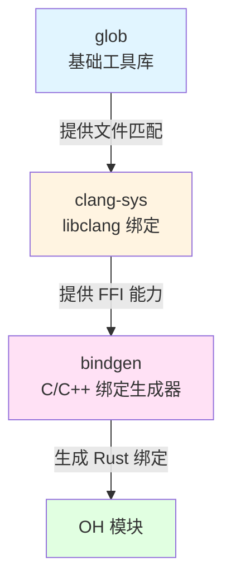

# glob 库概览

本文档介绍 glob 库的基本信息、核心功能以及在 OpenHarmony 中的作用和定位。

---

## 1. 基础信息

### 1.1 原始库信息

| 项目 | 内容 |
|------|------|
| **库名称** | rust-lang/glob |
| **版本** | 0.3.1 |
| **许可证** | Apache License V2.0, MIT (Dual License) |
| **许可证文件** | LICENSE-APACHE, LICENSE-MIT |
| **上游地址** | https://github.com/rust-lang/glob |
| ** crates.io** | https://crates.io/crates/glob |
| **文档** | https://docs.rs/glob/0.3.1 |
| **源代码行数** | 1434 行 (src/lib.rs) |
| **Rust Edition** | 2015 |
| **发布日期** | 2020 年 8 月 |

### 1.2 OpenHarmony 组件信息

| 项目 | 内容 |
|------|------|
| **组件名称** | rust_glob |
| **子系统** | thirdparty |
| **部件路径** | third_party/rust/crates/glob |
| **负责人** | fangting12@huawei.com |
| **OH 版本** | 6.1 |
| **适配系统类型** | standard |
| **集成日期** | 2023 年 4 月 |

---

## 2. 功能描述

### 2.1 原始功能

glob 是一个**支持 Unix shell 风格 glob 模式匹配的 Rust 库**。

**一句话描述**: 提供文件路径与 Unix shell 风格模式匹配的纯 Rust 实现。

**核心能力**:
- ✅ 支持 Unix shell 通配符模式（`*.rs`, `**/*.md`, `?`, `[a-z]` 等）
- ✅ 文件系统遍历和匹配
- ✅ 灵活的匹配选项（大小写敏感、分隔符要求、前导点要求等）
- ✅ 跨平台兼容（纯 Rust 实现，不依赖 libc 的 glob/fnmatch 函数）
- ✅ 错误处理（文件系统错误、无效模式等）

**主要 API**:
```rust
// 基础匹配
pub fn glob(pattern: &str) -> Result<Paths, PatternError>

// 带选项的匹配
pub fn glob_with(pattern: &str, options: MatchOptions) -> Result<Paths, PatternError>

// 单路径匹配检查
impl Pattern {
    pub fn matches(&self, path: &Path) -> bool
    pub fn matches_path(&self, path: &Path) -> bool
}
```

### 2.2 使用示例

**打印所有 jpg 文件**:
```rust
use glob::glob;

for entry in glob("/media/**/*.jpg").expect("Failed to read glob pattern") {
    match entry {
        Ok(path) => println!("{:?}", path.display()),
        Err(e) => println!("{:?}", e),
    }
}
```

**不区分大小写的匹配**:
```rust
use glob::glob_with;
use glob::MatchOptions;

let options = MatchOptions {
    case_sensitive: false,
    require_literal_separator: false,
    require_literal_leading_dot: false,
};

for entry in glob_with("local/*a*", options).unwrap() {
    if let Ok(path) = entry {
        println!("{:?}", path.display())
    }
}
```

---

## 3. 在 OpenHarmony 中的作用和定位

### 3.1 定位

glob 在 OpenHarmony 中扮演**基础工具库**的角色，为 Rust 生态提供文件路径匹配能力。

**关键特征**:
- 📦 **基础工具库**: 不直接面向应用开发者，作为构建工具链的底层依赖
- 🔧 **编译时依赖**: 主要在编译时被其他库使用，运行时依赖较少
- 🌍 **跨平台支持**: 纯 Rust 实现，无需担心平台兼容性问题
- 📊 **使用范围**: 间接服务于 OH 中的 FFI 绑定生成和 C/C++ 库集成

### 3.2 核心价值

**1. 支持 clang-sys 的库文件查找**

glob 的主要用途是为 `clang-sys` 提供文件路径匹配能力，用于查找和定位 `libclang` 库文件：

```
clang-sys 使用 glob 查找:
- libclang.so / libclang.dylib / libclang.dll
- 版本化文件: libclang-3.9.so, libclang-4.0.so 等
- 多路径搜索: 系统目录、环境变量路径、工具链目录等
```

**2. 支持构建系统的文件匹配**

为 Rust 生态中的构建工具提供通用的文件模式匹配能力，例如：
- 查找特定扩展名的文件
- 递归搜索子目录
- 匹配符合命名规范的文件

**3. 跨平台一致性**

提供跨平台的一致行为，避免不同操作系统下 libc glob 函数的差异导致的兼容性问题。

### 3.3 依赖关系



**直接依赖者**: clang-sys
**间接依赖者**: bindgen → OH 模块

### 3.4 使用场景

| 场景 | 描述 | 使用者 |
|------|------|--------|
| **libclang 库文件查找** | 在编译时和运行时查找 libclang 动态/静态库 | clang-sys |
| **版本化库文件匹配** | 支持查找不同版本的 libclang（如 libclang-16.0.so） | clang-sys |
| **多路径搜索** | 在多个系统目录中查找库文件 | clang-sys |
| **构建时文件遍历** | 在构建过程中匹配和查找特定文件 | bindgen (间接) |

---

## 4. 与其他库的关系

### 4.1 类似库对比

| 库 | 语言 | 特点 | 在 OH 中的使用 |
|----|------|------|--------------|
| **glob** | Rust | 纯 Rust，跨平台，功能简单 | ✅ 被使用 |
| **ignore** | Rust | 功能更丰富，支持 .gitignore 风格 | ❌ 未使用 |
| **walkdir** | Rust | 高效目录遍历，但不支持模式匹配 | ❌ 未使用 |
| **libc glob** | C | 依赖系统实现，行为不一致 | ❌ 未使用 |

**为什么选择 glob**:
- 简单轻量，满足基础需求
- 纯 Rust 实现，跨平台一致性
- 良好的稳定性和维护性

### 4.2 依赖链分析

```
应用层 (N/A)
    ↑
OH 模块 (netmanager_base, data_share, ...)
    ↑
bindgen (C/C++ FFI 绑定生成器)
    ↑
clang-sys (libclang 绑定)
    ↑
glob (文件路径匹配) ← 当前库
```

**说明**:
- glob 是依赖链的最底层
- 不直接被 OH 模块使用
- 通过 clang-sys 间接服务 OH 生态

---

## 5. 技术特性

### 5.1 架构设计

glob 采用**纯 Rust 实现**，完全独立于平台特定的 libc 函数：

**设计优势**:
- 跨平台一致性：不同操作系统下行为完全一致
- 无外部依赖：除标准库外无其他依赖
- 安全性：避免了 C 代码中的内存安全问题

### 5.2 性能特点

- **高效匹配**: 优化的模式匹配算法
- **惰性求值**: `Paths` 迭代器按需遍历文件系统
- **错误处理**: 遇到不可读目录时返回错误，不中断整个遍历

### 5.3 限制

- **不支持高级模式**: 仅支持标准 Unix shell 风格，不支持正则表达式
- **无并发**: 迭代器不支持并发遍历
- **平台限制**: Windows 路径分隔符行为与 Unix 可能略有不同

---

## 6. 维护状态

### 6.1 上游维护

- **状态**: ✅ 活跃维护
- **最新版本**: 0.3.1（2020 年发布）
- **维护者**: The Rust Project Developers
- **测试**: 完整的单元测试和文档测试

### 6.2 OpenHarmony 维护

- **Patch 策略**: ❌ 无 Patch
- **版本同步**: 建议定期同步上游
- **负责人**: fangting12@huawei.com
- **适配难度**: ⭐ 极低

---

## 7. 参考资源

### 7.1 官方文档

- [GitHub 仓库](https://github.com/rust-lang/glob)
- [crates.io](https://crates.io/crates/glob)
- [API 文档](https://docs.rs/glob/0.3.1)

### 7.2 OpenHarmony 相关

- [clang-sys 文档](../../clang-sys/wiki/)
- [bindgen 文档](../../bindgen/wiki/)
- [第三方库管理指南](https://gitee.com/openharmony/community/blob/master/contributing/binary-guideline/binary_library_management_guide.md)

---

## 8. 总结

glob 是一个**简单、可靠、跨平台的文件路径匹配库**，在 OpenHarmony 中作为基础工具库，为 clang-sys 和 bindgen 提供文件匹配能力。

**关键要点**:
- ✅ 零 Patch 适配，完全使用上游版本
- ✅ 基础工具库，不直接面向应用开发者
- ✅ 纯 Rust 实现，跨平台一致性好
- ✅ 维护成本低，升级风险低

**适用场景**:
- 编译时的文件匹配
- 库文件查找（如 libclang）
- 构建工具的文件遍历

---

**最后更新**: 2026-02-08
