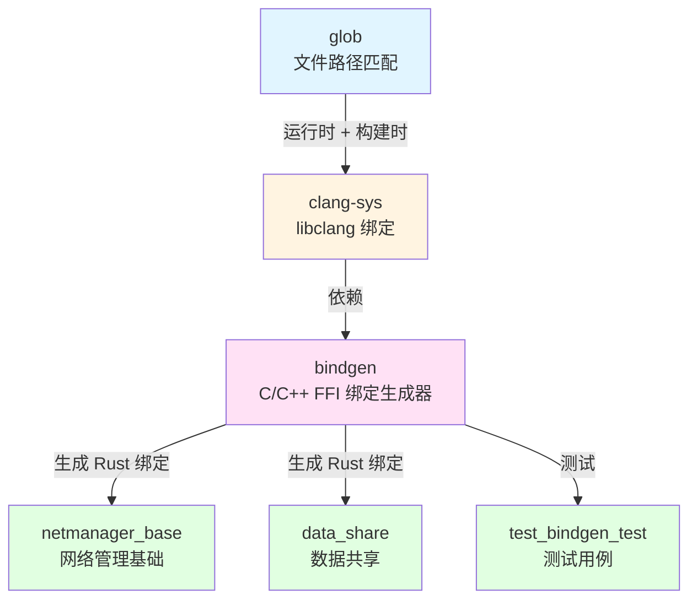

# 依赖关系与使用场景

本文档详细分析 glob 库在 OpenHarmony 中的依赖关系、使用方式以及关键使用场景。

---

## 1. 直接依赖者

### 1.1 依赖者清单

glob 在 OpenHarmony 中**只有一个直接依赖者**：

| 依赖模块 | BUILD.gn 路径 | 用途 | 依赖类型 |
|---------|--------------|------|---------|
| **clang-sys** | `third_party/rust/crates/clang-sys/BUILD.gn` | libclang 库文件查找 | 运行时 + 构建时 |

### 1.2 clang-sys 依赖详情

**clang-sys** 是 libclang 的 Rust 绑定库，为 Rust 代码提供与 Clang C API 的交互能力。

**依赖配置**:
```gn
# third_party/rust/crates/clang-sys/BUILD.gn
ohos_cargo_crate("lib") {
    deps = [
        "//third_party/rust/crates/glob:lib",  # 运行时依赖
        "//third_party/rust/crates/libc:lib",
        "//third_party/rust/crates/libloading:lib",
    ]
    build_deps = [ "//third_party/rust/crates/glob:lib" ]  # 构建时依赖
}
```

**依赖类型说明**:
- **运行时依赖**: clang-sys 的 Rust 代码在运行时调用 glob 的 API
- **构建时依赖**: clang-sys 的 `build.rs` 脚本在编译时使用 glob 查找文件

---

## 2. 间接依赖链

### 2.1 完整依赖关系图



### 2.2 依赖链说明

**第一层（直接依赖）**:
```
glob → clang-sys
```

**第二层（间接依赖）**:
```
clang-sys → bindgen
```

**第三层（OH 模块使用）**:
```
bindgen → OH 模块（netmanager_base, data_share, test cases）
```

---

## 3. 使用方式

### 3.1 静态链接

glob 在 OpenHarmony 中通过**静态链接**方式集成：

```gn
# glob/BUILD.gn
ohos_cargo_crate("lib") {
    crate_type = "rlib"  # Rust 静态库
    # ...
}
```

**静态链接特点**:
- ✅ 编译时链接，无运行时依赖
- ✅ 内联优化，性能更好
- ✅ 无版本冲突问题
- ❌ 增加最终产物大小

### 3.2 头文件引用

glob 作为 Rust crate，**不提供 C/C++ 头文件**，仅通过 Rust 生态使用：

```rust
// Rust 代码中使用 glob
extern crate glob;
use glob::glob;

// 或者在 Cargo.toml 中声明
[dependencies]
glob = "0.3.1"
```

**不适用于 C/C++ 代码**。

### 3.3 GN 构建依赖

在 GN 构建系统中依赖 glob：

```gn
# BUILD.gn
ohos_cargo_crate("my_crate") {
    deps = [
        "//third_party/rust/crates/glob:lib",
    ]
    # ...
}
```

---

## 4. 关键使用场景

### 4.1 clang-sys 的 libclang 查找

**场景描述**:
clang-sys 使用 glob 在编译时和运行时查找系统中的 `libclang` 库文件。

**使用方式**:
```rust
// clang-sys 的 build.rs 使用 glob
use glob::glob;

// 查找 libclang.so
for entry in glob("/usr/lib/**/libclang.so*")? {
    if let Ok(path) = entry {
        println!("cargo:rustc-link-lib=clang={}", path.display());
    }
}
```

**查找的文件类型**:
- 动态库: `libclang.so`, `libclang.dylib`, `libclang.dll`
- 版本化文件: `libclang-3.9.so`, `libclang-4.0.so`, `libclang-16.0.so`
- 静态库: `libclang.a`（如果启用静态链接）

**查找路径**:
1. 环境变量 `LIBCLANG_PATH` 指定的目录
2. `llvm-config --libdir` 返回的目录
3. 系统标准库目录（`/usr/lib`, `/usr/local/lib` 等）
4. 环境变量 `LD_LIBRARY_PATH` 包含的目录
5. macOS 工具链目录（`xcode-select --print-path`）

### 4.2 版本化库文件匹配

**场景描述**:
clang-sys 支持多个版本的 libclang，使用 glob 的通配符功能匹配所有可能版本。

**glob 模式示例**:
```rust
// 匹配所有版本的 libclang
glob("/usr/lib/libclang*.so")

// 匹配特定版本范围
glob("/usr/lib/libclang-1[5-9].*.so")

// 递归搜索所有子目录
glob("/usr/**/libclang.so")
```

**版本匹配逻辑**:
1. 查找所有匹配的文件
2. 按版本号排序（数字版本优先）
3. 选择最新版本

### 4.3 多路径搜索

**场景描述**:
clang-sys 在多个可能的路径中搜索 libclang，使用 glob 的模式匹配功能。

**搜索策略**:
```rust
let search_paths = vec![
    "/usr/lib",
    "/usr/local/lib",
    "/opt/llvm/lib",
    "/usr/local/llvm/lib",
];

for path in search_paths {
    let pattern = format!("{}/**/libclang.so*", path);
    for entry in glob(&pattern)? {
        if let Ok(lib_path) = entry {
            // 找到 libclang
            return Some(lib_path);
        }
    }
}
```

**glob 的优势**:
- 简洁的路径匹配语法
- 支持递归搜索
- 跨平台一致性

### 4.4 构建时文件遍历

**场景描述**:
bindgen 在构建时使用 glob（通过 clang-sys）查找和匹配文件。

**用途**:
- 查找 Clang 可执行文件
- 查找 Clang 头文件
- 查找 LLVM 配置文件

**间接依赖**:
```
bindgen → clang-sys → glob
```

---

## 5. OH 模块使用分析

### 5.1 netmanager_base 使用 bindgen

**路径**: `foundation/communication/netmanager_base/common/ani_sys/BUILD.gn`

**用途**:
- 为网络管理模块生成 ANI（Abstract Network Interface）C 库的 Rust 绑定
- 使用 bindgen 的 `rust_bindgen` GN 模板

**依赖链**:
```
netmanager_base
    ↓ 使用
bindgen
    ↓ 依赖
clang-sys
    ↓ 使用
glob
```

### 5.2 data_share 使用 bindgen

**路径**: `foundation/distributeddatamgr/data_share/common/ani_sys/BUILD.gn`

**用途**:
- 为数据共享模块生成 C 库的 Rust 绑定
- 与 netmanager_base 类似的用途

### 5.3 测试用例

**路径**: `build/rust/tests/test_bindgen_test/`

**用途**:
- 测试 bindgen 在 OH 中的集成
- 验证 Rust-C++ FFI 绑定生成功能

---

## 6. 使用统计

### 6.1 直接依赖者统计

| 统计项 | 数量 |
|--------|------|
| **直接依赖者** | 1 个（clang-sys） |
| **间接依赖者** | 1 个（bindgen） |
| **OH 模块使用者** | 3+ 个（netmanager_base, data_share, test cases） |

### 6.2 使用范围分析

**直接使用**: ❌ 无
- glob 不被任何 OH 模块直接使用

**间接使用**: ✅ 有
- 通过 clang-sys 间接服务 OH 生态

**深度**: 3 层
```
OH 模块 → bindgen → clang-sys → glob
```

---

## 7. glob 在 OH 中的价值

### 7.1 核心价值

1. **基础工具支持**:
   - 为 Rust 生态提供标准的文件路径匹配能力
   - 支持编译时的文件查找和遍历

2. **跨平台一致性**:
   - 纯 Rust 实现，避免平台差异
   - 确保在不同 OH 设备上行为一致

3. **构建系统集成**:
   - 支持 clang-sys 的库文件查找
   - 间接支持 bindgen 的 FFI 绑定生成

### 7.2 技术优势

| 优势 | 说明 |
|------|------|
| **零 Patch** | 完全使用上游版本，维护成本低 |
| **无依赖** | 仅依赖 Rust 标准库，部署简单 |
| **性能优秀** | 高效的模式匹配算法 |
| **安全可靠** | 无内存安全问题，经过充分测试 |

---

## 8. 使用建议

### 8.1 对于 OH 模块开发者

**如果需要文件匹配功能**:

1. **优先使用 glob**:
   ```rust
   use glob::glob;

   for entry in glob("src/**/*.rs")? {
       println!("{:?}", entry?);
   }
   ```

2. **在 BUILD.gn 中声明依赖**:
   ```gn
   ohos_cargo_crate("my_crate") {
       deps = [
           "//third_party/rust/crates/glob:lib",
       ]
   }
   ```

3. **使用标准 API**:
   - 参考上游文档：https://docs.rs/glob/0.3.1
   - 避免使用内部 API

### 8.2 对于库维护者

1. **保持版本更新**:
   - 定期检查上游 releases
   - 评估新版本的兼容性

2. **监控使用情况**:
   - 关注 clang-sys 的使用变化
   - 了解 bindgen 的功能需求

3. **性能优化**:
   - 评估是否需要启用 LTO（目前未启用）
   - 考虑添加 OH 特定的优化

---

## 9. 未来展望

### 9.1 潜在扩展场景

虽然 glob 目前仅被 clang-sys 使用，但未来可能在以下场景中使用：

1. **构建脚本**:
   - 其他 Rust crate 的 build.rs
   - 查找特定模式的源文件
   - 生成代码时遍历文件系统

2. **应用层工具**:
   - 文件管理工具
   - 配置文件扫描
   - 资源文件查找

3. **开发工具**:
   - 代码分析工具
   - 测试框架
   - IDE 插件

### 9.2 改进建议

1. **添加 OH 单元测试**:
   ```rust
   #[cfg(target_os = "ohos")]
   mod ohos_tests {
       // OH 特定测试
   }
   ```

2. **性能监控**:
   - 监控 clang-sys 使用 glob 的性能
   - 优化热点路径

3. **文档完善**:
   - 添加 OH 使用示例
   - 记录常见问题

---

## 10. 总结

glob 在 OpenHarmony 中扮演**基础工具库**的角色，主要通过 clang-sys 间接服务 OH 生态：

**关键要点**:
- ✅ 唯一直接依赖者：clang-sys
- ✅ 间接服务于 bindgen 和 OH 模块
- ✅ 主要用途：libclang 库文件查找
- ✅ 零 Patch 集成，维护成本低
- ✅ 跨平台一致性好，性能优秀

**依赖链**:
```
OH 模块 → bindgen → clang-sys → glob
```

**使用场景**:
- 编译时的库文件查找
- 版本化库文件匹配
- 多路径文件搜索
- 构建时文件遍历

---

**最后更新**: 2026-02-08
