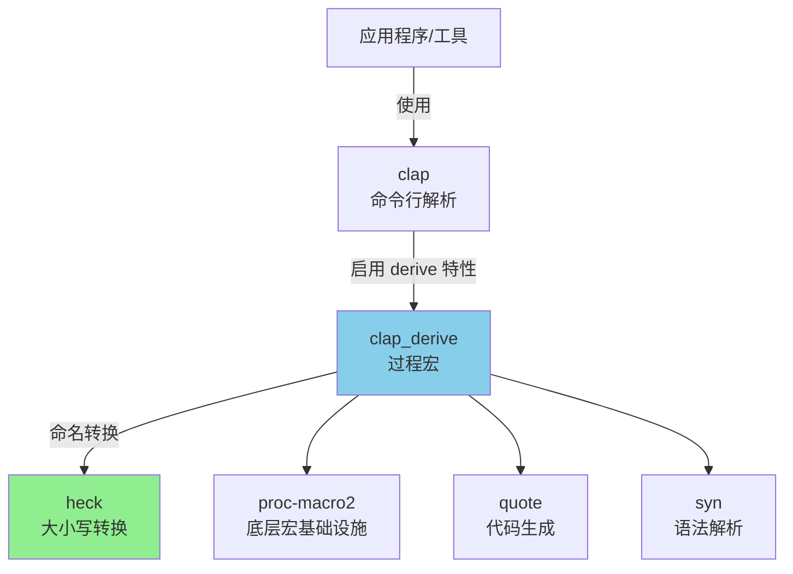
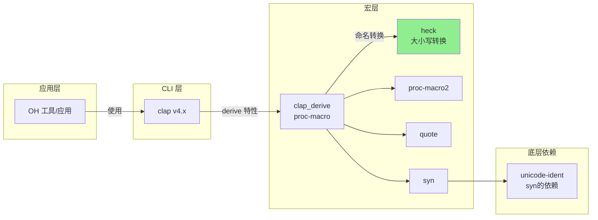

# heck 在 OpenHarmony 中的使用

## 1. 依赖关系总览

### 1.1 直接依赖者

目前仅发现 **1** 个 OH 组件直接依赖 heck：

| 组件名 | BUILD.gn 路径 | 用途 | 依赖方式 |
|--------|--------------|------|----------|
| **clap_derive** | `third_party/rust/crates/clap/clap_derive/BUILD.gn` | 命令行解析宏 | `deps` 静态链接 |

### 1.2 依赖声明

```gn
# third_party/rust/crates/clap/clap_derive/BUILD.gn
ohos_cargo_crate("lib") {
    crate_name = "clap_derive"
    crate_type = "proc-macro"
    # ...
    deps = [
        "//third_party/rust/crates/heck:lib",     # <-- 依赖 heck
        "//third_party/rust/crates/proc-macro2:lib",
        "//third_party/rust/crates/quote:lib",
        "//third_party/rust/crates/syn:lib",
    ]
}
```

### 1.3 依赖图



## 2. clap_derive 使用 heck 的场景

### 2.1 clap_derive 简介

clap_derive 是 clap 命令行解析库的**过程宏（proc-macro）** crate，提供：
- `#[derive(Parser)]` - 自动生成命令行解析器
- `#[derive(Args)]` - 子命令参数定义
- `#[derive(Subcommand)]` - 子命令枚举定义
- `#[derive(ValueEnum)]` - 值枚举定义

### 2.2 heck 的具体用途

在 derive 宏中，heck 主要用于：

| 场景 | 输入 | heck 转换 | 输出 |
|------|------|-----------|------|
| 长参数名 | `my_field` | `to_kebab_case()` | `--my-field` |
| 短参数名 | `MyVariant` | `to_kebab_case()` | `--my-variant` |
| 子命令名 | `MySubCmd` | `to_kebab_case()` | `my-sub-cmd` |
| 环境变量 | `my_field` | `to_shouty_snake_case()` | `MY_FIELD` |
| 值变体 | `SomeValue` | `to_kebab_case()` | `some-value` |

### 2.3 代码示例

假设有 Rust 代码：

```rust
use clap::Parser;

#[derive(Parser)]
struct Cli {
    /// 输入文件路径
    #[arg(short, long)]
    input_file: String,
    
    /// 是否启用详细输出
    #[arg(long)]
    enable_verbose: bool,
}

fn main() {
    let args = Cli::parse();
}
```

clap_derive 使用 heck 生成：

```rust
// 生成的代码（概念示意）
impl Parser for Cli {
    fn parse() -> Self {
        // 使用 heck 转换字段名
        let app = app.arg(
            Arg::new("input_file")
                .short('i')
                .long("input-file")  // <-- heck 转换结果
        );
        // ...
    }
}
```

## 3. OH 中的典型使用场景

### 3.1 开发工具

OH 生态中的 Rust 开发工具可能使用 clap：

| 工具类型 | 使用方式 | heck 角色 |
|----------|----------|-----------|
| 代码生成器 | `#[derive(Parser)]` | 参数名转换 |
| 构建辅助工具 | CLI 参数解析 | 选项名生成 |
| 测试工具 | 子命令定义 | 子命令名转换 |

### 3.2 系统组件

OH 系统组件（用 Rust 编写的）可能通过以下链使用 heck：

```
系统服务/工具 (Rust)
    ↓
使用 clap 解析命令行
    ↓
clap_derive 宏展开
    ↓
heck 进行命名转换
```

## 4. 使用方式分析

### 4.1 静态链接

heck 以 **rlib**（Rust 静态库）形式被链接：

```gn
# BUILD.gn 配置
crate_type = "rlib"
module_output_extension = ".rlib"
```

### 4.2 头文件/接口

heck 是纯 Trait 库，通过 Rust `use` 引入：

```rust
// clap_derive 中的使用示例
use heck::ToKebabCase;

let field_name = "my_field";
let arg_name = field_name.to_kebab_case(); // "my-field"
```

### 4.3 编译时 vs 运行时

**关键特性**：heck 被 proc-macro crate（clap_derive）使用

| 阶段 | 行为 |
|------|------|
| **编译时** | clap_derive 宏展开，调用 heck 进行代码生成 |
| **运行时** | heck 代码已内联到生成的代码中，无运行时依赖 |

这意味着：
- 最终二进制文件**不直接包含** heck crate
- heck 的代码通过宏展开**内联**到使用 clap 的应用中
- 运行时无额外的动态链接依赖

## 5. 依赖传递分析

### 5.1 完整依赖链



### 5.2 编译时依赖树

当编译使用 clap 的应用时，依赖解析顺序：

```
1. 解析 Cargo.toml / BUILD.gn
2. 发现 clap 依赖
3. 发现 clap_derive 依赖（若启用 derive 特性）
4. 发现 clap_derive 依赖 heck
5. 下载/构建 heck
6. 构建 clap_derive（proc-macro crate）
7. 编译应用源码时，展开 clap_derive 宏
   - 宏代码调用 heck 进行命名转换
8. 链接最终二进制
```

## 6. 在 OH 中的位置

### 6.1 子系统归属

| 属性 | 值 |
|------|-----|
| **所属子系统** | thirdparty |
| **Part 名称** | rust_heck |
| **目标路径** | third_party/rust/crates/heck |

### 6.2 与其他 Rust crate 的关系

```
third_party/rust/crates/
├── heck/                    <-- 本文档主题
│   ├── wiki/
│   ├── src/
│   └── BUILD.gn
├── clap/
│   └── clap_derive/        <-- 唯一依赖者
│       ├── src/
│       └── BUILD.gn        <-- deps 包含 heck
├── syn/                     <-- clap_derive 也依赖 syn
├── quote/                   <-- clap_derive 也依赖 quote
└── proc-macro2/             <-- clap_derive 也依赖 proc-macro2
```

## 7. 维护影响分析

### 7.1 变更影响范围

若 heck 需要修改（虽然当前无此需求）：

| 修改类型 | 影响范围 | 风险评估 |
|----------|----------|----------|
| API 变更 | clap_derive | 高（需同步更新 clap_derive） |
| Bug 修复 | 所有使用 clap 的应用 | 中（需重新编译依赖者） |
| 性能优化 | 编译时性能 | 低（无运行时影响） |

### 7.2 升级策略

由于 heck 是 clap_derive 的基础依赖，升级需谨慎：

1. **升级前**：检查 clap_derive 是否兼容新版本
2. **测试**：验证使用 clap 的应用编译正常
3. **回滚准备**：保留旧版本以备回滚

### 7.3 实际风险

**当前风险极低**，因为：
- heck API 稳定（v0.4.x 无破坏性变更）
- clap_derive 4.x 与 heck 0.4.x 兼容良好
- heck 无运行时依赖，问题易于隔离

## 8. 总结

| 项目 | 状态 |
|------|------|
| **直接依赖者数量** | 1（clap_derive） |
| **间接影响范围** | 所有使用 clap derive 宏的 Rust 应用 |
| **使用方式** | 编译时过程宏辅助 |
| **运行时依赖** | 无（代码内联） |
| **关键程度** | 中（影响命令行工具开发体验） |

heck 在 OH 中扮演**基础工具库**角色，虽不直接出现在应用代码中，但支撑着 clap 这一重要的命令行解析生态。其零 Patch、零依赖、纯 Safe Rust 的特性，使其成为 OH 中维护成本最低的第三方库之一。
