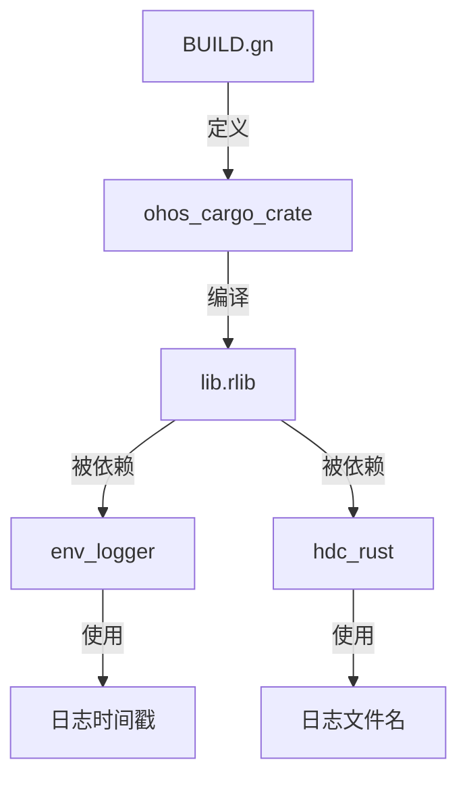

# OpenHarmony 构建适配

## 概述

humantime 在 OpenHarmony 中使用 **GN 构建系统** 进行构建适配。由于库本身简单纯粹，BUILD.gn 配置非常标准，无需特殊处理。

## BUILD.gn 完整配置

```gn
# Copyright (c) 2023 Huawei Device Co., Ltd.
# Licensed under the Apache License, Version 2.0 (the "License");
# you may not use this file except in compliance with the License.
# You may obtain a copy of the License at
#
#     http://www.apache.org/licenses/LICENSE-2.0
#
# Unless required by applicable law or agreed to in writing, software
# distributed under the License is distributed on an "AS IS" BASIS,
# WITHOUT WARRANTIES OR CONDITIONS OF ANY KIND, either express or implied.
# See the License for the specific language governing permissions and
# limitations under the License.

import("//build/ohos.gni")

ohos_cargo_crate("lib") {
    crate_name = "humantime"
    crate_type = "rlib"
    crate_root = "src/lib.rs"

    sources = ["src/lib.rs"]
    edition = "2018"
    cargo_pkg_version = "2.1.0"
    cargo_pkg_authors = "Paul Colomiets <paul@colomiets.name>"
    cargo_pkg_name = "humantime"
    cargo_pkg_description = "A parser and formatter for std::time::{Duration, SystemTime}"
    module_output_extension = ".rlib"
    part_name = "rust_humantime"
    subsystem_name = "thirdparty"
}
```

## 配置项详解

### 基础配置

| 配置项 | 值 | 说明 |
|--------|-----|------|
| `crate_name` | `"humantime"` | Rust crate 名称，与 Cargo.toml 一致 |
| `crate_type` | `"rlib"` | 生成 Rust 静态库，供其他 crate 链接 |
| `crate_root` | `"src/lib.rs"` | crate 入口文件 |

### 源代码配置

| 配置项 | 值 | 说明 |
|--------|-----|------|
| `sources` | `["src/lib.rs"]` | 单文件库，所有模块通过 lib.rs 引入 |
| `edition` | `"2018"` | Rust Edition，与 Cargo.toml 一致 |

**注**: humantime 虽然是单文件库，但实际包含多个模块：
- `src/lib.rs` - 主入口
- `src/duration.rs` - 持续时间模块
- `src/date.rs` - 日期时间模块
- `src/wrapper.rs` - 包装类型

这些模块通过 `mod` 语句在 lib.rs 中引入，因此 sources 只需包含 lib.rs。

### 元数据配置

| 配置项 | 值 | 说明 |
|--------|-----|------|
| `cargo_pkg_version` | `"2.1.0"` | 上游版本号 |
| `cargo_pkg_authors` | `"Paul Colomiets ..."` | 原作者信息 |
| `cargo_pkg_name` | `"humantime"` | 包名称 |
| `cargo_pkg_description` | `"A parser and formatter..."` | 包描述 |

这些元数据用于保持与上游 Cargo 生态的兼容性。

### OH 组件配置

| 配置项 | 值 | 说明 |
|--------|-----|------|
| `module_output_extension` | `".rlib"` | 输出文件扩展名 |
| `part_name` | `"rust_humantime"` | OH 部件名称，唯一标识 |
| `subsystem_name` | `"thirdparty"` | 所属子系统 |

## 与上游 Cargo.toml 的映射

### Cargo.toml (上游)

```toml
[package]
name = "humantime"
description = "A parser and formatter for std::time::{Duration, SystemTime}"
license = "MIT/Apache-2.0"
version = "2.1.0"
edition = "2018"
authors = ["Paul Colomiets <paul@colomiets.name>"]
categories = ["date-and-time"]

[lib]
name = "humantime"
path = "src/lib.rs"

[dev-dependencies]
time = "0.1"
chrono = "0.4"
rand = "0.6"
```

### 映射关系

| Cargo.toml | BUILD.gn | 说明 |
|-----------|----------|------|
| `[package] name` | `crate_name` | ✅ 直接映射 |
| `[package] version` | `cargo_pkg_version` | ✅ 直接映射 |
| `[package] edition` | `edition` | ✅ 直接映射 |
| `[package] authors` | `cargo_pkg_authors` | ✅ 直接映射 |
| `[package] description` | `cargo_pkg_description` | ✅ 直接映射 |
| `[lib] name` | `crate_name` | ✅ 相同 |
| `[lib] path` | `crate_root` | ✅ 对应 |
| `[dev-dependencies]` | 无 | ❌ 未引入 |

## 缺失的配置项

与典型的 OH Rust crate 相比，humantime 的 BUILD.gn **缺少以下配置**（但这些是合理的）：

| 缺失项 | 原因 |
|--------|------|
| `deps` | 该库无外部依赖 |
| `external_deps` | 不依赖其他 OH 组件 |
| `defines` | 无需自定义宏定义 |
| `configs` | 无需特殊编译配置 |
| `cflags` | 纯 Rust，无需 C 编译器标志 |
| `features` | 未启用 Cargo features |
| `test` | 未配置测试（可选） |

## 构建过程

### GN 构建流程

```
1. GN 解析 BUILD.gn
   └── 识别 ohos_cargo_crate 目标 "lib"

2. 调用 Rust 编译器 (rustc)
   └── 参数: --edition 2018 --crate-type rlib src/lib.rs

3. 生成输出
   └── obj/third_party/rust/crates/humantime/lib.rlib

4. 被依赖者链接
   └── env_logger, hdc_rust 等通过 deps 引用
```

### 依赖关系



## 使用示例

### 其他组件如何依赖

```gn
# env_logger/BUILD.gn
ohos_cargo_crate("lib") {
    crate_name = "env_logger"
    ...
    deps = [
        "//third_party/rust/crates/humantime:lib",
        ...
    ]
    features = [
        "humantime",  # 启用 humantime 功能
        ...
    ]
}
```

```gn
# hdc_rust/BUILD.gn
ohos_rust_executable("hdc_rust") {
    ...
    deps = [
        "//third_party/rust/crates/humantime:lib",
        ...
    ]
}
```

## 维护注意事项

### 升级版本时

1. **更新版本号**:
   ```gn
   cargo_pkg_version = "2.x.x"  # 更新为新版本
   ```

2. **检查 edition**:
   - 如果上游更新了 Rust Edition，同步修改 `edition` 字段

3. **验证编译**:
   ```bash
   gn gen out
   ninja -C out third_party/rust/crates/humantime:lib
   ```

### 添加依赖时

如果未来需要添加依赖（目前无此需求）：

```gn
ohos_cargo_crate("lib") {
    ...
    deps = [
        "//third_party/rust/crates/some_dep:lib",
    ]
}
```

## 结论

humantime 的 BUILD.gn 是 **OH Rust crate 的标准模板示例**：

- ✅ 配置简洁，无冗余
- ✅ 与上游 Cargo.toml 信息一致
- ✅ 无特殊适配需求
- ✅ 易于维护和升级

**关键要点**: 该库构建适配的唯一工作就是编写这个标准的 BUILD.gn 文件，其余完全复用上游代码。
