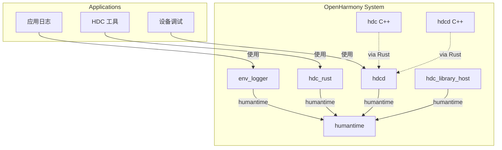
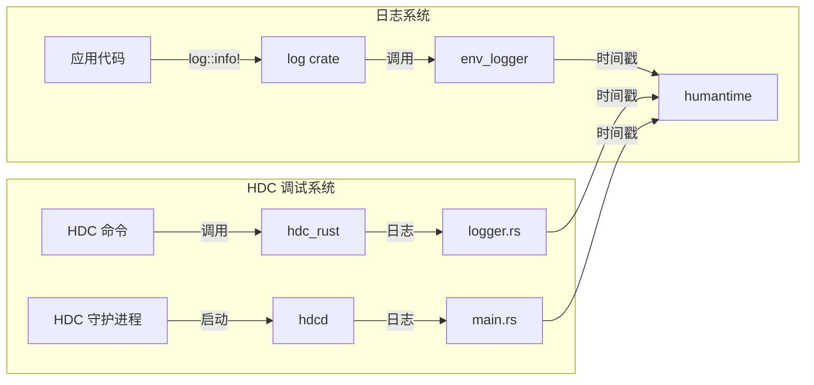

# humantime 在 OpenHarmony 中的使用

## 依赖关系概览

humantime 在 OpenHarmony 中作为**日志基础设施**被多个组件依赖，主要用于时间戳格式化。

### 直接依赖者清单

| 序号 | 组件 | 目标类型 | BUILD.gn 路径 | 用途 |
|------|------|----------|---------------|------|
| 1 | **env_logger** | rlib | `//third_party/rust/crates/env_logger:lib` | 日志时间戳格式化 |
| 2 | **hdcd** | executable | `//developtools/hdc/hdc_rust:hdcd` | 守护进程日志 |
| 3 | **hdc_library_host** | rlib | `//developtools/hdc/hdc_rust:hdc_library_host` | HDC 主机端库 |
| 4 | **hdc_rust** | executable | `//developtools/hdc/hdc_rust:hdc_rust` | HDC 客户端工具 |
| 5 | **hdc** (C++) | shared_library | `//developtools/hdc:hdc` | 原生 HDC 库 |
| 6 | **hdcd** (C++) | executable | `//developtools/hdc:hdcd` | 原生守护进程 |

### 依赖统计

- **Rust 组件**: 4 个
- **C++ 组件**: 2 个（通过 Rust 层间接依赖）
- **总计**: 6 个依赖目标

## 详细依赖分析

### 1. env_logger (日志库)

**组件信息**
- **路径**: `third_party/rust/crates/env_logger`
- **类型**: 第三方日志库
- **在 OH 中的角色**: 提供标准日志接口

**依赖方式**

```gn
# env_logger/BUILD.gn
deps = [
    "//third_party/rust/crates/humantime:lib",
    "//third_party/rust/crates/log:lib",
    "//third_party/rust/crates/regex:lib",
    "//third_party/rust/crates/termcolor:lib",
]
features = [
    "auto-color",
    "humantime",  # ★ 启用 humantime 功能
    "regex",
]
```

**使用场景**: 时间戳格式化

env_logger 在 `src/fmt/humantime.rs` 中包装了 humantime，提供多精度时间戳支持：

```rust
// env_logger/src/fmt/humantime.rs
use humantime::{
    format_rfc3339_micros, format_rfc3339_millis, 
    format_rfc3339_nanos, format_rfc3339_seconds,
};

impl Formatter {
    pub fn timestamp(&self) -> Timestamp {
        Timestamp {
            time: SystemTime::now(),
            precision: TimestampPrecision::Seconds,
        }
    }
    
    pub fn timestamp_millis(&self) -> Timestamp {
        Timestamp { ... precision: TimestampPrecision::Millis }
    }
    
    pub fn timestamp_micros(&self) -> Timestamp { ... }
    pub fn timestamp_nanos(&self) -> Timestamp { ... }
}

impl fmt::Display for Timestamp {
    fn fmt(&self, f: &mut fmt::Formatter) -> fmt::Result {
        let formatter = match self.precision {
            TimestampPrecision::Seconds => format_rfc3339_seconds,
            TimestampPrecision::Millis => format_rfc3339_millis,
            TimestampPrecision::Micros => format_rfc3339_micros,
            TimestampPrecision::Nanos => format_rfc3339_nanos,
        };
        formatter(self.time).fmt(f)
    }
}
```

**输出格式示例**:
```
[2024-01-15T10:30:45Z INFO my_module] log message
[2024-01-15T10:30:45.123Z DEBUG my_module] log message
```

### 2. hdc_rust (HDC Rust 实现)

**组件信息**
- **路径**: `developtools/hdc/hdc_rust`
- **类型**: 开发调试工具
- **在 OH 中的角色**: HarmonyOS Device Connector，设备连接调试工具

**依赖目标**:
1. `hdcd` - HDC 守护进程（设备端）
2. `hdc_library_host` - HDC 主机端库
3. `hdc_rust` - HDC 客户端可执行文件

**使用场景**: 日志文件名时间戳

**文件**: `developtools/hdc/hdc_rust/src/host/logger.rs`

```rust
use std::time::SystemTime;

fn dump_log_file(file_type: &str, log_level: log::LevelFilter) {
    let file_path = Path::new(&std::env::temp_dir())
        .join(config::LOG_FILE_NAME.to_string() + config::LOG_TAIL_NAME);
    
    // 使用 humantime 格式化时间戳
    let ts = humantime::format_rfc3339_millis(SystemTime::now())
        .to_string()
        .replace(':', "");  // 移除冒号以适应文件名
    
    let file_cache_path = if log_level == log::LevelFilter::Trace {
        Path::new(&std::env::temp_dir())
            .join(file_type.to_string() + &ts[..19] + config::LOG_TAIL_NAME)
    } else {
        Path::new(&std::env::temp_dir()).join(file_type.to_string() + config::LOG_TAIL_NAME)
    };
    
    // 重命名日志文件...
}
```

**文件**: `developtools/hdc/hdc_rust/src/host/logger.rs` (SimpleHostLogger)

```rust
impl log::Log for SimpleHostLogger {
    fn log(&self, record: &log::Record) {
        if self.enabled(record.metadata()) {
            // 时间戳格式化
            let ts = humantime::format_rfc3339_millis(SystemTime::now()).to_string();
            let level = &record.level().to_string()[..1];
            let Some(file) = record.file() else {
                println!("Get record file failed");
                return;
            };
            // 输出日志...
        }
    }
}
```

**文件**: `developtools/hdc/hdc_rust/src/daemon/main.rs`

```rust
fn main() {
    let ts = humantime::format_rfc3339_millis(SystemTime::now()).to_string();
    // 初始化日志...
}
```

**生成的日志文件名示例**:
```
hdc_2024-01-15T103045.123Z.log  # 毫秒级时间戳，冒号已移除
```

### 3. hdc (C++ 原生实现)

**组件信息**
- **路径**: `developtools/hdc`
- **类型**: C++ 原生实现
- **在 OH 中的角色**: HDC 的原生 C++ 版本

**依赖方式**: 
通过 `hdc_rust` 的静态库目标间接依赖：

```gn
# hdc/BUILD.gn
ohos_shared_library("hdc") {
    deps = [
        "//third_party/rust/crates/humantime:lib",
        ...
    ]
}
```

## 依赖关系图

### 简化依赖图



### 完整依赖链



## 使用场景总结

### 场景 1: 日志时间戳 (主要)

```
应用日志 → log crate → env_logger → humantime::format_rfc3339_millis → 格式化输出
```

**特点**:
- 高频调用
- 要求高性能
- RFC3339 标准格式
- 支持多精度（秒/毫秒/微秒/纳秒）

### 场景 2: 日志文件管理 (次要)

```
HDC 日志轮转 → humantime::format_rfc3339_millis → 文件名时间戳 → 文件重命名
```

**特点**:
- 低频调用（仅在日志轮转时）
- 毫秒级精度
- 移除冒号以适应文件系统

## API 使用统计

| API | 使用次数 | 使用组件 | 场景 |
|-----|----------|----------|------|
| `format_rfc3339_millis()` | 3 | hdc_rust | 日志时间戳 |
| `format_rfc3339_seconds()` | 1 | env_logger | 日志时间戳（秒级） |
| `format_rfc3339_micros()` | 1 | env_logger | 日志时间戳（微秒级） |
| `format_rfc3339_nanos()` | 1 | env_logger | 日志时间戳（纳秒级） |
| `parse_duration()` | 0 | - | 未使用 |
| `format_duration()` | 0 | - | 未使用 |

**分析**: 
- humantime 的 **时间戳格式化功能** 被充分使用
- **持续时间功能** (parse_duration/format_duration) 在 OH 中暂未使用
- 未来如有需要，可直接使用这些功能而无需额外集成

## 性能影响

### 时间戳格式化的性能

根据上游基准测试和 OH 使用场景：

| 精度 | 每次调用耗时 | OH 使用场景 |
|------|-------------|------------|
| Seconds | ~20 ns | 一般日志 |
| Millis | ~28 ns | HDC 日志、详细日志 |
| Micros | ~35 ns | 未在 OH 使用 |
| Nanos | ~40 ns | 未在 OH 使用 |

### 在系统中的影响

- **日志系统**: 时间戳格式化是日志输出的组成部分，但每次耗时仅 ~30ns，对整体性能影响可忽略
- **HDC 调试**: 仅在日志文件轮转时使用，频率低，无性能压力

## 结论

humantime 在 OpenHarmony 中的角色定位清晰：

1. **基础设施**: 作为日志系统的底层时间戳格式化工具
2. **轻量级依赖**: 仅被少数关键组件直接依赖
3. **稳定使用**: 使用模式固定，API 调用稳定
4. **潜在扩展**: duration 功能尚未使用，可作为预留能力

**维护建议**: 当前依赖关系合理，无需调整。如需使用 duration 功能，相关组件可直接通过已有依赖使用，无需额外集成。
