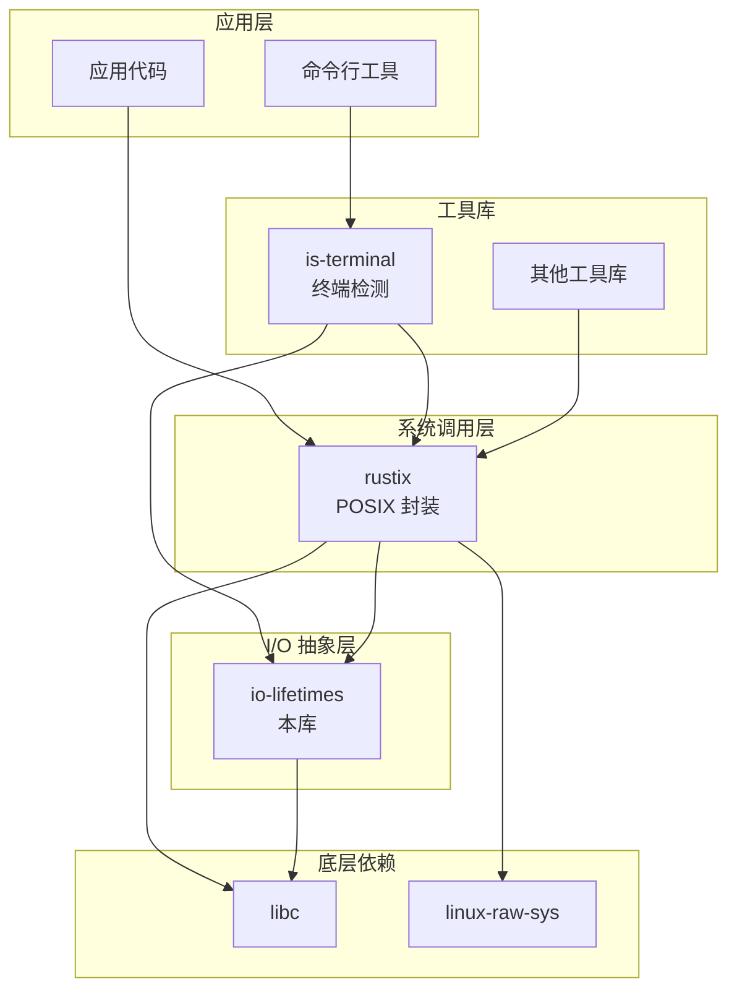

# io-lifetimes 在 OpenHarmony 中的使用

## 依赖者概览

io-lifetimes 在 OH 中作为基础设施层被以下组件直接依赖：

| 组件名 | BUILD.gn 路径 | 使用方式 | 重要性 |
|--------|--------------|----------|--------|
| **rustix** | `//third_party/rust/crates/rustix:lib` | 核心依赖 | ⭐⭐⭐ 高 |
| **is-terminal** | `//third_party/rust/crates/is-terminal:lib` | 功能依赖 | ⭐⭐ 中 |

---

## 1. rustix（主要依赖者）

### 组件信息

| 属性 | 值 |
|------|-----|
| **上游名称** | rustix |
| **OH 组件名** | rust_rustix |
| **版本** | 0.36.16 |
| **上游地址** | https://github.com/bytecodealliance/rustix |
| **功能** | 安全的 POSIX/Unix/Linux 系统调用封装 |

### 依赖配置

```gn
# third_party/rust/crates/rustix/BUILD.gn
ohos_cargo_crate("lib") {
  crate_name = "rustix"
  # ...
  deps = [
    "//third_party/rust/crates/bitflags:lib",
    "//third_party/rust/crates/io-lifetimes:lib",  # <-- 依赖 io-lifetimes
    "//third_party/rust/crates/libc:lib",
    "//third_party/rust/crates/linux-raw-sys:lib",
  ]
  features = [
    "io-lifetimes",  # <-- 启用 io-lifetimes 集成
    "libc",
    "std",
    "use-libc-auxv",
    "termios",
  ]
}
```

### 使用方式

#### 1.1 类型 Re-export

```rust
// rustix/src/backend/libc/io_lifetimes.rs
//! io_lifetimes types for Windows assuming that Fd is Socket.

#[cfg(windows)]
pub use io_lifetimes::{BorrowedSocket as BorrowedFd, OwnedSocket as OwnedFd};

#[cfg(windows)]
pub use io_lifetimes::AsSocket;
```

#### 1.2 Trait 实现

```rust
// rustix/src/backend/libc/io/poll_fd.rs
impl<'fd> io_lifetimes::AsSocket for PollFd<'fd> {
    // 实现代码...
}
```

#### 1.3 功能特性标记

```rust
// rustix/src/lib.rs
#![cfg_attr(io_lifetimes_use_std, feature(io_safety))]

//! [`OwnedFd`]: https://docs.rs/io-lifetimes/latest/io_lifetimes/struct.OwnedFd.html
//! [io-lifetimes crate]: https://crates.io/crates/io-lifetimes
```

### rustix 的核心功能

rustix 使用 io-lifetimes 提供安全的系统调用封装：

| 模块 | 功能 | io-lifetimes 使用 |
|------|------|------------------|
| `fs` | 文件系统操作 | `OwnedFd` 管理文件句柄 |
| `io` | 通用 I/O | `AsFd` trait 进行借用 |
| `net` | 网络操作 | `OwnedFd` 管理 socket |
| `process` | 进程操作 | 管道文件描述符管理 |
| `termios` | 终端控制 | 终端 FD 安全操作 |

### 使用示例

```rust
use rustix::fs::{open, Mode, OFlags};
use rustix::io::read;

// rustix 使用 io-lifetimes 的 OwnedFd
let file = open("/etc/passwd", OFlags::RDONLY, Mode::empty())?;

// file 是 OwnedFd 类型，自动管理生命周期
let mut buf = [0u8; 1024];
let n = read(&file, &mut buf)?;  // AsFd trait 启用借用

// file 在这里自动 drop，调用 close(2)
```

---

## 2. is-terminal

### 组件信息

| 属性 | 值 |
|------|-----|
| **上游名称** | is-terminal |
| **OH 组件名** | rust_is_terminal |
| **版本** | 0.4.0+ |
| **上游地址** | https://github.com/sunfishcode/is-terminal |
| **功能** | 检测 stdin/stdout/stderr 是否为终端 |

### 依赖配置

```gn
# third_party/rust/crates/is-terminal/BUILD.gn
ohos_cargo_crate("lib") {
  crate_name = "is_terminal"
  # ...
  deps = [
    "//third_party/rust/crates/io-lifetimes:lib",  # <-- 依赖 io-lifetimes
    "//third_party/rust/crates/rustix:lib",         # <-- 也依赖 rustix
  ]
}
```

### 使用方式

#### 2.1 Trait 使用

```rust
// is-terminal/src/lib.rs
use io_lifetimes::AsFilelike;
use io_lifetimes::BorrowedHandle;
```

#### 2.2 终端检测实现

```rust
use io_lifetimes::AsFilelike;

pub fn is_terminal<T: AsFilelike>(fd: &T) -> bool {
    let filelike = fd.as_filelike();
    // 使用 rustix 进行底层检测...
}
```

### 典型应用场景

```rust
use is_terminal::IsTerminal;

// 检测 stdout 是否为终端
if std::io::stdout().is_terminal() {
    // 是终端，可以启用彩色输出
    println!("\x1b[32m彩色输出\x1b[0m");
} else {
    // 不是终端（可能是管道或重定向）
    println!("普通输出");
}
```

---

## 依赖关系图

### 完整依赖链



### 简化依赖链

```
应用代码
    ├── rustix → io-lifetimes → libc
    │
    └── is-terminal → rustix → io-lifetimes → libc
                └── io-lifetimes ─────────────┘
```

---

## 在 OH 中的实际使用场景

### 场景 1：命令行工具开发

许多 Rust CLI 工具使用 `is-terminal` 检测终端：

```rust
// 某 OH 组件中的代码
use is_terminal::IsTerminal;

fn setup_logging() {
    if std::io::stderr().is_terminal() {
        // 终端环境：启用彩色日志
        env_logger::builder()
            .format(|buf, record| {
                writeln!(buf, "\x1b[31m{}\x1b[0m", record.args())
            })
            .init();
    } else {
        // 非终端：纯文本日志
        env_logger::init();
    }
}
```

### 场景 2：系统服务开发

使用 rustix 进行安全的系统调用：

```rust
use rustix::fs::{open, Mode, OFlags};
use rustix::io::write;

fn write_pid_file(path: &str) -> io::Result<()> {
    // 使用 io-lifetimes 保护的文件描述符
    let file = open(
        path,
        OFlags::CREATE | OFlags::WRONLY | OFlags::TRUNC,
        Mode::from_bits_truncate(0o644)
    )?;
    
    let pid = format!("{}\n", std::process::id());
    write(&file, pid.as_bytes())?;
    
    // file 自动关闭
    Ok(())
}
```

### 场景 3：测试工具

```rust
use rustix::pipe::pipe;

#[test]
fn test_pipe() {
    // pipe() 返回 (OwnedFd, OwnedFd)
    let (read_end, write_end) = pipe().unwrap();
    
    // 使用 io-lifetimes 类型确保资源释放
    rustix::io::write(&write_end, b"hello").unwrap();
    
    let mut buf = [0u8; 10];
    let n = rustix::io::read(&read_end, &mut buf).unwrap();
    
    assert_eq!(&buf[..n], b"hello");
    // read_end 和 write_end 自动关闭
}
```

---

## Rust 工具链中的使用

io-lifetimes 也在 OH 的 Rust 工具链中被广泛使用：

| 工具 | 路径 | 用途 |
|------|------|------|
| **miri** | `third_party/rust/rust/src/tools/miri/` | Rust 解释器中的 I/O 模拟 |
| **rustfmt** | `third_party/rust/rust/src/tools/rustfmt/` | 代码格式化 |
| **clippy** | `third_party/rust/rust/src/tools/clippy/` | 静态分析 |

这些工具通过 Cargo.lock 锁定 io-lifetimes 版本：

```toml
# Cargo.lock
[[package]]
name = "io-lifetimes"
version = "1.0.5"
```

---

## 统计摘要

### 依赖统计

| 指标 | 数值 |
|------|------|
| 直接依赖者数量 | 2（rustix, is-terminal） |
| 间接依赖者（估计） | 10+（通过 rustix） |
| BUILD.gn 引用次数 | 2 |
| Cargo.lock 引用次数 | 5+（工具链中） |

### 使用方式统计

| 使用方式 | 组件 |
|----------|------|
| 核心类型使用 | rustix |
| Trait 使用 | rustix, is-terminal |
| Re-export | rustix |

---

## 维护影响分析

### 升级影响

升级 io-lifetimes 时需要测试的组件：

```
io-lifetimes 升级
    ├── 直接测试
    │   └── io-lifetimes 自身测试
    │
    ├── 下游依赖测试
    │   ├── rustix 测试
    │   │   └── rustix/tests/
    │   └── is-terminal 测试
    │       └── is-terminal/tests/
    │
    └── 集成测试
        └── 使用 rustix 的 OH 组件
```

### 回滚策略

由于 io-lifetimes 是基础设施：

1. **高影响**：影响所有使用 rustix 的组件
2. **低风险**：API 稳定，向后兼容
3. **建议**：在 CI 中测试所有 rustix 依赖项

---

## 文档导航

- [概览](01_Overview.md)
- [Patch 分析](02_Patches.md)
- [构建适配](03_Build_Integration.md)
- **依赖与使用**（本页）
