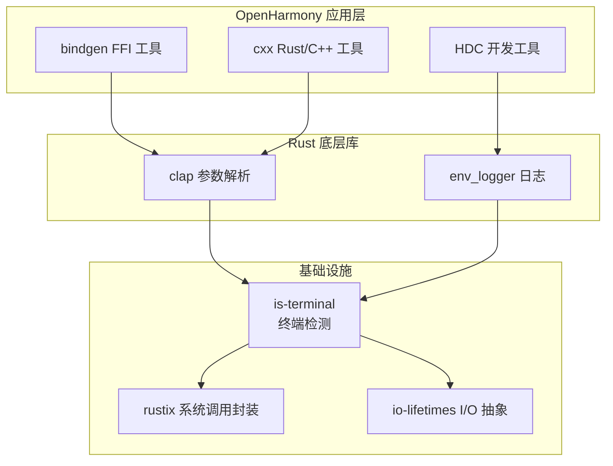

# is-terminal 库概览

## 原始库简介

### 基本信息

| 属性 | 值 |
|------|-----|
| **库名称** | is-terminal |
| **当前版本** | v0.4.3 |
| **许可证** | MIT / Apache 2.0（OH 额外添加） |
| **上游仓库** | https://github.com/sunfishcode/is-terminal |
| **文档地址** | https://docs.rs/is-terminal |
| **MSRV** | Rust 1.48 |

### 功能描述

is-terminal 是一个简单但实用的 Rust 库，提供**终端检测能力**。

**核心功能**：检测给定的流（stream）是否为终端（tty）

**一句话概括**：
> Test whether a given stream is a terminal.

### 技术特性

- **跨平台支持**:
  - Unix-like 系统: 使用 `isatty()` 系统调用
  - Windows: 使用多种技术检测终端状态
  - WASI: WebAssembly 系统接口支持
  - HermitOS: 独立操作系统支持

- **I/O 安全**: 遵循 Rust I/O 安全 RFC，仅对传入的流进行操作

- **API 设计简洁**:
  ```rust
  pub trait IsTerminal {
      fn is_terminal(&self) -> bool;
  }
  ```

- **从 atty 改进而来**: 修复了 atty 的 bug（PR #51），并支持任意流类型

### 典型使用场景

在命令行工具中，is-terminal 常用于：

1. **彩色输出控制**
   ```rust
   if std::io::stdout().is_terminal() {
       println!("\x1b[31m错误信息\x1b[0m");  // 红色
   } else {
       println!("错误信息");  // 纯文本
   }
   ```

2. **日志格式切换**
   ```rust
   if std::io::stderr().is_terminal() {
       logger.set_color_enabled(true);
   }
   ```

3. **交互式检测**
   ```rust
   if std::io::stdin().is_terminal() {
       println!("运行在交互模式");
   }
   ```

---

## 在 OpenHarmony 中的作用和定位

### OH 中的角色

**类别**: 基础设施库（Infrastructure Library）

**定位**: 为 OpenHarmony Rust 生态提供终端检测能力的基础设施

**集成类型**: 纯净上游集成（Vanilla Upstream Integration）

### 在 OH 中的价值

1. **提升用户体验**
   - 为命令行工具提供智能的彩色输出
   - 自动适配终端和非终端环境

2. **标准化终端检测**
   - 统一 OH Rust 生态的终端检测方案
   - 避免各工具重复实现相同功能

3. **支持开发工具**
   - HDC (华为设备连接器) 使用它来提供彩色日志
   - bindgen、cxx 等工具使用它来优化命令行界面

### 在 OH 技术栈中的位置



---

## 原始库与上游的同步

### 同步状态

| 项目 | 状态 |
|------|------|
| **源代码** | ✅ 与上游 v0.4.3 完全一致 |
| **Cargo.toml** | ✅ 与上游一致 |
| **文档** | ✅ README.md 保留原始内容 |
| **构建系统** | ⚠️ 使用 GN 替代 Cargo（OH 适配） |

### 差异说明

OpenHarmony 对 is-terminal 的集成**没有任何源代码修改**，仅添加了：

1. **BUILD.gn** - OH 构建系统适配文件
2. **bundle.json** - OH 组件化配置
3. **README.OpenSource** - OH 归属信息

这些文件都不影响原始库的功能和 API。

### 版本历史

| 提交 | 版本 | 变更 |
|------|------|------|
| `bee73f2` | v0.4.3 | 上游正式版本（当前 OH 使用版本） |
| `91ace6c` | v0.4.2 | 更新 windows-sys 依赖 |
| `c688317` | v0.4.1 | 修复 wasm32-wasi 编译 |

**注**: OH 目前使用 v0.4.3，可以安全升级到更新的上游版本。

---

## 相关依赖

### is-terminal 的依赖

| 依赖 | 版本（OH） | 用途 |
|------|------------|------|
| **io-lifetimes** | 1.0.0 | I/O 资源抽象，支持 AsFilelike trait |
| **rustix** | 0.36.4 (Unix) | Rust 系统调用封装，提供 `isatty()` 功能 |
| **windows-sys** | 0.45.0 (Windows) | Windows API 绑定 |
| **hermit-abi** | 0.3.0 (Hermit) | HermitOS 系统调用 |

### 平台特性配置

```toml
# Unix (Linux, macOS, BSD)
[target.'cfg(not(any(windows, target_os = "hermit", target_os = "unknown")))'.dependencies]
rustix = { version = "0.36.4", features = ["termios"] }

# Windows
[target.'cfg(windows)'.dependencies.windows-sys]
version = "0.45.0"
features = [
    "Win32_Foundation",
    "Win32_Storage_FileSystem",
    "Win32_System_Console",
]
```

---

## 参考资源

- **上游仓库**: https://github.com/sunfishcode/is-terminal
- **上游文档**: https://docs.rs/is-terminal
- **原始 README**: 项目根目录 `README.md`
- **OH 组件**: `@ohos/rust_is_terminal`
- **OH 负责人**: fangting12@huawei.com
