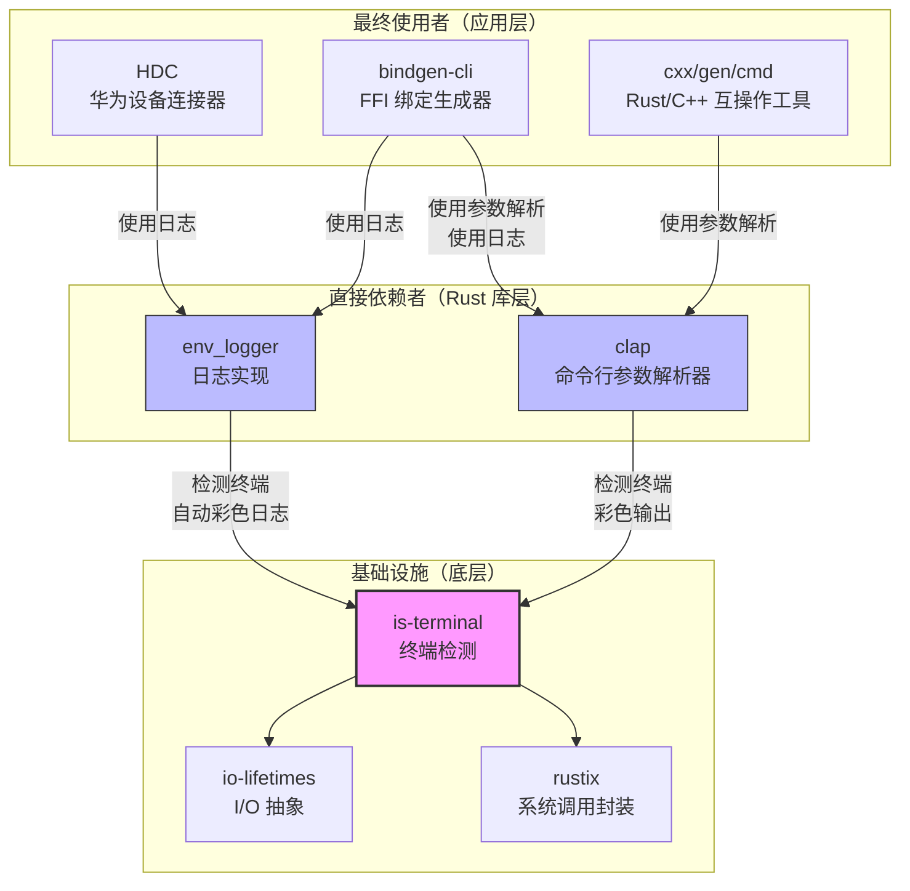

# 依赖关系与使用

> is-terminal 在 OpenHarmony 中主要被 clap 和 env_logger 依赖，间接支持 HDC、bindgen、cxx 等开发工具。

---

## 直接依赖者

### 1. clap (Command Line Argument Parser)

| 属性 | 值 |
|------|-----|
| **OH 组件** | @ohos/rust_clap |
| **OH 路径** | third_party/rust/crates/clap |
| **上游版本** | v4.1.13 |
| **使用方式** | BUILD.gn 依赖 + Cargo.toml 可选依赖 |
| **依赖类型** | Optional (feature: color) |

**使用用途**:
clap 使用 is-terminal 来检测 stdout 是否为终端，决定是否启用彩色参数解析帮助信息。

**配置示例**:

```gn
# third_party/rust/crates/clap/BUILD.gn
deps = [
    "//third_party/rust/crates/is-terminal:lib",  # Line 31
]
```

```toml
# third_party/rust/crates/clap/Cargo.toml
[dependencies]
is-terminal = { version = "0.4.1", optional = true }
```

**Feature Flag**:
```toml
[features]
default = ["std", "color", ...]
color = ["is-terminal"]
```

### 2. env_logger (Logging Implementation)

| 属性 | 值 |
|------|-----|
| **OH 组件** | @ohos/rust_env_logger |
| **OH 路径** | third_party/rust/crates/env_logger |
| **上游版本** | v0.10.2 |
| **使用方式** | BUILD.gn 依赖 + Cargo.toml 可选依赖 |
| **依赖类型** | Optional (feature: auto-color) |

**使用用途**:
env_logger 使用 is-terminal 来检测日志输出环境，自动选择彩色或纯文本日志格式。

**配置示例**:

```gn
# third_party/rust/crates/env_logger/BUILD.gn
deps = [
    "//third_party/rust/crates/is-terminal:lib",  # Line 26
]
```

```toml
# third_party/rust/crates/env_logger/Cargo.toml
[dependencies]
is-terminal = { version = "0.4.0", optional = true }
```

**Feature Flag**:
```toml
[features]
default = ["humantime", "atty", "termcolor", "regex", "auto-color"]
auto-color = ["is-terminal"]
```

---

## 间接依赖者（最终使用者）

### 1. HDC (Huawei Device Connector)

| 属性 | 值 |
|------|-----|
| **OH 路径** | developtools/hdc |
| **类型** | 开发调试工具 |

**依赖链**:
```
HDC → env_logger → is-terminal
```

**使用场景**:
HDC 是华为设备连接器，用于 OH 设备的开发和调试。它使用 env_logger 输出彩色日志，当在终端中运行时提供更好的可读性。

**BUILD.gn 依赖**:
```gn
# developtools/hdc/hdc_rust/BUILD.gn
deps = [
    "//third_party/rust/crates/env_logger:lib",  # Line 62
]
```

### 2. bindgen-cli (Rust FFI Binding Generator)

| 属性 | 值 |
|------|-----|
| **OH 路径** | third_party/rust/crates/bindgen/bindgen-cli |
| **类型** | 工具 |

**依赖链**:
```
bindgen-cli → clap + env_logger → is-terminal
```

**使用场景**:
bindgen 用于从 C/C++ 头文件自动生成 Rust FFI 绑定代码。使用 clap 提供友好的命令行界面，使用 env_logger 输出构建日志。

### 3. cxx/gen/cmd (Rust/C++ Interop Tool)

| 属性 | 值 |
|------|-----|
| **OH 路径** | third_party/rust/crates/cxx/gen/cmd |
| **类型** | 工具 |

**依赖链**:
```
cxx/gen/cmd → clap → is-terminal
```

**使用场景**:
cxx 提供了 Rust 和 C++ 之间安全的互操作机制。gen/cmd 是其代码生成工具，使用 clap 解析命令行参数。

---

## 依赖关系图

### 完整依赖图



### 简化依赖链

```
HDC
  └── env_logger
        └── is-terminal
              ├── rustix
              └── io-lifetimes

bindgen-cli
  ├── clap
  │     └── is-terminal
  └── env_logger
        └── is-terminal

cxx/gen/cmd
  └── clap
        └── is-terminal
```

---

## 典型使用场景

### 场景 1: 终端彩色输出

**工具**: clap

**代码示例**:
```rust
use clap::Parser;
use is_terminal::IsTerminal;

#[derive(Parser)]
struct Args {
    #[arg(short, long)]
    name: String,
}

fn main() {
    let args = Args::parse();

    if std::io::stdout().is_terminal() {
        println!("\x1b[32mHello, {}!\x1b[0m", args.name);  // 绿色
    } else {
        println!("Hello, {}!", args.name);  // 纯文本
    }
}
```

**OH 中的实现**:
clap 的 color feature 在内部调用 `is_terminal()`，开发者无需手动检测。

### 场景 2: 自动日志颜色切换

**工具**: env_logger

**代码示例**:
```rust
use env_logger::Env;

fn main() {
    env_logger::Builder::from_env(Env::default().default_filter_or("info"))
        .init();  // 自动检测终端，决定是否启用彩色日志

    log::info!("这是一条信息日志");
    log::warn!("这是一条警告日志");
    log::error!("这是一条错误日志");
}
```

**OH 中的实现**:
env_logger 的 auto-color feature 在内部调用 `is_terminal()`。

**行为对比**:
| 环境 | 输出效果 |
|------|---------|
| 终端 | 彩色日志（info=白色, warn=黄色, error=红色） |
| 重定向到文件 | 纯文本日志（无 ANSI 颜色码） |
| 管道到其他命令 | 纯文本日志（无 ANSI 颜色码） |

### 场景 3: HDC 调试工具

**工具**: HDC (Huawei Device Connector)

**使用场景**:
```bash
# 在终端中运行 - 彩色日志
$ hdc list devices
<INFO> Connected to device
<WARN> Slow response detected
<ERROR> Connection failed

# 重定向到文件 - 纯文本日志
$ hdc list devices > hdc.log
$ cat hdc.log
<INFO> Connected to device
<WARN> Slow response detected
<ERROR> Connection failed
```

---

## 使用方式

### 静态链接 vs 动态链接

**当前配置**: **静态链接 (rlib)**

is-terminal 编译为 Rust rlib（静态库），通过 GN 构建系统静态链接到依赖它的 crate 中。

**构建配置**:
```gn
ohos_cargo_crate("lib") {
    crate_type = "rlib"  # 静态库
    # ...
}
```

### 头文件引用方式

is-terminal 是纯 Rust 库，**不提供 C/C++ 头文件**，只能被 Rust 代码引用。

**Rust 代码引用**:
```rust
// Cargo.toml
[dependencies]
is-terminal = "0.4"

// src/main.rs
use is_terminal::IsTerminal;

fn main() {
    if std::io::stdout().is_terminal() {
        println!("终端中运行");
    }
}
```

**在 OH BUILD.gn 中依赖**:
```gn
ohos_rust_executable("my_tool") {
    deps = [
        "//third_party/rust/crates/is-terminal:lib",
    ]
    sources = ["src/main.rs"]
}
```

---

## 影响范围评估

### 影响范围

**直接影响**: clap, env_logger (2 个 Rust crate)

**间接影响**: HDC, bindgen, cxx (开发工具生态)

**影响类型**: 终端检测和彩色输出功能

### 风险评估

| 风险类型 | 等级 | 说明 |
|---------|------|------|
| **功能破坏** | 低 | is-terminal 功能简单，API 稳定 |
| **性能影响** | 低 | 终端检测是轻量级系统调用 |
| **兼容性** | 低 | 使用标准 API，跨平台兼容性好 |
| **升级风险** | 低 | 无 Patch，易于升级上游版本 |

### 修改建议

如果需要修改 is-terminal 的行为，需要注意：

1. **测试覆盖**: 确保 clap、env_logger 及其下游工具的测试通过
2. **平台兼容**: 修改需考虑所有支持的平台（Unix, Windows, WASI, Hermit）
3. **回归测试**: 运行 HDC 工具的实际使用场景测试

---

## 参考资源

- **clap 文档**: `third_party/rust/crates/clap/wiki/`
- **env_logger 文档**: `third_party/rust/crates/env_logger/wiki/`
- **HDC 文档**: `developtools/hdc/README.md`
- **OH 依赖分析**: `wiki/_work/ASSESSMENT.md` 第 0.3 节
