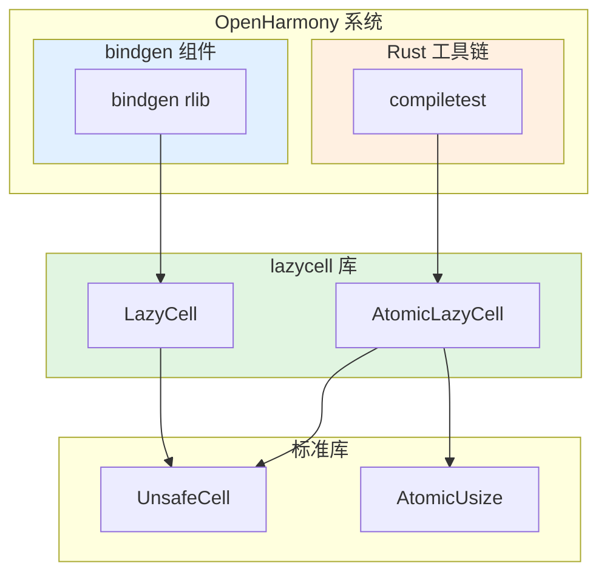

# 依赖关系与使用

> **说明**: 本文档说明 lazycell 在 OpenHarmony 中的依赖关系和使用情况。
> **核心内容**: 依赖者列表、使用方式、依赖关系图。

---

## 直接依赖者统计

### 依赖者概览

| 类型 | 数量 | 模块 |
|------|------|------|
| BUILD.gn 依赖 | 1 | bindgen |
| Cargo.toml 依赖 | 1 | compiletest (Rust 工具链) |
| **总计** | **2** | — |

---

## 依赖者详情

### 1. bindgen —— C/C++ FFI 绑定生成器

#### 基本信息

| 项目 | 内容 |
|------|------|
| **OH 组件** | @ohos/rust_bindgen |
| **上游版本** | 0.64.0 |
| **依赖路径** | `third_party/rust/crates/bindgen/bindgen/BUILD.gn` |
| **依赖方式** | `//third_party/rust/crates/lazycell:lib` |
| **用途** | 自动生成 Rust FFI 绑定到 C/C++ 库 |

#### BUILD.gn 依赖声明

```gn
ohos_cargo_crate("lib") {
    crate_name = "bindgen"
    # ...
    deps = [
        "//third_party/rust/crates/bitflags:lib",
        "//third_party/rust/crates/rust-cexpr:lib",
        "//third_party/rust/crates/clang-sys:lib",
        "//third_party/rust/crates/lazy-static.rs:lib",
        "//third_party/rust/crates/lazycell:lib",  # lazycell 依赖
        "//third_party/rust/crates/log:lib",
        # ...
    ]
}
```

#### 使用场景推测

bindgen 在解析 C/C++ 头文件时可能使用 lazycell 实现：

1. **延迟初始化解析缓存**
2. **按需加载类型信息**
3. **缓存编译器配置**

**具体用法**（推测，未在源码中确认）：

```rust
use lazycell::LazyCell;

struct Parser {
    type_cache: LazyCell<HashMap<String, Type>>,
}

impl Parser {
    fn get_type(&self, name: &str) -> &Type {
        self.type_cache.borrow_with(|| {
            // 首次调用时构建类型缓存
            self.build_type_cache()
        }).get(name).unwrap()
    }
}
```

#### 在 OH 中的作用

- **支持 C/C++ 互操作**: bindgen 生成的 FFI 绑定允许 Rust 代码调用 C/C++ 库
- **系统集成**: 用于 OH 中需要与 C/C++ 代码交互的 Rust 组件
- **自动化**: 减少手动编写 FFI 绑定的工作量

---

### 2. compiletest —— Rust 编译器测试工具

#### 基本信息

| 项目 | 内容 |
|------|------|
| **OH 位置** | `third_party/rust/rust/src/tools/compiletest/` |
| **上游版本** | 0.0.0 (Rust 工具链内部) |
| **依赖路径** | `Cargo.toml` |
| **依赖方式** | `lazycell = "1.3.0"` |
| **用途** | Rust 编译器测试框架 |

#### Cargo.toml 依赖声明

```toml
[package]
name = "compiletest"
version = "0.0.0"
edition = "2021"

[dependencies]
# ...
lazycell = "1.3.0"  # lazycell 依赖
# ...
```

#### 具体使用

**文件**: `third_party/rust/rust/src/tools/compiletest/src/common.rs`

```rust
use lazycell::AtomicLazyCell;

// 延迟初始化目标平台配置
static target_cfgs: AtomicLazyCell<TargetCfgs> = AtomicLazyCell::NONE;

pub fn get_target_cfgs() -> &'static TargetCfgs {
    target_cfgs.borrow_with(|| {
        // 计算昂贵的配置
        compute_target_cfgs()
    })
}
```

**文件**: `third_party/rust/rust/src/tools/compiletest/src/lib.rs`

```rust
use lazycell::AtomicLazyCell;

pub struct Config {
    pub target_cfgs: AtomicLazyCell<TargetCfgs>,
}

impl Config {
    pub fn target_cfgs(&self) -> &'static TargetCfgs {
        self.target_cfgs.borrow_with(|| {
            // 计算目标平台配置
            self.compute_target_cfgs()
        })
    }
}
```

#### 使用场景

1. **延迟初始化目标平台配置**
   - 首次访问时计算配置（CPU 架构、操作系统等）
   - 之后缓存结果供重复使用
   - 避免每次测试都重新计算

2. **线程安全**
   - 使用 `AtomicLazyCell` 支持多线程环境
   - 多个测试线程可以同时访问配置
   - 只有第一个线程会执行 `compute_target_cfgs()`

3. **性能优化**
   - 配置计算可能涉及文件 I/O 和环境变量读取
   - 延迟初始化减少启动时间
   - 缓存结果减少重复计算

#### 在 OH 中的作用

- **Rust 工具链测试**: compiletest 是 Rust 编译器测试基础设施的一部分
- **回归测试**: 用于运行 Rust 编译器的回归测试
- **跨平台测试**: 支持多个目标平台的测试

---

## 依赖关系图

### 顶层依赖图



### 详细依赖树

```
lazycell (v1.3.0)
├── 被 bindgen 依赖
│   ├── bindgen v0.64.0
│   │   └── 用于生成 Rust FFI 绑定
│   │       └── 支持 OH 中的 C/C++ 互操作
│   └── 依赖声明: BUILD.gn
│
└── 被 compiletest 依赖
    ├── compiletest v0.0.0
    │   └── Rust 编译器测试框架
    │       └── 使用 AtomicLazyCell 延迟初始化 target_cfgs
    │           └── 支持多线程访问目标配置
    └── 依赖声明: Cargo.toml
```

---

## 典型使用模式

### 1. 单线程延迟初始化（LazyCell）

**场景**: 配置缓存、按需加载资源

```rust
use lazycell::LazyCell;

struct ResourceManager {
    config: LazyCell<Config>,
    resources: LazyCell<HashMap<String, Resource>>,
}

impl ResourceManager {
    fn get_config(&self) -> &Config {
        self.config.borrow_with(|| {
            Config::from_env()
        })
    }

    fn load_resource(&self, name: &str) -> &Resource {
        self.resources.borrow_with(|| {
            let mut map = HashMap::new();
            map.insert("default".to_string(), Resource::load("default"));
            map
        }).get(name).unwrap()
    }
}
```

### 2. 多线程延迟初始化（AtomicLazyCell）

**场景**: 全局配置、线程安全缓存

```rust
use lazycell::AtomicLazyCell;

static GLOBAL_CONFIG: AtomicLazyCell<Config> = AtomicLazyCell::NONE;

fn get_config() -> &'static Config {
    GLOBAL_CONFIG.borrow_with(|| {
        Config::load_from_file()
    })
}

// 多个线程可以同时调用 get_config()
// 只有第一个线程会执行 load_from_file()
```

---

## 链接方式

### 静态链接（Rlib）

lazycell 在 OH 中通过静态链接方式使用：

| 方式 | 说明 |
|------|------|
| **输出类型** | `.rlib`（Rust 静态库） |
| **链接时机** | 编译时 |
| **运行时依赖** | 无 |
| **C ABI** | 不提供 |

**原因**:
- lazycell 是 Rust 专用库
- 无需提供 C/C++ 接口
- rlib 可以跨 crate 复用

### 头文件引用方式

lazycell 不提供 C 头文件，仅在 Rust 代码中使用：

```rust
// 在 Rust 代码中引用
extern crate lazycell;

use lazycell::{LazyCell, AtomicLazyCell};
```

---

## 使用场景总结

### bindgen 中的使用

| 场景 | 类型 | 目的 |
|------|------|------|
| 解析缓存 | LazyCell | 延迟初始化类型解析缓存 |
| 配置管理 | LazyCell | 按需加载解析器配置 |
| 性能优化 | LazyCell | 避免重复计算 |

### compiletest 中的使用

| 场景 | 类型 | 目的 |
|------|------|------|
| 目标配置 | AtomicLazyCell | 延迟初始化目标平台配置 |
| 线程安全 | AtomicLazyCell | 支持多线程访问配置 |
| 性能优化 | AtomicLazyCell | 缓存昂贵的配置计算 |

---

## 依赖影响范围

### 升级影响

| 升级 lazycell | 影响范围 | 回归风险 |
|---------------|---------|---------|
| bindgen | FFI 绑定生成 | 低（内部使用） |
| compiletest | Rust 工具链测试 | 低（内部使用） |
| **总体** | 仅工具链和 FFI 工具 | **低** |

### 替代成本

| 替代为 once_cell | 影响范围 | 工作量 |
|---------------|---------|--------|
| bindgen | 需要修改代码 | 中等 |
| compiletest | 需要修改代码 | 中等 |
| **总体** | 2 个模块需要修改 | **中等** |

---

## 维护建议

### 1. 升级策略

- **跟随 bindgen**: 如果 bindgen 升级并更新依赖，同步升级 lazycell
- **跟随编译器**: 如果 Rust 编译器工具链升级，检查 compiletest 的依赖
- **定期审查**: 每季度检查是否有上游更新或安全修复

### 2. 迁移建议

- **新代码**: 优先使用 `once_cell` 或 `std::sync::LazyLock`
- **现有代码**: 可继续使用 lazycell，无强制迁移需求
- **时机**: 在大规模重构或 API 清理时考虑迁移

详见 **[05_Migration_Guide.md](05_Migration_Guide.md)**

---

## 参考资源

- **完整评估报告**: [_work/ASSESSMENT.md](_work/ASSESSMENT.md)
- **bindgen BUILD.gn**: [../../bindgen/bindgen/BUILD.gn](../../bindgen/bindgen/BUILD.gn)
- **compiletest**: [../../rust/rust/src/tools/compiletest/](../../rust/rust/src/tools/compiletest/)
- **上游 API 文档**: https://indiv0.github.io/lazycell/lazycell
