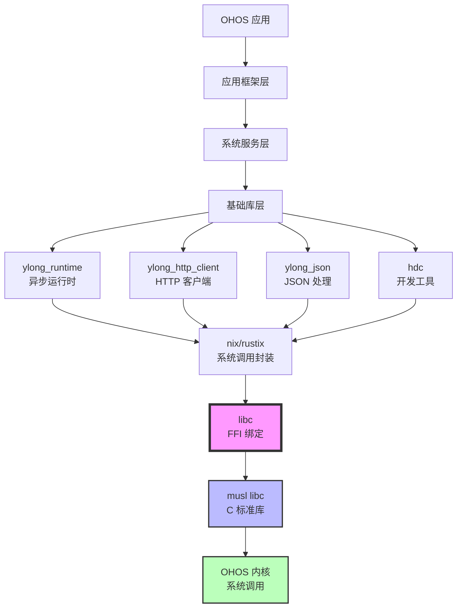

# 04_Usage_in_OH - 依赖关系与使用

> **文档状态**: ✅ 完成
> **最后更新**: 2026-02-08
> **依赖者总数**: 19 个

---

## 4.1 依赖者统计

### 总体统计

| 类别 | 数量 | 占比 |
|------|------|------|
| 第三方 crate 直接依赖（路径引用）| 4 个 | 21% |
| 第三方 crate 依赖（part_name 引用）| 4 个 | 21% |
| OpenHarmony 业务组件 | 11 个 | 58% |
| **总计** | **19 个** | 100% |

### 依赖者分类

```
libc (third_party/rust/crates/libc)
│
├─ 第三方 crate 直接依赖（通过 //third_party/rust/crates/libc:lib）
│  ├─ nix              # Unix 系统 API 的 Rust 绑定
│  ├─ rustix           # POSIX/Unix/Linux 系统调用的安全 Rust 绑定
│  ├─ which-rs         # Unix which 命令的 Rust 实现
│  └─ clang-sys        # libclang 的 Rust 绑定
│
├─ 第三方 crate 依赖（通过 rust_libc:lib）
│  ├─ atty             # 检测终端是否 TTY
│  ├─ io-lifetimes     # I/O 生命周期管理
│  ├─ openssl-sys      # OpenSSL FFI 绑定
│  └─ openssl          # OpenSSL 安全包装库
│
└─ OpenHarmony 业务组件（通过 rust_libc:lib）
   ├─ ylong_http_client      # HTTP/HTTPS 客户端库
   ├─ ylong_json             # JSON 解析/反序列化库
   ├─ ylong_runtime          # 异步运行时
   ├─ ylong_runtime/test     # 运行时测试
   ├─ ylong_io              # 异步 I/O 操作库
   ├─ ylong_signal           # 异步信号处理库
   ├─ hdc                   # 开发调试工具（HDC）
   ├─ hdc_rust              # HDC 的 Rust 实现
   ├─ file_api              # 文件管理接口的 Rust 绑定
   ├─ device_status scheduler # 设备状态调度器（test 和 sys）
   └─ companion_device_auth # 配套设备认证安全命令适配器
```

---

## 4.2 直接依赖者列表

### 类型 A: 第三方 crate 直接依赖（通过 `//third_party/rust/crates/libc:lib`）

| BUILD.gn 路径 | 依赖方式 | 组件名称 | 用途说明 |
|--------------|---------|----------|----------|
| `third_party/rust/crates/nix/BUILD.gn` | `deps = ["//third_party/rust/crates/libc:lib"]` | **nix** | Unix 系统 API 的友好 Rust 绑定，提供安全的系统调用封装（文件、socket、进程、信号等）|
| `third_party/rust/crates/rustix/BUILD.gn` | `deps = ["//third_party/rust/crates/libc:lib"]` | **rustix** | POSIX/Unix/Linux/Winsock2 系统调用的安全 Rust 绑定，使用 `bitflags` 和 `io-lifetimes` 确保类型安全 |
| `third_party/rust/crates/which-rs/BUILD.gn` | `deps = ["//third_party/rust/crates/libc:lib"]` | **which-rs** | Unix `which` 命令的 Rust 等效实现，用于在 PATH 中定位可执行文件 |
| `third_party/rust/crates/clang-sys/BUILD.gn` | `deps = ["//third_party/rust/crates/libc:lib"]` | **clang-sys** | libclang 的 Rust FFI 绑定，用于与 C/C++ 编译器、解析器交互（如 Rust bindgen 使用）|

### 类型 B: 第三方 crate 依赖（通过 `rust_libc:lib`）

| BUILD.gn 路径 | 依赖方式 | 组件名称 | 用途说明 |
|--------------|---------|----------|----------|
| `third_party/rust/crates/atty/BUILD.gn` | `external_deps = ["rust_libc:lib"]` | **atty** | 检测标准流（stdin/stdout/stderr）是否是 TTY（终端） |
| `third_party/rust/crates/io-lifetimes/BUILD.gn` | `external_deps = ["rust_libc:lib"]` | **io-lifetimes** | I/O 资源生命周期管理，为 rustix 等库提供安全的 I/O 操作抽象 |
| `third_party/rust/crates/rust-openssl/openssl-sys/BUILD.gn` | `external_deps = ["rust_libc:lib"]` | **openssl-sys** | OpenSSL 的低级 FFI 绑定，直接调用 OpenSSL C 库 |
| `third_party/rust/crates/rust-openssl/openssl/BUILD.gn` | `external_deps = ["rust_libc:lib"]` | **openssl** | OpenSSL 的高级 Rust 包装库，提供类型安全的加密、SSL/TLS 操作 |

### 类型 C: OpenHarmony 业务组件（通过 `rust_libc:lib`）

| BUILD.gn 路径 | 依赖方式 | 组件名称 | 用途说明 |
|--------------|---------|----------|----------|
| `commonlibrary/rust/ylong_http/ylong_http_client/BUILD.gn` | `external_deps = ["rust_libc:lib"]` | **ylong_http_client** | HTTP/HTTPS 客户端库，支持 HTTP/1.1 和 HTTP/2，用于网络请求 |
| `commonlibrary/rust/ylong_json/BUILD.gn` | `external_deps = ["rust_libc:lib"]` | **ylong_json** | JSON 序列化/反序列化库，系统服务层广泛使用 |
| `commonlibrary/rust/ylong_runtime/ylong_runtime/BUILD.gn` | `external_deps = ["rust_libc:lib"]` | **ylong_runtime** | 异步运行时（类似 Tokio），提供 fs/net/sync/time 等功能 |
| `commonlibrary/rust/ylong_runtime/test/BUILD.gn` | `external_deps = ["rust_libc:lib"]` | **ylong_runtime test** | 运行时测试套件，验证 ylong_runtime 的正确性 |
| `commonlibrary/rust/ylong_runtime/ylong_io/BUILD.gn` | `external_deps = ["rust_libc:lib"]` | **ylong_io** | 异步 I/O 操作库，基于 ylong_runtime 提供文件、网络 I/O 抽象 |
| `commonlibrary/rust/ylong_runtime/ylong_signal/BUILD.gn` | `external_deps = ["rust_libc:lib"]` | **ylong_signal** | 异步信号处理库，提供安全的 Unix 信号操作 |
| `developtools/hdc/BUILD.gn` | `external_deps = ["rust_libc:lib"]` | **hdc** | OpenHarmony 设备连接器（HDC），开发与调试工具，用于设备连接、文件传输、日志查看 |
| `developtools/hdc/hdc_rust/BUILD.gn` | `external_deps = ["rust_libc:lib"]` | **hdc_rust** | hdc 的 Rust 实现，支持 host/daemon 双模式 |
| `foundation/filemanagement/file_api/interfaces/kits/rust/BUILD.gn` | `external_deps = ["rust_libc:lib"]` | **file_api** | 文件管理接口的 Rust 绑定，为上层应用提供文件操作能力 |
| `base/msdp/device_status/rust/modules/scheduler/sys/BUILD.gn` | `external_deps = ["rust_libc:lib"]` | **device_status scheduler** | 设备状态调度器系统模块，管理设备的状态转换 |
| `base/msdp/device_status/rust/modules/scheduler/test/BUILD.gn` | `external_deps = ["rust_libc:lib"]` | **device_status scheduler test** | 设备状态调度器测试模块 |
| `base/useriam/companion_device_auth/services/external_adapters/security_command_adapter/rust/BUILD.gni` | `external_deps = ["rust_libc:lib"]` | **companion_device_auth** | 配套设备认证安全命令适配器，处理设备间的安全认证 |

---

## 4.3 主要依赖者分析

### 1. ylong 系列（基础设施层）

**位置**: `commonlibrary/rust/`

**组件**:
- **ylong_runtime**: 异步运行时，是整个 ylong 生态的核心，依赖 libc 进行底层系统调用
- **ylong_http_client**: 基于 ylong_runtime 的 HTTP 客户端
- **ylong_json**: 系统级的 JSON 处理库，服务于系统服务层
- **ylong_io**: 异步 I/O 操作库
- **ylong_signal**: 异步信号处理库

**重要性**: 🟢🟢🟢🟢🟢（最高）

**说明**: ylong 系列是 OpenHarmony 的 Rust 基础设施，为上层应用提供异步 I/O、网络、JSON 处理等能力。ylong_runtime 尤为重要，是所有 ylong 生态组件的基础。

**依赖特点**:
- 间接依赖：通过 `rust_libc:lib` 引用
- 功能核心：大量使用文件 I/O、网络、信号等系统调用

---

### 2. hdc 系列（开发工具）

**位置**: `developtools/hdc/`

**组件**:
- **hdc**: OpenHarmony 设备连接器（HDC）
- **hdc_rust**: hdc 的 Rust 实现

**重要性**: 🟢🟢🟢🟢（高）

**说明**: HDC 是 OpenHarmony 的核心开发工具，用于设备连接、文件传输、日志查看、Shell 命令执行等。依赖 libc 进行进程管理、网络通信、终端操作等底层功能。

**依赖特点**:
- 直接依赖：通过 `rust_libc:lib` 引用
- 功能核心：大量使用 socket、进程、终端 I/O 等系统调用

---

### 3. nix 和 rustix（底层系统调用封装）

**位置**: `third_party/rust/crates/`

**组件**:
- **nix**: Unix 系统 API 的友好 Rust 绑定
- **rustix**: POSIX/Unix/Linux 系统调用的安全 Rust 绑定

**重要性**: 🟢🟢🟢🟢（高）

**说明**: 这两个 crate 是 Rust 生态中最常用的底层系统调用封装库，为上层代码提供安全的文件操作、socket、进程、信号等接口。它们直接依赖 libc，是许多其他 crate 的依赖基础。

**依赖特点**:
- 直接依赖：通过 `//third_party/rust/crates/libc:lib` 引用
- 功能核心：全面使用 libc 提供的所有系统调用

---

### 4. file_api（文件管理）

**位置**: `foundation/filemanagement/file_api/interfaces/kits/rust/`

**组件**:
- **file_api**: 文件管理接口的 Rust 绑定

**重要性**: 🟢🟢🟢（中高）

**说明**: file_api 为上层应用提供文件操作能力，依赖 libc 进行文件系统操作（open, read, write, stat 等）。

**依赖特点**:
- 间接依赖：通过 `rust_libc:lib` 引用
- 功能核心：文件 I/O 操作

---

### 5. device_status（设备状态管理）

**位置**: `base/msdp/device_status/rust/modules/scheduler/`

**组件**:
- **device_status scheduler**: 设备状态调度器系统模块
- **device_status scheduler test**: 设备状态调度器测试模块

**重要性**: 🟢🟢🟢（中高）

**说明**: 设备状态调度器管理系统设备的状态转换，依赖 libc 进行系统级操作和设备监控。

**依赖特点**:
- 间接依赖：通过 `rust_libc:lib` 引用
- 功能核心：系统监控、设备管理

---

### 6. companion_device_auth（安全认证）

**位置**: `base/useriam/companion_device_auth/services/external_adapters/security_command_adapter/rust/`

**组件**:
- **companion_device_auth**: 配套设备认证安全命令适配器

**重要性**: 🟢🟢🟢（中高）

**说明**: 处理设备间的安全认证，依赖 libc 进行加密、网络通信等操作。

**依赖特点**:
- 间接依赖：通过 `rust_libc:lib` 引用
- 功能核心：加密、网络通信

---

## 4.4 使用方式

### 静态链接 vs 动态链接

**libc 在 OpenHarmony 中的链接方式**: **静态链接（.rlib）**

```gn
# BUILD.gn
crate_type = "rlib"
module_output_extension = ".rlib"
```

**说明**:
- **rlib（Rust Library）**: Rust 静态库格式，包含编译后的 Rust 中间代码（`.rmeta`）和静态链接的代码
- **不产生独立二进制**: libc 作为库被其他 Rust crates 链接，不会生成独立的 `.a` 或 `.so` 文件
- **链接到最终二进制**: 当最终的可执行文件或库链接时，libc 的代码会被静态链接进去

**优点**:
- 🔒 **无运行时依赖**: 不需要在设备上部署额外的 libc 共享库
- ⚡ **优化空间大**: 静态链接允许链接器进行全程序优化（LTO）
- 🔧 **简化部署**: 不需要管理共享库版本

**缺点**:
- 📦 **二进制体积增加**: 每个依赖 libc 的程序都包含一份副本（但实际影响较小，因为 libc 主要是类型定义和 FFI 绑定）
- 🔃 **升级困难**: 修复 libc 的 bug 需要重新编译所有依赖它的程序

### 头文件引用方式

**在 Rust 代码中使用 libc**:

```rust
// 方式 1: 直接使用 extern crate（Rust 2015）
extern crate libc;

use libc::{open, O_RDONLY, c_int};

fn main() {
    let fd = unsafe { open(b"/path/to/file\0".as_ptr() as *const i8, O_RDONLY) };
    if fd < 0 {
        eprintln!("Failed to open file");
    }
}
```

```rust
// 方式 2: 使用 use 语句（Rust 2018+ 推荐）
use libc::{open, O_RDONLY, c_int};

fn main() {
    let fd = unsafe { open(b"/path/to/file\0".as_ptr() as *const i8, O_RDONLY) };
    if fd < 0 {
        eprintln!("Failed to open file");
    }
}
```

**在 Cargo.toml 中声明依赖**:

```toml
[dependencies]
libc = "0.2"
```

**在 BUILD.gn 中声明依赖**:

```gn
ohos_cargo_crate("my_crate") {
  deps = [ "//third_party/rust/crates/libc:lib" ]
  # 或者
  external_deps = [ "rust_libc:lib" ]
  # ...
}
```

---

## 4.5 典型使用场景

### 场景 1: 文件 I/O 操作

**使用库**: ylong_http_client, ylong_io, file_api

**系统调用**:
- `open`, `read`, `write`, `close`
- `stat`, `fstat`, `lstat`
- `mkdir`, `rmdir`, `unlink`

**代码示例**:
```rust
use libc::{open, O_RDONLY, read, close, c_char};

fn read_file(path: &str) -> Result<Vec<u8>, std::io::Error> {
    let c_path = std::ffi::CString::new(path)?;
    let fd = unsafe { open(c_path.as_ptr(), O_RDONLY) };
    if fd < 0 {
        return Err(std::io::Error::last_os_error());
    }

    let mut buffer = vec![0u8; 4096];
    let bytes_read = unsafe { read(fd, buffer.as_mut_ptr() as *mut c_char, buffer.len()) };
    unsafe { close(fd) };

    if bytes_read < 0 {
        Err(std::io::Error::last_os_error())
    } else {
        buffer.truncate(bytes_read as usize);
        Ok(buffer)
    }
}
```

---

### 场景 2: 网络 Socket 操作

**使用库**: ylong_http_client, hdc, ylong_runtime

**系统调用**:
- `socket`, `bind`, `listen`, `connect`, `accept`
- `send`, `recv`, `sendto`, `recvfrom`
- `getaddrinfo`, `freeaddrinfo`

**代码示例**:
```rust
use libc::{socket, bind, listen, accept, AF_INET, SOCK_STREAM, sockaddr_in, in_addr};

fn create_server() -> Result<i32, std::io::Error> {
    let fd = unsafe { socket(AF_INET, SOCK_STREAM, 0) };
    if fd < 0 {
        return Err(std::io::Error::last_os_error());
    }

    let addr = sockaddr_in {
        sin_family: AF_INET as u16,
        sin_port: 8080u16.to_be(),
        sin_addr: in_addr { s_addr: 0 },
        sin_zero: [0; 8],
    };

    let result = unsafe {
        bind(fd, &addr as *const sockaddr_in as *const libc::sockaddr, std::mem::size_of::<sockaddr_in>() as u32)
    };
    if result < 0 {
        return Err(std::io::Error::last_os_error());
    }

    unsafe { listen(fd, 128) };
    Ok(fd)
}
```

---

### 场景 3: 进程管理

**使用库**: hdc, device_status scheduler

**系统调用**:
- `fork`, `exec`, `waitpid`, `exit`
- `getpid`, `getppid`, `getuid`, `getgid`

**代码示例**:
```rust
use libc::{fork, getpid, waitpid, WEXITSTATUS, c_int};

fn spawn_child() -> Result<(), std::io::Error> {
    let pid = unsafe { fork() };
    if pid < 0 {
        return Err(std::io::Error::last_os_error());
    }

    if pid == 0 {
        // 子进程
        println!("Child PID: {}", unsafe { getpid() });
        unsafe { libc::exit(0) };
    } else {
        // 父进程
        let mut status: c_int = 0;
        unsafe { waitpid(pid, &mut status, 0) };
        println!("Child exited with status: {}", unsafe { WEXITSTATUS(status) });
    }

    Ok(())
}
```

---

### 场景 4: 信号处理

**使用库**: ylong_signal, ylong_runtime

**系统调用**:
- `signal`, `sigaction`, `kill`, `raise`
- `sigprocmask`, `sigpending`

**代码示例**:
```rust
use libc::{sigaction, signal, SIGINT, SIGTERM, c_void, c_int};

extern "C" fn handle_sigint(sig: c_int) {
    println!("Received signal: {}", sig);
    unsafe { libc::exit(0) };
}

fn setup_signal_handler() -> Result<(), std::io::Error> {
    let mut action: sigaction = unsafe { std::mem::zeroed() };
    action.sa_sigaction = handle_sigint as usize;

    let result = unsafe {
        sigaction(SIGINT, &action, std::ptr::null_mut())
    };

    if result < 0 {
        Err(std::io::Error::last_os_error())
    } else {
        Ok(())
    }
}
```

---

### 场景 5: 线程操作

**使用库**: ylong_runtime, nix, rustix

**系统调用**:
- `pthread_create`, `pthread_join`, `pthread_detach`
- `pthread_mutex_*`, `pthread_cond_*`
- `sem_wait`, `sem_post`

**代码示例**:
```rust
use libc::{pthread_create, pthread_join, pthread_t};

extern "C" fn thread_function(arg: *mut c_void) -> *mut c_void {
    println!("Thread running");
    std::ptr::null_mut()
}

fn spawn_thread() -> Result<(), std::io::Error> {
    let mut thread: pthread_t = 0;
    let result = unsafe {
        pthread_create(&mut thread, std::ptr::null_mut(), thread_function, std::ptr::null_mut())
    };

    if result != 0 {
        return Err(std::io::Error::new(std::io::ErrorKind::Other, "Failed to create thread"));
    }

    unsafe { pthread_join(thread, std::ptr::null_mut()) };
    Ok(())
}
```

---

## 4.6 依赖关系图

### 完整依赖图

```mermaid
graph TB
    subgraph "OHOS 业务层"
        APP1[应用/服务]
        APP2[系统服务]
        APP3[开发工具]
    end

    subgraph "基础设施层"
        YLONG_HTTP[ylong_http_client]
        YLONG_JSON[ylong_json]
        YLONG_RT[ylong_runtime]
        YLONG_IO[ylong_io]
        YLONG_SIG[ylong_signal]
        HDC[hdc]
        HDC_RUST[hdc_rust]
        FILE_API[file_api]
        DEV_STATUS[device_status scheduler]
        COMP_AUTH[companion_device_auth]
    end

    subgraph "第三方库层"
        NIX[nix]
        RUSTIX[rustix]
        ATTY[atty]
        IO_LT[io-lifetimes]
        OPENSSL[openssl/openssl-sys]
        WHICH[which-rs]
        CLANG[clang-sys]
    end

    subgraph "FFI 层"
        LIBC[libc<br/>(third_party/rust/crates/libc)]
    end

    subgraph "系统层"
        MUSL[musl libc]
        KERNEL[OHOS 内核]
    end

    APP1 --> YLONG_HTTP
    APP2 --> YLONG_JSON
    APP2 --> DEV_STATUS
    APP3 --> HDC

    YLONG_HTTP --> YLONG_RT
    YLONG_RT --> YLONG_IO
    YLONG_RT --> YLONG_SIG
    YLONG_IO --> NIX
    YLONG_SIG --> NIX
    HDC --> NIX
    HDC_RUST --> NIX
    FILE_API --> NIX
    DEV_STATUS --> NIX
    COMP_AUTH --> NIX

    NIX --> LIBC
    RUSTIX --> LIBC
    ATTY --> LIBC
    IO_LT --> LIBC
    OPENSSL --> LIBC
    WHICH --> LIBC
    CLANG --> LIBC

    LIBC --> MUSL
    MUSL --> KERNEL

    style LIBC fill:#f9f,stroke:#333,stroke-width:4px
    style MUSL fill:#bbf,stroke:#333,stroke-width:2px
    style KERNEL fill:#bfb,stroke:#333,stroke-width:2px
```

### 依赖层次说明

| 层次 | 说明 | 示例 |
|------|------|------|
| **应用/服务层** | 使用 Rust 开发的上层应用和系统服务 | 网络服务、文件服务、设备管理服务等 |
| **基础设施层** | OpenHarmony 的 Rust 基础库和开发工具 | ylong 系列、hdc、file_api 等 |
| **第三方库层** | Rust 社区的第三方 crates | nix, rustix, openssl 等 |
| **FFI 层** | Rust 与 C 的接口绑定 | libc crate |
| **系统层** | C 标准库和操作系统内核 | musl libc, OHOS 内核 |

---

## 4.7 在 OHOS 系统层次中的位置



**说明**:
- **应用/服务层**: 上层的应用和系统服务，使用 Rust 开发
- **基础库层**: ylong 系列等基础库，为上层提供异步 I/O、网络、JSON 等能力
- **系统调用封装层**: nix、rustix 等，为 Rust 代码提供安全的系统调用接口
- **FFI 绑定层**: libc crate，将 Rust 代码映射到 C 标准库
- **系统层**: musl libc 和 OHOS 内核，提供实际的系统调用实现

---

## 4.8 依赖关系的关键发现

### 1. 基础性依赖

**关键发现**: libc 是 **所有依赖者的基础依赖**，没有任何依赖者能够绕过 libc 直接访问系统资源。

**影响**:
- 🔒 libc 的任何变更都可能影响所有 19 个依赖者
- ⚠️ 升级 libc 需要谨慎，需要验证所有依赖者的兼容性
- 📦 libc 的 bug 修复需要在所有依赖者中重新编译

### 2. 分层依赖结构

**关键发现**: 依赖者呈现出清晰的分层结构：
- 直接依赖者（nix, rustix 等）是底层系统调用封装
- 间接依赖者（ylong 系列, hdc 等）通过 nix/rustix 使用系统调用

**影响**:
- 🏗️ 架构清晰，便于理解和维护
- 🔄 升级时可以分层验证（先验证底层，再验证上层）
- 🎯 问题定位更容易，可以逐层排查

### 3. 聚合依赖

**关键发现**: ylong 系列是聚合依赖的典型例子：
- ylong_runtime 依赖 nix
- ylong_http_client 依赖 ylong_runtime
- 其他组件依赖 ylong_http_client

**影响**:
- 📊 libc 的影响范围通过 ylong 系列被放大
- 🔧 维护 ylong 系列可以间接影响所有使用 ylong 的组件
- ⚡ 优化 ylong 系列的性能可以带来系统级收益

### 4. 第三方库的广泛使用

**关键发现**: nix 和 rustix 是最常用的底层系统调用封装库，被多个业务组件使用。

**影响**:
- 🌐 libc 通过 nix/rustix 影响了广泛的 OHOS 组件
- 🔧 nix/rustix 的质量直接影响整个 OHOS 的 Rust 生态
- ⚠️ nix/rustix 的 bug 可能导致系统级问题

---

## 4.9 升级影响分析

### 升级 libc 的影响范围

| 依赖者类型 | 数量 | 影响程度 | 验证优先级 |
|-----------|------|----------|------------|
| 第三方 crate 直接依赖 | 4 个 | 🟡 中 | P1（最高）|
| 第三方 crate 间接依赖 | 4 个 | 🟡 中 | P2（高）|
| OpenHarmony 业务组件 | 11 个 | 🟢 低 | P3（中）|

**升级检查清单**:

#### P1（最高优先级）- 直接依赖的第三方 crate
- [ ] **nix**: 验证与新版 libc 的兼容性
- [ ] **rustix**: 验证与新版 libc 的兼容性
- [ ] **which-rs**: 验证与新版 libc 的兼容性
- [ ] **clang-sys**: 验证与新版 libc 的兼容性

#### P2（高优先级）- 间接依赖的第三方 crate
- [ ] **atty**: 验证与新版 libc 的兼容性
- [ ] **io-lifetimes**: 验证与新版 libc 的兼容性
- [ ] **openssl-sys**: 验证与新版 libc 的兼容性
- [ ] **openssl**: 验证与新版 libc 的兼容性

#### P3（中优先级）- OpenHarmony 业务组件
- [ ] **ylong_runtime**: 验证与新版 libc 的兼容性
- [ ] **ylong_http_client**: 验证与新版 libc 的兼容性
- [ ] **ylong_json**: 验证与新版 libc 的兼容性
- [ ] **ylong_io**: 验证与新版 libc 的兼容性
- [ ] **ylong_signal**: 验证与新版 libc 的兼容性
- [ ] **hdc**: 验证与新版 libc 的兼容性
- [ ] **hdc_rust**: 验证与新版 libc 的兼容性
- [ ] **file_api**: 验证与新版 libc 的兼容性
- [ ] **device_status scheduler**: 验证与新版 libc 的兼容性
- [ ] **companion_device_auth**: 验证与新版 libc 的兼容性

### 回归风险

| 风险项 | 风险等级 | 缓解措施 |
|--------|----------|----------|
| **ABI 不兼容** | 🟡 中 | 逐层验证，从底层到上层 |
| **类型定义变更** | 🟡 中 | 重点检查 utmpx、pthread 等结构体 |
| **常量值变更** | 🟢 低 | 检查 LC_*、socket 选项等常量 |
| **函数签名变更** | 🟡 中 | 检查排除的函数列表是否更新 |
| **性能退化** | 🟢 低 | 运行性能基准测试 |

---

## 4.10 参考资源

### 外部参考
- [nix Crate Documentation](https://docs.rs/nix/)
- [rustix Crate Documentation](https://docs.rs/rustix/)
- [ylong Documentation](https://docs.openharmony.cn/)
- [Rust FFI Nomicon](https://doc.rust-lang.org/nomicon/ffi.html)

### 内部资源
- [BUILD.gn 文件列表](#42-直接依赖者列表) - 所有依赖者的 BUILD.gn 路径
- [01_Overview.md](./01_Overview.md) - 原始库简介
- [03_Build_Integration.md](./03_Build_Integration.md) - OH 构建适配

---

**文档版本**: 1.0
**作者**: Sisyphus (OpenHarmony Third-Party Wiki Agent)
**最后审核**: 待审核
