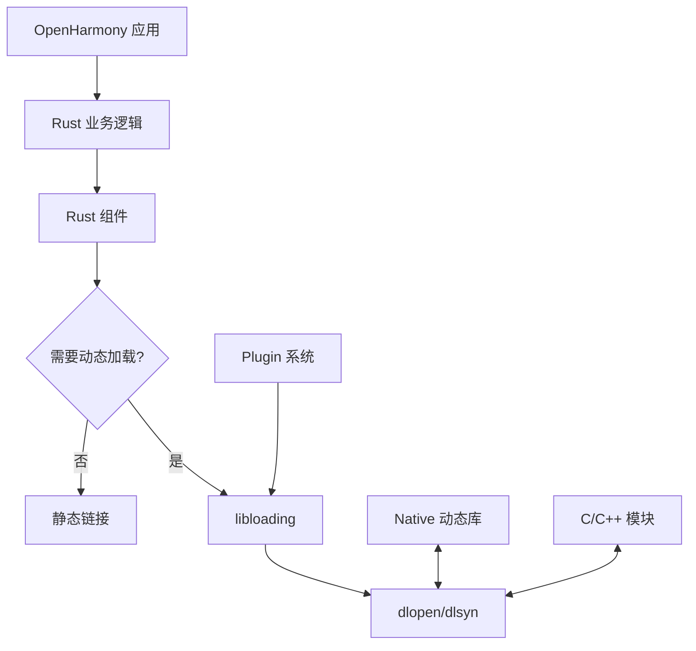
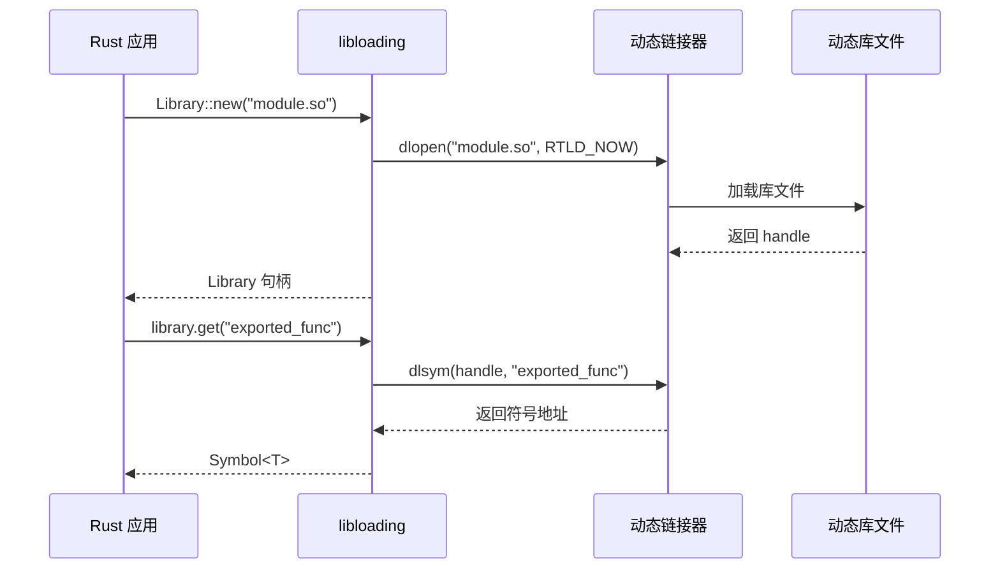

# 依赖关系与使用

## 4.1 直接依赖者分析

### 依赖搜索结果

**搜索命令**: `grep -r "third_party/rust/crates/libloading" --include="*.gn" --include="*.gni"`

**搜索结果**: 未发现直接依赖声明

### 可能原因

| 可能性 | 说明 |
|--------|------|
| 间接依赖 | libloading 被其他 Rust crate 间接依赖 |
| 路径变体 | 使用不同的依赖路径格式 |
| 新集成 | 该库可能最近才加入 OH |
| 特殊使用 | 用于特定场景，未广泛部署 |

### 依赖搜索策略建议

如果需要找到 libloading 的实际使用者，可以尝试：

```bash
# 搜索 libloading 符号引用
grep -r "libloading" --include="*.rs"

# 搜索 Cargo.toml 中的依赖
grep -r "libloading" --include="Cargo.toml"

# 搜索 Rust 源文件中的 use 语句
grep -r "use libloading" --include="*.rs"
```

## 4.2 典型使用场景

虽然当前未发现直接依赖者，以下是 libloading 在 OpenHarmony 中可能的典型使用场景：

### 场景一：Rust Plugin 系统

**用途**: 支持运行时动态加载 Rust 插件

```rust
// Plugin 加载示例
use libloading::{Library, Symbol};

pub trait Plugin {
    fn name(&self) -> &str;
    fn execute(&self) -> Result<(), String>;
}

pub struct PluginManager {
    plugins: Vec<Box<dyn Plugin>>,
}

impl PluginManager {
    pub fn load_plugin(&self, path: &str) -> Result<(), libloading::Error> {
        let library = Library::new(path)?;
        
        // 获取 Plugin 工厂函数
        let create_plugin: Symbol<fn() -> Box<dyn Plugin>> = 
            library.get(b"create_plugin")?;
        
        let plugin = create_plugin();
        self.plugins.push(plugin);
        Ok(())
    }
}
```

### 场景二：Native 模块加载

**用途**: 加载 C/C++ 编译的 Native 模块

```rust
// 加载 C 库示例
use libloading::{Library, Symbol};

pub struct CryptoModule {
    library: Library,
}

impl CryptoModule {
    pub fn new() -> Result<Self, libloading::Error> {
        let library = Library::new("libcrypto.so")?;
        Ok(Self { library })
    }
    
    pub fn md5_hash(&self, data: &[u8]) -> Result<[u8; 16], libloading::Error> {
        type Md5Func = unsafe extern "C" fn(*const u8, usize, *mut u8) -> i32;
        
        let md5_update: Symbol<Md5Func> = 
            self.library.get(b"MD5_Update")?;
        
        let mut hash = [0u8; 16];
        unsafe {
            md5_update(data.as_ptr(), data.len(), hash.as_mut_ptr());
        }
        Ok(hash)
    }
}
```

### 场景三：FFI 互操作层

**用途**: 提供 Rust 与原生代码的运行时绑定

```rust
// 运行时 FFI 绑定示例
use libloading::{Library, Symbol};

pub struct ForeignFunctionInvoker {
    library: Library,
}

impl ForeignFunctionInvoker {
    pub fn load_function<T>(&self, name: &str) -> Result<Symbol<T>, libloading::Error> {
        self.library.get(name.as_bytes())
    }
    
    pub fn call_with_string(
        &self,
        func_name: &str,
        input: &str,
    ) -> Result<i32, libloading::Error> {
        type StringFunc = unsafe extern "C" fn(*const i8) -> i32;
        
        let func: Symbol<StringFunc> = self.load_function(func_name)?;
        
        let c_string = std::ffi::CString::new(input)?;
        unsafe {
            Ok(func(c_string.as_ptr()))
        }
    }
}
```

## 4.3 使用方式详解

### 链接方式

| 链接类型 | 是否支持 | 说明 |
|----------|----------|------|
| 静态链接 | ✅ | libloading 编译为 rlib，可静态链接到 Rust 程序 |
| 动态链接 | ❌ | rlib 是静态库格式，不用于动态链接 |

### 头文件引用方式

libloading 是 Rust 库，使用 Rust 的模块系统引入：

```rust
// Cargo.toml 依赖声明
[dependencies]
libloading = "0.7"

// Rust 代码引入
use libloading::{Library, Symbol};
```

### 平台条件编译

```rust
#[cfg(unix)]
use libloading::os::unix::Library as UnixLibrary;

#[cfg(windows)]
use libloading::os::windows::Library as WindowsLibrary;
```

## 4.4 依赖关系图

由于未发现直接依赖者，以下为假设的依赖关系图：



### 可能的依赖链

```
用户 Rust 应用
    ↓
业务逻辑 Rust crate
    ↓
libloading（可选依赖）
    ↓
Native 动态库 (.so)
```

## 4.5 与其他 OH 模块的交互

### 交互模式

| 交互对象 | 交互方式 | 说明 |
|----------|----------|------|
| 动态链接器 | 系统调用 | 通过 dlopen/dlsym/dnclose |
| 文件系统 | 路径查找 | 查找 .so 文件 |
| 内存管理 | Rust 分配器 | 符号内存分配 |
| 错误处理 | Result 类型 | 统一的错误处理 |

### 符号解析流程



## 4.6 使用注意事项

### 1. 错误处理

```rust
use libloading::{Error, Library};

fn load_with_error_handling(path: &str) -> Result<Library, Error> {
    let library = Library::new(path)?;
    
    // 验证关键符号是否存在
    library.get::<unsafe extern "C" fn()>(b"required_init")?;
    
    Ok(library)
}
```

### 2. 资源管理

```rust
// libloading 自动处理资源清理
// Library 实现 Drop trait，自动调用 dlclose

fn example() {
    let _library = Library::new("module.so").unwrap();
    // library 超出作用域时自动关闭
}
```

### 3. 跨平台兼容性

```rust
// 使用 libloading 的跨平台抽象
use libloading::Library;

#[cfg(unix)]
fn load_library(path: &str) -> Result<Library, libloading::Error> {
    Library::new(path)
}

#[cfg(windows)]
fn load_library(path: &str) -> Result<Library, libloading::Error> {
    Library::new(path)
}

// 或者更简洁的方式
fn load_library(path: &str) -> Result<Library, libloading::Error> {
    Library::new(path)
}
```

## 4.7 性能考虑

### 加载性能

| 操作 | 性能特征 | 优化建议 |
|------|----------|----------|
| dlopen | 较慢（文件 I/O） | 缓存已加载的库 |
| dlsym | 较快（符号表查找） | 预加载常用符号 |
| dlclose | 快 | 通常不需要立即关闭 |

### 使用建议

```rust
// 缓存模式示例
use std::sync::Arc;
use libloading::Library;

pub struct LibraryCache {
    cache: dashmap::DashMap<String, Arc<Library>>,
}

impl LibraryCache {
    pub fn get_or_load(&self, path: &str) -> Result<Arc<Library>, libloading::Error> {
        if let Some(lib) = self.cache.get(path) {
            return Ok(Arc::clone(&lib));
        }
        
        let library = Arc::new(Library::new(path)?);
        self.cache.insert(path.to_string(), Arc::clone(&library));
        Ok(library)
    }
}
```

## 4.8 总结

libloading 在 OpenHarmony 中的使用特点：

| 特点 | 说明 |
|------|------|
| 依赖发现 | 未发现直接依赖者 |
| 典型场景 | Plugin 系统、Native 模块加载、FFI 互操作 |
| 链接方式 | 静态链接 (rlib) |
| 跨平台支持 | 通过 cfg-if 自动处理 |
| 资源管理 | 自动 Drop，无需手动管理 |

libloading 为 OpenHarmony 的 Rust 生态提供了标准的动态库加载能力，但由于其使用场景相对特定，可能不会在大量模块中直接使用。
