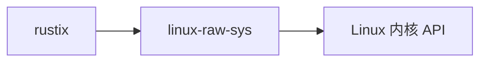
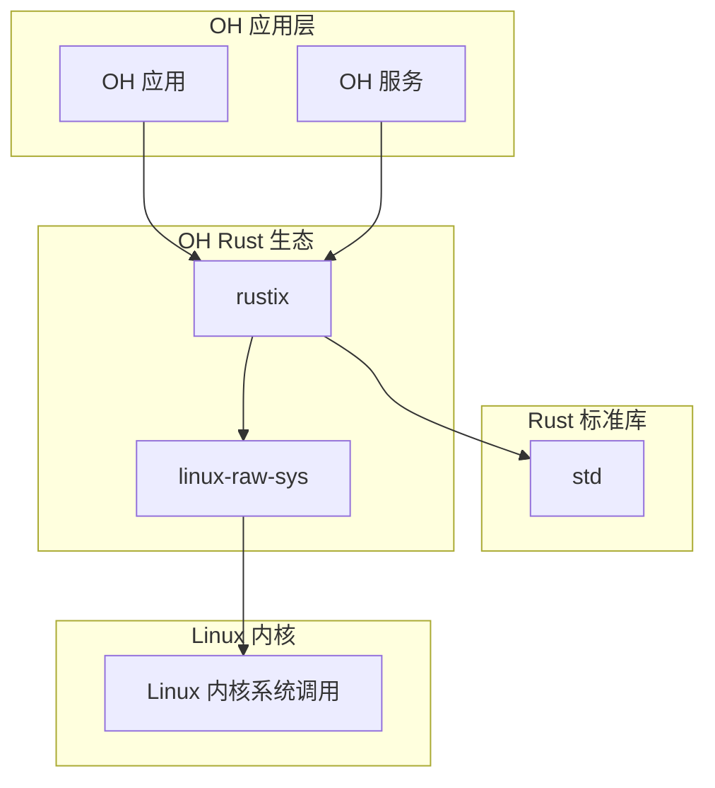

# OH 使用情况与依赖关系

## 一、依赖关系概述

### 1.1 在 OH 生态中的位置

linux-raw-sys 在 OpenHarmony Rust 生态中扮演着**底层基础设施**的角色。它不直接面向应用开发者，而是作为更高级库（rustix）的底层依赖存在。

```
OpenHarmony 架构层次
═══════════════════════════════════════
    应用层 / 用户进程
─────────────────────────────────────
    rustix（安全系统调用封装层）
─────────────────────────────────────
    linux-raw-sys（原始绑定层）
─────────────────────────────────────
    Linux 内核（系统调用接口）
═══════════════════════════════════════
```

### 1.2 直接依赖者

| 模块名称 | 类型 | 依赖路径 | 主要用途 |
|----------|------|----------|----------|
| rustix | 直接依赖 | //third_party/rust/crates/rustix | 提供安全的 Linux 系统调用 API |

**说明**：目前仅发现 rustix 直接依赖 linux-raw-sys。

### 1.3 间接依赖者

由于 rustix 被多个 OH 模块使用，linux-raw-sys 存在以下间接依赖链：

```
linux-raw-sys
    └── rustix
            ├── [OH 网络模块]
            ├── [OH 文件系统模块]
            ├── [OH 进程管理模块]
            └── [其他使用 rustix 的模块]
```

## 二、rustix 依赖分析

### 2.1 rustix 简介

rustix 是建立在 linux-raw-sys 之上的安全 Rust 系统调用库，提供：

- **类型安全**：使用 Rust 枚举和结构体
- **内存安全**：避免原始指针操作
- **错误处理**：使用 Result 类型
- **更友好的 API**：符合 Rust 惯用法

### 2.2 依赖声明

**rustix/BUILD.gn 中的依赖声明**：

```gn
ohos_cargo_crate("lib") {
  crate_name = "rustix"
  # ... 其他配置 ...
  deps = [
    "//third_party/rust/crates/linux-raw-sys:lib",
    # ... 其他依赖 ...
  ]
}
```

**rustix/Cargo.toml 中的依赖声明**：

```toml
[dependencies]
linux-raw-sys = { path = "../linux-raw-sys", version = "0.1.4" }
```

### 2.3 使用方式

rustix 底层使用 linux-raw-sys 的方式进行系统调用：

```rust
// rustix 内部代码示例（简化）
use linux_raw_sys::general::syscalls::read;

fn read_fd(fd: RawFd, buf: &mut [u8]) -> Result<usize, Errno> {
    // 底层调用使用 linux-raw-sys 定义的接口
    let ret = read(fd as i32, buf.as_mut_ptr(), buf.len());
    // ... 错误处理 ...
}
```

## 三、使用场景分析

### 3.1 典型使用场景

由于 linux-raw-sys 主要被 rustix 使用，最终用户一般不会直接使用它。以下是 rustix 在 OH 中的典型使用场景：

#### 场景一：文件系统操作

```rust
// 使用 rustix 进行文件读写（间接使用 linux-raw-sys）
use rustix::fs::{open, OpenFlags, Stat};
use rustix::fd::AsRawFd;

let file = open("/data/test.txt", OpenFlags::RDONLY, 0o644)?;
let stat = Stat::from_fd(&file)?;
```

#### 场景二：网络通信

```rust
// 使用 rustix 进行网络编程
use rustix::net::{socket, AddressFamily, SocketType, SockFlag};
use rustix::net::sockaddr::{Sockaddr, InetSockaddr};

let sock = socket(AddressFamily::INET, SocketType::STREAM, SockFlag::CLOEXEC)?;
```

#### 场景三：进程管理

```rust
// 使用 rustix 进行进程操作
use rustix::process::{fork, Fork};
use rustix::thread::{clone, CloneFlags};

let thread = clone(|| {
    // 子线程代码
    0
}, CloneFlags::SIGCHLD)?;
```

### 3.2 适用模块

根据 rustix 的功能范围，以下 OH 模块可能间接使用 linux-raw-sys：

| 模块类别 | 可能的使用方式 |
|----------|----------------|
| 网络模块 | socket 创建、数据收发 |
| 文件系统模块 | 文件操作、目录遍历 |
| 进程模块 | 进程创建、线程管理 |
| 系统信息模块 | 系统参数查询 |
| 设备 I/O 模块 | 设备控制操作 |

## 四、依赖关系图

### 4.1 直接依赖图



### 4.2 完整依赖图（简化）



## 五、链接方式

### 5.1 静态链接

linux-raw-sys 以 **静态库**（.rlib）形式被链接：

| 链接类型 | 说明 |
|----------|------|
| 静态链接 | librust_linux_raw_sys.rlib 链接到 rustix 的 rlib 中 |
| 最终产物 | 随应用或服务一起编译为最终可执行文件 |

### 5.2 依赖传递

```
最终可执行文件
    │
    ├── rustix 代码
    │
    └── linux-raw-sys 绑定（静态嵌入）
```

## 六、版本兼容性

### 6.1 当前版本

| 库 | 版本 | 状态 |
|----|------|------|
| linux-raw-sys | 0.1.4 | 当前使用 |
| rustix | 需确认 | 依赖 0.1.4 |

### 6.2 版本要求

rustix 对 linux-raw-sys 的版本要求：

```toml
# rustix/Cargo.toml
[dependencies]
linux-raw-sys = "0.1"
```

这意味着 rustix 兼容 0.1.x 系列版本。

## 七、最佳实践

### 7.1 对应用开发者的建议

1. **不要直接使用**：如非必要，不要在应用代码中直接使用 linux-raw-sys
2. **使用 rustix**：通过 rustix 访问 Linux 系统调用更安全、更 Rust 化
3. **关注 rustix 更新**：rustix 更新时会处理 linux-raw-sys 的兼容性

### 7.2 对库开发者的建议

1. **向上游贡献**：如果需要新的绑定，考虑向上游 linux-raw-sys 项目贡献
2. **保持版本同步**：更新版本时确保与 rustix 的兼容性
3. **测试验证**：更改版本后运行 rustix 的测试套件

## 八、故障排查

### 8.1 常见问题

#### 问题一：链接冲突

**现象**：出现 duplicate symbol 错误

**可能原因**：多个 rustix 版本依赖不同版本的 linux-raw-sys

**解决方案**：统一 linux-raw-sys 的版本

#### 问题二：特性未启用

**现象**：某些 API 不可用

**可能原因**：对应的 features 未在 BUILD.gn 中启用

**解决方案**：在 BUILD.gn 的 features 列表中添加对应特性

### 8.2 排查命令

```bash
# 检查依赖版本
cargo tree -p linux-raw-sys

# 检查构建产物
ls -la out/.../librust_linux_raw_sys.rlib

# 检查特性是否启用
grep features rustix/BUILD.gn
```

---

**文档版本**：1.0
**最后更新**：2024年
**依赖分析范围**：直接依赖和一级间接依赖
