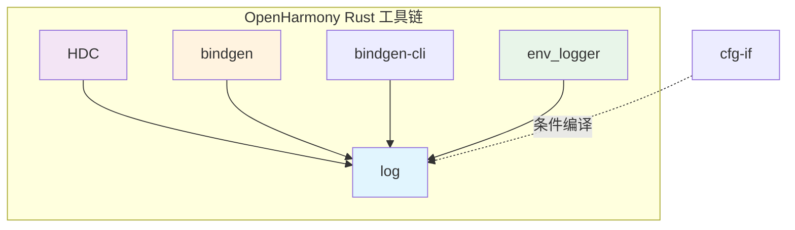

# 依赖关系与使用

## 直接依赖者

### 依赖清单

| 模块 | BUILD.gn 路径 | 引用次数 | 主要用途 |
|-----|--------------|---------|---------|
| **hdc** | developtools/hdc/hdc_rust/BUILD.gn | 3 | 设备通信工具日志 |
| **hdc** | developtools/hdc/BUILD.gn | 2 | 同上 |
| **bindgen** | third_party/rust/crates/bindgen/bindgen/BUILD.gn | 1 | 绑定生成日志 |
| **bindgen-cli** | third_party/rust/crates/bindgen/bindgen-cli/BUILD.gn | 1 | CLI 工具日志 |
| **env_logger** | third_party/rust/crates/env_logger/BUILD.gn | 1 | 日志实现依赖 |

**总计**：5 个 BUILD.gn 引用点，3 个独立模块

### 依赖关系图



## 详细使用场景

### 1. HDC (Huawei Device Connector)

HDC 是 OpenHarmony 的设备通信工具，用于设备与主机之间的调试和文件传输。

#### 使用位置

```
developtools/hdc/hdc_rust/BUILD.gn
```

#### 使用方式

```gn
# hdc_rust 中的依赖声明
ohos_rust_library("hdc_core") {
  crate_name = "hdc_core"
  deps = [
    "//third_party/rust/crates/log:lib",  # 日志输出
    "//third_party/rust/crates/env_logger:lib",
    # ... 其他依赖
  ]
}
```

#### 日志示例

```rust
// HDC 中的典型日志使用
use log::{info, warn, error};

info!("Device connected: {}", device_id);
warn!("Connection timeout, retrying...");
error!("Failed to transfer file: {}", err);
```

#### 集成方式

- **静态链接**：log 库静态链接到 hdc_core
- **日志实现**：配合 env_logger 使用
- **日志级别**：通常配置为 Info 或 Debug 级别

### 2. Bindgen

Bindgen 是 Rust FFI 绑定生成器，用于从 C 头文件生成 Rust 绑定。

#### 使用位置

```
third_party/rust/crates/bindgen/bindgen/BUILD.gn
```

#### 使用方式

```gn
# bindgen 中的依赖声明
ohos_cargo_crate("lib") {
  crate_name = "bindgen"
  deps = [
    "//third_party/rust/crates/log:lib",
    # ... 其他依赖
  ]
}
```

#### 日志示例

```rust
// Bindgen 构建日志
info!("Parsing header: {}", header_path);
debug!("Found {} declarations", decl_count);
warn!("Unknown attribute: {}", attr_name);
```

#### 集成方式

- **静态链接**：log 库静态链接到 bindgen
- **日志级别**：通常配置为 Warn 或 Error 级别（构建工具通常减少日志输出）

### 3. Env_logger

Env_logger 是一个日志实现库，读取环境变量配置日志级别，将日志输出到 stderr。

#### 使用位置

```
third_party/rust/crates/env_logger/BUILD.gn
```

#### 使用方式

```gn
# env_logger 对 log 的依赖
ohos_cargo_crate("lib") {
  crate_name = "env_logger"
  deps = [
    "//third_party/rust/crates/log:lib",  # 依赖日志门面
    "//third_party/rust/crates/termcolor:lib",
    # ... 其他依赖
  ]
}
```

#### 集成方式

- **门面依赖**：env_logger 实现 Log trait
- **消费者**：hdc、bindgen 等工具通过 env_logger 使用 log

```rust
// env_logger 的典型使用模式
use log::info;
use env_logger::Env;

env_logger::Builder::from_env(Env::default().default_filter_or("info"))
    .init();

info!("Application started");
```

## 依赖关系详解

### 依赖链分析

```
log (日志门面)
│
├── hdc ────────────────→ 直接使用日志宏
│
├── bindgen ────────────→ 直接使用日志宏
│
└── env_logger ─────────→ 实现 Log trait
    │
    └── hdc, bindgen ───→ 使用 env_logger 作为日志实现
```

### 静态链接关系

| 组件 | 链接类型 | 说明 |
|-----|---------|-----|
| log → hdc | 静态链接 | log.rlib 链接到 hdc 二进制 |
| log → bindgen | 静态链接 | log.rlib 链接到 bindgen 二进制 |
| log → env_logger | 静态链接 | log.rlib 链接到 env_logger |
| env_logger → hdc | 静态链接 | env_logger + log 一起链接 |

## 在 OH 中的定位

### 系统架构位置

```
┌──────────────────────────────────────────────────────────┐
│                   OpenHarmony 系统                        │
├──────────────────────────────────────────────────────────┤
│                                                          │
│  ┌──────────────┐    ┌──────────────┐                   │
│  │    HDC       │    │   Bindgen    │  ← Rust 工具链    │
│  └──────┬───────┘    └──────┬───────┘                   │
│         │                   │                            │
│         ▼                   ▼                            │
│  ┌──────────────────────────────────┐                    │
│  │      env_logger + log            │  ← 日志基础设施   │
│  └──────────────────────────────────┘                    │
│                                                          │
│  ┌──────────────────────────────────┐                    │
│  │     OHOS 底层系统日志             │                   │
│  └──────────────────────────────────┘                    │
│                                                          │
└──────────────────────────────────────────────────────────┘
```

### 作用总结

| 维度 | 描述 |
|-----|-----|
| **依赖层级** | 基础库，被工具链依赖 |
| **功能角色** | 统一日志接口抽象 |
| **位置** | Rust 工具链的基础组件 |
| **必需性** | 可选但推荐（工具普遍使用） |

## 头文件引用

### Rust 代码引用方式

```rust
// 基础日志宏
use log::{error, warn, info, debug, trace};

// 记录器初始化
use log::{Log, Level, LevelFilter};

// 结构化日志（如果启用 kv_unstable）
use log::{as_serde, as_error};
```

### 模块结构

```
log crate
├── macros      → error!, warn! 等宏
├── Log         → 日志记录器 trait
├── Level       → 日志级别枚举
├── LevelFilter → 日志级别过滤
├── Record      → 日志记录结构
├── Metadata    → 日志元数据
└── kv/         → 结构化日志（OH 未启用）
```

## 版本兼容性

### 依赖版本要求

| 依赖者 | 最低 log 版本 | 测试状态 |
|-------|-------------|---------|
| hdc | 0.4.17 | 正常 |
| bindgen | 0.4.17 | 正常 |
| env_logger | 0.4.x | 兼容 0.4.17 |

### 升级影响评估

| 升级场景 | 影响范围 | 风险 |
|---------|---------|-----|
| Patch 版本 (0.4.x → 0.4.y) | 低 | 低 |
| Minor 版本 (0.4 → 0.5) | 中 | 中（API 可能变化） |
| Major 版本 (0.x → 1.x) | 高 | 高（breaking changes） |

**建议**：仅在必要时升级，并充分测试依赖者。
