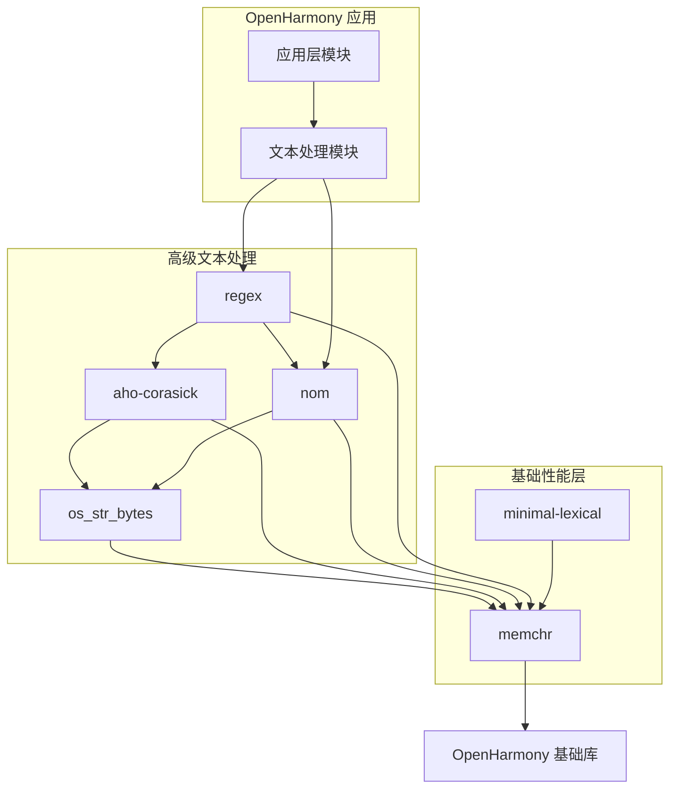

# 依赖关系与使用

## 直接依赖者

memchr 库在 OpenHarmony 生态中被以下 Rust crates 直接依赖。这些依赖者代表了 memchr 在 OH 系统中的应用场景和价值体现。

### 依赖者列表

| 序号 | 模块名称 | BUILD.gn 路径 | 主要用途 | 依赖方式 |
|------|----------|---------------|----------|----------|
| 1 | os_str_bytes | //third_party/rust/crates/os_str_bytes:BUILD.gn | 字符串与字节序列之间的转换 | 直接依赖 |
| 2 | aho-corasick | //third_party/rust/crates/aho-corasick:BUILD.gn | 多模式字符串匹配算法（Aho-Corasick） | 直接依赖 |
| 3 | nom | //third_party/rust/crates/nom:BUILD.gn | 解析器组合子库 | 直接依赖 |
| 4 | regex | //third_party/rust/crates/regex:BUILD.gn | 正则表达式引擎 | 直接依赖 |
| 5 | minimal-lexical | //third_party/rust/crates/minimal-lexical:BUILD.gn | 高性能数字解析与序列化 | 直接依赖 |

### 依赖详情说明

#### os_str_bytes

os_str_bytes 库提供了 Rust 字符串类型与字节序列之间的安全转换功能。该库使用 memchr 进行字节序列中的字符定位和搜索操作，是字符串处理管道中的基础组件。

#### aho-corasick

aho-corasick 库实现了著名的 Aho-Corasick 多模式匹配算法，用于在单个输入中同时搜索多个模式。memchr 被用作底层字符搜索原语，为该算法提供高效的字节匹配能力。该库在日志分析、关键字过滤、数据解析等场景中有广泛应用。

#### nom

nom 是一个用 Rust 编写的解析器组合子库，用于构建高效的解析器。该库使用 memchr 进行分隔符搜索和模式匹配，是数据解析场景中的重要依赖。

#### regex

regex 库提供了正则表达式功能，是 Rust 生态正则表达式 crate中最流行的 之一。该库使用 memchr 进行底层文本搜索，为正则表达式匹配提供性能基础。regex 在 OpenHarmony 的文本处理、输入验证、日志分析等场景中发挥重要作用。

#### minimal-lexical

minimal-lexical 库专注于高性能的数字类型解析和序列化。在解析数字字符串时，需要进行字符搜索和验证，memchr 为这些操作提供高效的字节查找能力。

## 依赖关系图

以下图表展示了 memchr 在 OpenHarmony Rust 生态中的位置和依赖关系：



### 依赖层级说明

memchr 库在 OpenHarmony 依赖层级中处于**第二层**位置：

- **第一层（应用层）**：直接面向应用的模块
- **第二层（高级库）**：regex、aho-corasick、nom 等提供高级功能的库
- **第三层（性能层）**：memchr 等提供底层优化的库（本库位置）

这种层级结构确保了：
- 高层库可以获得经过充分测试的底层优化
- 性能改进可以在底层统一实现并惠及所有依赖者
- 维护和升级可以分层进行，降低系统性风险

## 使用方式详解

### 依赖添加方式

在 OpenHarmony 的 Rust 模块中添加 memchr 依赖，需要在 BUILD.gn 文件中配置以下内容：

```gn
deps = ["//third_party/rust/crates/memchr:lib"]
```

### 静态链接说明

memchr 库以**静态链接**方式被集成到依赖模块中：

- **链接类型**：rlib 静态库
- **链接时机**：编译时静态链接
- **产物影响**：成为最终二进制文件的一部分

这种链接方式确保了：
- 运行时无需额外的动态库依赖
- 优化器可以进行跨 crate 的内联和优化
- 部署包包含所有必要的代码

### 典型使用场景

#### 场景一：正则表达式匹配

regex 库是 memchr 最主要的调用方。典型的使用场景包括：

```rust
// 应用代码示例（非 OpenHarmony 特化）
use regex::Regex;

let re = Regex::new(r"\d+").unwrap();
let text = "version 1.0.0 released";
if let Some(m) = re.find(text) {
    println!("Found version: {}", m.as_str());
}
```

在上述场景中，regex 内部使用 memchr 进行字节级别的搜索优化。

#### 场景二：多模式关键词过滤

aho-corasick 库使用 memchr 进行高效的多模式匹配：

```rust
// aho-corasick 使用示例
use aho_corasick::AhoCorasick;

let patterns = &["apple", "banana", "cherry"];
let ac = AhoCorasick::new(patterns);
let text = "I like apple and banana";
for mat in ac.find_iter(text) {
    println!("Found: {}", patterns[mat.pattern()]);
}
```

#### 场景三：分隔符解析

nom 解析器使用 memchr 进行分隔符定位：

```rust
// nom 使用示例
use nom::bytes::complete::tag;

fn parse_comma_separated(input: &str) -> nom::IResult<&str, Vec<&str>> {
    // 使用 tag! 解析特定分隔符，内部可能使用 memchr 优化
    nom::multi::separated_list0(tag(","), nom::bytes::complete::take_until1(","))(input)
}
```

## 性能特性影响

### SIMD 加速的效果

memchr 库为所有依赖者带来了 SIMD 加速的搜索性能。在支持的平台上，搜索性能可以获得 5-10 倍的提升：

| 操作类型 | 简单迭代实现 | memchr SIMD 实现 | 加速比 |
|----------|--------------|------------------|--------|
| 单字节搜索 | 基线 | SIMD 优化 | ~5-10x |
| 多字节搜索 | 基线 | SIMD 优化 | ~3-5x |
| 子字符串搜索 | 基线 | Two-Way + SIMD | ~2-5x |

### 性能优势传递

由于 memchr 被多个高级库依赖，其性能优势会传递给所有使用者：

```
应用层 --> regex --> memchr --> SIMD 加速
           |
           --> aho-corasick --> memchr --> SIMD 加速
           |
           --> nom --> memchr --> SIMD 加速
```

### 性能配置建议

为确保获得最佳性能，建议：

1. **启用 std 特性**：确保依赖链中 std 特性保持启用状态
2. **使用 release 构建**：性能优化主要在 release profile 下生效
3. **考虑目标平台**：SIMD 加速效果在支持的 CPU 架构上更明显

## 版本兼容性

### 版本要求

| 依赖者 | 使用的 memchr 版本 | 说明 |
|--------|-------------------|------|
| os_str_bytes | 2.4.0 | Cargo.toml 中指定 |
| aho-corasick | 2.4.0 | Cargo.toml 中指定 |
| nom | 2.4.0 | Cargo.toml 中指定 |
| regex | 2.4.0 | Cargo.toml 中指定 |
| minimal-lexical | 2.4.0 | Cargo.toml 中指定 |

当前 OH 中集成的 memchr 版本为 2.5.0，与上述依赖者的版本要求兼容。

### 版本升级影响

升级 memchr 版本时需要注意：

1. **API 兼容性**：memchr 2.x 系列 API 相对稳定，2.4.0 到 2.5.0 主要是 bug 修复和性能改进
2. **依赖兼容性**：确认所有依赖者在新版本下正常工作
3. **性能回归**：建立性能基准，确保升级不导致性能下降

## 相关文档

- [01_Overview.md](./01_Overview.md) - 库功能概述
- [02_Patches.md](./02_Patches.md) - Patch 分析
- [03_Build_Integration.md](./03_Build_Integration.md) - 构建配置详解
- [ASSESSMENT.md](./_work/ASSESSMENT.md) - 完整评估报告
