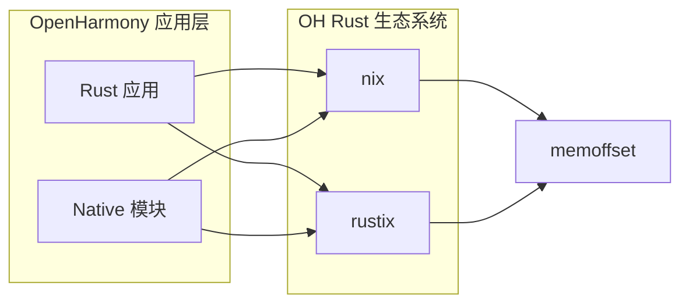

# OH 使用情况

## 概述

memoffset 在 OpenHarmony 中作为**底层支撑库**，主要通过间接依赖的方式被使用。该库本身不直接被 OH 应用代码引用，而是作为 nix 和 rustix 等 Rust crates 的依赖被引入。

## 直接依赖者

### 依赖者列表

| 模块 | BUILD.gn 路径 | 用途 | 依赖方式 |
|------|--------------|------|---------|
| nix | //third_party/rust/crates/nix/BUILD.gn | Unix 系统调用绑定 | optional feature |
| rustix | //third_party/rust/crates/rustix/BUILD.gn | 现代 Unix 系统调用绑定 | 编译依赖 |

### 依赖者详细信息

#### 1. nix crate

**路径**: //third_party/rust/crates/nix

**版本**: v0.30.1

**Cargo.toml 引用**:
```toml
[dependencies]
memoffset = { version = "0.9", optional = true }

[features]
socket = ["memoffset"]
```

**依赖条件**: 仅在启用 `socket` feature 时依赖 memoffset

**使用场景**: 
- socket 网络编程
- 底层网络结构体操作

#### 2. rustix crate

**路径**: //third_party/rust/crates/rustix

**版本**: ~0.38.x（待确认）

**依赖方式**: 直接编译依赖

**使用场景**:
- 现代 Unix 系统调用
- 进程、线程、文件系统操作

## 依赖关系图

### Mermaid 依赖图



### 依赖链说明

| 层级 | 组件 | 说明 |
|------|------|------|
| L1 | 应用/Native 模块 | 直接使用 nix 或 rustix |
| L2 | nix / rustix | Unix API 绑定库 |
| L3 | memoffset | 偏移量计算支撑库 |

### 架构位置

```
+-------------------------+
|   Rust 应用层           |
|   (ace_napi, etc.)      |
+-----------+-------------+
            |
            v
+-------------------------+
|   系统绑定层             |
|   (nix, rustix)         |
+-----------+-------------+
            |
            v
+-------------------------+
|   底层支撑层             |
|   (memoffset, libc)     |
+-------------------------+
```

## 使用方式

### 链接方式

| 方式 | 说明 |
|------|-----|
| 静态链接 | memoffset 编译为 rlib，静态链接到 nix/rustix |

### 头文件引用

memoffset 不提供 C 头文件，仅提供 Rust 宏：

```rust
// Rust 代码使用方式
use memoffset::{offset_of, span_of};
```

### 典型使用场景

#### 场景 1：Socket 结构体操作

```rust
// nix crate 中的典型使用
use memoffset::offset_of;

#[repr(C)]
struct sockaddr_in {
    sin_family: u16,
    sin_port: u16,
    sin_addr: [u8; 4],
    // ...
}

// 计算字段偏移量用于 FFI 调用
let addr_offset = offset_of!(sockaddr_in, sin_addr);
let port_offset = offset_of!(sockaddr_in, sin_port);
```

#### 场景 2：系统调用参数构造

```rust
// 构造 iovec 结构用于 readv/writev 系统调用
use memoffset::span_of;

#[repr(C)]
struct iovec {
    iov_base: *mut libc::c_void,
    iov_len: usize,
}

fn writev_all(fd: libc::c_int, iovs: &[iovec]) -> libc::ssize_t {
    // 计算整个 iovec 数组的内存范围
    let total_span = span_of!(iovs[0]..=iovs[iovs.len()-1]);
    // ...
}
```

#### 场景 3：序列化/反序列化

```rust
// 二进制协议构造
use memoffset::{offset_of, span_of};

#[repr(C, packed)]
struct Message {
    header: ProtocolHeader,
    payload: [u8; 1024],
    footer: [u8; 4],
}

fn serialize_message(msg: &Message, buffer: &mut [u8]) {
    // 计算校验和范围
    let checksum_range = span_of!(Message, header..footer);
    let checksum = compute_checksum(&buffer[checksum_range]);

    // 填充校验和字段
    let checksum_offset = offset_of!(Message, footer);
    buffer[checksum_offset..][..2].copy_from_slice(&checksum.to_le_bytes());
}
```

## OH 特有的使用方式

### OpenHarmony 系统调用支持

memoffset 通过 nix/rustix 支持 OpenHarmony 的特殊系统调用：

| 系统调用类型 | OH 支持情况 | 使用场景 |
|-------------|-------------|---------|
| 标准 POSIX | nix/rustix 支持 | 文件 IO、进程控制 |
| OH 特有 | 待确认 | 设备驱动、HDF |

### 架构适配

memoffset 确保在不同 CPU 架构下偏移量计算的一致性：

| 架构 | 支持状态 | 说明 |
|------|---------|------|
| aarch64 | ✓ | OH 主要目标架构 |
| x86_64 | ✓ | 开发/仿真环境 |
| armv7 | ✓ | 低端设备支持 |
| riscv64 | ✓ | 新架构支持 |

## 在 OH 子系统中的使用

### 涉及的子系统

| 子系统 | 模块 | 使用方式 |
|-------|------|---------|
| 第三方组件 | nix | 基础系统调用 |
| 第三方组件 | rustix | 现代系统调用 |
| 开发者工具 | (潜在) | FFI 工具 |

### 关键应用场景

#### 网络模块

```
应用场景: HTTP 客户端、网络库
└── 使用 nix socket feature
    └── 依赖 memoffset
        └── 计算 sockaddr 相关偏移
```

#### 文件系统操作

```
应用场景: 文件读写、目录操作
└── 使用 rustix fs 模块
    └── 依赖 memoffset
        └── 计算 dirent, stat 等偏移
```

## 版本兼容性

### OH 版本与 memoffset 版本

| OH 版本 | memoffset 版本 | 状态 |
|---------|---------------|------|
| OH 6.1 | v0.9.1 | 当前使用 |
| OH 6.0 | v0.9.1 | 可能使用 |
| OH 5.0 | v0.9.0 | 待确认 |

### Rust 版本要求

| Rust 版本 | memoffset 支持 | OH 支持 |
|-----------|---------------|---------|
| 1.19+ | ✓ | OH 标准工具链 |
| 1.65+ | ✓ const | OH 标准工具链 |
| 1.77+ | ✓ std forward | 新版 OH |

## 维护考量

### 升级影响评估

| 升级场景 | 影响范围 | 注意事项 |
|---------|---------|---------|
| memoffset 小版本升级 | 低 | 验证兼容性即可 |
| memoffset 大版本升级 | 中 | 检查 API 变更 |
| Rust 1.77+ 适配 | 低 | 自动使用 std |

### 依赖风险

| 风险 | 级别 | 缓解措施 |
|------|-----|---------|
| 上游停止维护 | 低 | 考虑 Fork 或替换方案 |
| API 不兼容变更 | 低 | 锁定版本，谨慎升级 |
| 安全漏洞 | 中 | 关注 CVE，及时更新 |

## 性能考量

### 编译时影响

- **宏展开**: 编译时展开，无运行时开销
- **依赖大小**: rlib 体积小，链接开销低
- **增量编译**: 支持，优化编译时间

### 运行时影响

- **零运行时开销**: 偏移量在编译期计算
- **无动态分配**: 完全静态编译
- **无锁/同步**: 单线程使用，无竞争

## 最佳实践

### 在 OH 中使用 memoffset

**推荐方式**: 通过 nix/rustix 间接使用

```rust
// 不直接使用 memoffset
use memoffset::{offset_of, span_of};  // 不推荐

// 而是通过 nix/rustix
use nix::sys::socket::SockAddr;  // 推荐
```

### 贡献 OH 代码

如需在 OH 代码中使用偏移量计算：

1. **优先使用 nix/rustix**: 已有成熟的 API
2. **直接使用 std**: Rust 1.77+ 使用 `core::mem::offset_of!`
3. **仅在必要时引入**: 如需新功能，考虑贡献给上游

## 相关文档

- [上游 memoffset](https://github.com/Gilnaa/memoffset)
- [nix crate](https://github.com/nix-rust/nix)
- [rustix crate](https://github.com/bytecodealliance/rustix)
- [Rust offset_of 文档](https://doc.rust-lang.org/std/mem/fn.offset_of.html)
