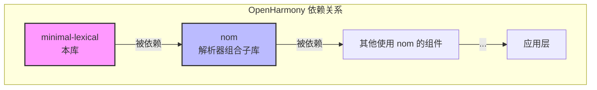
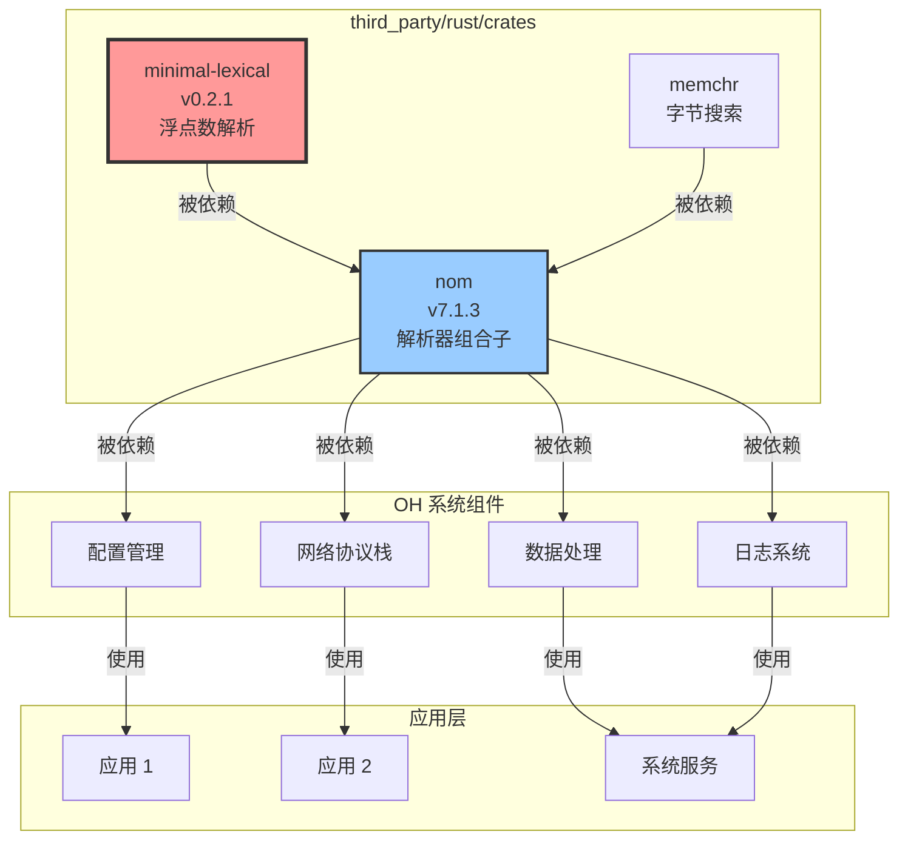

# 04 - OpenHarmony 中的依赖关系与使用

## 4.1 依赖者总览

### 4.1.1 直接依赖者

通过搜索 OH 代码库中所有引用 `third_party/rust/crates/minimal-lexical` 的 BUILD.gn 文件，发现 **1 个直接依赖者**：

| 序号 | 模块名称 | BUILD.gn 路径 | 依赖类型 | 用途 |
|------|---------|--------------|---------|------|
| 1 | **nom** | `//third_party/rust/crates/nom/BUILD.gn` | 直接依赖 | 浮点数解析 |

### 4.1.2 搜索命令

```bash
# 在 OH 代码库中搜索依赖
$ grep -r "third_party/rust/crates/minimal-lexical" \
    /Volumes/lexar/code/d/work/oh \
    --include="*.gn" --include="*.gni"

# 结果
/third_party/rust/crates/nom/BUILD.gn:        "//third_party/rust/crates/minimal-lexical:lib",
```

### 4.1.3 依赖关系图



## 4.2 主要依赖者详解：nom

### 4.2.1 nom 简介

**nom** 是 Rust 语言中最流行的 **Parser Combinator（解析器组合子）** 库之一。

| 属性 | 值 |
|------|-----|
| **名称** | nom |
| **版本** | 7.1.3（OH 版本） |
| **上游** | https://github.com/rust-bakery/nom |
| **许可证** | MIT |
| **功能** | 字节级、零拷贝的解析器组合子库 |

### 4.2.2 nom 在 OH 中的 BUILD.gn

```gn
# Copyright (c) 2023 Huawei Device Co., Ltd.
# Licensed under the Apache License, Version 2.0 (the "License");
# ...

import("//build/ohos.gni")

ohos_cargo_crate("lib") {
    crate_name = "nom"
    crate_type = "rlib"
    crate_root = "src/lib.rs"

    sources = ["src/lib.rs"]
    edition = "2018"
    cargo_pkg_version = "7.1.3"
    cargo_pkg_authors = "contact@geoffroycouprie.com"
    cargo_pkg_name = "nom"
    cargo_pkg_description = "A byte-oriented, zero-copy, parser combinators library"
    
    # 关键：依赖 minimal-lexical
    deps = [
        "//third_party/rust/crates/memchr:lib",
        "//third_party/rust/crates/minimal-lexical:lib",  # <-- 依赖本库
    ]
    
    features = [
        "alloc",
        "std",
    ]
    module_output_extension = ".rlib"
    part_name = "rust_nom"
    subsystem_name = "thirdparty"
}
```

### 4.2.3 nom 如何使用 minimal-lexical

nom 在其浮点数解析器中使用了 minimal-lexical。具体使用方式：

```rust
// nom 源码示例（概念展示）
// 文件：nom 的 number 模块

use minimal_lexical::parse_float;

// 解析浮点数的 parser
pub fn float_parser(input: &str) -> IResult<&str, f64> {
    // 1. 解析整数部分
    // 2. 解析小数部分
    // 3. 解析指数部分
    // 4. 调用 minimal-lexical 的 parse_float
    let value = parse_float(
        integer_part.iter(),
        fraction_part.iter(),
        exponent
    );
    Ok((remaining, value))
}
```

### 4.2.4 nom 的功能特性

nom 提供以下解析能力：

| 功能类别 | 说明 | 示例 |
|---------|------|------|
| **字节解析** | 处理二进制数据 | 解析二进制协议、文件格式 |
| **文本解析** | 处理字符串数据 | 解析配置文件、日志 |
| **流式解析** | 处理不完整数据 | 网络协议解析 |
| **零拷贝** | 避免不必要的数据复制 | 高性能解析 |

### 4.2.5 依赖链：nom <- minimal-lexical

| 依赖层级 | 库 | 说明 |
|---------|-----|------|
| Level 0 | minimal-lexical | 本库，最底层 |
| Level 1 | nom | 使用 minimal-lexical 进行浮点数解析 |
| Level 2 | 使用 nom 的组件 | 各种解析器 |
| Level 3 | 应用层 | 最终应用 |

## 4.3 间接依赖者分析

### 4.3.1 潜在间接依赖者

虽然无法精确定位所有间接依赖者（需要遍历整个 OH 代码库的 Rust 依赖图），但可以推测以下类型的组件可能通过 nom 间接依赖 minimal-lexical：

| 组件类型 | 可能的使用场景 | 示例 |
|---------|--------------|------|
| **配置文件解析器** | 解析 JSON、TOML、YAML | 配置管理模块 |
| **网络协议实现** | HTTP、自定义协议解析 | 网络栈 |
| **数据序列化库** | 数据格式转换 | IPC 模块 |
| **日志解析器** | 日志分析和处理 | 日志系统 |
| **编译器前端** | 源码解析 | DSL 实现 |

### 4.3.2 依赖传播路径

```
minimal-lexical
    └── nom
        ├── 配置文件解析库 (如 toml-rs, serde_json)
        │       └── 配置管理组件
        │
        ├── 网络协议库
        │       └── HTTP 服务器/客户端
        │
        ├── 数据格式解析库
        │       └── 数据处理组件
        │
        └── 其他使用 nom 的组件
                └── ...
```

## 4.4 使用场景分析

### 4.4.1 典型使用场景

#### 场景 1：配置文件解析

```rust
// 解析配置文件中的浮点数
use nom::number::complete::double;

fn parse_config(input: &str) -> IResult<&str, Config> {
    // 解析类似：timeout = 3.5
    let (input, _) = tag("timeout = ")(input)?;
    let (input, value) = double(input)?;  // <-- 内部使用 minimal-lexical
    Ok((input, Config { timeout: value }))
}
```

#### 场景 2：网络协议解析

```rust
// 解析网络协议中的浮点数字段
use nom::number::complete::float;

fn parse_packet(input: &[u8]) -> IResult<&[u8], Packet> {
    // 解析包含浮点数的二进制数据包
    let (input, temperature) = float(input)?;  // <-- 内部使用 minimal-lexical
    Ok((input, Packet { temperature }))
}
```

#### 场景 3：数据日志解析

```rust
// 解析日志中的测量数据
use nom::number::complete::double;

fn parse_log_line(input: &str) -> IResult<&str, Measurement> {
    // 解析：2024-01-15 sensor1 23.456
    let (input, _) = date_parser(input)?;
    let (input, sensor_id) = sensor_parser(input)?;
    let (input, value) = double(input)?;  // <-- 内部使用 minimal-lexical
    Ok((input, Measurement { sensor_id, value }))
}
```

### 4.4.2 使用方式总结

| 使用方式 | 说明 | 占比估算 |
|---------|------|---------|
| **静态链接** | 作为 .rlib 静态链接到最终二进制 | 100% |
| **头文件引用** | Rust 通过 `extern crate` 或 `use` 引用 | 100% |
| **动态链接** | 不使用（Rust crate 通常静态链接） | 0% |

## 4.5 依赖关系图

### 4.5.1 完整依赖图



### 4.5.2 在 OH 架构中的位置

```
┌─────────────────────────────────────────────────────────────┐
│                         应用层                               │
│  ┌─────────┐  ┌─────────┐  ┌─────────┐  ┌─────────┐        │
│  │ 应用 1   │  │ 应用 2   │  │ 系统服务 │  │ ...     │        │
│  └────┬────┘  └────┬────┘  └────┬────┘  └─────────┘        │
└───────┼────────────┼────────────┼──────────────────────────┘
        │            │            │
        ▼            ▼            ▼
┌─────────────────────────────────────────────────────────────┐
│                       系统服务层                             │
│  ┌─────────┐  ┌─────────┐  ┌─────────┐  ┌─────────┐        │
│  │配置管理  │  │网络协议栈│  │数据处理  │  │日志系统  │        │
│  └────┬────┘  └────┬────┘  └────┬────┘  └────┬────┘        │
└───────┼────────────┼────────────┼────────────┼──────────────┘
        │            │            │            │
        └────────────┴────────────┴────────────┘
                          │
                          ▼
┌─────────────────────────────────────────────────────────────┐
│                       基础库层                               │
│  ┌─────────────────────────────────────────┐               │
│  │              nom (Parser Combinator)     │               │
│  │  ┌─────────────────────────────────────┐ │               │
│  │  │    minimal-lexical (本库)            │ │               │
│  │  │    - 浮点数解析                      │ │               │
│  │  └─────────────────────────────────────┘ │               │
│  └─────────────────────────────────────────┘               │
└─────────────────────────────────────────────────────────────┘
```

## 4.6 依赖统计

### 4.6.1 依赖数量统计

| 统计项 | 数值 |
|--------|------|
| **直接依赖者** | 1 个（nom） |
| **间接依赖者** | 未知（通过 nom 传播） |
| **被依赖的 features** | std |
| **依赖的其他库** | 0 个（零依赖） |

### 4.6.2 与其他库的对比

| 库 | 被依赖数量 | 在 OH 中的角色 |
|------|-----------|---------------|
| minimal-lexical | 1（低） | 基础设施（浮点数解析） |
| nom | 较多（中） | 基础设施（解析器框架） |
| libc | 很多（高） | 系统基础（C 库绑定） |
| serde | 很多（高） | 基础设施（序列化） |

## 4.7 影响范围评估

### 4.7.1 变更影响分析

如果对 minimal-lexical 进行变更（如升级版本、添加 Patch），影响范围如下：

| 变更类型 | 直接影响 | 间接影响 | 风险等级 |
|---------|---------|---------|---------|
| **Bug 修复** | nom | 使用 nom 的组件 | 中 |
| **API 变更** | nom（可能不兼容） | 所有使用 nom 的组件 | 高 |
| **性能优化** | nom | 解析密集型组件 | 低 |
| **安全修复** | nom | 所有使用 nom 的组件 | 中 |

### 4.7.2 升级建议

由于 minimal-lexical 是基础设施组件，升级时应：

1. **充分测试**：确保 nom 的功能正常
2. **兼容性检查**：验证 API 是否变化
3. **性能回归测试**：确保性能不下降
4. **逐步推广**：先在小范围验证，再全面推广

---

*本文档最后更新：2026-02-07*
