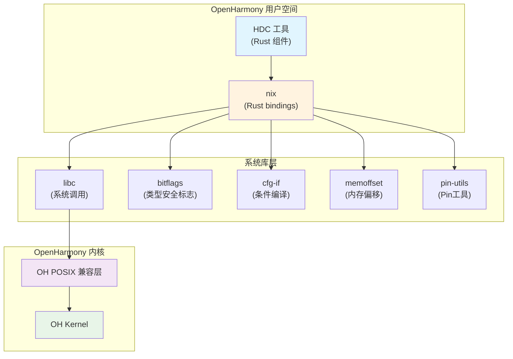

# 04 在 OpenHarmony 中的使用

> Nix 库在 OpenHarmony 生态系统中的依赖关系和使用方式

## 依赖关系概览

### 直接依赖者

| 模块 | BUILD.gn 路径 | 用途 |
|------|--------------|------|
| **hdc** | //developtools/hdc/hdc_rust/BUILD.gn | Rust 组件的系统调用 |
| **hdc** | //developtools/hdc/BUILD.gn | HDC 主构建配置 |

### 依赖关系图



---

## 主要使用者：HDC 工具

### 什么是 HDC？

HDC (Huawei Device Connector) 是 OpenHarmony 的设备连接工具，用于：

- 设备发现与连接
- 文件传输
- Shell 命令执行
- 应用安装与调试

### HDC 的 Rust 组件

HDC 包含 Rust 组件，用于处理需要高性能和系统级访问的功能：

```
developtools/hdc/
├── hdc_rust/          # HDC Rust 源码
│   ├── BUILD.gn       # Rust 构建配置
│   └── src/           # Rust 源码
│       └── lib.rs
```

### HDC 使用 nix 的示例

```rust
// hdc_rust/src/lib.rs

use nix::unistd;
use nix::errno::Errno;
use nix::sys::socket;
use std::os::unix::io::AsRawFd;

// 获取进程信息
pub fn get_process_info() -> Result<ProcessInfo, Errno> {
    let pid = unistd::getpid();
    let uid = unistd::getuid()?;
    let gid = unistd::getgid()?;
    
    Ok(ProcessInfo {
        pid: pid.as_raw(),
        uid: uid.as_raw(),
        gid: gid.as_raw(),
    })
}

// 进程权限获取
pub fn get_process_cred() -> Result<Credential, Errno> {
    let euid = unistd::geteuid()?;
    let egid = unistd::getegid()?;
    
    Ok(Credential {
        euid: euid.as_raw(),
        egid: egid.as_raw(),
    })
}

// 使用 nix 的安全系统调用
pub fn set_process_priority(nice: i32) -> Result<(), Errno> {
    unistd::setpriority(unistd::PRIO_PROCESS, 0, nice)?;
    Ok(())
}
```

---

## 在 OH Rust 项目中使用 nix

### 方式 1：静态库依赖

```gn
# BUILD.gn
ohos_rust_shared_library("my_rust_lib") {
    source = ["src/lib.rs"]
    deps = ["//third_party/rust/crates/nix:lib"]
    
    # 可选：指定需要的 features
    # features = ["process", "socket"]
}
```

### 方式 2：直接使用源码

如果需要修改 nix，可以将其作为源码依赖：

```gn
ohos_rust_source_crate("nix_modified") {
    crate_name = "nix"
    crate_root = "src/lib.rs"
    sources = ["src/**/*.rs"]
    edition = "2021"
    deps = [
        "//third_party/rust/crates/bitflags:lib",
        "//third_party/rust/crates/libc:lib",
        "//third_party/rust/crates/cfg-if:lib",
        "//third_party/rust/crates/memoffset:lib",
        "//third_party/rust/crates/pin-utils:lib",
    ]
}
```

### Rust 代码中使用

```rust
// Cargo.toml
[dependencies]
nix = { path = "//third_party/rust/crates/nix" }

// lib.rs
use nix::{
    unistd,
    sys::socket::{self, SockAddr, SockType},
    errno::Errno,
};
```

---

## 常见使用场景

### 场景 1：文件操作

```rust
use nix::fcntl::{open, OFlag};
use nix::sys::stat::Mode;
use nix::unistd::{close, read, write};

// 打开文件
let fd = open(
    "/data/test.txt",
    OFlag::O_WRONLY | OFlag::O_CREAT,
    Mode::S_IRWXU,
)?;

// 写入数据
write(fd, b"Hello OHOS")?;

// 读取数据
let mut buffer = [0u8; 1024];
let bytes_read = read(fd, &mut buffer)?;

// 关闭文件
close(fd)?;
```

### 场景 2：进程管理

```rust
use nix::unistd::{fork, Fork, Pid};
use nix::sys::wait::{waitpid, WaitStatus};

match fork()? {
    Fork::Parent(child_pid) => {
        // 父进程逻辑
        match waitpid(child_pid, None)? {
            WaitStatus::Exited(_, status) => {
                println!("Child exited with status: {}", status);
            }
            _ => {}
        }
    }
    Fork::Child => {
        // 子进程逻辑
        println!("I'm the child!");
    }
}
```

### 场景 3：信号处理

```rust
use nix::sys::signal::{Signal, SigHandler, SigAction, SigSet};
use nix::unistd::alarm;

let action = SigAction::new(
    SigHandler::Handler(|sig| {
        eprintln!("Received signal: {:?}", sig);
    }),
    SaFlags::empty(),
    SigSet::empty(),
);

// 设置信号处理
unsafe {
    signal::sigaction(Signal::SIGTERM, &action)?;
}
```

### 场景 4：Socket 通信

```rust
use nix::sys::socket::{socket, SockAddr, SockType, SockFlag};
use nix::unistd::close;

let sock_fd = socket(
    SockAddr::new_inet(
        std::net::Ipv4Addr::LOCALHOST,
        8080,
    ),
    SockType::Stream,
    SockFlag::empty(),
    None,
)?;

let addr = SockAddr::new_inet(std::net::Ipv4Addr::LOCALHOST, 8080);
connect(sock_fd, &addr)?;

// 后续读写操作...
close(sock_fd)?;
```

---

## 使用注意事项

### 1. 条件编译

nix 的某些 API 可能在 OH 上不可用：

```rust
// 使用条件编译处理平台差异
#[cfg(target_os = "ohos")]
fn ohos_specific_api() {
    // OH 特有实现
}

#[cfg(not(target_os = "ohos"))]
fn ohos_specific_api() {
    // 替代实现或 panic
}
```

### 2. 错误处理

```rust
use nix::errno::Errno;

// 不要忽略错误
fn unsafe_example() {
    let _ = unistd::chown("/path", uid, gid);  // ❌ 错误：忽略了可能的错误
}

fn safe_example() -> Result<(), Errno> {
    unistd::chown("/path", uid, gid)?;  // ✅ 正确：传播错误
    Ok(())
}
```

### 3. 权限要求

某些系统调用需要特殊权限：

```rust
// 可能需要 root 权限或 OH 能力
fn privileged_operation() -> Result<(), Errno> {
    // bind to low port (< 1024)
    let _ = socket::bind(sockfd, &addr)?;
    Ok(())
}
```

---

## 调试技巧

### 1. 查看编译目标

```rust
#[cfg(target_os = "ohos")]
fn print_platform_info() {
    println!("Compiling for OpenHarmony");
}
```

### 2. 调试系统调用

```rust
use nix::unistd::getpid;

fn debug_syscall() {
    let pid = getpid();
    eprintln!("[DEBUG] Current PID: {:?}", pid);
}
```

### 3. 错误诊断

```rust
use nix::errno::Errno;

fn diagnose_error(err: Errno) {
    match err {
        Errno::ENOENT => eprintln!("File not found"),
        Errno::EACCES => eprintln!("Permission denied"),
        Errno::EBUSY  => eprintln!("Resource busy"),
        _ => eprintln!("Unknown error: {:?}", err),
    }
}
```

---

## 依赖管理最佳实践

### 推荐的 Features 配置

| 场景 | 建议 Features |
|------|--------------|
| **基础使用** | `process`, `unistd`, `errno` |
| **网络应用** | `socket`, `net`, `poll` |
| **文件操作** | `fs`, `dir`, `fcntl` |
| **完整功能** | 所有 Features |

### 避免过度依赖

```gn
# 错误：启用所有 features 可能引入不必要的依赖
features = ["*"]  # ❌ 不推荐

# 推荐：只启用需要的 features
features = ["process", "socket", "fs"]  # ✅ 推荐
```

---

## 总结

| 项目 | 内容 |
|------|------|
| **主要使用者** | HDC 工具 |
| **使用方式** | 静态链接 (rlib) |
| **依赖类型** | 直接依赖 |
| **链接方式** | 静态链接 |
| **使用复杂度** | 低 - 标准 Rust 依赖 |

---

**上一节**: [03_Build_Integration.md](03_Build_Integration.md)  
**下一节**: [05_API_Differences.md](05_API_Differences.md)
