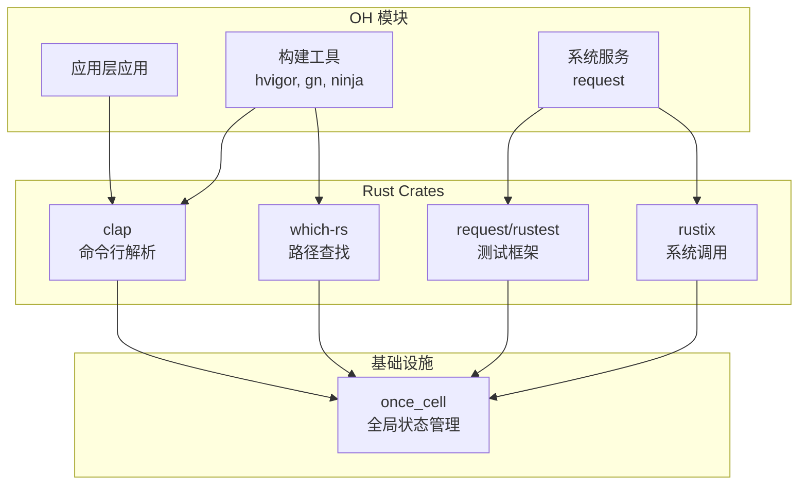
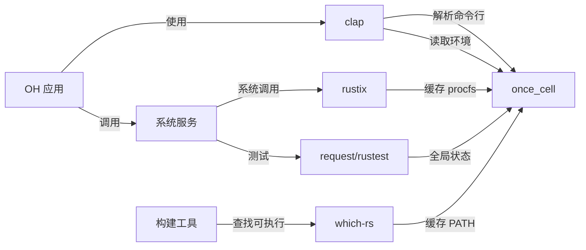

# 依赖关系与使用

## 概述

once_cell 在 OpenHarmony 中主要作为**基础设施依赖**被其他 Rust crates 间接使用。它不是面向应用的直接 API，而是作为底层工具库支持其他功能模块。

**使用统计**:
- **直接依赖者**: 6 个模块
- **间接依赖者**: 未统计（通过传递依赖使用）
- **主要用途**: 全局静态变量、延迟初始化、缓存管理

---

## 直接依赖者

### BUILD.gn 依赖者

以下模块通过 GN 的 `deps` 直接依赖 once_cell:

| 模块 | BUILD.gn 路径 | 用途 | 链接方式 |
|------|----------------|------|----------|
| **clap** | third_party/rust/crates/clap/BUILD.gn | 命令行参数解析 | 静态链接 (rlib) |
| **openssl** | third_party/rust/crates/rust-openssl/openssl/BUILD.gn | OpenSSL Rust 绑定 | 静态链接 (rlib) |
| **request_test_common** | base/request/request/test/rustest/BUILD.gn | 请求模块测试工具 | 静态链接 (rlib) |

### Cargo.toml 依赖者

以下模块通过 Cargo.toml 的 `[dependencies]` 声明依赖:

| 模块 | Cargo.toml 路径 | 版本要求 | 依赖类型 | 用途 |
|------|----------------|---------|----------|------|
| **clap** | third_party/rust/crates/clap/Cargo.toml | 1.12.0+ | 可选 (derive, cargo) | 宏派生全局状态 |
| **rustix** | third_party/rust/crates/rustix/Cargo.toml | 1.5.2 | 可选 (procfs) | 缓存 proc 文件系统数据 |
| **which-rs** | third_party/rust/crates/which-rs/Cargo.toml | 1.x | 平台特定 (Windows) | 缓存 PATH 解析结果 |
| **request/rustest** | base/request/request/test/rustest/Cargo.toml | 1.17.0 | 直接依赖 | 全局消息存储 |
| **request/services** | base/request/request/services/Cargo.toml | 1.17.0 | dev-dependency | 开发依赖 |

---

## 详细使用场景

### 1. clap - 命令行参数解析器

#### 依赖配置

**BUILD.gn**:
```gn
ohos_cargo_crate("lib") {
    deps = [
        "//third_party/rust/crates/once_cell:lib",  // ← GN 依赖
        ...
    ]
    features = [
        "derive",  // ← 使用 derive 特性时需要 once_cell
        "cargo",   // ← 使用 cargo 特性时需要 once_cell
    ]
}
```

**Cargo.toml**:
```toml
[dependencies]
once_cell = { version = "1.12.0", optional = true }

[features]
derive = ["dep:once_cell"]     // ← derive 特性依赖 once_cell
cargo = ["dep:once_cell"]      // ← cargo 特性依赖 once_cell
```

#### 使用方式

**场景 1: 宏派生中的全局状态**
```rust
// clap 使用 once_cell 在宏派生过程中存储类型信息
// 宏展开后生成类似以下的代码：

use once_cell::sync::Lazy;

// 全局注册的参数信息
static ARG_REGISTRY: Lazy<Vec<ArgInfo>> = Lazy::new(|| {
    // 宏生成的参数注册代码
    collect_args_from_derive_macro()
});

fn main() {
    let args = parse_args();
    // 首次访问时初始化 ARG_REGISTRY
    let info = ARG_REGISTRY.get(&args.name);
}
```

**场景 2: Cargo 环境变量缓存**
```rust
// clap 的 cargo 特性使用 once_cell 缓存环境变量

use once_cell::sync::OnceCell;

static CARGO_PKG_VERSION: OnceCell<String> = OnceCell::new();

fn get_package_version() -> &'static str {
    CARGO_PKG_VERSION.get_or_init(|| {
        // 首次访问时从环境变量读取
        std::env::var("CARGO_PKG_VERSION").unwrap_or_default()
    })
}
```

**OH 中的价值**:
- OH 的构建工具 (hvigor) 使用 clap 解析命令行参数
- once_cell 确保宏派生的全局状态线程安全

#### 链接方式
- **静态链接**: 编译到依赖者的 `.rlib` 文件中
- **无运行时依赖**: 不产生独立的 `.so` 或 `.dll`

---

### 2. rustix - POSIX/Unix/Linux 系统调用安全绑定

#### 依赖配置

**Cargo.toml**:
```toml
[target.'cfg(any(target_os = "android", target_os = "linux"))'.dependencies]
once_cell = { version = "1.5.2", optional = true }  // ← 仅 Linux/Android 可选依赖

[features]
procfs = ["once_cell", "itoa", "fs"]  // ← procfs 特性需要 once_cell
```

#### 使用方式

**场景: 缓存 proc 文件系统数据**
```rust
use once_cell::sync::OnceCell;

// 缓存 /proc/self/auxv 内容
static AUXV_CACHE: OnceCell<Vec<AuxvEntry>> = OnceCell::new();

fn read_auxv() -> &'static Vec<AuxvEntry> {
    AUXV_CACHE.get_or_init(|| {
        // 首次访问时读取 /proc/self/auxv
        parse_auxv_file("/proc/self/auxv").unwrap_or_default()
    })
}

// 使用缓存的数据
fn get_auxv_value(key: u32) -> Option<u64> {
    read_auxv().iter().find(|e| e.key == key).map(|e| e.value)
}
```

**OH 中的价值**:
- OH 的标准系统基于 Linux 内核
- rustix 提供的系统调用包装器使用 once_cell 缓存内核数据
- 避免重复读取 `/proc` 文件系统，提升性能

#### 平台限制
- **仅 Linux/Android**: 其他平台不使用 once_cell
- **条件编译**: 通过 `#[cfg(target_os = "...")]` 控制

#### 链接方式
- **静态链接**: 编译到 rustix 的 `.rlib` 中
- **平台特定**: 仅在 Linux/Android 平台编译

---

### 3. which-rs - Unix "which" 命令的 Rust 实现

#### 依赖配置

**Cargo.toml**:
```toml
[target.'cfg(windows)'.dependencies]
once_cell = "1"  // ← 仅 Windows 平台依赖
```

#### 使用方式

**场景: 缓存 PATH 环境变量解析**
```rust
// which-rs 仅在 Windows 平台使用 once_cell
// 原因: Windows 的 PATH 解析较慢，需要缓存

use once_cell::sync::Lazy;

// 延迟初始化 PATH 目录列表
static PATH_DIRS: Lazy<Vec<PathBuf>> = Lazy::new(|| {
    // 首次访问时解析 PATH 环境变量
    std::env::var("PATH")
        .unwrap_or_default()
        .split(';')
        .map(PathBuf::from)
        .collect()
});

fn find_executable(name: &str) -> Option<PathBuf> {
    for dir in PATH_DIRS.iter() {  // ← 使用缓存
        let path = dir.join(name);
        if path.exists() {
            return Some(path);
        }
    }
    None
}
```

**OH 中的价值**:
- OH 的构建工具在 Windows 主机上运行
- which-rs 用于查找可执行文件路径
- once_cell 缓存 PATH 解析，提升构建工具性能

#### 平台限制
- **仅 Windows**: Unix 系统不使用 once_cell（Unix PATH 解析快，无需缓存）
- **平台特定**: 通过 `#[cfg(windows)]` 控制

#### 链接方式
- **静态链接**: 编译到 which-rs 的 `.rlib` 中
- **平台特定**: 仅在 Windows 平台编译

---

### 4. request/rustest - 请求模块测试工具

#### 依赖配置

**BUILD.gn**:
```gn
ohos_cargo_crate("lib") {
    deps = [
        "//third_party/rust/crates/once_cell:lib",  // ← GN 依赖
    ]
    features = ["oh"]
}
```

**Cargo.toml**:
```toml
[dependencies]
once_cell = "1.17.0"  // ← 直接依赖
```

#### 使用方式

**场景: 全局消息存储**
```rust
use once_cell::sync::{Lazy, OnceCell};
use std::sync::{Arc, Mutex};
use std::collections::HashMap;

// 延迟初始化全局消息存储
static MESSAGES: Lazy<Arc<Mutex<HashMap<u32, Vec<MessageInfo>>>>> =
    Lazy::new(|| Arc::new(Mutex::new(HashMap::new())));

// 单次赋值：测试会话标识
static SESSION_ID: OnceCell<u32> = OnceCell::new();

fn register_message(msg: MessageInfo) {
    let mut msgs = MESSAGES.lock().unwrap();
    let session = SESSION_ID.get_or_init(|| generate_session_id());
    msgs.entry(*session).or_insert_with(Vec::new).push(msg);
}
```

**OH 中的价值**:
- request 模块是 OH 的网络请求管理组件
- rustest 是该模块的单元测试和集成测试框架
- once_cell 用于管理测试过程中的全局状态

#### 链接方式
- **静态链接**: 编译到 rustest 的 `.rlib` 中
- **OH 特定**: 仅在测试构建中链接

---

## 依赖图

### 高层依赖关系



**说明**:
- once_cell 是底层依赖，被多个中间层 crate 使用
- 模块 A-C 是 OH 中的应用或系统服务
- 模块 D-G 是 OH 中的 Rust crate
- once_cell 是所有 Rust crate 的共同依赖

### 模块间依赖链



---

## 使用方式汇总

### 静态链接 vs 动态链接

| 模块 | 链接方式 | 输出类型 | 原因 |
|------|----------|----------|------|
| **clap** | 静态链接 | .rlib | OH 默认使用静态链接 Rust crates |
| **rustix** | 静态链接 | .rlib | 系统库必须静态链接 |
| **request/rustest** | 静态链接 | .rlib | 测试库静态链接 |
| **which-rs** | 静态链接 | .rlib | 构建工具静态链接 |

**结论**: once_cell 在 OH 中**始终静态链接**，不产生动态库。

### 头文件引用方式

**Rust crate 不使用 C 头文件**:
- once_cell 是纯 Rust 库，通过 Rust 的模块系统引用
- 依赖者通过 `use once_cell::...` 导入 API

```rust
// 引用方式
use once_cell::sync::OnceCell;
use once_cell::sync::Lazy;
use once_cell::unsync::OnceCell;
use once_cell::race::OnceBox;
```

### 运行时加载

**无运行时加载**: once_cell 在**编译时**链接到依赖者，不在运行时动态加载。

**加载流程**:
1. 依赖者编译时，once_cell 的机器码被链接到依赖者的 `.rlib`
2. 链接阶段，依赖者的 `.rlib` 与其他库合并
3. 运行时，once_cell 的代码已加载到内存，直接调用

---

## 典型使用场景

### 场景 1: 全局配置

```rust
use once_cell::sync::Lazy;

// 全局应用配置
static CONFIG: Lazy<AppConfig> = Lazy::new(|| {
    AppConfig::load_from_env()
});

fn main() {
    // 首次访问时初始化
    let config = &*CONFIG;
    println!("Server port: {}", config.port);
}
```

**OH 应用**: 网络服务、系统配置管理

### 场景 2: 缓存计算结果

```rust
use once_cell::sync::OnceCell;

static REGEX_CACHE: OnceCell<Regex> = OnceCell::new();

fn parse_data(data: &str) -> Vec<&str> {
    // 只编译一次正则表达式
    let regex = REGEX_CACHE.get_or_init(|| {
        Regex::new(r"\d+").unwrap()
    });
    
    regex.find_iter(data).map(|m| m.as_str()).collect()
}
```

**OH 应用**: 日志解析、数据处理

### 场景 3: 单例模式

```rust
use once_cell::sync::OnceCell;

struct DatabasePool {
    connections: Vec<Connection>,
}

static POOL: OnceCell<DatabasePool> = OnceCell::new();

fn get_pool() -> &'static DatabasePool {
    POOL.get_or_init(|| {
        // 首次访问时初始化连接池
        DatabasePool::new()
    })
}
```

**OH 应用**: 数据库连接池、资源管理

### 场景 4: 延迟初始化

```rust
use once_cell::sync::Lazy;

// 延迟加载大型资源
static ASSETS: Lazy<AssetBundle> = Lazy::new(|| {
    AssetBundle::load("assets.zip")  // 耗时操作
});

fn render_frame() {
    // 首次渲染时才加载资源
    let assets = &*ASSETS;
    assets.draw_sprite();
}
```

**OH 应用**: 游戏引擎、UI 框架

---

## 性能分析

### once_cell 的性能优势

| 操作 | 性能特征 | 说明 |
|------|----------|------|
| **首次初始化** | O(n) | 执行初始化函数（n 为初始化成本） |
| **后续访问** | O(1) | 直接返回引用，零成本 |
| **线程安全** | 无锁（已初始化后） | 使用原子操作，读操作无锁 |
| **内存占用** | 最小 | 仅存储一个指针或原子值 |

### vs 其他方案的性能对比

| 方案 | 首次访问 | 后续访问 | 线程安全 | 内存占用 |
|------|----------|----------|----------|---------|
| **once_cell** | 执行初始化 | 直接返回 | ✅ 原子操作 | 小 |
| **lazy_static!** | 执行初始化 | 直接返回 | ✅ 无锁 | 稍大 |
| **Mutex<T>** | 加锁初始化 | 加锁访问 | ✅ 有锁 | 大 |
| **static mut** | 不安全 | 不安全 | ❌ 无保护 | 最小 |

**结论**: once_cell 提供最佳的性能-安全性平衡。

---

## 迁移指南

### 如果 once_cell 被纳入 Rust 标准库

⚠️ **未来可能**: once_cell 的 API 正在通过 [RFC 2788](https://github.com/rust-lang/rfcs/pull/2788) 提议纳入标准库。

**迁移路径**:
```rust
// 当前 (once_cell)
use once_cell::sync::Lazy;

static CONFIG: Lazy<Config> = Lazy::new(|| ...);

// 未来 (std) - 待 RFC 合并
use std::sync::Lazy;

static CONFIG: Lazy<Config> = Lazy::new(|| ...);
```

**迁移步骤**:
1. 等待标准库 API 稳定（预计 1-2 年）
2. 修改所有导入语句：`once_cell::` → `std::sync::`
3. 重新编译验证
4. 移除 once_cell 依赖

**注意事项**:
- API 设计基本一致，迁移成本低
- OH 可以并行推进，不影响现有功能
- 建议持续跟踪 RFC 2788 进展

---

## 总结

once_cell 在 OpenHarmony 中的使用体现了 Rust 生态的最佳实践：

✅ **广泛采用**: 6 个直接依赖者，覆盖多种场景
✅ **性能优异**: 零成本抽象，线程安全
✅ **易用性强**: 无需宏，直接使用类型
✅ **低维护成本**: 无需 OH 特定代码，完全上游同步
✅ **标准化**: 成为 Rust 社区的全局状态管理标准

once_cell 是 OH Rust 基础设施的重要组成部分，值得继续推广使用。
