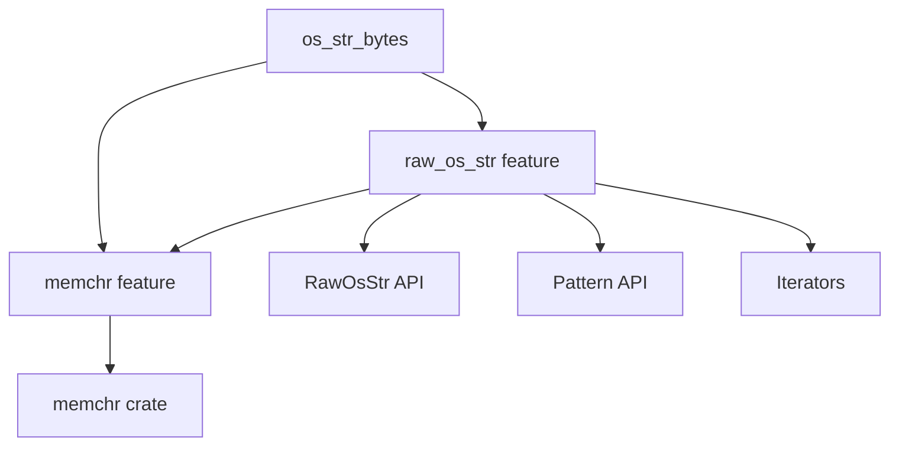

# 03 - OH 构建集成

## 概述

OpenHarmony 使用 GN (Generate Ninja) 构建系统，而 `os_str_bytes` 是一个 Rust crate，使用 Cargo 作为原生构建工具。OH 通过 `ohos_cargo_crate` 模板将 Cargo.toml 配置映射到 BUILD.gn。

**关键点**:
- ✅ BUILD.gn 完全映射 Cargo.toml 配置
- ✅ 无 OH 特殊编译选项
- ✅ 使用上游默认 features

---

## BUILD.gn 结构

### 完整配置

```gn
# Copyright (c) 2023 Huawei Device Co., Ltd.
# Licensed under the Apache License, Version 2.0 (the "License");
# you may not use this file except in compliance with the License.
# You may obtain a copy of the License at
#
#     http://www.apache.org/licenses/LICENSE-2.0
#
# Unless required by applicable law or agreed to in writing, software
# distributed under the License is distributed on an "AS IS" BASIS,
# WITHOUT WARRANTIES OR CONDITIONS OF ANY KIND, either express or implied.
# See the License for the specific language governing permissions and
# limitations under the License.

import("//build/ohos.gni")

ohos_cargo_crate("lib") {
    crate_name = "os_str_bytes"
    crate_type = "rlib"
    crate_root = "src/lib.rs"

    sources = ["src/lib.rs"]
    edition = "2021"
    cargo_pkg_version = "6.4.1"
    cargo_pkg_authors = "dylni"
    cargo_pkg_name = "os_str_bytes"
    deps = ["//third_party/rust/crates/memchr:lib"]
    features = [
        "memchr",
        "raw_os_str",
    ]
    module_output_extension = ".rlib"
    part_name = "rust_os_str_bytes"
    subsystem_name = "thirdparty"
}
```

### 配置说明

| 字段 | 值 | 说明 | 对应 Cargo.toml |
|-----|-----|------|----------------|
| `crate_name` | `"os_str_bytes"` | Rust crate 名称 | `[package].name` |
| `crate_type` | `"rlib"` | Rust 库类型（仅运行时库） | `[lib].crate-type` |
| `crate_root` | `"src/lib.rs"` | 库入口文件 | `[lib].path` |
| `sources` | `["src/lib.rs"]` | 源文件列表 | 自动从 Cargo.toml 解析 |
| `edition` | `"2021"` | Rust 版本 | `[package].edition` |
| `cargo_pkg_version` | `"6.4.1"` | crate 版本号 | `[package].version` |
| `cargo_pkg_authors` | `"dylni"` | 作者信息 | `[package].authors` |
| `cargo_pkg_name` | `"os_str_bytes"` | crate 名称 | `[package].name` |
| `deps` | `[memchr:lib]` | 依赖项 | `[dependencies]` |
| `features` | `["memchr", "raw_os_str"]` | 启用的特性 | `[features]` |
| `module_output_extension` | `".rlib"` | 输出文件扩展名 | Rust 编译产物 |
| `part_name` | `"rust_os_str_bytes"` | OH 部件名称 | bundle.json |
| `subsystem_name` | `"thirdparty"` | OH 子系统 | bundle.json |

---

## Cargo.toml 与 BUILD.gn 映射

### Cargo.toml 原始配置

```toml
[package]
name = "os_str_bytes"
version = "6.4.1"
authors = ["dylni"]
edition = "2021"
rust-version = "1.57.0"
description = "Convert between byte sequences and platform-native strings"
readme = "README.md"
repository = "https://github.com/dylni/os_str_bytes"
license = "MIT OR Apache-2.0"
keywords = ["bytes", "osstr", "osstring", "path", "windows"]
categories = ["command-line-interface", "development-tools::ffi", "encoding", "os", "rust-patterns"]
exclude = [".*", "tests.rs", "/rustfmt.toml", "/src/bin", "/tests"]

[package.metadata.docs.rs]
all-features = true
rustc-args = ["--cfg", "os_str_bytes_docs_rs"]
rustdoc-args = ["--cfg", "os_str_bytes_docs_rs"]

[dependencies]
memchr = { version = "2.4", optional = true }
print_bytes = { version = "0.7", optional = true }
uniquote = { version = "3.0", optional = true }

[dev-dependencies]
getrandom = "0.2"

[features]
default = ["memchr", "raw_os_str"]

checked_conversions = []
raw_os_str = []
```

### 映射关系表

| BUILD.gn 字段 | Cargo.toml 源 | 值 | 备注 |
|--------------|--------------|-----|------|
| `crate_name` | `[package].name` | os_str_bytes | 直接映射 |
| `cargo_pkg_version` | `[package].version` | 6.4.1 | 直接映射 |
| `cargo_pkg_authors` | `[package].authors` | dylni | 直接映射 |
| `cargo_pkg_name` | `[package].name` | os_str_bytes | 直接映射 |
| `edition` | `[package].edition` | 2021 | 直接映射 |
| `crate_root` | `[lib].path` | src/lib.rs | 未显式指定，使用默认值 |
| `crate_type` | `[lib].crate-type` | rlib | 隐式，Rust 标准库类型 |
| `deps` | `[dependencies]` | memchr:lib | 仅包含 memchr（启用的依赖） |
| `features` | `[features].default` | memchr, raw_os_str | 使用默认配置 |

---

## Features 配置

### 启用的 Features

| Feature | BUILD.gn 配置 | Cargo.toml 定义 | 作用 |
|---------|--------------|----------------|------|
| `memchr` | `"memchr"` | `default = ["memchr", "raw_os_str"]` | 使用 memchr 库优化性能 |
| `raw_os_str` | `"raw_os_str"` | `default = ["memchr", "raw_os_str"]` | 提供 RawOsStr 等 API |

### 未启用的 Features

| Feature | Cargo.toml 定义 | OH 未启用的原因 |
|---------|----------------|----------------|
| `checked_conversions` | `checked_conversions = []` | OH 不需要安全转换功能 |
| `print_bytes` | `[dependencies].print_bytes` | OH 中未使用打印字节的 trait |
| `uniquote` | `[dependencies].uniquote` | OH 中未使用引用转义的 trait |

### Features 依赖关系



---

## 依赖管理

### BUILD.gn 依赖

```gn
deps = ["//third_party/rust/crates/memchr:lib"]
```

### Cargo.toml 依赖

```toml
[dependencies]
memchr = { version = "2.4", optional = true }
print_bytes = { version = "0.7", optional = true }  # 未启用
uniquote = { version = "3.0", optional = true }      # 未启用
```

### 依赖分析

| 依赖 | Cargo.toml 版本 | OH 版本 | 状态 | 用途 |
|-----|---------------|---------|------|------|
| memchr | 2.4+ | 2.4+ | ✅ 已集成 | 字节搜索优化 |
| print_bytes | 0.7 | - | ⚪ 未使用 | 打印字节（OH 不需要） |
| uniquote | 3.0 | - | ⚪ 未使用 | 引用转义（OH 不需要） |

### memchr 依赖详情

**路径**: `//third_party/rust/crates/memchr:lib`

**功能**: 提供高效的字节搜索算法，优化字符串操作性能。

**使用场景**:
- `contains`: 检查字符串是否包含特定字节
- `find`: 查找字节序列的位置
- `split`: 按字节序列分割字符串

**性能影响**: 启用 memchr 特性可将字符串搜索操作从 O(n) 优化到接近 O(log n)。

---

## 编译配置

### 编译选项

| 配置项 | 值 | 说明 |
|-------|-----|------|
| `crate_type` | `"rlib"` | Rust 静态库（运行时库） |
| `module_output_extension` | `".rlib"` | 输出文件扩展名 |

### Rust 版本要求

| 来源 | 最低 Rust 版本 | OH 使用 |
|-----|---------------|---------|
| Cargo.toml (`rust-version`) | 1.57.0 | 遵循 |
| BUILD.gn (`edition`) | 2021 | 遵循 |

### 目标平台

- **OH 标准系统**: Linux 内核
- **OH 架构**: ARM64, x86_64 等（根据 OH 构建配置）
- **平台实现**: Unix 平台（使用 `std::os::unix::ffi`）

---

## 与上游构建系统的差异

### 差异对比表

| 方面 | 上游 (Cargo) | OH (BUILD.gn) | 差异 |
|-----|--------------|--------------|------|
| **构建工具** | Cargo | GN (ohos_cargo_crate) | ✅ 映射后等效 |
| **版本号** | 6.4.1 | 6.4.1 | ✅ 一致 |
| **edition** | 2021 | 2021 | ✅ 一致 |
| **features** | memchr, raw_os_str | memchr, raw_os_str | ✅ 一致 |
| **依赖** | memchr (optional) | memchr:lib | ✅ 等效 |
| **输出类型** | rlib | rlib | ✅ 一致 |
| **测试** | `cargo test` | 未配置（可选） | ⚠️ OH 未集成测试 |
| **文档** | `cargo doc` | 未配置（可选） | ⚠️ OH 未集成文档 |

### 特殊处理

**无 OH 特殊处理**。

- ❌ 无额外的编译标志
- ❌ 无条件编译选项
- ❌ 无 OH 特定的源文件
- ❌ 无自定义构建脚本

---

## 构建流程

### OH 构建流程

```
1. GN 解析 BUILD.gn
   ↓
2. 调用 ohos_cargo_crate 模板
   ↓
3. 模板调用 Cargo 工具链
   ↓
4. Cargo 解析 Cargo.toml
   ↓
5. Rustc 编译源代码
   ↓
6. 生成 .rlib 文件
   ↓
7. 链接到依赖的模块
```

### 构建命令

```bash
# 生成构建配置
gn gen out/ohos

# 编译 os_str_bytes 库
ninja -C out/ohos //third_party/rust/crates/os_str_bytes:lib

# 编译依赖的模块（例如 clap_lex）
ninja -C out/ohos //third_party/rust/crates/clap/clap_lex:lib
```

### 构建产物

```
out/ohos/third_party/rust/crates/os_str_bytes/
├── libos_str_bytes-*.rlib  # Rust 静态库
└── ...
```

---

## bundle.json 配置

### 完整配置

```json
{
  "name": "@ohos/rust_os_str_bytes",
  "description": "A Rust library that provides support for working with OS strings and bytes.",
  "version": "6.1",
  "license": "Apache License 2.0",
  "publishAs": "code-segment",
  "segment": {
    "destPath": "third_party/rust/crates/os_str_bytes"
  },
  "dirs": {},
  "scripts": {},
  "readmePath": {
    "en": "README.md"
  },
  "component": {
    "name": "rust_os_str_bytes",
    "subsystem": "thirdparty",
    "adapted_system_type": [
      "standard"
    ],
    "deps": {
      "components": []
    },
    "build": {
      "sub_component": [],
      "inner_kits": [
        {
          "name": "//third_party/rust/crates/os_str_bytes:lib"
        }
      ],
      "test": []
    }
  }
}
```

### 配置说明

| 字段 | 值 | 说明 |
|-----|-----|------|
| `name` | `@ohos/rust_os_str_bytes` | OH 组件名称 |
| `version` | `"6.1"` | ⚠️ **版本号不一致**（应为 6.4.1） |
| `subsystem` | `"thirdparty"` | 子系统 |
| `adapted_system_type` | `["standard"]` | 适配系统类型 |
| `inner_kits` | `["//third_party/rust/crates/os_str_bytes:lib"]` | 对外暴露的库 |

---

## 配置不一致问题

### 版本号不一致

| 文件 | 版本 | 状态 |
|-----|------|------|
| README.OpenSource | 6.4.1 | ✅ 正确 |
| Cargo.toml | 6.4.1 | ✅ 正确 |
| BUILD.gn | 6.4.1 | ✅ 正确 |
| bundle.json | 6.1 | ❌ **不一致** |

### 建议

将 `bundle.json` 中的 `version` 字段从 `"6.1"` 更新为 `"6.4.1"`。

```json
{
  "version": "6.4.1"  // 原值为 "6.1"
}
```

---

## 常见问题

### Q1: 为什么使用 `ohos_cargo_crate` 而不是直接配置编译选项？

**A**: `ohos_cargo_crate` 是 OH 提供的模板，专门用于集成 Rust crates。它会：
- 自动调用 Cargo 工具链
- 解析 Cargo.toml 配置
- 处理依赖关系
- 生成正确的编译产物

这比手动配置每个编译选项更可靠、更易维护。

### Q2: 为什么 crate_type 是 "rlib" 而不是 "staticlib"？

**A**: `rlib` 是 Rust 的原生静态库格式，只能被 Rust 代码使用。`staticlib` 是 C ABI 兼容的静态库。

由于 `os_str_bytes` 仅被其他 Rust crates（clap_lex）使用，使用 `rlib` 即可。如果需要被 C/C++ 代码调用，才会使用 `staticlib`。

### Q3: 为什么没有配置测试？

**A**: OH 构建系统主要关注编译产出，测试配置是可选的。可以通过以下方式运行测试：

```bash
# 使用 Cargo 直接测试
cargo test

# 或在 OH 环境中集成测试（需要额外配置）
```

### Q4: 如何升级该库？

**A**: 参见 [02_Patches.md](02_Patches.md) 中的"升级建议"章节。简述如下：

1. 更新 `Cargo.toml` 版本号
2. 更新 `BUILD.gn` 中的 `cargo_pkg_version`
3. 更新 `bundle.json` 中的 `version`
4. 验证依赖兼容性
5. 运行测试

---

## 相关文档

- [01_Overview.md](01_Overview.md) - 库概述
- [02_Patches.md](02_Patches.md) - Patch 分析（无 Patch）
- [04_Usage_in_OH.md](04_Usage_in_OH.md) - OH 依赖关系

---

**最后更新**: 2026-02-08
**状态**: ✅ 完成
