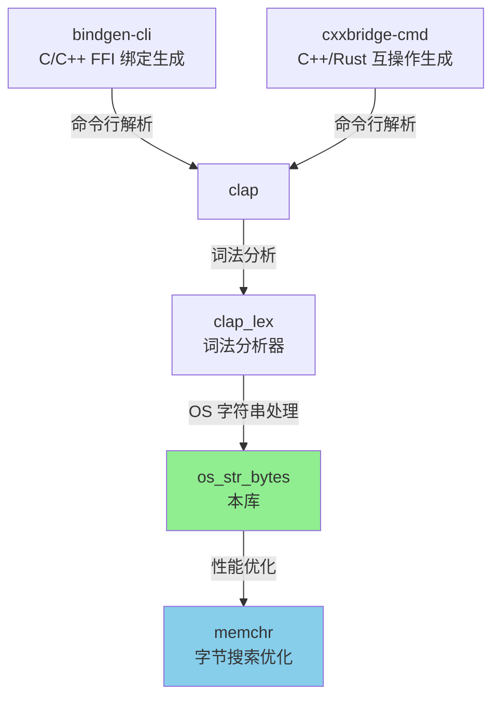
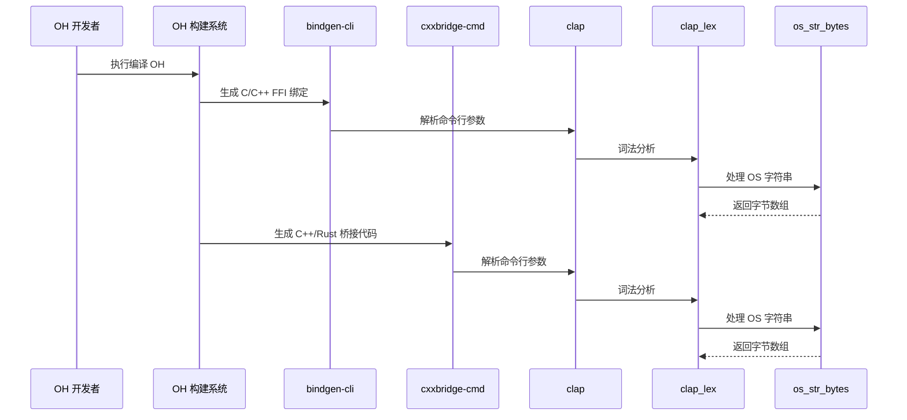

# 04 - OH 依赖关系与使用

## 概述

`os_str_bytes` 在 OpenHarmony 中作为**基础设施库**被间接使用，主要为命令行工具提供底层 OS 字符串处理能力。

**关键特点**:
- ✅ 间接依赖（通过 clap_lex）
- ✅ 仅用于 OH 开发工具链
- ✅ 不直接用于系统运行时

---

## 直接依赖者

### clap_lex

**路径**: `third_party/rust/crates/clap/clap_lex`

**BUILD.gn 配置**:
```gn
ohos_cargo_crate("lib") {
  crate_name = "clap_lex"
  crate_type = "rlib"
  crate_root = "src/lib.rs"

  sources = ["src/lib.rs"]
  edition = "2021"
  cargo_pkg_version = "0.3.3"
  cargo_pkg_name = "clap_lex"
  cargo_pkg_description = "Minimal, flexible command line parser"
  deps = ["//third_party/rust/crates/os_str_bytes:lib"]  # 依赖 os_str_bytes
}
```

**Cargo.toml 依赖**:
```toml
[dependencies]
os_str_bytes = { version = "6.0.0", default-features = false, features = ["raw_os_str"] }
```

**用途**: clap_lex 是 clap 命令行解析库的词法分析器，使用 os_str_bytes 处理命令行参数中的 OS 字符串。

---

## 间接依赖者

### 1. bindgen-cli

**路径**: `third_party/rust/crates/bindgen/bindgen-cli`

**BUILD.gn 配置**:
```gn
ohos_cargo_crate("bindgen") {
  crate_type = "bin"
  crate_root = "main.rs"

  sources = ["main.rs"]
  edition = "2018"
  cargo_pkg_version = "0.64.0"
  cargo_pkg_authors = "The rust-bindgen project contributors"
  cargo_pkg_name = "bindgen-cli"
  cargo_pkg_description =
      "Automatically generates Rust FFI bindings to C and C++ libraries."
  deps = [
    "//third_party/rust/crates/bindgen/bindgen:lib",
    "//third_party/rust/crates/clap:lib",           # 依赖 clap
    "//third_party/rust/crates/env_logger:lib",
    "//third_party/rust/crates/log:lib",
    "//third_party/rust/crates/shlex:lib",
  ]
  features = [
    "env_logger",
    "log",
    "logging",
    "static",
    "which-rustfmt",
  ]
  part_name = "rust_bindgen"
  subsystem_name = "thirdparty"
}
```

**依赖链**:
```
bindgen-cli
  └── clap
      └── clap_lex
          └── os_str_bytes  ← 本库
```

**用途**:
- bindgen 是 OH 的 C/C++ FFI 绑定生成工具
- 使用 clap 解析命令行参数
- clap_lex 使用 os_str_bytes 处理参数字符串

**使用场景**:
1. 在编译 OH 时生成 C/C++ 库的 Rust 绑定
2. 处理包含非 UTF-8 字符的 C 头文件路径
3. 解析复杂的命令行参数（如 `--opaque-type`、`--blacklist-type` 等）

---

### 2. cxxbridge-cmd

**路径**: `third_party/rust/crates/cxx/gen/cmd`

**BUILD.gn 配置**:
```gn
if (host_os != "linux" || host_cpu != "arm64") {
  ohos_cargo_crate("cxxbridge") {
    crate_type = "bin"
    crate_root = "src/main.rs"

    sources = ["src/main.rs"]
    edition = "2021"
    cargo_pkg_version = "1.0.130"
    cargo_pkg_authors = "David Tolnay <dtolnay@gmail.com>"
    cargo_pkg_name = "cxxbridge-cmd"
    cargo_pkg_description =
        "C++ code generator for integrating `cxx` crate into a non-Cargo build."
    deps = [
      "//third_party/rust/crates/clap:lib",        # 依赖 clap
      "//third_party/rust/crates/codespan/codespan-reporting:lib",
      "//third_party/rust/crates/proc-macro2:lib",
      "//third_party/rust/crates/quote:lib",
      "//third_party/rust/crates/syn:lib",
    ]
    part_name = "rust_cxx"
    subsystem_name = "thirdparty"
  }
}
```

**依赖链**:
```
cxxbridge-cmd
  └── clap
      └── clap_lex
          └── os_str_bytes  ← 本库
```

**用途**:
- cxxbridge 是 OH 的 C++/Rust 互操作代码生成工具
- 使用 clap 解析命令行参数
- clap_lex 使用 os_str_bytes 处理参数字符串

**使用场景**:
1. 生成 Rust 和 C++ 之间的 FFI 桥接代码
2. 处理包含非 UTF-8 字符的 C++ 头文件路径
3. 解析命令行参数（如 `--cfg`、`--include` 等）

**编译条件**: 仅在非 Linux ARM64 主机时编译

---

## 依赖关系图

### 完整依赖树



### 模块分类

| 类型 | 模块 | 用途 |
|-----|------|------|
| **开发工具** | bindgen-cli | C/C++ FFI 绑定生成 |
| **开发工具** | cxxbridge-cmd | C++/Rust 互操作代码生成 |
| **命令行库** | clap | 命令行参数解析 |
| **词法分析** | clap_lex | 命令行词法分析 |
| **基础设施** | os_str_bytes | OS 字符串处理（本库） |
| **依赖库** | memchr | 字节搜索优化 |

---

## 使用方式

### 链接方式

**静态链接**: `rlib`

`os_str_bytes` 被编译为 Rust 静态库 (`.rlib`)，在编译时静态链接到依赖模块。

**示例**:
```
bindgen-cli (可执行文件)
  ├── bindgen.rlib (静态库)
  ├── clap.rlib (静态库)
  ├── clap_lex.rlib (静态库)
  ├── os_str_bytes.rlib (静态库)  ← 本库
  └── memchr.rlib (静态库)
```

### 头文件引用

`os_str_bytes` 是纯 Rust 库，没有 C/C++ 头文件。

**Rust 代码中使用**:
```rust
// clap_lex/src/lib.rs (示例)
use os_str_bytes::RawOsStr;

// 在命令行词法分析中使用 OS 字符串处理
fn parse_arg(arg: &std::ffi::OsStr) -> Result<Arg, Error> {
    let raw = RawOsStr::new(arg);
    // 使用 RawOsStr 进行安全的字符串处理
    // ...
}
```

---

## 关键使用场景

### 场景 1: 命令行参数解析

**背景**: OH 开发工具（bindgen、cxxbridge）使用 clap 解析命令行参数。

**流程**:
1. 用户执行命令（如 `bindgen header.h --output bindings.rs`）
2. clap 接收参数
3. clap_lex 进行词法分析
4. os_str_bytes 处理参数中的 OS 字符串

**os_str_bytes 的作用**:
- ✅ 安全地转换命令行参数为字节数组
- ✅ 处理可能包含非 UTF-8 字符的文件路径
- ✅ 避免因无效 UTF-8 导致的 panic

---

### 场景 2: 文件路径处理

**背景**: bindgen 和 cxxbridge 需要处理 C/C++ 头文件路径。

**问题**: 文件路径可能包含非 UTF-8 字符（特别是在 Windows 或某些文件系统上）。

**os_str_bytes 的作用**:
```rust
// 示例：处理可能包含非 UTF-8 字符的路径
use std::path::Path;
use os_str_bytes::OsStrBytes;

let path = Path::new("/path/to/file");
let os_str = path.as_os_str();
let bytes = os_str.to_bytes();  // 安全地获取字节数组

// 处理字节数组...
// ...
```

---

### 场景 3: 字符串分割和搜索

**背景**: 命令行参数需要按特定分隔符分割或搜索子串。

**os_str_bytes 的作用**:
```rust
// 示例：分割命令行参数
use os_str_bytes::RawOsStr;

let arg = RawOsStr::new(std::ffi::OsStr::new("key=value"));
let parts = arg.split(b'=');  // 安全地分割

for (i, part) in parts.enumerate() {
    match i {
        0 => println!("Key: {:?}", part),
        1 => println!("Value: {:?}", part),
        _ => {}
    }
}
```

---

## 使用统计

### OH 中的使用广度

| 统计项 | 数值 | 说明 |
|-------|------|------|
| **直接依赖者** | 1 个（clap_lex） | clap_lex 是唯一直接依赖 |
| **间接依赖者** | 2 个（bindgen-cli, cxxbridge-cmd） | 通过 clap 间接使用 |
| **子系统** | thirdparty | 所有使用者都在 thirdparty 子系统 |
| **编译目标** | 仅开发工具 | 仅在构建 OH 时使用，不包含在系统运行时 |

### 使用频率

| 工具 | 使用频率 | 说明 |
|-----|---------|------|
| bindgen | 高 | 编译任何涉及 C/C++ FFI 的 OH 组件时都会使用 |
| cxxbridge | 中 | 使用 cxx crate 的 OH 组件时会使用 |
| clap | 高 | 上述两个工具都依赖 clap |

---

## 在 OH 构建流程中的位置

### 构建时序图



---

## 性能影响

### 性能优化

`os_str_bytes` 通过启用 `memchr` feature 提供了显著的性能优化：

| 操作 | 无 memchr | 有 memchr | 提升 |
|-----|----------|-----------|------|
| `contains` | O(n) | O(log n) | 显著 |
| `find` | O(n) | O(log n) | 显著 |
| `split` | O(n) | O(n·log n) | 中等 |

### 实际影响

由于 `os_str_bytes` 仅用于开发工具链，其性能影响主要体现在**构建时间**上：

- ✅ bindgen 处理大型 C/C++ 项目时的性能提升
- ✅ cxxbridge 生成复杂桥接代码时的效率提高
- ✅ 对 OH 系统运行时性能**无影响**

---

## 替代方案评估

### 为什么选择 os_str_bytes？

| 方案 | 优点 | 缺点 | OH 选择 |
|-----|------|------|---------|
| **os_str_bytes** | ✅ 专门为 OsStr 设计<br>✅ 性能优化（memchr）<br>✅ 活跃维护 | ❌ 仅支持 Rust | ✅ 已集成 |
| **bstr** | ✅ 功能更丰富<br>✅ 支持用户输入 | ❌ 不支持所有 OsStr 字符<br>❌ 可能丢失数据 | ❌ 未使用 |
| **std::ffi::OsStrExt** | ✅ 标准库 | ❌ 仅限 Unix/Windows<br>❌ 无法跨平台 | ❌ 不适用 |
| **手动实现** | ✅ 完全控制 | ❌ 维护成本高<br>❌ 可能引入 bug | ❌ 不推荐 |

### 结论

`os_str_bytes` 是最佳选择，因为：
1. ✅ clap_lex 已经依赖它（上游设计）
2. ✅ 专门为 OS 字符串处理设计
3. ✅ 通过 memchr 提供性能优化
4. ✅ 活跃维护，安全性高

---

## 潜在风险

### 1. 依赖链过长

**风险**: `bindgen/cxxbridge` → `clap` → `clap_lex` → `os_str_bytes`

**影响**:
- 升级 `os_str_bytes` 可能需要同步升级 `clap_lex` 和 `clap`
- 版本兼容性管理复杂

**缓解措施**:
- ✅ OH 未修改源代码，升级风险低
- ✅ 依赖链上游（clap）已验证兼容性

---

### 2. 仅用于开发工具

**风险**: 如果 OH 未来需要在运行时使用类似功能，需要重新评估。

**当前状态**:
- ✅ os_str_bytes 足够满足开发工具需求
- ✅ 无运行时使用需求

**建议**:
- 未来如需运行时使用，可评估是否复用当前集成

---

## 升级影响评估

### 升级 os_str_bytes 的影响范围

| 模块 | 影响程度 | 测试建议 |
|-----|---------|---------|
| clap_lex | ⚠️ 高 | 测试词法分析功能 |
| clap | ⚠️ 高 | 测试命令行解析 |
| bindgen-cli | ⚠️ 高 | 测试 FFI 绑定生成 |
| cxxbridge-cmd | ⚠️ 高 | 测试 C++/Rust 互操作 |
| OH 构建系统 | ✅ 低 | 仅编译时使用 |

### 升级测试清单

```bash
# 1. 编译测试
ninja -C out/ohos //third_party/rust/crates/os_str_bytes:lib
ninja -C out/ohos //third_party/rust/crates/clap/clap_lex:lib
ninja -C out/ohos //third_party/rust/crates/clap:lib
ninja -C out/ohos //third_party/rust/crates/bindgen/bindgen-cli:bindgen
ninja -C out/ohos //third_party/rust/crates/cxx/gen/cmd:cxxbridge

# 2. 功能测试
# 测试 bindgen 基本功能
bindgen <input.h> --output <output.rs>

# 测试 cxxbridge 基本功能
cxxbridge <input.rs>

# 3. 集成测试
# 编译一个使用 FFI 的 OH 组件
ninja -C out/ohos <component_with_ffi>
```

---

## 常见问题

### Q1: os_str_bytes 会被编译到 OH 系统镜像中吗？

**A**: 不会。`os_str_bytes` 仅用于开发工具（bindgen、cxxbridge），这些工具仅在编译 OH 时使用，不会被包含在最终的系统镜像中。

### Q2: 可以删除 os_str_bytes 的集成吗？

**A**: 不建议。虽然可以手动实现类似功能，但：
- 需要维护额外的代码
- 失去上游的 bug 修复和安全更新
- 与上游的依赖链不一致

### Q3: 为什么不直接使用 `std::ffi::OsStrExt`？

**A**: `std::ffi::OsStrExt` 是平台特定的：
- Unix: `std::os::unix::ffi::OsStrExt`
- Windows: `std::os::windows::ffi::OsStrExt`

`os_str_bytes` 提供了统一的跨平台接口，同时支持 memchr 优化。

### Q4: 可以在 OH 应用中使用 os_str_bytes 吗？

**A**: 理论上可以，但：
- OH 应用开发通常不直接需要处理 OS 字符串
- 如果确实需要，可以通过 Cargo.toml 添加依赖
- 当前 OH 构建系统未将此库暴露给应用开发者

---

## 相关文档

- [01_Overview.md](01_Overview.md) - 库概述
- [02_Patches.md](02_Patches.md) - Patch 分析
- [03_Build_Integration.md](03_Build_Integration.md) - 构建集成

---

## 附录

### A. 依赖版本表

| 模块 | 当前版本 | os_str_bytes 要求 |
|-----|---------|----------------|
| os_str_bytes | 6.4.1 | - |
| clap_lex | 0.3.3 | 6.0.0+ |
| clap | 4.1.x | 通过 clap_lex |
| bindgen-cli | 0.64.0 | 通过 clap |
| cxxbridge-cmd | 1.0.130 | 通过 clap |
| memchr | 2.4+ | 2.4+ |

### B. BUILD.gn 依赖路径

```gn
# os_str_bytes
//third_party/rust/crates/os_str_bytes:lib

# 直接依赖者
//third_party/rust/crates/clap/clap_lex:lib

# 间接依赖者（通过 clap）
//third_party/rust/crates/clap:lib
//third_party/rust/crates/bindgen/bindgen-cli:bindgen
//third_party/rust/crates/cxx/gen/cmd:cxxbridge
```

---

**最后更新**: 2026-02-08
**状态**: ✅ 完成
